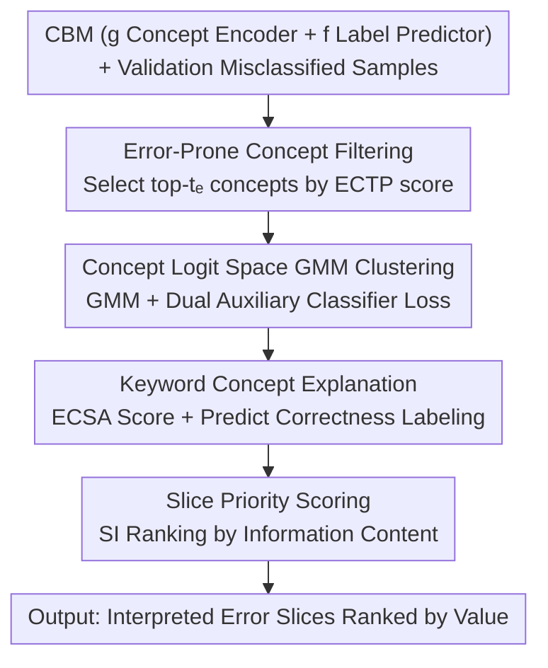

# CB-SLICE: Concept-Based Interpretable Error Slice Discovery

**Conference**: ICML2026  
**arXiv**: [2605.29836](https://arxiv.org/abs/2605.29836)  
**Code**: https://github.com/yaelkon/CB-SLICE  
**Area**: Explainability  
**Keywords**: Error Slice Discovery, Concept Bottleneck Models, Model Debugging, Bias Detection, Explainable AI  

## TL;DR

CB-SLICE utilizes the concept prediction space of Concept Bottleneck Models (CBMs) to discover and explain systematic error slices in deep learning models. Through a three-step pipeline—filtering error-prone concepts, GMM clustering for slice formation, and keyword-based concept explanation—it consistently outperforms existing methods across multiple benchmarks while providing faithful explanations directly grounded in the model's internal decision logic.

## Background & Motivation

**Background**: Despite excellent average performance, deep learning models often exhibit systematic errors on specific data subgroups, known as error slices. Existing Slice Discovery Methods (SDMs) such as Domino, GEORGE, and Spotlight have been developed to identify these failure modes.

**Limitations of Prior Work**: Current SDMs typically rely on auxiliary language models (e.g., ClipCap) to generate explanations. However, these explanations are decoupled from the internal reasoning process of the model under analysis—they only indirectly approximate the error source, which can be inaccurate or even misleading. Furthermore, auxiliary models may introduce additional biases, further reducing the reliability of the explanations.

**Key Challenge**: Error slice discovery requires solving two simultaneous problems: (i) finding subsets of erroneous samples that share semantic failure patterns, and (ii) explaining the causes of failure in a human-understandable way. Existing methods separate these steps, leading to explanations that are unfaithful to the model's true decision process.

**Goal**: To design a framework that unifies slice discovery and bias explanation within the model's internal representation space, ensuring that explanations are directly linked to the model's decision logic.

**Key Insight**: Concept Bottleneck Models (CBMs) first predict human-understandable concepts (e.g., "dark skin", "asymmetric") and then classify based on these predictions. This structured prediction flow naturally establishes a transparent link between model decisions and semantic concepts. When downstream predictions depend on intermediate concept predictions, systematic errors inevitably originate from the concept prediction stage.

**Core Idea**: Perform error slice discovery and explanation within the concept logit space of the CBM, transforming SDM from a "post-hoc description" task into a "model-aware" process.

## Method

### Overall Architecture

CB-SLICE addresses the following problem: given a trained CBM and a batch of samples misclassified by it, how to automatically categorize these errors based on "which concepts the model struggled with" and provide clear explanations. The framework integrates error slice discovery into the CBM's concept prediction space—taking a CBM $\mathcal{M}_\theta = (g, f)$ (concept encoder $g$ + label predictor $f$) and a set of misclassified validation samples $\Psi_{\text{val}}$. It proceeds through three stages: "Filter Error-Prone Concepts $\rightarrow$ Cluster in Concept Logit Space $\rightarrow$ Keyword Concept Explanation", and finally ranks slices by information content to output a set of priority-ranked error slices with intrinsic explanations. Since both discovery and explanation occur within the model's own concept representations, the pipeline requires no external auxiliary language models.

### Key Designs

**1. Error-Prone Concept Filtering: Removing Noise with ECTP Scores**

Performing slicing directly on all $k$ concepts would introduce noise from irrelevant concepts and dilute slice quality. Therefore, CB-SLICE first filters for a subset of concepts $C_{\text{err}}$ most likely to cause downstream misclassification. The criterion is the Expected Change in Target Prediction (ECTP) score: for each concept $i$, an intervention is performed to see how much the downstream prediction distribution changes. This is defined as $T_i(\hat{\mathbf{c}}) = (1-\hat{c}_i) D_{\text{KL}}(\hat{y}_{\hat{c}_i=0} \| \hat{y}) + \hat{c}_i D_{\text{KL}}(\hat{y}_{\hat{c}_i=1} \| \hat{y})$, representing the KL divergence of the downstream distribution relative to the original after flipping the concept prediction to 0 or 1. Top-$t_e$ concepts are selected after averaging by class. This restricts slice formation to concepts that truly govern downstream decisions, significantly improving discovery quality.

**2. GMM Clustering in Concept Logit Space: Mapping Slices to Concept-Level Error Patterns**

To group error samples by "shared failure modes" rather than "surface feature similarity", CB-SLICE maps concept predictions back to the logit space $H_{\text{err}} = \sigma^{-1}(\hat{C}_{\text{err}})$. Concept logits encode the model's confidence and approximate a Gaussian distribution, making them ideal for Gaussian Mixture Model (GMM) modeling. The clustering objective consists of three components: the GMM negative log-likelihood $\mathcal{L}_{\text{GMM}}$ for semantic coherence, and two auxiliary classifier losses $\mathcal{L}_{c_{\text{true}}}$ and $\mathcal{L}_{c_{\text{pred}}}$ to ensure samples within a slice share consistent true and predicted concept values. The total loss is $\mathcal{L} = \mathcal{L}_{\text{GMM}} + \lambda(\mathcal{L}_{c_{\text{true}}} + \mathcal{L}_{c_{\text{pred}}})$. With these auxiliary losses, slices capture consistent concept-level error patterns rather than just clusters of similar-looking samples.

**3. Keyword Concept Explanation: Explaining Slice Formation via ECSA Scores**

After slicing, one must answer "why these samples form a slice." CB-SLICE generalizes the ECTP logic from "impact on downstream prediction" to "impact on slice assignment," proposing the Expected Change in Slice Assignment (ECSA) score: $\text{ECSA}_i(\mathbf{x}) = \mathbb{E}_{v \sim \text{Bern}(\hat{c}_i)} [D_{\text{KL}}(P(S_j | \mathbf{x}, \hat{c}_i = v) \| P(S_j | \mathbf{x}))]$. This measures the change in the probability distribution of slice assignment after intervening on concept $i$. Top-$t_k$ concepts are selected as keywords. Crucially, it labels whether the predicted value of each keyword concept is correct—thus, the explanation goes beyond identifying relevant attributes to distinguishing between "incorrect concept prediction" and "under-training due to rare concept combinations," pointing toward different debugging solutions.

**4. Slice Priority Scoring: Ranking by Information Content**

To manage the burden of analyzing numerous slices, CB-SLICE ranks them using an information-rich score $\text{SI}_j = \rho \cdot \frac{1}{2}(\text{MC}_j + \frac{1+\text{SC}_j}{2})$. Here, MC (Misprediction Consistency) is derived from the entropy of predicted labels within the slice (lower entropy indicates a more consistent error pattern); SC (Semantic Compactness) is determined by the cosine similarity of slice members to the centroid; and the penalty factor $\rho$ downweights small slices with too few samples. Ranking by SI ensures analysts see the most homogeneous and valuable slices first.

## Key Experimental Results

### Main Results

On four datasets (Waterbirds, CelebA, MetaShift, MNIST-Sum), CB-SLICE was compared against Domino, GEORGE, HiBug2, Spotlight, and K-Means using CBMs (Sequential and Joint training):

| Dataset | Model | CB-SLICE Prec@10 | Best Baseline Prec@10 | CB-SLICE MGF | Best Baseline MGF |
|---------|-------|------------------|-----------------------|--------------|-------------------|
| Waterbirds | CBM+Seq | **0.78** | 0.72 (Domino) | **0.70** | 0.25 (HiBug2) |
| Waterbirds | CBM+Joint | **0.83** | 0.62 (Domino) | **0.76** | 0.25 (HiBug2) |
| CelebA | CBM+Seq | **0.92** | 0.63 (Domino) | **0.66** | 0.51 (HiBug2) |
| MetaShift | CBM+Joint | **0.91** | 0.86 (Domino) | **0.86** | 0.72 (GEORGE) |
| MNIST-Sum | CBM+Joint | **1.00** | 0.50 (HiBug2) | **0.95** | 0.56 (HiBug2) |

### Ablation Study

| Configuration | Effect | Explanation |
|---------------|--------|-------------|
| Use all concepts (No ECTP) | Significant decrease | Irrelevant concepts introduce noise, reducing slice quality |
| Only $\mathcal{L}_{\text{GMM}}$ | Decrease | Lacks alignment with concept-level error patterns |
| $\mathcal{L}_{\text{GMM}} + \mathcal{L}_{c_{\text{true}}}$ | Sub-optimal | Lacks consistency constraint on predicted values |
| $\mathcal{L}_{\text{GMM}} + \mathcal{L}_{c_{\text{true}}} + \mathcal{L}_{c_{\text{pred}}}$ | **Optimal** | Synergistic effect of three losses leads to highest and most stable performance |
| GMM vs. Linear Clustering | GMM superior | GMM consistently outperforms linear alternatives in auxiliary classifier accuracy |

### Key Findings

- CB-SLICE leads extensively in Precision@10, with particularly significant gains in CelebA (+29%) and MNIST-Sum (+50%), demonstrating highly precise error slice localization.
- The massive advantage in MGF (e.g., 0.70 vs. 0.25 on Waterbirds) indicates that CB-SLICE discovers highly homogeneous slices without polluting them with samples from other failure modes.
- Keyword concepts successfully distinguish between two types of failure modes: errors driven by concept misprediction (e.g., "medium size" mispredicted in Waterbirds) and errors caused by rare concept combinations (e.g., under-trained (1,1) pairs in MNIST-Sum).
- The alignment between loss convergence and evaluation metric saturation provides a practical heuristic for selecting the number of slices $t_g$ without needing ground truth labels.

## Highlights & Insights

- **Model-Aware Explanation Paradigm**: CB-SLICE shifts error explanation from "post-hoc description" to a "model-aware" process. Explanations derive directly from the model's internal concept predictions, avoiding secondary biases from auxiliary models. This logic is generalizable to any architecture with intermediate interpretable representations.
- **Distinction of Two Failure Modes**: By labeling the correctness of keyword concept predictions, CB-SLICE automatically differentiates "concept misprediction" from "rare combination under-training." This directly guides different mitigation strategies (improving the concept encoder vs. data augmentation).
- **Generalization of ECTP to ECSA**: Extending the ECTP score (measuring impact on downstream prediction) to the ECSA score (measuring impact on slice assignment) provides a "causal reasoning via intervention" framework that can be transferred to other attribution analysis scenarios.

## Limitations & Future Work

- CB-SLICE depends on the CBM architecture and requires complete, faithful concept annotations; performance may degrade with noisy or incomplete concepts.
- Training CBMs incurs additional computational costs, although the performance gap between CBMs and standard DNNs is narrowing.
- Future work could extend to scenarios with incomplete/noisy concept sets or create a closed loop with downstream bias mitigation strategies (e.g., re-sampling, data augmentation).

## Related Work & Insights

- **SDM Series**: Domino finds slices in CLIP space but uses external explanations; GEORGE uses embedding clustering but lacks explanation; Spotlight identifies high-loss regions but lacks discriminative power. CB-SLICE unifies discovery and explanation.
- **CBM Bias Handling**: Bordt et al. mitigate spurious concepts via pruning; Kim et al. use VLMs to automatically filter concept libraries. CB-SLICE differs by aiming for comprehensive discovery of all failure modes rather than fixing specific biases.
- **Insight**: Concept bottlenecks are not just tools for interpretability but natural infrastructure for model debugging. Any architecture decomposing decision-making into interpretable intermediate representations can leverage a similar "error analysis in the intermediate space" strategy.

<!-- RELATED:START -->

## Related Papers

- [\[ICLR 2026\] Adaptive Concept Discovery for Interpretable Few-Shot Text Classification](../../ICLR2026/interpretability/adaptive_concept_discovery_for_interpretable_few-shot_text_classification.md)
- [\[CVPR 2025\] Towards Human-Understandable Multi-Dimensional Concept Discovery](../../CVPR2025/interpretability/towards_human-understandable_multi-dimensional_concept_discovery.md)
- [\[ICLR 2026\] From Concepts to Components: Concept-Agnostic Attention Module Discovery in Transformers](../../ICLR2026/interpretability/from_concepts_to_components_concept-agnostic_attention_module_discovery_in_trans.md)
- [\[ACL 2025\] CLEME2.0: Towards Interpretable Evaluation by Disentangling Edits for Grammatical Error Correction](../../ACL2025/interpretability/cleme2_gec_evaluation.md)
- [\[ICCV 2025\] Granular Concept Circuits: Toward a Fine-Grained Circuit Discovery for Concept Representations](../../ICCV2025/interpretability/granular_concept_circuits_toward_a_fine-grained_circuit_discovery_for_concept_re.md)

<!-- RELATED:END -->
