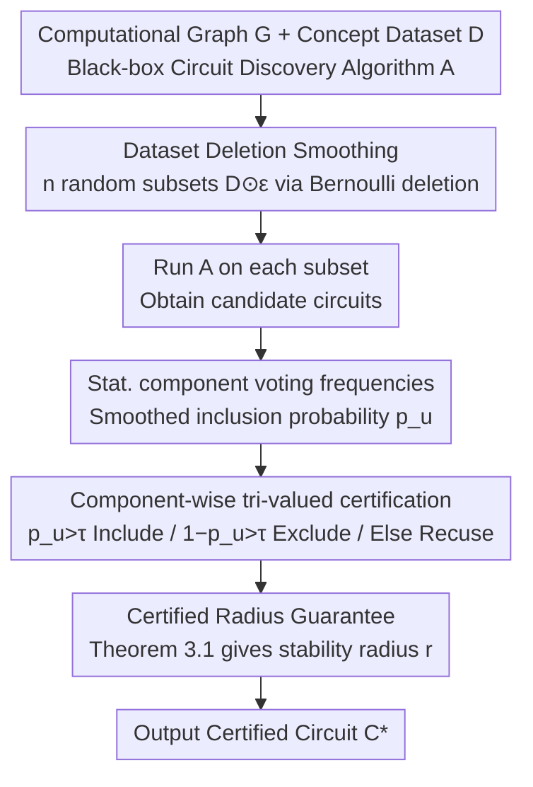

# Certified Circuits: Stability Guarantees for Mechanistic Circuits

**Conference**: ICML 2026  
**arXiv**: [2602.22968](https://arxiv.org/abs/2602.22968)  
**Code**: https://github.com/AlaaAnani/certified-circuits  
**Area**: AI Safety / Interpretability  
**Keywords**: Mechanistic Interpretability, Circuit Discovery, Randomized Smoothing, Robustness Certification, Dataset Stability  

## TL;DR
The authors propose the Certified Circuits framework, which provides provable dataset-level stability guarantees for circuit discovery in mechanistic interpretability via deletion-based randomized smoothing. This ensures that discovered circuits remain invariant under bounded edit distance perturbations of the concept dataset, resulting in more compact, accurate circuits with superior OOD generalization.

## Background & Motivation

**Background**: Mechanistic Interpretability aims to understand the internal computations of neural networks by identifying circuits—minimal sub-networks responsible for specific behaviors. In vision models, a circuit for "crocodile" might consist of convolutional filters detecting scales or teeth; in language models, attention heads and MLP neurons responsible for specific tasks can be isolated through activation patching and causal tracing.

**Limitations of Prior Work**: Current circuit discovery methods are extremely fragile—adding, removing, or replacing a few semantically equivalent samples in the concept dataset can lead to unpredictable changes in the discovered circuit. For example, a circuit discovered using photos of crocodiles on land may perform poorly on crocodiles in water or cartoon crocodiles. More critically, discovered circuits often fail to generalize reliably to out-of-distribution (OOD) data.

**Key Challenge**: The root cause of this instability is that existing methods overfit to specific concept datasets rather than recovering true conceptual representations. The unstable components included in circuits often correspond to spurious features (e.g., focusing on birds in the background when identifying crocodiles) rather than class-defining features (e.g., teeth, scales).

**Goal**: To provide provable dataset-level robustness guarantees for circuit discovery, ensuring that the discovered circuits remain invariant under bounded edit perturbations of the concept dataset.

**Key Insight**: The authors transfer the idea of Randomized Smoothing (RS) from classification tasks to the circuit discovery scenario. By running a circuit discovery algorithm over multiple randomly subsampled datasets and aggregating the results, empirical stability is converted into provable robustness guarantees. This is promising because RS-Del (deletion smoothing) under edit distance has been proven effective for discrete objects.

**Core Idea**: Wrap any black-box circuit discovery algorithm with randomized deletion smoothing and perform component-wise voting certification for each circuit component's inclusion/exclusion. Uncertain components are recused, resulting in provably stable and more compact circuits.

## Method

### Overall Architecture
The framework addresses the sensitivity of circuit discovery to concept datasets. Certified Circuits treats any black-box algorithm $A$ as a subroutine, executing it on numerous randomly deleted versions of the concept dataset $D$ and performing voting certification on the "selection frequency" of each component. Given a model computational graph $G=(V,E)$, a concept dataset $D$, and an algorithm $A$, the process involves: repeated random subsampling of $D$ → running $A$ on each subset to obtain candidate circuits → calculating component voting frequencies and certifying each individually → outputting a circuit guaranteed to remain invariant under any dataset perturbation within edit distance $r$.

### Key Designs

**1. Dataset Deletion Smoothing: Converting exponential edit perturbations into sampleable random deletions**

Directly enumerating "all datasets within edit distance $r$" is exponentially complex. The authors adopt the RS-Del approach: for each sample in $D=(x_1,\ldots,x_{|D|})$, a Bernoulli coin $\varepsilon_i \sim \text{Bernoulli}(1-p_{\text{del}})$ is flipped. Only samples with $\varepsilon_i=1$ are kept, forming a random subset $D\odot\varepsilon$. By running $A$ on $n$ such subsets, the smoothed inclusion probability $p_u(D)=P[A_u(D\odot\varepsilon)=1]$ is estimated for each component $u$. RS-Del proves that empirical consistency under random deletion translates to certification guarantees for the full edit distance (insertion, deletion, substitution).

**2. Component-wise Tri-valued Certification: Recusing uncertain components instead of forcing them into the circuit**

With $p_u$, a provable decision is made using a confidence threshold $\tau\in[0.5,1)$. For each component $u$, a tri-valued logic is applied: certify inclusion (1) if $p_u>\tau$; certify exclusion (0) if $1-p_u>\tau$; otherwise, recuse ($\oslash$). The recusal stage adaptively prunes components that fluctuate under random deletion—components that often correspond to spurious features. This design converts "top-K selection" into certification-driven adaptive sparsification.

**3. Certified Radius Guarantees: Formalizing worst-case stability radii**

The core theorem (Theorem 3.1) proves that for any non-recused component $u$, with confidence $\geq 1-\alpha$, the certification decision remains invariant for all perturbed datasets $D'$ satisfying $\text{dist}_{\text{edit}}(D,D')\leq r$, where the certified radius is $$r=\lfloor \log(1.5-\tau)/\log p_{\text{del}}\rfloor$$. For example, with $p_{\text{del}}=0.6$ and $\tau=0.95$, $r=1$. For larger $|D|$, the radius can scale up to 59. This elevates circuit discovery from a "likely stable" heuristic to a worst-case guarantee over exponential dataset families.

## Key Experimental Results

### Main Results

Experiments cover three architectures (ResNet-101/50, ViT-B/16, GPT-2 Small) across vision and language modalities.

| Dataset/Task | Model | Full Model cACC | Baseline cACC | Certified cACC | Gain | Circuit Size K Reduc. |
|-------------|------|---------------|---------------|----------------|------|-----------------|
| ImageNet (ID) | ResNet-101 | 0.78 | 0.83 | 0.95 | ↑14% | ↓52% |
| ImageNet-A (OOD) | ResNet-101 | 0.07 | 0.60 | 0.94 | ↑56% | ↓15% |
| OOD-CV (OOD) | ResNet-101 | 0.20 | 0.73 | 0.93 | ↑28% | ↓33% |
| ImageNet-C (OOD) | ResNet-101 | 0.57 | 0.72 | 0.92 | ↑28% | ↓41% |
| IOI (ID) | GPT-2 | 1.00 | 1.00 | 1.00 | 0% | ↓58% |
| Greater-Than (ID) | GPT-2 | 1.00 | 1.00 | 1.00 | 0% | ↓75% |
| Greater-Than (OOD) | GPT-2 | 1.00 | 1.00 | 1.00 | 0% | ↓80% |

### Ablation Study

| Analysis Dimension | Key Result | Explanation |
|----------|----------|------|
| Feature Visualization | Certified neurons respond to class-defining features | Recused neurons respond to co-occurring but non-specific spurious cues |
| Structural Stability (IoU) | Certified circuits have higher median IoU and tighter distributions | The largest stability gains correspond to the highest $\Delta$cACC on OOD-CV |
| Cross-Seed Stability | Certified circuits converge across seeds | The certification process itself is highly reliable |
| Computational Overhead | ~2.4× baseline algorithm cost (n=1000) | Maintained via caching of forward/backward passes |

### Key Findings
- Certified circuits significantly outperform baselines on all vision OOD datasets, with the largest gains on the most difficult shifts (ImageNet-A ↑56%).
- The recusal mechanism removes not just uninformative components, but "harmful" ones that bias the baseline toward spurious class correlations.
- In language tasks where accuracy is saturated, certified circuits achieve the same performance using up to 80% fewer edges.
- When re-discovered on OOD data, certified circuits converge to a similar invariant core, verifying their ability to capture true conceptual representations.

## Highlights & Insights
- **Transferring Randomized Smoothing to Circuits**: Moving RS-Del from classification input perturbations to dataset perturbations for circuit discovery, combined with component-wise recusal, is an elegant application of an established tool to a new domain. This logic could extend to any scenario requiring certified stability of structured outputs.
- **Recusal as Pruning**: The tri-valued logic essentially performs adaptive sparsification. Instead of manual top-K selection, the certification process automatically identifies and excludes unstable components. This implies many components in traditional top-K circuits are spurious.
- **Algorithm Agnostic**: The framework wraps any black-box algorithm without requiring internal access, allowing it to enhance existing circuit discovery methods "out of the box."

## Limitations & Future Work
- Larger certified radii require higher deletion rates, which may degrade base algorithm performance if the concept dataset is very small (though it scales well for $|D| > 100$).
- Current implementation uses a uniform sparsity $K$ across all layers; layer-wise budget allocation might yield finer sparsification.
- Not yet verified on larger LMs (e.g., LLaMA), multi-modal models, or sparse activation architectures.
- Certification guarantees are relative to specific threat models and concept datasets; they should not be misinterpreted as exhaustive explanations of model behavior.

## Related Work & Insights
- **ACDC** (Conmy et al., 2023): Automatically discovers circuits via iterative edge pruning; serves as a baseline for vision experiments.
- **EAP-IG** (Hanna et al., 2024): LM circuit discovery via Integrated Gradients scoring; used as the base algorithm for language experiments.
- **RS-Del** (Huang et al., 2023): Provides the theoretical foundation for edit-distance certification via random deletion.
- **Fischer et al. (2021)**: Pixel-wise certification in segmentation tasks inspired the component-wise recusal design.

<!-- RELATED:START -->

## Related Papers

- [\[ICML 2026\] Query Circuits: Explaining How Language Models Answer User Prompts](query_circuits_explaining_how_language_models_answer_user_prompts.md)
- [\[ACL 2025\] Reasoning Circuits in Language Models: A Mechanistic Interpretation of Syllogistic Inference](../../ACL2025/interpretability/reasoning_circuits_in_language_models_a_mechanistic_interpretation_of_syllogisti.md)
- [\[ICML 2026\] All Circuits Lead to Rome: Rethinking Functional Anisotropy in Circuit and Sheaf Discovery for LLMs](all_circuits_lead_to_rome_rethinking_functional_anisotropy_in_circuit_and_sheaf_.md)
- [\[ICLR 2026\] Formal Mechanistic Interpretability: Automated Circuit Discovery with Provable Guarantees](../../ICLR2026/interpretability/formal_mechanistic_interpretability_automated_circuit_discovery_with_provable_gu.md)
- [\[ICCV 2025\] Granular Concept Circuits: Toward a Fine-Grained Circuit Discovery for Concept Representations](../../ICCV2025/interpretability/granular_concept_circuits_toward_a_fine-grained_circuit_discovery_for_concept_re.md)

<!-- RELATED:END -->
