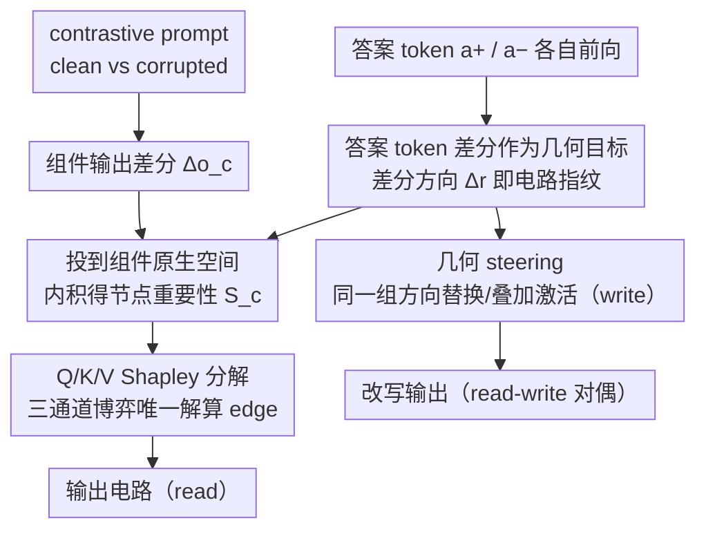

# Circuit Fingerprints: How Answer Tokens Encode Their Geometrical Path

**Conference**: ICML 2026  
**arXiv**: [2602.09784](https://arxiv.org/abs/2602.09784)  
**Code**: Not explicitly public  
**Area**: Interpretability / Mechanistic Interpretability / Activation Steering  
**Keywords**: Circuit Discovery, Activation Steering, Geometric Alignment, Answer Token Fingerprints, Shapley Decomposition

## TL;DR
This paper proposes the "Circuit Fingerprint" hypothesis—feeding a standalone answer token into a Transformer leaves a directional signature in the latent space that corresponds exactly to the circuit path required to generate that answer. Based on this, it achieves circuit discovery through pure geometric alignment (without gradients or intervention). It further demonstrates that the same set of directions can perform activation steering, proving that "reading" and "writing" are two sides of the same geometric object.

## Background & Motivation
**Background**: Mechanistic interpretability currently follows two paths: (i) circuit discovery, using activation patching or gradient approximations (EAP / EAP-IG) to find task-critical attention head/MLP sub-networks; (ii) activation steering, adding learned directions to the residual stream to control model behavior. Both operate within the same representation space yet remain independent.

**Limitations of Prior Work**: Patching requires $O(LH)$ forward passes; gradient methods (attribution patching, EAP-IG) suffer from instability due to saturation and LayerNorm non-linearities; mask-learning methods (ACDC, edge pruning) require iterative optimization. Steering requires collecting contrastive data, learning directions, and tuning intervention strength, while "where to intervene" and "which direction to use" are treated as decoupled problems.

**Key Challenge**: If a circuit is stably encoded in model weights, then discovery and steering should operate on the same object—but existing methods treat them as separate tools that do not communicate. The linear representation hypothesis (Park 2024, Elhage 2022) suggests a unified geometric perspective but has never been used to explain both simultaneously.

**Goal**: To use a single geometric principle to answer (i) which components belong to a circuit (read) and (ii) how to intervene in these components to change the output (write), without relying on gradients or intervention and using only pure forward projections.

**Key Insight**: Feeding an answer token (e.g., "Paris") alone into the model carries no context, but because circuits are fixed weights, it activates the same capital-city recall circuit along its path. Thus, $\Delta r^{(L)}=r_{a_+}^{(L)}-r_{a_-}^{(L)}$ naturally becomes a geometric signature of the direction "required to generate" $a_+$ vs $a_-$.

**Core Idea**: Circuit membership equals the alignment between component outputs and the "answer token differential direction." Using the same direction for steering constitutes a "write" operation; read and write are duals (duality) of the same group of directions.

## Method

### Overall Architecture
The method addresses two sides of the same problem: identifying components that constitute a circuit (read) and modifying those components to switch outputs (write). It frames both as "geometric alignment"—one side being the differential direction (circuit fingerprint) left by the forward pass of a standalone answer token, and the other being the component output differences $\Delta o_c$ under a contrastive prompt (clean vs. corrupted). In the read phase, fingerprint directions are projected into the native space of each component to calculate node importance via inner products, followed by a Q/K/V three-channel decomposition to solve for edges. In the write phase, the same set of directions is used to replace or augment component activations. The entire process requires no gradients or intervention, relying solely on pure forward projections.

### Key Designs

**1. Answer token difference as geometric target: Preserving additivity via native space projection**

Traditional circuit discovery methods rely on per-component patching or backpropagation, which are costly and susceptible to LayerNorm non-linearities. This paper takes a different starting point: by feeding $a_+$ and $a_-$ independently into the model just once, the target directions $\Delta r^{(L)}, \Delta v, \Delta q, \Delta k$ can be read from every layer and head. Since weights are fixed, isolated answer tokens follow the original circuit, leaving a signature of the direction "needed to produce the answer." To measure component importance, it is crucial not to take inner products directly in the residual stream, as shared projection matrices like $W_O$ introduce geometric confusion. Instead, the paper transforms target directions into the native space of component $c$ ($W_O$ for attention heads, $W_{\text{out}}$ for MLPs) to get $\hat t_c=W_c^\top \Delta r^{(L)}/\|\Delta r^{(L)}\|$, then calculates $S_c=\langle \Delta o_c,\hat t_c\rangle$. This decouples "how components generate directions" from "shared residual stream geometry," ensuring $\sum_c S_c$ exactly equals the total projection onto the target direction in the residual stream—making importance additive and training-free.

**2. Q/K/V Shapley Decomposition: Turning edge attribution into a unique game-theoretic solution**

Beyond node importance, the method characterizes edges $i\to j$ (information flow from an upstream component to a downstream head). Since an edge traverses three channels (Query, Key, Value), assigning weights to these channels is traditionally arbitrary. This paper defines normalized residual stream decompositions for each channel, such as $R^{(K)}_{i\to j}=\langle \Delta o_i, W^{(j)}_K \Delta k^{(j)}\rangle/\langle\Delta r^{(\ell_j)}, W^{(j)}_K \Delta k^{(j)}\rangle$. By treating Q, K, and V as players in a cooperative game, it evaluates $2^3=8$ coalitions per head to find the Shapley weights $\phi_Q, \phi_K, \phi_V$. The final edge importance is $E_{i\to j}=S_j\cdot(\phi_Q R^{(Q)}_{i\to j}+\phi_K R^{(K)}_{i\to j}+\phi_V R^{(V)}_{i\to j})$, with indirect importance accumulated via back-accumulation from deep to shallow layers (Alg. 1). Shapley values are used because they are the **unique** distribution satisfying fairness axioms in cooperative games, ensuring additivity holds at the edge level. Empirically, this decomposition reveals functional roles—Fig. 4 shows Name Mover heads are Q-dominated and S-Inhibition heads are K-dominated, aligning perfectly with human-labeled roles from Wang 2022.

**3. Geometric steering: Directly using the "read" directions for "write"**

To prove fingerprints represent causal structures rather than surface correlations, the paper uses them to intervene in generation. Reusing the same directions identified during the read phase for the same heads, it performs steering: answer prototypes $\{r_1,\dots,r_k\}$ are centered and processed via SVD to find an orthogonal basis $\{u_i\}$. For factual recall, a replacement method $X'=X-\|d_s-d_t\|\hat d_s+\|d_s-d_t\|\hat d_t$ is used; for stylistic tasks (emotion, language), a magnitude transfer $X'=X-\|d_s\|(\hat d_s-\hat d_t)$ is applied. The control group is activation patching (directly moving corrupted activations), which serves as the behavioral upper bound. If geometric directions can approximate patching effects, it confirms read-write duality. On IOI, with $\alpha=1$, geometric steering achieved $P(\text{correct})=0.014$ vs patching's 0.0, and a logit diff of $-4.07$ vs $-7.34$, demonstrating behavioral effects of the same magnitude.

### Loss & Training
The entire process uses no training, no gradients, and no interventions: obtaining target directions requires only 2 forward passes ($a_+$ and $a_-$). Calculating $\Delta o_c$ requires one additional forward pass with the contrastive prompt. The 8 coalition evaluations for Shapley values can be run in batches. Total computational budget is comparable to a single backward pass of EAP.

## Key Experimental Results

### Main Results

| Model | Method | IOI CMD↓ | IOI CPR↑ | SVA CMD↓ | SVA CPR↑ | MCQA CMD↓ | MCQA CPR↑ |
|-------|--------|---------|---------|---------|---------|---------|-----------|
| GPT2-Small | EAP-IG | 0.03 | 0.97 | 0.05 | 0.95 | N/A | N/A |
|  | **CF (ours)** | 0.06 | **0.98** | 0.09 | 0.91 | N/A | N/A |
| Qwen2.5-0.5B | EAP-IG | 0.01 | 1.00 | 0.05 | 0.99 | 0.05 | 95.0 |
|  | **CF (ours)** | 0.04 | 0.96 | 0.06 | 0.94 | 0.09 | 92.0 |
| Llama3.2-1B | EAP-IG | 0.01 | 0.99 | 0.03 | 0.98 | 0.05 | 95.0 |
|  | **CF (ours)** | 0.02 | 0.99 | 0.05 | 0.96 | 0.13 | 0.87 |
| OPT-1.3B | EAP-IG | 0.00 | 1.50 | 0.01 | 1.00 | 0.04 | 0.96 |
|  | **CF (ours)** | 0.01 | 0.99 | 0.05 | 0.95 | 0.07 | 0.93 |

CF performs comparably to gradient-based baselines in IOI and SVA and is fully competitive with EAP; it is slightly weaker in MCQA.

### Steering Evaluation

| Metric | Baseline (instruction prompting) | CF Steered |
|--------|----------------------------------|-----------|
| Emotion Classification Accuracy | 53.1% | **69.8%** |
| Perplexity (median) | 17.03 | **13.37** |
| Factual Accuracy | 90.1% | 89.6% |

Steering for positive emotions (joy) maintains or improves factual accuracy. However, negative emotions (sadness 81%, disgust 78%) result in "emotional resonance phoneme pollution" of name recall (e.g., Einstein being changed to "Sissoar").

### Key Findings
- CMD/CPR results are nearly equal to gradient baselines. As model size increases, the geometric method converges toward EAP-IG, attributed to "better conceptual decoupling in larger models."
- Shapley decomposition reveals functional roles: Name Mover heads are Q-dominated, while S-Inhibition heads are K-dominated, matching manual classifications in IOI literature.
- The same directions work effectively for both read and write phases (the curves for patching upper bound and CF steering overlap significantly), providing strong evidence for read-write duality.
- Persona/emotion instruction prefixes from prompt engineering can also extract directions, proving the fingerprint method generalizes to any attribute controllable via prompt modification.

## Highlights & Insights
- **The claim that "answer tokens carry their own circuit fingerprints" is highly counter-intuitive**: While we usually assume circuits only activate when producing an answer, this paper reveals that answer tokens follow the same path even when used as input (sometimes suppressing incorrect candidates). It quantifies the intuition of "circuits as stable structures" into readable directions.
- **Read-write duality as true causal validation**: Directions found are not just "important-looking" but can directly steer generation to reproduce patching effects. This moves interpretability from "post-hoc description" to "pre-hoc intervention," a paradigm shift from SAEs/probes.
- **Transferable Q/K/V Shapley logic**: Using $2^3=8$ coalitions for a unique game-theoretic solution replaces "arbitrary weight combinations." This logic is reusable for any multi-branch module like MoE or multi-expert fusion.
- **Efficiency**: Requiring only 2 forward passes makes CF nearly free computationally compared to $O(LH)$ sweeps or backpropagation, making it highly friendly for large models.

## Limitations & Future Work
- Experiments were restricted to small models ($\le 1.3$B); 7B+ models were not tested. Llama3.2-1B's performance on MCQA (CPR 0.87 vs EAP-IG 0.95) suggests geometric approximations are less tight for complex tasks.
- The focus is on the final token position, ignoring indirect effects at earlier positions and LayerNorm non-linearities, which may affect edge attribution accuracy in long contexts.
- Zero-shot steering remains fragile: negative emotions can pollute semantics and generate nonsensical words (e.g., "Bonniweeper"), indicating features are still entangled with lexical content.
- Evaluation metrics (CMD/CPR) are from the MIB benchmark; systematic comparisons on other interpretability tasks (feature ablation, faithfulness) are still needed.

## Related Work & Insights
- **vs. ACDC / Edge Pruning / EAP-IG**: Traditional circuit discovery requires iterative searches or backpropagation; CF achieves this with the cost of a single forward pass and no gradient dependency.
- **vs. Activation Steering (Turner 2023, Zou 2023)**: Existing steering requires preparing contrastive data to learn directions; CF reuses directions from discovery, unifying "where to intervene" and "which direction to use."
- **vs. Linear Representation Hypothesis**: Where earlier work described features as directions, CF provides operational evidence—these directions describe the circuits themselves. It suggests a unification: "Feature Geometry $\equiv$ Circuit Geometry."

## Rating
- **Novelty**: ⭐⭐⭐⭐⭐ The Circuit Fingerprint hypothesis and read-write duality unify two independent research lines into a single geometric object.
- **Experimental Thoroughness**: ⭐⭐⭐ Covers 4 model families across 3 tasks and 5 emotional steering tests, but model sizes are small and benchmarks are limited.
- **Writing Quality**: ⭐⭐⭐⭐ Clear conceptual explanations, complete Shapley derivations, and honest discussion of limitations.
- **Value**: ⭐⭐⭐⭐ Provides a gradient-free, low-cost tool for simultaneous discovery and control, useful for alignment and behavioral editing.

<!-- RELATED:START -->

## Related Papers

- [\[ICML 2026\] Query Circuits: Explaining How Language Models Answer User Prompts](query_circuits_explaining_how_language_models_answer_user_prompts.md)
- [\[ICLR 2026\] From Tokens to Thoughts: How LLMs and Humans Trade Compression for Meaning](../../ICLR2026/interpretability/from_tokens_to_thoughts_how_llms_and_humans_trade_compression_for_meaning.md)
- [\[ICML 2026\] LatentLens: Revealing Highly Interpretable Visual Tokens in LLMs](latentlens_revealing_highly_interpretable_visual_tokens_in_llms.md)
- [\[ICML 2026\] All Circuits Lead to Rome: Rethinking Functional Anisotropy in Circuit and Sheaf Discovery for LLMs](all_circuits_lead_to_rome_rethinking_functional_anisotropy_in_circuit_and_sheaf_.md)
- [\[ICML 2026\] Scalable Circuit Learning for Interpreting Large Language Models](scalable_circuit_learning_for_interpreting_large_language_models.md)

<!-- RELATED:END -->
