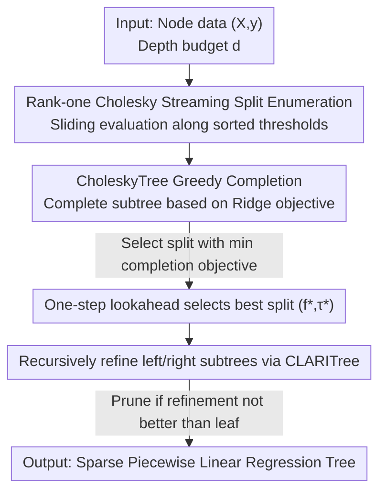

# CLARITree: Cholesky and Lookahead Accelerations for Regression with Interpretable Piecewise Linear Trees

**Conference**: ICML 2026  
**arXiv**: [2606.12840](https://arxiv.org/abs/2606.12840)  
**Code**: https://github.com/Yixiao-Wang-Stats/CLARITree  
**Area**: Interpretability / Decision Tree Regression  
**Keywords**: Regression Trees, Piecewise Linear, Lookahead Search, Rank-one Cholesky Update, Near-optimal Trees

## TL;DR
Addressing the dilemma where "greedy regression trees are fast but inaccurate, while optimal regression trees are accurate but computationally prohibitive," CLARITree combines one-step lookahead search with rank-one Cholesky updates of the Ridge Regression Gram matrix. It learns near-optimal, sparse regression trees with linear models at the leaves, achieving accuracy close to optimal solutions while scaling an order of magnitude better than existing state-of-the-art methods.

## Background & Motivation

**Background**: Regression trees are among the few model classes in machine learning that are both interpretable and expressive. Constant-leaf trees like CART/C4.5 are fast to train but have limited modeling capacity. Linear-leaf trees (M5, GUIDE, PILOT) are more expressive but suffer from high training costs as they require solving a least-squares problem at every node. To approach optimality, mainstream methods use dynamic programming (DP) and branch-and-bound (e.g., STreeD) to search the tree space through pruning with upper and lower bounds.

**Limitations of Prior Work**: Greedy methods consider only the current best split at each step, which can result in a significant gap from the true optimal solution (infinitely large gaps have been documented in literature). Conversely, optimal DP methods face a combinatorial explosion when leaves use linear regression and features are continuous. Solving a linear regression is $O(k^3)$, and when multiplied by a massive number of candidate thresholds and an exponential tree space, existing optimal implementations either revert to constant or single-feature linear leaves or time out on medium-to-large datasets.

**Key Challenge**: There is a hard trade-off between scalability and optimality. The overhead of optimal methods stems primarily from two factors: repeatedly refitting linear regressions at every candidate split and the explosion of candidate thresholds when continuous features are binarized.

**Goal**: To develop an algorithm that retains the efficiency of greedy methods while approaching optimal accuracy, capable of handling continuous features directly with numerical stability.

**Key Insight**: Inspired by SPLIT (Babbar et al., 2025, a lookahead framework for classification trees), it is observed that one does not need a global search of the entire tree; "looking ahead" for the first few layers and completing the rest greedily often yields near-optimal results. The difficulty lies in the fact that classification trees do not involve solving linear regressions in leaves. Adapting lookahead to regression trees with continuous features and linear leaves presents new algorithmic challenges regarding least-squares cost and numerical stability.

**Core Idea**: Use "one-step lookahead split selection + recursive refinement" to control the search budget, and use "rank-one Cholesky updates for Ridge Regression Gram decomposition" to reduce the evaluation cost of each candidate split from $O(k^3)$ to $O(k^2)$. This makes near-optimal linear regression trees on continuous features practical for the first time.

## Method

### Overall Architecture

CLARITree aims to minimize the objective of "prediction loss + structural complexity penalty":

$$L^*(D, d, \lambda, \kappa) = \min_{T_d \in \mathcal{T}} \Big( R_\kappa(T_d, D) + \lambda S(T_d) \Big)$$

Where each leaf fits a ridge-regularized linear predictor $\hat{y}_i = \beta_0 + x_i^\top \beta$ (regularization coefficient $\kappa$), $S(T_d)$ is the number of leaves, and $\lambda$ controls the tree size. Since finding the exact optimum is NP-hard, CLARITree approximates it using $L_{\text{CLARITree}}$.

The workflow is as follows: For the current node, one-step lookahead enumerates "all possible splits at this level." Each candidate split uses a greedy subroutine (CholeskyTree) to complete the remaining subtree. The overall objective after completion is compared to select the best split $(f^\star, \tau^\star)$. Once selected, CLARITree recursively refines the left and right subtrees (rather than simply adopting the greedy completion). Finally, the refined subtree objective is compared with the "leaf-only" objective; if refinement does not improve the result, the node is pruned into a leaf. The computational burden of the search-evaluation loop is concentrated on "evaluating massive candidate splits," which is precisely the bottleneck addressed by rank-one Cholesky updates.

### Key Designs

**1. One-step Lookahead + Recursive Refinement: Approximating Global Optimum with Finite Foresight**

Greedy methods suffer from "looking only at the current step," while optimal methods suffer from "looking at all steps at an explosive cost." CLARITree takes a middle ground: it exhaustively searches all candidate splits for the "current layer" only (one-step lookahead). Each candidate is evaluated by a greedy completion to estimate "how good the entire subtree would be if this split was chosen," and the split with the minimum completion objective is selected. Formally, the objective is defined recursively: first, CholeskyTree finds $(f^\star, \tau^\star) = \arg\min_{f,\tau}\big(L_g(D_{f\le\tau}, d{-}1) + L_g(D_{f>\tau}, d{-}1)\big)$, then CLARITree refines the child nodes. Theoretically, it is proven that its objective value is always $\le$ greedy CholeskyTree (Theorem 5.3), and for certain distributions, the MSE improvement can be arbitrarily large ($\text{MSE}_{\text{Greedy}}/\text{MSE}_{\text{CLARITree}} \ge \frac{1}{4\varepsilon}$, Theorem 5.4).

**2. CholeskyTree Greedy Completion Subroutine: Selecting Splits via Downstream Ridge Objectives**

Lookahead requires a fast completer to estimate subtree quality, which is CholeskyTree (also usable as a standalone baseline). While it resembles the classic M5 model tree, there is a fundamental difference: methods like M5 use mean/variance reduction to evaluate splits while using linear models in leaves, leading to a "mismatch between evaluation criteria and final prediction." CholeskyTree directly uses the **downstream ridge-regularized linear regression loss** to select splits, aligning evaluation with prediction. It maintains leaf statistics using rank-one Cholesky updates, making subtree completion extremely fast.

**3. Rank-one Cholesky Streaming Split Enumeration: Reducing Split Evaluation to $O(k^2)$**

This is the core of the efficiency. Evaluating a split requires re-solving Ridge Regression for two child nodes, which is $O(k^3)$ from scratch. CLARITree maintains the Cholesky decomposition of the regularized Gram matrix $A = X^\top X + \kappa I = LL^\top$ and the moment vector $b = X^\top y$. When scanning samples along a feature sorted by value, moving one sample involves a rank-one Cholesky update/downdate (cholupdate $\pm$) for the child nodes, costing $O(k^2)$ (Theorem 4.1). Ridge loss is obtained **without explicitly solving for coefficients** directly from the Cholesky factors:

$$\min_\beta \|X\beta - y\|^2 + \kappa\|\beta\|^2 = \|y\|^2 - \|L^{-1}b\|^2$$

This operation is also $O(k^2)$ (Theorem 4.2). Using Cholesky factors instead of updating the inverse matrix ensures numerical stability without pivoting. This reduces the cost of evaluating a single split by a factor of $O(k)$.

**4. Direct Handling of Continuous Features: Avoiding Binarization to Save an $O(n)$ Factor**

Existing optimal methods often binarize continuous features (generating $T$ threshold predicates per feature), causing the number of candidates to explode. Since rank-one Cholesky updates follow an incremental "moving samples between children" format, CLARITree can perform a sliding scan over sorted continuous features with incremental updates without pre-binarization. Compared to binarization schemes enumerating $T$ thresholds, directly handling continuous features reduces split evaluation complexity by a factor of $T$ (or $T^3$ compared to fully binarized regression, Theorem 5.5).

## Key Experimental Results

Setup: Depth 4, 20 candidate thresholds per feature, reporting Test $R^2$ (Mean ± SD). Values in parentheses indicate the Test MSE ratio relative to CLARITree. Training time limit 600s (timeout marked as `*`). Baselines include optimal DP (STreeD, STreeD-S) and several greedy methods (GUIDE, PILOT, M5, CholeskyTree).

### Main Results

| Dataset | Scale | CLARITree | STreeD (Optimal DP) | GUIDE | PILOT | M5 |
|--------|------|-----------|----------------|-------|-------|-----|
| Airfoil | 1503 | 0.88 | 0.89 | 0.84 | 0.51 | 0.54 |
| Optical Net | 630 | **0.92** | 0.88 | 0.80 | 0.71 | 0.74 |
| California Housing | 20433 | **0.75** | 0.70* (Timeout) | 0.73 | 0.64 | 0.60 |
| Seoul Bike | 8760 | **0.72** | 0.69* | 0.68 | 0.54 | 0.60 |
| Temperature(Max) | 7590 | **0.88** | 0.82* | 0.84 | 0.78 | 0.72 |

On small/medium scales, CLARITree is nearly identical to optimal DP (e.g., Airfoil 0.88 vs. STreeD 0.89) and outperforms greedy baselines. On large scales, optimal DP consistently exceeds the 600s limit (`*`), resulting in lower accuracy than CLARITree (e.g., California Housing 0.75 vs. 0.70*).

### Ablation Study

| Configuration | Function | Description |
|------|------|------|
| CLARITree (Full) | One-step Lookahead + Recursive Refinement | Near-optimal solution, theoretically $\le$ greedy objective. |
| CholeskyTree | Only Greedy Completion (No Lookahead) | Greedy baseline; accuracy is generally lower than CLARITree. |
| No Cholesky Update | Solve $O(k^3)$ from scratch per split | Evaluation cost increases by $O(k)$; infeasible for large data. |
| Binarized Features | No direct continuous handling | Split evaluation complexity increases by $T$ (or $T^3$ for full binarization). |

### Key Findings
- **Lookahead provides accuracy**: CholeskyTree (without foresight) performs worse than CLARITree on most datasets, and CLARITree is theoretically guaranteed to be no worse than the greedy objective.
- **Cholesky updates provide scalability**: Reducing split evaluation from $O(k^3)$ to $O(k^2)$ is critical; otherwise, large-scale data remains untrainable.
- **Optimal DP is "accurate but slow"**: Several large datasets triggered the 600s timeout, where CLARITree achieved higher $R^2$ within the same time budget.

## Highlights & Insights
- Integrates "rollout/pilot ideas from combinatorial optimization" with "rank-one Cholesky updates from numerical linear algebra": the former controls search budget while the latter makes each evaluation cheap.
- Calculating Ridge loss via $\|y\|^2 - \|L^{-1}b\|^2$ **bypasses explicit coefficient computation**, a reusable trick for any scenario requiring repeated linear regression evaluations across many split points.
- Aligning evaluation criteria with leaf predictions (both using Ridge objectives) avoids the mismatch seen in M5 (splitting by variance but predicting with linear models).
- Direct handling of continuous features acts as both an efficiency and accuracy optimization, as binarization inherently loses information.

## Limitations & Future Work
- The main paper focuses on "one-step lookahead" as a polynomial-time special case; multi-step lookahead is closer to optimal but more expensive and only briefly discussed.
- Runtime $O(d^2 n k^4 T)$ has a quartic dependency on feature dimension $k$, which may be challenging for extremely high-dimensional features.
- The standard split criterion is fixed to MSE reduction; while the framework claims to accommodate other greedy heuristics, other criteria have not been empirically verified.
- Near-optimal, not optimal: While guaranteed $\le$ greedy, the gap to the true optimal solution has no theoretical upper bound and may persist in extreme distributions.

## Related Work & Insights
- **vs. STreeD (Optimal DP, Van Den Bos et al. 2024)**: STreeD uses DP + Branch & Bound for optimality but times out on large-scale linear-leaf/continuous-feature data. CLARITree sacrifices global optimality for scalability, achieving higher accuracy on large datasets in practice.
- **vs. SPLIT (Babbar et al. 2025)**: SPLIT applies lookahead to classification trees. CLARITree extends this to regression trees with linear leaves, addressing the algorithmic challenge of least-squares cost via Cholesky updates.
- **vs. PILOT (Raymaekers et al. 2024)**: PILOT uses rank-one updates for greedy linear model trees but focuses on minimal regression models and recomputes matrix inverses at each node without cross-tree state sharing.
- **vs. M5 (Quinlan 1992)**: M5 splits by variance but predicts with linear models. CLARITree aligns the split selection directly with the downstream Ridge objective.

## Rating
- Novelty: ⭐⭐⭐⭐ Combining lookahead with rank-one Cholesky updates for linear-leaf regression trees is a first; solid synthesis of existing ideas.
- Experimental Thoroughness: ⭐⭐⭐⭐ Covers small/medium/large data with a full suite of optimal and greedy baselines.
- Writing Quality: ⭐⭐⭐⭐ Clear algorithms and theorems; complete pseudocode provided.
- Value: ⭐⭐⭐⭐ Provides a practical, near-optimal linear regression tree implementation with open-source code.

<!-- RELATED:START -->

## Related Papers

- [\[ICML 2026\] Breaking the Simplification Bottleneck in Amortized Neural Symbolic Regression](breaking_the_simplification_bottleneck_in_amortized_neural_symbolic_regression.md)
- [\[NeurIPS 2025\] Are Greedy Task Orderings Better Than Random in Continual Linear Regression?](../../NeurIPS2025/interpretability/are_greedy_task_orderings_better_than_random_in_continual_linear_regression.md)
- [\[ICML 2026\] MAAT: Heterogeneous Partial Observation State Reconstruction Based on Knowledge-Guided Kernel Regression](knowledge-informed_kernel_state_reconstruction_from_heterogeneous_partial_observ.md)
- [\[ICML 2026\] Why Linear Interpretability Works: Invariant Subspaces as a Result of Architectural Constraints](why_linear_interpretability_works_invariant_subspaces_as_a_result_of_architectur.md)
- [\[ICML 2026\] LatentLens: Revealing Highly Interpretable Visual Tokens in LLMs](latentlens_revealing_highly_interpretable_visual_tokens_in_llms.md)

<!-- RELATED:END -->
