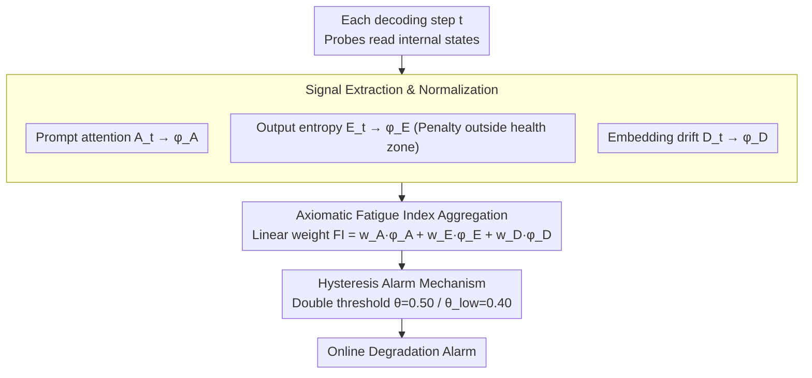

# Cognitive Fatigue in Autoregressive Transformers: Formalization and Measurement

**Conference**: ICML2026  
**arXiv**: [2605.30981](https://arxiv.org/abs/2605.30981)  
**Code**: None  
**Area**: Interpretability/Model Diagnostics  
**Keywords**: Cognitive Fatigue, Autoregressive Transformer, Runtime Monitoring, Fatigue Index, Long-sequence Degradation  

## TL;DR
This paper formalizes the degradation phenomenon of autoregressive language models in long-sequence generation as "cognitive fatigue." It proposes the Fatigue Index (FI), a lightweight, model-agnostic online diagnostic metric that aggregates three signals: prompt attention decay, representation drift, and entropy dysregulation. The predictive power of FI for degradation (AUROC=0.976) is validated across 9 models, revealing non-monotonic scaling behavior.

## Background & Motivation

**Background**: Large Language Models (LLMs) perform excellently with short prompts but exhibit systematic degradation in long-sequence generation scenarios (e.g., multi-step reasoning, tool calling, multi-turn dialogues)—producing repetitive text, losing instruction-following capabilities, and experiencing entropy instability.

**Limitations of Prior Work**: Current mitigation strategies primarily operate during training (e.g., unlikelihood training) or offline evaluation phases, lacking online diagnostic signals that can detect degradation in real-time during inference. Practitioners often discover unreliable outputs only after generation is complete, preventing timely intervention during the onset of degradation.

**Key Challenge**: The autoregressive decoding of Transformers naturally involves structural pressures such as attention dilution, residual accumulation, and overfitting. These pressures compound as the sequence grows; however, models do not expose a "reliability dashboard" to reflect the health of the current generation.

**Goal**: (1) Formalize long-sequence degradation into a measurable concept of "cognitive fatigue"; (2) Design an online indicator (FI) that satisfies axiomatic constraints; (3) Validate the predictive capability and stability of FI across multiple models and tasks.

**Key Insight**: The authors proceed from three types of internal observable signals in Transformers—attention distribution, latent state trajectories, and output entropy—where each corresponds to a specific degradation mode. These can be computed without modifying model weights or retraining.

**Core Idea**: Linearly aggregate three orthogonal signals—attention decay, representation drift, and entropy dysregulation—after normalization into a bounded Fatigue Index. This transforms long-sequence degradation from "ex-post observation" into "real-time monitoring."

## Method

### Overall Architecture
The paper addresses the issue of models "quietly failing" during long-sequence generation without a real-time dashboard. In each step $t$ of the decoder-only model’s autoregressive decoding, lightweight probes extract three orthogonal signals: current token attention to the prompt region, latent state shift relative to the end of the prompt, and the entropy of the next token distribution. These are normalized to a uniform penalty scale and linearly aggregated into a bounded Fatigue Index (FI). The FI satisfies five axioms to ensure interpretability and attribution, followed by a hysteresis alarm mechanism to convert continuous risk scores into stable online alerts. The entire process requires no weight modification or retraining.

### Key Designs

**1. Three Signal Extraction and Normalization: Mapping heterogeneous internal states to additive degradation penalties**

Degradation manifests in several ways: forgotten instructions, failed prediction calibration, and increasingly drifting representations. No single signal is sufficient, yet their scales differ completely. This paper designs a mapping function to $[0,1]$ for each signal: **Prompt Attention** $A_t$ calculates the average weight of all attention heads in the last layer toward the prompt segment; lower attention indicates more severe instruction-following decay, so the penalty is $\phi_A(A_t) = 1 - \text{clip}(A_t, 0, 1)$. **Output Entropy** $E_t$ introduces a "health zone" $[H_\ell, H_u]$ where the penalty is 0; values below the lower bound correspond to overconfidence/repetition, and values above the upper bound correspond to over-uncertainty, with linear penalties applied to both sides. **Embedding Drift** $D_t = \|h_t - h_0\|_2$ measures the distance of the latent state from the end of the prompt, divided by a fixed upper bound $\kappa$ and clipped to $[0,1]$. These signals target instruction following, prediction calibration, and internal representation degradation respectively, allowing them to be compared and added on a common scale.

**2. Axiomatic Fatigue Index Aggregation: An attributable single-value risk score**

Once the three penalties are obtained, they must be synthesized into a single score using a credible method. The paper uses a linear aggregation $FI_t = w_A \phi_A(A_t) + w_E \phi_E(E_t) + w_D \phi_D(D_t)$, with weights $w_A=0.40, w_E=0.35, w_D=0.25$. This aggregation is proven to satisfy five axioms: Monotonicity (FI increases if any signal worsens), Scale Invariance (order-preserving transformations do not change ranking), Boundedness ($FI \in [0,1]$), Temporal Stability (Lipschitz continuity with respect to $t$), and Decomposability (can be decomposed back into individual signal contributions). Linear fusion is chosen over complex non-linear methods for transparency and attribution—allowing one to identify which signal is driving high scores. The weight hierarchy $w_A \geq w_E \geq w_D$ encodes domain priors: attention most directly reflects instruction following, followed by entropy for repetition/collapse, while drift is a long-term but noisier signal.

**3. Hysteresis Alarm Mechanism: Turning jittery risk scores into usable production alarms**

Even if the FI trend is correct, step-by-step thresholding can lead to frequent flipping near the critical point, resulting in false alarms. Drawing from control system hysteresis, this paper sets two thresholds—an activation threshold $\theta = 0.50$ and a deactivation threshold $\theta_{\text{low}} = 0.40$. The FI must continuously exceed the activation threshold to trigger an alarm and must fall below the deactivation threshold to clear it. A short-window smoothing layer further suppresses instantaneous jitter. This mechanism ensures alarms are only raised during sustained degradation, reducing alarm flips by over 91% across all datasets.

## Key Experimental Results

### Main Results
Evaluated on OPT-2.7B across three QA datasets with 27,405 generated sequences:

| Dataset | Sample Count | Avg FI | Repetition Rate | Spearman ρ (Full Seq) | Spearman ρ (First 20 tokens) |
|--------|--------|---------|--------|---------------------|------------------------|
| HotpotQA | 7,405 | 0.815 | 0.404 | 0.848 | 0.425 |
| SQuAD | 10,000 | 0.812 | 0.423 | 0.856 | 0.375 |
| TriviaQA | 10,000 | 0.833 | 0.467 | 0.820 | 0.404 |

Aggregation vs. Single Signal AUROC Comparison (HotpotQA, Severe Degradation Detection):

| Method | AUROC |
|------|-------|
| **Fatigue Index (Ours)** | **0.976** |
| Entropy Only | 0.954 |
| Drift Only | 0.929 |
| Attention Only (Inverse) | 0.307 |

### Ablation Study

| Configuration | Key Metric | Description |
|------|---------|------|
| Full FI + Hysteresis Alarm | Flip reduction 91-93% | Naive flips of 18-21/seq reduced to 1.4-1.7/seq across datasets |
| FP16 Precision | Stable Entropy | Normal attention and drift trajectories |
| 4-bit NF4 Quantization | Deeper/unstable entropy collapse | Quantization primarily degrades calibration rather than prompt focus or representation stability |
| Short Context (len=192) | High prompt attention | Attention remains significantly non-zero |
| Long Context (len=1446) | Near-zero prompt attention | Earlier onset of total attention collapse |

### Key Findings
- **Aggregation Significantly Outperforms Single Signals**: The AUROC of FI (0.976) significantly exceeds the strongest single signal (drift 0.929), validating the necessity of multi-signal aggregation. While attention alone has an AUROC of only 0.307, it receives the highest weight as it most directly reflects instruction following.
- **Non-monotonic Scaling**: Among 9 models from 1B to 13B, instruction-tuned models under 3B collapse faster than base models. This trend reverses at 7B, where instruction-tuned models perform better. Llama-2-13B-Chat exhibits "safety fatigue"—collapsing into low-entropy rejection templates.
- **Drift Slope is Independent of Model Size**: The embedding drift slopes of different scale models cluster between 0.08-0.14, suggesting that larger models are not "drifting less" but rather "drifting more coherently."
- **Positional Bias Exacerbates Fatigue**: Attention given to prefix evidence is 5-10 times higher than for middle/end positions. Primacy bias leads to systematic neglect of later context.

## Highlights & Insights
- **Transformation from Ex-post Observation to Real-time Diagnosis**: FI only requires the model's logits, attention, and latent states, allowing for online calculation without retraining. This "model endoscope" approach can be extended to any LLM deployment scenario requiring runtime reliability monitoring.
- **Axiomatic Design Ensures Metric Quality**: The five axioms (monotonicity, scale invariance, boundedness, temporal stability, decomposability) not only constrain the form of FI but also provide general criteria for evaluating any online diagnostic metric. This methodological contribution is independent of specific signal choices.
- **Discovery of "Safety Fatigue"**: The phenomenon of 13B alignment models collapsing into rejection templates reveals side effects of over-alignment on output diversity, serving as a warning for RLHF/alignment research.

## Limitations & Future Work
- FI requires access to logits, attention, and latent states, making it inapplicable to closed-source APIs (e.g., GPT-4).
- Experiments are limited to QA tasks with a generation limit of 120 tokens; practical scenarios like long dialogues, code, or tool calling await verification.
- Linear aggregation and fixed weight assumptions are strong; the weight transferability across model families and decoding strategies is unverified.
- Only the predictive power for repetitive degradation was verified; non-repetitive failure modes like hallucinations or factual errors were not covered.
- Future work could explore closed-loop intervention (automatic strategy switching when FI is triggered), mechanistic interpretability (locating circuit-level causes of fatigue), and adaptive weight learning.

## Related Work & Insights
- Liu et al. (2023) "Lost in the Middle" reveals task-level effects of positional bias; this paper refines it into token-level online signals.
- Holtzman et al. (2020) proposed nucleus sampling to mitigate text degradation; this paper addresses the same issue from a monitoring rather than mitigation perspective.
- Farquhar et al. (2024) used semantic entropy for hallucination detection, which is an offline method based on semantic aggregation, whereas FI emphasizes real-time performance and multi-signal fusion.
- The FI concept could be migrated to multimodal models (attention decay of visual tokens) or Agent systems (monitoring cumulative degradation in multi-step calls).

<!-- RELATED:START -->

## Related Papers

- [\[NeurIPS 2025\] How Intrinsic Motivation Shapes Learned Representations in Decision Transformers: A Cognitive Interpretability Analysis](../../NeurIPS2025/interpretability/toward_explainable_offline_rl_analyzing_representations_in_intrinsically_motivat.md)
- [\[ICLR 2026\] Decoupling Dynamical Richness from Representation Learning: Towards Practical Measurement](../../ICLR2026/interpretability/decoupling_dynamical_richness_from_representation_learning_towards_practical_mea.md)
- [\[ICML 2026\] Discovering Interpretable Algorithms by Decompiling Transformers to RASP](discovering_interpretable_algorithms_by_decompiling_transformers_to_rasp.md)
- [\[ICLR 2026\] AdAEM: An Adaptively and Automated Extensible Measurement of LLMs' Value Difference](../../ICLR2026/interpretability/adaem_an_adaptively_and_automated_extensible_measurement_of_llms_value_differenc.md)
- [\[ICLR 2026\] Hessian-Enhanced Token Attribution (HETA): Interpreting Autoregressive LLMs](../../ICLR2026/interpretability/hessian-enhanced_token_attribution_heta_interpreting_autoregressive_llms.md)

<!-- RELATED:END -->
