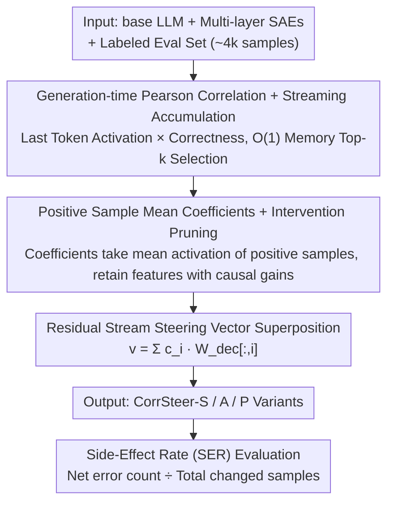

# CorrSteer: Generation-Time LLM Steering via Correlated Sparse Autoencoder Features

**Conference**: ICML 2026  
**arXiv**: [2508.12535](https://arxiv.org/abs/2508.12535)  
**Code**: https://github.com/seonglae/CorrSteer  
**Area**: Mechanistic Interpretability / SAE / Steering  
**Keywords**: Sparse Autoencoders, Representation Steering, Feature Selection, Pearson Correlation, Side-Effect Rate

## TL;DR
By calculating the Pearson correlation between SAE activations on generation-time tokens and task correctness, CorrSteer identifies interpretable steering features. Using mean activations from positive samples as coefficients without contrasting datasets or backpropagation, it improves MMLU by +3.3% and HarmBench by +27.1% on Gemma-2 2B / LLaMA-3.1 8B, achieving a lower side-effect rate than fine-tuning.

## Background & Motivation
**Background**: Sparse Autoencoders (SAE) decompose LLM superposition representations into tens of thousands of sparse, interpretable features, becoming a vital tool for mechanistic interpretability. SAE-based "steering" modifies model behavior without fine-tuning weights by adding a feature direction vector to the residual stream, previously applied in narrow scenarios like bias mitigation, unlearning, and jailbreak defense.

**Limitations of Prior Work**: Existing SAE steering methods face three primary issues: (1) Methods like SPARE and DSG require constructing contrastive datasets or storing activations for all samples, causing memory and computation to scale linearly with sample size; (2) AlphaEdit and CAA select features using hidden states from context tokens, but steering truly affects "generation behavior," leading to misalignment; (3) Most methods are restricted to a few axes like bias/refusal, lacking a general pipeline for task-related feature discovery.

**Key Challenge**: Identifying a few features within an SAE dictionary of size $10^5$ that "modify behavior without damaging general capabilities" requires scalability (avoiding activation storage), causal reliability (going beyond mere correlation), and interpretability (avoiding black-box probes).

**Goal**: Construct a fully automated, $O(1)$ memory, backpropagation-free pipeline for feature selection, coefficient estimation, and steering that achieves both accuracy improvements and low side-effect rates across multiple benchmarks.

**Key Insight**: The authors observe that SAE dictionaries are linearly additive, aligning with the "Linear Representation Hypothesis." Thus, Pearson correlation faithfully captures linear dependencies between SAE activations and task outcomes, serving as a lightweight heuristic naturally suited to SAE structures. Furthermore, intervention tests upgrade correlation to causal evidence.

**Core Idea**: Utilize streaming Pearson correlation on generation-time tokens to screen candidate features, use mean activations from correct samples as coefficients, and apply intervention validation to retain features that truly "improve performance when amplified"—treating "correlation as screening, intervention as judgment."

## Method

### Overall Architecture
CorrSteer takes a base LLM, corresponding multi-layer SAEs, a small labeled evaluation set (~4k samples), and a benchmark category as input. The pipeline consists of three automated stages: (1) Calculating the Pearson correlation $r_i$ between each SAE feature activation $z_i$ at the generation step and the sample correctness $y_j \in \{0,1\}$, implemented via Welford-style streaming accumulators for $O(1)$ memory; (2) For each candidate feature $i$, using the mean activation on positive samples $c_i = \frac{1}{|\{j:y_j>0\}|}\sum_{j:y_j>0} z_{i,j}$ as the steering coefficient; (3) Adding $v_{\text{steer}} = \sum_{i \in \mathcal{F}} c_i \cdot W_{\text{dec}}[:,i]$ to the residual stream at the generation position. Three variants, CorrSteer-S/A/P (Global Single Feature / Per-layer / With Intervention Pruning), are output for different task granularities.

### Key Designs

**1. Generation-time Pearson Correlation + Streaming Accumulation: $O(1)$ Memory Feature Selection**

The first stage selects a few features related to task success from an SAE dictionary of size $10^5$. The challenge is avoiding activation storage while ensuring selection aligns with "generation behavior" rather than "input processing." CorrSteer extracts activations $z_i$ only at the **last generation token** position and calculates the Pearson correlation $r_i = \text{Cov}(z_i, y) / \sqrt{\text{Var}(z_i) \cdot \text{Var}(y)}$ with sample correctness $y_j \in \{0,1\}$. Using Welford-style online accumulators maintains only three scalars (mean, variance, covariance) per feature, ensuring $O(1)$ memory independent of sample count. For multi-token generation, max-pooling aggregates activations, while long reasoning (GSM8K) uses mean-pooling to avoid dilution. Only positively correlated features are retained—ablation shows negatively correlated features consistently degrade performance. Pearson correlation is chosen over SPARE’s Mutual Information or DSG’s Fisher matrix because linear correlation matches the linear superposition structure of SAE decoders.

**2. Positive Sample Mean Coefficients + Intervention Pruning (CorrSteer-P): Upgrading Correlation to Causal Evidence**

Candidates screened by correlation may include spurious features that co-occur with success but do not drive it. CorrSteer sets coefficients $c_i$ as the mean activation of the feature across correct samples—leveraging the non-negative nature of SAE activations for lower variance and clearer physical meaning than contrastive differences. Building on CorrSteer-A (one feature per layer), CorrSteer-P performs an intervention pass, retaining only features where steering improves performance over the non-steered baseline. On LLaMA-3.1 8B, MMLU retains 24/31 layers, HarmBench 27/31, and MMLU-Pro only 5/31; the more specialized the task, the more aggressive the pruning. Since intervention is the gold standard for causal inference, such automated pruning identifies features that "truly improve" without requiring manual priors.

**3. Side-Effect Rate (SER): Revealing Reward Hacking Risks in Steering**

Existing steering work often reports only accuracy, masking "reward hacking" where a model swaps one correct behavior for another to improve a target metric. CorrSteer proposes the Side-Effect Rate $\text{SER} = \#\text{New Errors} / \#\text{Total Changes}$, decomposing "improvement" into "total change" and "the ratio of correct modifications." This metric is more transparent: CorrSteer-A on MMLU has an SER of 0.21, while fine-tuning reaches 0.41, despite similar accuracy (55.48% vs 55.75%). This indicates fine-tuning mistakenly breaks twice as many previously correct samples to reach the same score.

### Loss & Training
The method involves no gradient-based training—no weight fine-tuning, no SAE training, and no backpropagation. It only requires forward passes to calculate activations, accumulate correlations, and perform interventions. A full pipeline with 4,000 samples on Gemma-2 2B takes approximately 9 minutes on a single RTX 5090; inference overhead is < 0.1%.

## Key Experimental Results

### Main Results
Evaluated on Gemma-2 2B + Gemma Scope (16K features × 26 layers) and LLaMA-3.1 8B + LLaMA Scope (32K × 32) across several benchmarks.

| Dataset | Non-steered | CorrSteer-A | Fine-tuning | Gain (vs base) |
|--------|-------------|-------------|-------------|----------------|
| MMLU | 52.21 | **55.48** | 55.75 | +3.3 (≈ FT) |
| HarmBench (refusal) | 46.61 | **73.75** | – | +27.1 |
| BBQ Disambig | 75.38 | 76.53 | – | +1.2 |
| XSTest | 86.35 | 86.98 | – | +0.6 |
| MMLU-Pro | 30.40 | 30.93 | 35.32 | +0.5 (FT higher) |

| Method | MMLU | Side-Effect Rate (SER) | Remarks |
|------|------|--------------|------|
| CorrSteer-A | 55.48 | 0.21 | Accuracy matches FT |
| Fine-tuning | 55.75 | 0.41 | SER is 2× CorrSteer |
| SPARE (MI) | 54.97 | – | Requires large activation storage |
| DSG (Fisher) | 52.81 | – | Requires contrastive data + backprop |
| CAA | 55.13 | – | Poor SER on XSTest |

### Ablation Study

| Configuration | MMLU | HarmBench | Explanation |
|------|------|-----------|------|
| Full (max-pool + pos corr) | 56.32 | 67.50 | Main config |
| Mean-pool | 56.32 | 0.00 | Mean-pool dilutes coefficients to 0 in safety tasks |
| All-token pool | 52.91 | 47.14 | Introduces context noise |
| Neg-correlated (Neg-A) | 49.45 | – | Negatively correlated features degrade results |
| Sample Size ≤ 100 | High Var | – | Requires ≥ 4000 for convergence |

### Key Findings
- On HarmBench (108 samples), CorrSteer-A has a standard deviation of ±8.84, while MMLU (4000 samples) is only ±0.59; ~4000 samples is the empirical lower bound for stable feature selection.
- A steering scale of 1.0× is Pareto optimal. At 2.0×, models collapse (HarmBench drops to 7.50%).
- Cross-task transfer: Features selected on MMLU still improve BBQ, suggesting some features encode general QA capability rather than task-specific patterns.
- On base LLaMA-3.1 8B, CorrSteer turns instructions for harmful acts into refusals, proving it activates existing but suppressed capabilities rather than injecting new knowledge.

## Highlights & Insights
- **The "Correlation + Intervention" minimalist approach matches SAE linear structures**: Using SAE’s own linear assumptions to justify the method is elegant—avoiding complex non-linear objectives.
- **Generation-time tokens vs. context tokens**: This simple shift addresses a blind spot in previous SAE steering methods—steering targets output behavior, so feature selection must focus on output positions.
- **SER is more honest than accuracy**: Revealing that FT has an SER double that of CorrSteer on MMLU demonstrates that despite high accuracy, FT "breaks" significantly more correct behaviors. This metric is valuable for the RLHF/DPO community.
- **Fully interpretable and reversible**: Selected features can be verified on Neuronpedia (e.g., refusal, nuclear physics); turning them off restores the base model without retraining.

## Limitations & Future Work
- CorrSteer-A shows high variance (±24.43) on long reasoning tasks like GSM8K, implying "static behavior steering" is less suitable for dynamic chain-of-thought processes.
- The 4000-sample lower bound is impractical for small benchmarks (e.g., HarmBench 108); future work could explore bootstrapping or fusing contrastive signals for few-shot scenarios.
- It relies on high-quality public SAEs (Gemma/LLaMA Scope); steering performance is capped by SAE quality.
- "Positive sample mean" is sensitive to long-tail high-activation samples; trimmed mean or robust estimators could be tested.

## Related Work & Insights
- **vs SPARE (Mutual Information)**: SPARE captures non-linear dependencies but requires massive activation storage; CorrSteer is $O(1)$ and outperforms it on MMLU/BBQ using linear assumptions.
- **vs DSG (Fisher Information)**: DSG requires contrastive datasets and backpropagation; CorrSteer uses only forward passes.
- **vs AlphaEdit / CAA (Context-token focus)**: These select features from input tokens, leading to higher SER and over-refusal on XSTest; CorrSteer aligns with the goal by focusing on the generation token.
- **vs Fine-tuning / LoRA**: FT achieves higher raw accuracy on complex tasks but at the cost of doubling the side-effect rate. CorrSteer can serve as a complementary intervention on top of FT models.

## Rating
- Novelty: ⭐⭐⭐⭐ The systemization of "Pearson + Generation-token + Intervention" is novel and effective.
- Experimental Thoroughness: ⭐⭐⭐⭐ Covered two model scales, 8 benchmarks, and extensive ablations on pooling/scale/sample size.
- Writing Quality: ⭐⭐⭐⭐ Clear formulas and pipelines; the introduction of SER is a standout.
- Value: ⭐⭐⭐⭐⭐ Provides a "default baseline" for SAE steering—no hyperparameters, $O(1)$ memory, 9-minute execution, and lower side effects than fine-tuning.

<!-- RELATED:START -->

## Related Papers

- [\[ICML 2026\] Rational Sparse Autoencoder](rational_sparse_autoencoder.md)
- [\[ICML 2026\] Closing the Loop: PID Feedback Control for Interpretable Activation Steering in Symbolic Music Generation](closing_the_loop_pid_feedback_control_for_interpretable_activation_steering_in_s.md)
- [\[ICML 2026\] Query Lens: Interpreting Sparse Key-Value Features with Indirect Effects](query_lens_interpreting_sparse_key-value_features_with_indirect_effects.md)
- [\[ICML 2026\] Steer Like the LLM: Activation Steering that Mimics Prompting](steer_like_the_llm_activation_steering_that_mimics_prompting.md)
- [\[ICLR 2026\] Toward Faithful Retrieval-Augmented Generation with Sparse Autoencoders](../../ICLR2026/interpretability/toward_faithful_retrieval-augmented_generation_with_sparse_autoencoders.md)

<!-- RELATED:END -->
