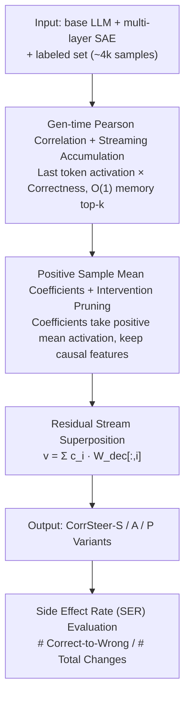

# CorrSteer: Generation-Time LLM Steering via Correlated Sparse Autoencoder Features

**Conference**: ICML 2026  
**arXiv**: [2508.12535](https://arxiv.org/abs/2508.12535)  
**Code**: https://github.com/seonglae/CorrSteer  
**Area**: Mechanistic Interpretability / SAE / Steering  
**Keywords**: Sparse Autoencoders, Representation Steering, Feature Selection, Pearson Correlation, Side Effect Rate (SER)

## TL;DR
By correlating SAE activations on generation-time tokens with task correctness via Pearson correlation, interpretable steering features are selected. Using the mean activation of positive samples directly as coefficients, without requiring contrastive datasets or backpropagation, this method improves MMLU by +3.3% and HarmBench by +27.1% on Gemma-2 2B / LLaMA-3.1 8B, while achieving a lower side-effect rate than fine-tuning.

## Background & Motivation
**Background**: Sparse Autoencoders (SAEs) decompose the superimposed representations of LLMs into tens of thousands of sparse, interpretable features, becoming a crucial tool for mechanistic interpretability. "Steering" based on SAEs alters model behavior without weight fine-tuning by adding a feature direction vector to the residual stream, previously used in narrow scenarios like bias mitigation, unlearning, and jailbreak defense.

**Limitations of Prior Work**: Existing SAE steering methods face three major issues: (1) Methods like SPARE and DSG require constructing contrastive datasets or storing activations for all samples, with memory and computation costs scaling linearly with sample size; (2) AlphaEdit, CAA, and others select features using hidden states of context tokens, whereas steering actually impacts "generation behavior," making the selection misaligned with the target; (3) Most methods are limited to a few axes like bias or refusal, lacking a general process for "task-related feature discovery."

**Key Challenge**: To find a few features within an SAE dictionary of $10^5$ scale that "can change behavior without destroying general capabilities," the process must be scalable (no storage of all activations), causally reliable (not relying solely on correlation), and interpretable (no black-box probes).

**Goal**: Construct a fully automated, $O(1)$ memory, backpropagation-free pipeline for feature selection, coefficient estimation, and steering that achieves both accuracy gains and low side-effect rates across multiple benchmarks.

**Key Insight**: The authors observe that SAE dictionaries are linearly additive, consistent with the "Linear Representation Hypothesis." Thus, Pearson correlation faithfully captures the linear dependence between SAE activations and task outcomes, serving as a lightweight heuristic naturally suited to SAE structures. Furthermore, intervention tests can upgrade correlation to causal evidence.

**Core Idea**: Use streaming Pearson correlation on generation-time tokens to screen candidate features, use the mean activation on correct samples as coefficients, and then use intervention validation to retain features that truly "improve performance when amplified"—treating "correlation as screening, intervention as judgment."

## Method

### Overall Architecture
The input to CorrSteer is a base LLM, its corresponding multi-layer SAE, a small labeled evaluation set (~4k samples), and a benchmark category (multi-choice/safety/factuality, etc.). The pipeline consists of three automated stages: (1) Calculate the Pearson correlation $r_i$ between each SAE feature activation $z_i$ at the generation token and the sample correctness $y_j \in \{0, 1\}$, implemented with a Welford-style streaming accumulator for $O(1)$ memory; (2) For each candidate feature $i$, use the mean activation on positive samples $c_i = \frac{1}{|\{j:y_j>0\}|}\sum_{j:y_j>0} z_{i,j}$ as the steering coefficient; (3) Add $v_{\text{steer}} = \sum_{i \in \mathcal{F}} c_i \cdot W_{\text{dec}}[:,i]$ to the residual stream at target generation positions. Three variants CorrSteer-S/A/P are output, corresponding to "global single feature / one per layer / intervention pruning" for different task granularities.

### Key Designs

**1. Generation-time Pearson Correlation + Streaming Accumulation: $O(1)$ Feature Selection in 100k Dictionaries via Linear Metric**

The first stage selects a few features related to task success from a dictionary of $10^5$ SAE features. The difficulty lies in avoiding the storage of all activations while ensuring selection aligns with "generation behavior" rather than "input processing." CorrSteer extracts activation $z_i$ only at the **last generation token** and calculates Pearson correlation $r_i = \text{Cov}(z_i, y) / \sqrt{\text{Var}(z_i) \cdot \text{Var}(y)}$ with sample correctness $y_j \in \{0,1\}$. Using an online Welford accumulator maintains only the mean, variance, and covariance, requiring $O(1)$ memory per feature regardless of sample size. For multi-token generation, activations are aggregated via max-pooling (or mean-pooling for long reasoning tasks like GSM8K to avoid coefficient dilution). Only positively correlated features are kept—ablation shows negatively correlated features consistently degrade performance. Pearson correlation is chosen over SPARE’s mutual information or DSG’s Fisher matrix because linear correlation matches the linear additive structure (Linear Representation Hypothesis) of the SAE decoder. Placing the extraction at the generation token rather than context tokens (CAA, AlphaEdit) ensures selection reflects the actual output behavior.

**2. Positive Sample Mean Coefficients + Intervention Pruning (CorrSteer-P): Upgrading Correlation to Causal Evidence**

Candidate features screened by correlation might include "commensal" features that do not "drive" success. A stable coefficient must be assigned, and features must be filtered a second time. Coefficients are directly set as $c_i$ = the average activation of that feature on correct samples. Leveraging the non-negativity of SAE activations, this is more stable than contrastive differences and has clearer physical meaning. Building on this, CorrSteer-P (based on CorrSteer-A, one feature per layer) runs an intervention pass, retaining only features where "adding the vector yields higher scores than non-steered." On LLaMA-3.1 8B, MMLU retains 24/31 layers, HarmBench 27/31, and MMLU-Pro only 5/31—the more specialized the task, the more aggressive the pruning. Since intervention is the gold standard for causality, using it as automated pruning avoids manual priors and task-specific hyperparameters, filtering "correlated" down to "truly improving."

**3. Side Effect Rate (SER): Revealing the Risk of Reward Hacking in Steering**

Existing steering works typically report only accuracy, hiding the "reward hacking" effect where target improvement comes at the cost of suppressing other correct behaviors. CorrSteer introduces Side Effect Rate $\text{SER} = \#\text{Correct-to-Wrong} / \#\text{Changes}$, decomposing whether steering truly improves the model into "total changes + ratio of correct modifications." On MMLU, CorrSteer-A has an SER of 0.21 while fine-tuning is 0.41, despite nearly identical accuracies (55.48% vs 55.75%). Fine-tuning silently breaks twice as many questions for the same score. This metric serves as a discriminative indicator for the "net gain" of steering.

### Loss & Training
The method involves no gradient training—no weight fine-tuning, no SAE training, and no backpropagation. It only requires forward activation computation, correlation accumulation, and intervention. On a single RTX 5090, the full pipeline (loading, streaming, evaluation) for 4,000 samples on Gemma-2 2B takes approximately 9 minutes. During inference, the pre-computed steering vector is added to the residual stream with < 0.1% overhead.

## Key Experimental Results

### Main Results
Evaluated across MMLU / MMLU-Pro / SimpleQA / BBQ / HarmBench / XSTest / GSM8K using Gemma-2 2B + Gemma Scope (16K features × 26 layers) and LLaMA-3.1 8B + LLaMA Scope (32K × 32).

| Dataset | Non-steered | CorrSteer-A | Fine-tuning | Gain (vs base) |
|:---|:---|:---|:---|:---|
| MMLU | 52.21 | **55.48** | 55.75 | +3.3 (≈ FT) |
| HarmBench (refusal) | 46.61 | **73.75** | – | +27.1 |
| BBQ Disambig | 75.38 | 76.53 | – | +1.2 |
| XSTest | 86.35 | 86.98 | – | +0.6 |
| MMLU-Pro | 30.40 | 30.93 | 35.32 | +0.5 (FT higher) |

| Method | MMLU | Side Effect Rate (SER) | Notes |
|:---|:---|:---|:---|
| CorrSteer-A | 55.48 | 0.21 | Accuracy matches FT |
| Fine-tuning | 55.75 | 0.41 | SER is 2× CorrSteer |
| SPARE (MI) | 54.97 | – | Requires large activation storage |
| DSG (Fisher) | 52.81 | – | Requires contrastive data + BP |
| CAA | 55.13 | – | Poor SER on XSTest |

### Ablation Study

| Configuration | MMLU | HarmBench | Description |
|:---|:---|:---|:---|
| Full (max-pool + pos correlation) | 56.32 | 67.50 | Main config |
| Mean-pool | 56.32 | 0.00 | Multi-token safety task; mean dilutes coefficients to 0 |
| All-token pool | 52.91 | 47.14 | Introduces context noise |
| Neg-correlated (Neg-A) | 49.45 | – | Negatively correlated features degrade |
| Sample size ≤ 100 | High Var | – | Requires ≥ 4000 for convergence |

### Key Findings
- On HarmBench (108 samples), CorrSteer-A shows a standard deviation of ±8.84, compared to ±0.59 on MMLU (4000 samples). An empirical threshold of ~4000 samples is the lower bound for stable feature selection.
- Steering coefficient scale at 1.0× is Pareto optimal: HarmBench 60.36% / XSTest over-refusal 21.89% / MMLU −0.21%. At 2.0×, the model collapses (HarmBench drops to 7.50%).
- Cross-task transfer: Features selected on MMLU still improve BBQ, suggesting some features encode general QA capability rather than task-specific patterns.
- On LLaMA-3.1 8B (which lacks safety training), CorrSteer changes "how to steal enriched uranium" from compliant response to refusal, proving it activates existing but suppressed capabilities rather than injecting new knowledge.

## Highlights & Insights
- **"Correlation + Intervention" matches the SAE linear structure**: This is the most elegant aspect—using the SAE’s own linear assumption to justify the methodology theoretically, rather than fitting complex non-linear objectives. It can be directly transferred to any "sparse + linearly additive" representation system.
- **Generation-time token over context token**: A simple change that addresses a blind spot in all previous SAE steering methods—steering targets output behavior, so feature selection should observe output positions. This insight is valuable for any steering work.
- **SER metric is more honest than accuracy**: Revealing that FT's SER on MMLU is double that of CorrSteer shows that while FT appears high-performing, it actually breaks many previously correct answers. This metric should be adopted by the RLHF/DPO communities.
- **Fully interpretable and reversible**: Selected features can be cross-referenced on Neuronpedia for semantics (refusal / multiple-choice format / nuclear physics, etc.). Turning it off restores the model without re-training.

## Limitations & Future Work
- The authors admit high variance (±24.43) on long reasoning tasks like GSM8K, indicating that "static behavior steering" is unsuitable for tasks requiring dynamic chain-of-thought.
- The 4000-sample lower bound is unfriendly to small benchmarks (HarmBench 108), leading to lower stability in safety steering. Future work could explore bootstrapping or fusing contrastive signals for small-sample scenarios.
- Only validated on Gemma Scope and LLaMA Scope; SAE training quality becomes the ceiling. Deploying on closed-source models requires training custom SAEs, increasing the entry barrier.
- Using "positive sample mean" as a coefficient is robust but sensitive to long-tail high activations; trimmed mean or robust estimators could be considered.

## Related Work & Insights
- **vs SPARE (MI feature selection)**: SPARE captures non-linear dependencies via Mutual Information but requires massive activation storage that scales with sample size. CorrSteer's Pearson correlation is "just enough" for the linear SAE architecture, outperforming SPARE on MMLU/BBQ with $O(1)$ memory.
- **vs DSG (Fisher information selection)**: DSG requires contrastive datasets and backpropagation of the Fisher matrix, limiting task coverage. CorrSteer is entirely backpropagation-free and requires only a single forward pass per benchmark.
- **vs AlphaEdit / CAA (context-token activation)**: These select features from the input side, leading to high SER and severe over-refusal on XSTest. Moving the selection point to generation-time tokens aligns CorrSteer with the target behavior.
- **vs Fine-tuning / LoRA**: While FT has higher raw accuracy on GSM8K / MMLU-Pro, its SER is doubled. CorrSteer can be stacked on FT models for complementary benefits.

## Rating
- Novelty: ⭐⭐⭐⭐ The "Pearson + Generation-time token + Intervention pruning" triad is systematically proposed for the first time. Each component is not entirely new, but the combination is highly effective and minimalist.
- Experimental Thoroughness: ⭐⭐⭐⭐ Covers two model scales, 8 benchmarks, and extensive ablations on pooling, sample size, scale, and correlation types, including the new SER metric.
- Writing Quality: ⭐⭐⭐⭐ Formulas and pipelines are clear. Figure 1 and qualitative refusal examples are intuitive. Slight repetition between method and ablation sections, but overall very readable.
- Value: ⭐⭐⭐⭐⭐ Provides a "default baseline" for SAE steering—no hyperparameters, $O(1)$ memory, 9-minute run time, and lower SER than FT. It lowers the barrier to entry for the mechanistic interpretability community.

<!-- RELATED:START -->

## Related Papers

- [\[CVPR 2026\] Improving Sparse Autoencoder with Dynamic Attention](../../CVPR2026/interpretability/improving_sparse_autoencoder_with_dynamic_attention.md)
- [\[AAAI 2026\] SparseRM: A Lightweight Preference Modeling with Sparse Autoencoder](../../AAAI2026/interpretability/sparserm_a_lightweight_preference_modeling_with_sparse_autoencoder.md)
- [\[ICML 2026\] Steer Like the LLM: Activation Steering that Mimics Prompting](steer_like_the_llm_activation_steering_that_mimics_prompting.md)
- [\[ICLR 2026\] Toward Faithful Retrieval-Augmented Generation with Sparse Autoencoders](../../ICLR2026/interpretability/toward_faithful_retrieval-augmented_generation_with_sparse_autoencoders.md)
- [\[CVPR 2026\] Language Models Can Explain Visual Features via Steering](../../CVPR2026/interpretability/language_models_can_explain_visual_features_via_steering.md)

<!-- RELATED:END -->
