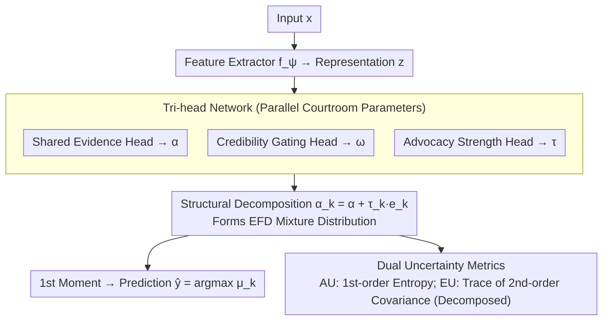

# Courtroom Analogy: New Perspective on Uncertainty-Aware Classification

**Conference**: ICML 2026  
**arXiv**: [2605.25616](https://arxiv.org/abs/2605.25616)  
**Code**: To be confirmed  
**Area**: Interpretability  
**Keywords**: Uncertainty Quantification, Evidential Deep Learning, Dirichlet Mixture, Interpretability, Single-forward UQ

## TL;DR
This paper proposes a "courtroom analogy" perspective, modeling second-order uncertainty in classification as a structured mixture of $K$ class-advocate Dirichlet opinions under input-dependent weights. This is instantiated as the MoDEX network (comprising three lightweight heads: shared evidence $\bm{\alpha}$, class-specific advocacy strength $\tau_k$, and credibility $\bm{\omega}$). MoDEX consistently outperforms baselines such as EDL and $\mathcal{F}$-EDL across benchmarks including CIFAR/SVHN/TIN/CIFAR-10-C/CIFAR-10-LT with a single forward pass, providing semantically clear uncertainty decomposition.

## Background & Motivation
**Background**: Single-forward second-order UQ methods, exemplified by EDL (Sensoy et al., 2018), model classification uncertainty as a distribution $q\in\mathcal{Q}$ over the class probability vector, typically using the Dirichlet family. This allows for closed-form predictive mean/variance and interprets concentration parameters as evidence. Subsequent works like $\mathcal{I}$-EDL, R-EDL, Re-EDL, and $\mathcal{F}$-EDL have advanced along this path.

**Limitations of Prior Work**: The mainstream optimization direction has been "increasing expressivity"—either by adopting more flexible distribution families or relaxing original EDL assumptions. Consequently, while $\mathcal{Q}$ becomes better at fitting complex uncertainty patterns, the **formation and aggregation mechanisms of uncertainty remain a black box**. After obtaining the Dirichlet $\bm{\alpha}$, it can only be interpreted as "total evidence," offering almost no semantic insight into "why the model hesitates on this image" or "where the hesitation originates."

**Key Challenge**: There is no bridge between expressivity and structural interpretability. Simply stacking the capacity of $\mathcal{Q}$ does not inform users about the source structure of uncertainty (e.g., lacks evidence vs. conflicting explanations between classes), which is precisely the most valuable part of UQ in high-stakes scenarios.

**Goal**: Design a framework that retains the advantages of single-forward passes, closed-form moments, and Dirichlet-based properties, while explicitly encoding the **formation mechanism** of uncertainty into the structure of $\mathcal{Q}$.

**Key Insight**: The authors start from an intuitive analogy: viewing classification as a courtroom debate. Each class corresponds to an advocate; all advocates observe the same case evidence $\mathbf{x}$ but derive different probabilistic beliefs based on different emphases. The final judgment is a weighted aggregation of these beliefs based on "credibility." This metaphor naturally distinguishes three sources of uncertainty: (i) insufficient evidence itself, (ii) inconsistent interpretations of the same evidence by advocates, and (iii) which advocate is more credible.

**Core Idea**: Structurally decompose $K$ Dirichlet opinions using "shared base evidence + class-specific advocacy increment," then mix them via input-dependent credibility weights into $\mathcal{Q}$. This results in a second-order distribution with $\mathcal{O}(K)$ parameters, supporting single-forward passes and carrying courtroom semantics for every parameter—a distribution family equivalent to the Extended Flexible Dirichlet (EFD) proposed by Ongaro et al.

## Method

### Overall Architecture
MoDEX aims to provide structurally interpretable second-order uncertainty in a single forward pass. It conceptualizes classification as a courtroom debate: $K$ classes each send an advocate who views the same case evidence but may reach different beliefs. The final verdict is the weighted aggregation of these beliefs. In the network, an input $\mathbf{x}_i$ passes through a feature extractor $f_{\bm{\psi}}$ to obtain representation $\mathbf{z}_i$. Three lightweight heads then output courtroom parameters in parallel: shared evidence $\bm{\alpha}(\mathbf{x}_i)\in\mathbb{R}_{>0}^K$, credibility weights $\bm{\omega}(\mathbf{x}_i)\in\Delta^{K-1}$, and class-specific advocacy strengths $\bm{\tau}(\mathbf{x}_i)\in\mathbb{R}_{>0}^K$. Together, these define an EFD distribution $p(\bm{\pi}_i\mid\mathbf{x}_i)=\sum_k \omega_k(\mathbf{x}_i)\,\mathrm{Dir}(\bm{\pi}_i\mid\bm{\alpha}(\mathbf{x}_i)+\tau_k(\mathbf{x}_i)\mathbf{e}_k)$. During prediction, the first-order moment is taken in closed form to get $\hat{p}(y^\star=k\mid\mathbf{x}^\star)$ for argmax. Aleatoric and epistemic uncertainties are output via first-order entropy and the trace of the second-order covariance, respectively, requiring no sampling or ensembles.

### Key Designs

**1. Courtroom Generative Model: Modeling the "Formation Mechanism" of Uncertainty**

A pain point of the EDL lineage is that $\mathcal{Q}$ fits complex uncertainty shapes but fails to explain "where the hesitation comes from." MoDEX addresses this by explicitly building classification uncertainty as an input-dependent mixture of $K$ Dirichlet advocate opinions: $p(\bm{\pi}\mid\mathbf{x})=\sum_k \omega_k(\mathbf{x})\mathrm{Dir}(\bm{\pi}\mid\bm{\alpha}_k(\mathbf{x}))$. Each component represents a class advocate's belief regarding the true probability vector. The generative process is a clear chain: a latent variable $L\sim\mathrm{Cat}(\bm{\omega}(\mathbf{x}))$ selects the active advocate; given $L=k$, $\bm{\pi}\sim\mathrm{Dir}(\bm{\alpha}_k(\mathbf{x}))$; then the label $y\sim\mathrm{Cat}(\bm{\pi})$ is generated. Marginalizing $L$ yields the structured second-order distribution. This is effective because it binds three heterogeneous sources—insufficient evidence, advocate disagreement, and credibility—to three independent mechanisms (Dirichlet internal variance, inter-component discrepancy, and mixture weights $\bm{\omega}$), upgrading $\mathcal{Q}$ from a "bucket for uncertainty" to a structured distribution that explains its origins.

**2. Structural Decomposition: $\mathcal{O}(K)$ Parameters for EFD Equivalence and Semantic Decoupling**

Assigning an independent $K$-dimensional concentration to each component would result in $\mathcal{O}(K^2)$ parameters with uninterpretable $\bm{\alpha}_k$. MoDEX defines each advocate's concentration as $\bm{\alpha}_k(\mathbf{x})=\bm{\alpha}(\mathbf{x})+\tau_k(\mathbf{x})\mathbf{e}_k$—a shared base evidence $\bm{\alpha}(\mathbf{x})$ plus an advocacy increment $\tau_k(\mathbf{x})\mathbf{e}_k$ applied only to the $k$-th dimension of its own class. Thus, $K$ Dirichlet components share a backbone and only "bulge" in their respective dimensions. This decomposition achieves two goals: it reduces parameters to $\mathcal{O}(K)$, and the distribution becomes equivalent to the Extended Flexible Dirichlet (EFD, Ongaro et al. 2020), allowing for closed-form moments for single-forward prediction. Crucially, the inductive bias forces the decoupling of "objective case facts" and "subjective advocate bias"—$\bm{\alpha}$ carries evidence seen by all, while $\tau_k$ carries the extra push by advocate $k$ for its own class. This provides the theoretical basis for splitting epistemic uncertainty into inter- and intra-expert components.

**3. Tri-head Network and Dual Uncertainty Metrics: Mapping Semantics to Readable Numbers**

The courtroom parameters are predicted by three logit heads (concentration / gating / advocacy) with exp or softmax activations to produce $(\bm{\alpha}, \bm{\omega}, \bm{\tau})$. Spectral normalization is applied to $f_{\bm{\psi}}$ and the concentration head to stabilize UQ. Inference distinguishes two types of uncertainty: aleatoric via first-order predictive entropy $\mathrm{AU}=-\sum_k\mu_k\log\mu_k$, and epistemic via the trace of the second-order covariance $\mathrm{EU}=\mathrm{tr}(\mathrm{Cov}[\bm{\pi}^\star])$. Most importantly, EU can be provably decomposed into $\mathrm{EU}_{\text{inter}}=\sum_k\omega_k\|\bm{\mu}^{(k)}-\bar{\bm{\mu}}\|_2^2$ (disagreement between advocates) and $\mathrm{EU}_{\text{intra}}=\sum_k\omega_k\sum_j\mathrm{Var}_{\bm{\pi}\sim\mathrm{Dir}(\bm{\alpha}_k)}[\pi_j]$ (insufficient evidence within individual advocates). For a given total EU, whether it is driven by disagreement or lack of evidence becomes clear—a level of interpretability that pure Dirichlet or $\mathcal{F}$-EDL cannot provide.

### Loss & Training
The training loss consists of three terms:
$$\mathcal{L}=\|\mathbf{y}-\mathbb{E}_{\bm{\pi}\sim\mathrm{EFD}}[\bm{\pi}]\|_2^2+\|\mathbf{y}-\bm{\omega}\|_2^2+D_{\mathrm{KL}}(\sigma^{\text{SM}}(\bm{\tau})\,\|\,\tilde{\mathbf{y}})$$
The first term (MSE) aligns the EFD predictive mean with one-hot labels. The second term (Brier regularization) calibrates the gating $\bm{\omega}$ to prevent it from collapsing into one-hot. The third term applies KL soft supervision to $\sigma^{\text{SM}}(\bm{\tau})$ using label-smoothed labels $\tilde{\mathbf{y}}$, injecting the prior that "the correct class should advocate more vigorously." Label smoothing $\epsilon\in[0,1]$ controls the hardness of $\tilde{\mathbf{y}}$. This combination of MSE and regularization inherits the mature training practices of the EDL series while avoiding the instability of directly maximizing EFD likelihood.

## Key Experimental Results

### Main Results
Evaluation tasks: ID classification accuracy, Misclassification detection (Miscl. AUPR, aleatoric), OOD detection (AUPR, epistemic), CIFAR-10-C shift detection, and CIFAR-10-LT long-tail robustness. Baselines include Dropout / EDL / $\mathcal{I}$-EDL / R-EDL / DAEDL / Re-EDL / $\mathcal{F}$-EDL.

| Dataset | Metric | $\mathcal{F}$-EDL (Prev. SOTA) | MoDEX | Gain |
|--------|------|-----------------------------|-------|------|
| CIFAR-10 ID | Test Acc | 91.19 | **92.46** | +1.27 |
| CIFAR-10 | Miscl. AUPR (aleatoric) | 99.10 | **99.18** | +0.08 |
| CIFAR-10 → SVHN / C-100 | OOD AUPR | 91.20 / 88.37 | **91.58 / 89.28** | +0.38 / +0.91 |
| CIFAR-100 ID | Test Acc | 69.40 | **75.91** | +6.51 |
| CIFAR-100 | Miscl. AUPR | 94.01 | **96.17** | +2.16 |
| CIFAR-100 → SVHN / TIN | OOD AUPR | 75.35 / 80.58 | **77.90 / 81.76** | +2.55 / +1.18 |
| CIFAR-10-C ($\mathcal{C}{=}5$) | Shift AUPR | 78.52 | **80.63** | +2.11 |
| CIFAR-10-LT ($\rho{=}0.01$) | Test Acc | 63.73 | **71.53** | +7.80 |
| CIFAR-10-LT | OOD SVHN / C-100 | 62.56 / 70.18 | **72.05 / 76.52** | +9.49 / +6.34 |

### Ablation Study

| Configuration / Property | Behavior | Description |
|-------------|------|------|
| Full MoDEX | Best performing | Shared $\bm{\alpha}$ + class-specific $\tau_k$ + input-dependent $\bm{\omega}$ |
| $\tau_k\equiv\tau$ (Single advocacy) | Degenerates to $\mathcal{F}$-EDL (Thm 5.1) | Loses structural differences between advocates |
| $\tau=1$ and $\bm{\omega}=\bm{\alpha}/\|\bm{\alpha}\|_1$ | Degenerates to EDL (Thm 5.1) | Reverts to original evidential baseline |
| EU Decomposition (Prop 5.4) | $\mathrm{EU}=\mathrm{EU}_{\text{inter}}+\mathrm{EU}_{\text{intra}}$ | Distinguishes "advocate disagreement" vs. "insufficient evidence" |
| Equivalence (Thm 5.3) | Ensemble of $K$ EDL experts / base-EDL + softmax mix | Two perspectives on the same model during inference |

### Key Findings
- **Gains scale with class count and imbalance**: The improvement is most significant on CIFAR-100 and long-tail settings (+7.8 Accuracy and +9.5 OOD AUPR). This suggests the $\bm{\alpha}$ vs. $\tau_k$ decoupling is a substantive mechanism that allows minority-class advocates an expressive channel when the head classes are suppressed.
- **Structure > Expressivity**: Compared to $\mathcal{F}$-EDL (a more flexible single distribution family), MoDEX's mixture structure is stronger across nearly all UQ tasks, validating that structural inductive bias is key.
- **Monotonic improvement with distribution shift**: From $\mathcal{C}=1$ to $\mathcal{C}=5$, MoDEX's lead increases (+0.56 to +2.11 AUPR), indicating that epistemic metrics are sensitive to shifts and well-calibrated.
- **Visualization of inter/intra EU**: On clean ID data, EU is primarily intra-dominant (single expert). On OOD/ambiguous inputs, inter-expert disagreement weight rises significantly, providing a human-readable explanation for model hesitation.

## Highlights & Insights
- Replaced "increasing expressivity" with "increasing structural semantics." By using a structured $\mathcal{O}(K)$ decomposition, the authors gain EFD equivalence, EU decomposability, and a unified view of EDL/$\mathcal{F}$-EDL.
- The "courtroom" metaphor is a design principle: $\bm{\alpha}$/$\tau_k$/$\bm{\omega}$ map to case evidence / advocacy strategy / judicial conviction. Every experimental result can be explained through the metaphor, making interpretability "by design."
- Dual equivalent representations (EDL expert ensemble vs. base-EDL+softmax mixture) inspire a general pattern: rewriting an "ensemble" as a "main branch + correction branch" mixture, which has potential in knowledge distillation and MoE LLM reliability modeling.

## Limitations & Future Work
- Validated only on medium-scale vision tasks; performance on ImageNet-scale, NLP, or multi-label scenarios with thousands of classes is unverified.
- Training loss weights rely on empirical values; a systematic sensitivity analysis is lacking.
- Computational cost: Although single-forward, MoDEX requires two additional $K$-dimensional heads and EFD moment calculations; latency benchmarks for long sequences are needed.
- Currently, there are exactly $K$ advocates (one per class). Future work could explore hierarchical courtrooms or multiple advocates per class for fine-grained labels.

## Related Work & Insights
- **vs. EDL / $\mathcal{I}$-EDL / R-EDL / Re-EDL**: These modify a single Dirichlet (e.g., Fisher information). MoDEX treats them as special cases (Thm 5.1) while adding the interpretable inter/intra-EU decomposition.
- **vs. $\mathcal{F}$-EDL (Yoon & Kim 2026)**: While $\mathcal{F}$-EDL pursues flexibility in distribution families, MoDEX utilizes structural inductive bias, outperforming it across tasks.
- **vs. Bayesian/Deep Ensembles**: Ensembles require multiple forward passes for second-order uncertainty. MoDEX "internalizes" a $K$-expert ensemble within a single pass, offering better efficiency and interpretability.
- **vs. Subjective Logic / Dempster-Shafer**: MoDEX modernizes traditional formal logic (opinion + credibility aggregation) within an end-to-end learnable neural network framework.

## Rating
- Novelty: ⭐⭐⭐⭐ Original framework (courtroom analogy + structural decomposition), though rooted in Dirichlet extensions.
- Experimental Thoroughness: ⭐⭐⭐⭐ Covers ID/OOD/Shift/Long-tail tasks with consistent gains; lacks ImageNet and loss weight ablations.
- Writing Quality: ⭐⭐⭐⭐⭐ The metaphor is well-sustained; theorems and property analyses are logically rigorous.
- Value: ⭐⭐⭐⭐ Decomposable EU and unified视角 provide direct inspiration for high-stakes UQ deployment.

<!-- RELATED:START -->

## Related Papers

- [\[ICML 2026\] MiniMax Learning of Interpretable Factored Stochastic Policies from Conjoint Data, with Uncertainty Quantification](minimax_learning_of_interpretable_factored_stochastic_policies_from_conjoint_dat.md)
- [\[ICCV 2025\] "Principal Components" Enable A New Language of Images](../../ICCV2025/interpretability/principal_components_enable_a_new_language_of_images.md)
- [\[ICML 2026\] OmniSapiens: A Foundation Model for Social Behavior Processing via Heterogeneity-Aware Relative Policy Optimization](omnisapiens_a_foundation_model_for_social_behavior_processing_via_heterogeneity-.md)
- [\[CVPR 2026\] Making the Classification Explanation Faithful to the Confidence Score](../../CVPR2026/interpretability/making_the_classification_explanation_faithful_to_the_confidence_score.md)
- [\[ICML 2025\] On the Effect of Uncertainty on Layer-wise Inference Dynamics](../../ICML2025/interpretability/on_the_effect_of_uncertainty_on_layer-wise_inference_dynamics.md)

<!-- RELATED:END -->
