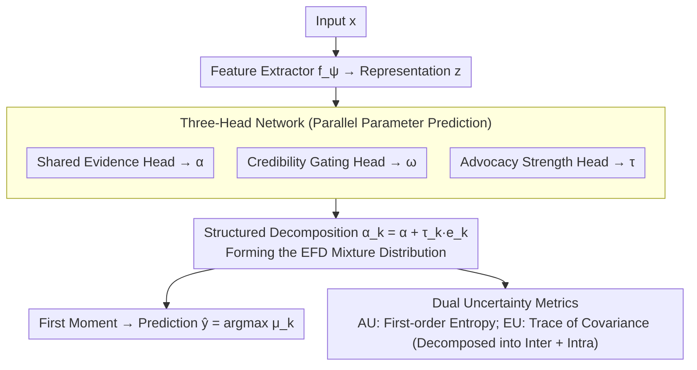

# Courtroom Analogy: New Perspective on Uncertainty-Aware Classification

**Conference**: ICML 2026  
**arXiv**: [2605.25616](https://arxiv.org/abs/2605.25616)  
**Code**: To be confirmed  
**Area**: Interpretability  
**Keywords**: Uncertainty quantification, Evidential Deep Learning, Dirichlet Mixture, Interpretability, Single-forward UQ  

## TL;DR
This paper proposes a "courtroom analogy" perspective to model second-order uncertainty in classification as a structured mixture of $K$ class-advocate Dirichlet opinions weighted by input-dependent reliability. Instantiated as the MoDEX network (comprising three lightweight heads: shared evidence $\bm{\alpha}$, class-specific advocacy strength $\tau_k$, and credibility $\bm{\omega}$), it consistently outperforms baselines such as EDL and $\mathcal{F}$-EDL across benchmarks including CIFAR/SVHN/TIN/CIFAR-10-C/CIFAR-10-LT in a single forward pass, while providing semantically clear uncertainty decomposition.

## Background & Motivation
**Background**: Single-forward second-order UQ methods represented by EDL (Sensoy et al., 2018) model classification uncertainty as a distribution $q\in\mathcal{Q}$ over the class probability vector. Typically, the Dirichlet family is used, as it provides closed-form predictive mean/variance and interprets concentration parameters through "evidence." Subsequent works like $\mathcal{I}$-EDL, R-EDL, Re-EDL, and $\mathcal{F}$-EDL follow this path.

**Limitations of Prior Work**: The mainstream optimization direction in this line of research is "increasing expressiveness"—either by adopting more flexible distribution families or relaxing the original EDL assumptions. Consequently, while $\mathcal{Q}$ becomes better at fitting complex uncertainty patterns, the **mechanism of how uncertainty is "formed" and "aggregated" remains a black box**. After obtaining the Dirichlet $\bm{\alpha}$, it can only be interpreted as "total evidence," offering almost no semantic insight into "why the model hesitates" or "where the hesitation originates."

**Key Challenge**: There is no bridge between expressiveness and structural interpretability. Simply stacking the capacity of $\mathcal{Q}$ does not inform the user about the underlying structure of uncertainty (e.g., is it due to lack of evidence or conflicting interpretations between classes?), which is precisely the most valuable part of UQ in high-risk scenarios.

**Goal**: Design a framework that retains the superior properties of single-forward passes, closed-form moments, and Dirichlet families, while explicitly encoding the **formation mechanism** of uncertainty into the structure of $\mathcal{Q}$.

**Key Insight**: The authors start from an intuitive analogy: viewing classification as a courtroom debate. Each class corresponds to an advocate. All advocates observe the same case evidence $\mathbf{x}$ but derive different probability beliefs based on their specific focus. The final verdict is the result of aggregating these beliefs weighted by "credibility." This metaphor naturally distinguishes three sources of uncertainty: (i) insufficient evidence, (ii) inconsistent interpretations of the same evidence by advocates, and (iii) the varying credibility of different advocates.

**Core Idea**: Structured decomposition of $K$ Dirichlet opinions using a "shared base evidence + class-specific advocacy increment" approach, then mixing them into $\mathcal{Q}$ using input-dependent credibility weights. This results in a second-order distribution with $\mathcal{O}(K)$ parameters, single-forward capability, and courtroom semantics for each parameter—its distribution family is equivalent to the Extended Flexible Dirichlet (EFD) proposed by Ongaro et al.

## Method

### Overall Architecture
MoDEX addresses the challenge of providing structurally interpretable second-order uncertainty in a single forward pass. It conceptualizes classification as a courtroom debate where $K$ class advocates examine the same case evidence but reach different beliefs. To implement this, an input $\mathbf{x}_i$ is processed by a feature extractor $f_{\bm{\psi}}$ to obtain representation $\mathbf{z}_i$. Three lightweight heads then output legal parameters in parallel: shared evidence $\bm{\alpha}(\mathbf{x}_i)\in\mathbb{R}_{>0}^K$, credibility weights $\bm{\omega}(\mathbf{x}_i)\in\Delta^{K-1}$, and class-specific advocacy strengths $\bm{\tau}(\mathbf{x}_i)\in\mathbb{R}_{>0}^K$. These collectively define an EFD distribution $p(\bm{\pi}_i\mid\mathbf{x}_i)=\sum_k \omega_k(\mathbf{x}_i)\,\mathrm{Dir}(\bm{\pi}_i\mid\bm{\alpha}(\mathbf{x}_i)+\tau_k(\mathbf{x}_i)\mathbf{e}_k)$. During prediction, the first moment is taken in closed form to obtain $\hat{p}(y^\star=k\mid\mathbf{x}^\star)$. Aleatoric and epistemic uncertainties are output using the first-order entropy and the trace of the second-order covariance, respectively, all within a single forward pass without sampling.

### Key Designs

**1. Courtroom Generative Model: Modeling the "Formation Mechanism" of Uncertainty**

A pain point of the EDL lineage is that as $\mathcal{Q}$ becomes more capable of fitting complex shapes, it fails to explain the source of hesitation. MoDEX solves this by modeling classification uncertainty as an input-dependent mixture of $K$ Dirichlet advocate opinions $p(\bm{\pi}\mid\mathbf{x})=\sum_k \omega_k(\mathbf{x})\mathrm{Dir}(\bm{\pi}\mid\bm{\alpha}_k(\mathbf{x}))$, where each component represents a class advocate's belief. The generative process follows a clear chain: a latent variable $L\sim\mathrm{Cat}(\bm{\omega}(\mathbf{x}))$ selects the active advocate; given $L=k$, $\bm{\pi}\sim\mathrm{Dir}(\bm{\alpha}_k(\mathbf{x}))$; finally, the label is generated via $y\sim\mathrm{Cat}(\bm{\pi})$. This is effective because it maps three heterogeneous sources—lack of evidence, disagreement among advocates, and credibility—to independent mechanisms (Dirichlet internal variance, differences between components, and weights $\bm{\omega}$), upgrading $\mathcal{Q}$ from a "bucket for uncertainty" to a structured distribution that explains its origins.

**2. Structured Decomposition: $\mathcal{O}(K)$ Parameters for EFD Equivalence and Semantic Decoupling**

Simply assigning an independent $K$-dimensional concentration to each component would result in $\mathcal{O}(K^2)$ parameters and uninterpretable $\bm{\alpha}_k$. MoDEX defines each advocate's concentration as $\bm{\alpha}_k(\mathbf{x})=\bm{\alpha}(\mathbf{x})+\tau_k(\mathbf{x})\mathbf{e}_k$. In this setup, the shared base evidence $\bm{\alpha}(\mathbf{x})$ is combined with an advocacy increment $\tau_k(\mathbf{x})\mathbf{e}_k$ applied only to the $k$-th dimension. This decomposition achieves two goals: it reduces parameters to $\mathcal{O}(K)$ and makes the distribution equivalent to the Extended Flexible Dirichlet (EFD, Ongaro et al. 2020), allowing for closed-form moments. More importantly, it uses inductive bias to decouple "objective facts" from "subjective advocacy"—$\bm{\alpha}$ captures shared evidence while $\tau_k$ captures the specific push for a class, enabling the decomposition of epistemic uncertainty into inter-expert and intra-expert components.

**3. Three-Head Network and Dual Uncertainty Metrics: Mapping Semantics to Readable Numbers**

The courtroom parameters are predicted by three logit heads (concentration, gating, advocacy) with exp or softmax activations to yield $(\bm{\alpha},\bm{\omega},\bm{\tau})$. Spectral normalization is applied to $f_{\bm{\psi}}$ and the concentration head to stabilize UQ. Inference distinguishes two types of uncertainty: aleatoric uncertainty via first-order predictive entropy $\mathrm{AU}=-\sum_k\mu_k\log\mu_k$, and epistemic uncertainty via the trace of the second-order covariance $\mathrm{EU}=\mathrm{tr}(\mathrm{Cov}[\bm{\pi}^\star])$. Crucially, EU can be provably decomposed into $\mathrm{EU}_{\text{inter}}=\sum_k\omega_k\|\bm{\mu}^{(k)}-\bar{\bm{\mu}}\|_2^2$ (disagreement between advocates) and $\mathrm{EU}_{\text{intra}}=\sum_k\omega_k\sum_j\mathrm{Var}_{\bm{\pi}\sim\mathrm{Dir}(\bm{\alpha}_k)}[\pi_j]$ (insufficient evidence for individual advocates). This clarifies whether uncertainty stems from conflict or lack of data—an interpretability feature that pure Dirichlet or $\mathcal{F}$-EDL models cannot provide.

### Loss & Training
The training loss consists of three terms:
$$\mathcal{L}=\|\mathbf{y}-\mathbb{E}_{\bm{\pi}\sim\mathrm{EFD}}[\bm{\pi}]\|_2^2+\|\mathbf{y}-\bm{\omega}\|_2^2+D_{\mathrm{KL}}(\sigma^{\text{SM}}(\bm{\tau})\,\|\,\tilde{\mathbf{y}})$$
The first term (MSE) aligns the EFD predictive mean with the one-hot label. The second term (Brier regularization) calibrates the gating $\bm{\omega}$ to prevent it from collapsing into one-hot. The third term applies KL soft supervision using label-smoothed targets $\tilde{\mathbf{y}}$ on $\sigma^{\text{SM}}(\bm{\tau})$, injecting a prior that the correct class advocate should "argue" more vigorously. Label smoothing $\epsilon\in[0,1]$ controls the hardness of $\tilde{\mathbf{y}}$. This combination inherits the maturity of EDL training while avoiding the instability of directly maximizing EFD likelihood.

## Key Experimental Results

### Main Results
Evaluation tasks include: ID test set accuracy, misclassification detection (Miscl. AUPR, aleatoric), OOD detection (AUPR, epistemic), CIFAR-10-C distribution shift detection, and CIFAR-10-LT long-tail robustness. Baselines include Dropout, EDL, $\mathcal{I}$-EDL, R-EDL, DAEDL, Re-EDL, and $\mathcal{F}$-EDL.

| Dataset | Metric | $\mathcal{F}$-EDL (Prev. SOTA) | MoDEX | Gain |
|--------|------|-----------------------------|-------|------|
| CIFAR-10 ID | Test Acc | 91.19 | **92.46** | +1.27 |
| CIFAR-10 | Miscl. AUPR (aleatoric) | 99.10 | **99.18** | +0.08 |
| CIFAR-10 → SVHN / C-100 | OOD AUPR | 91.20 / 88.37 | **91.58 / 89.28** | +0.38 / +0.91 |
| CIFAR-100 ID | Test Acc | 69.40 | **75.91** | +6.51 |
| CIFAR-100 | Miscl. AUPR | 94.01 | **96.17** | +2.16 |
| CIFAR-100 → SVHN / TIN | OOD AUPR | 75.35 / 80.58 | **77.90 / 81.76** | +2.55 / +1.18 |
| CIFAR-10-C ($\mathcal{C}{=}5$) | Shift AUPR | 78.52 | **80.63** | +2.11 |
| CIFAR-10-LT ($\rho{=}0.01$) | Test Acc | 63.73 | **71.53** | +7.80 |
| CIFAR-10-LT | OOD SVHN / C-100 | 62.56 / 70.18 | **72.05 / 76.52** | +9.49 / +6.34 |

### Ablation Study

| Configuration / Property | Behavior | Description |
|-------------|------|------|
| Full MoDEX | Best across all | Shared $\bm{\alpha}$ + class-specific $\tau_k$ + input-dependent $\bm{\omega}$ |
| $\tau_k\equiv\tau$ (Single advocacy strength) | Degenerates to $\mathcal{F}$-EDL (Thm 5.1) | Loss of structural differences between advocates |
| $\tau=1$ and $\bm{\omega}=\bm{\alpha}/\|\bm{\alpha}\|_1$ | Degenerates to EDL (Thm 5.1) | Reverts to original evidential baseline |
| EU Decomposition (Prop 5.4) | $\mathrm{EU}=\mathrm{EU}_{\text{inter}}+\mathrm{EU}_{\text{intra}}$ | Distinguishes "advocate disagreement" vs "insufficient evidence" |
| Equivalent Representation (Thm 5.3) | Ensemble of $K$ EDL experts | Dual perspectives for inference |

### Key Findings
- **More classes and longer tails lead to more significant gains**: Accuracy increased by 6.5 points on CIFAR-100 and 7.8 points in long-tail settings. This suggests that the decoupling of $\bm{\alpha}$ and $\tau_k$ is a substantial mechanism that allows minority class advocates to express themselves when head classes dominate.
- **Structure > Expressiveness**: Compared to $\mathcal{F}$-EDL, which uses a more flexible but single distribution family, MoDEX’s mixture structure performs better across UQ tasks, validating that structural inductive bias is the key.
- **Monotonic improvement with distribution shift**: From $\mathcal{C}=1$ to $\mathcal{C}=5$ on CIFAR-10-C, MoDEX consistently maintains and widens its lead, showing that the epistemic metric is sensitive to shifts.
- **Visualization of inter/intra-EU**: On clean ID data, EU is dominated by intra-expert uncertainty. On OOD or ambiguous inputs, the inter-expert (disagreement) weight rises significantly, providing human-readable explanations.

## Highlights & Insights
- Shifting from "adding expressiveness" to "adding structural semantics"—by using a structured Dirichlet mixture with $\mathcal{O}(K)$ parameters, the author achieves EFD equivalence, EU decomposability, and a unified perspective on EDL/$\mathcal{F}$-EDL.
- The "courtroom" metaphor is functional: $\bm{\alpha}$, $\tau_k$, and $\bm{\omega}$ map to evidence, strategy, and judgment. Every experiment result can be explained through the metaphor, making interpretability a design feature rather than an afterthought.
- The dual representation (ensemble of experts vs. base-EDL mixture) suggests a general pattern: rewriting ensemble models as mixtures of a "main branch" and a "correction branch" could be applied to knowledge distillation or MoE LLMs.
- The $\mathrm{EU}_{\text{inter}}+\mathrm{EU}_{\text{intra}}$ decomposition can serve as a signal for active learning: high intra-EU indicates a need for more data, while high inter-EU indicates a need for better labeling or review.

## Limitations & Future Work
- The framework was validated on medium-scale vision tasks (CIFAR, SVHN, TIN); performance on ImageNet-scale data, NLP tasks, or multi-label scenarios with thousands of classes remains to be verified.
- The weights for the three loss terms are determined empirically; a systematic sensitivity analysis is missing.
- Computational cost: Although single-forward, MoDEX adds two $K$-dimensional heads and EFD moment calculations; latency benchmarks for long sequences or online inference are needed.
- "Advocates" are currently limited to $K$ (one per class); extensions could involve hierarchical courtrooms for fine-grained labels.
- There is no provided interface to translate the inter/intra-EU numbers into direct clinical or legal actionable advice for end-users.

## Related Work & Insights
- **vs EDL (Sensoy 2018) / $\mathcal{I}$-EDL / R-EDL / Re-EDL**: These modify a single Dirichlet (Fisher information, relaxing assumptions). MoDEX treats them as special cases (Thm 5.1) while adding interpretable decomposition.
- **vs $\mathcal{F}$-EDL (Yoon & Kim 2026)**: $\mathcal{F}$-EDL focuses on flexible distribution families, whereas MoDEX focuses on structural inductive bias, outperforming the former in most tasks.
- **vs Bayesian/Deep Ensembles**: Ensembles require multiple passes for second-order uncertainty. MoDEX "internalizes" a $K$-expert ensemble in a single pass, offering efficiency and better interpretability.
- **vs Deterministic/Distance-aware UQ (DUQ, SNGP)**: These map uncertainty to feature space distance but lack a second-order distribution. MoDEX retains second-order semantics while adopting stability techniques like spectral normalization.

## Rating
- Novelty: ⭐⭐⭐⭐ (Original courtroom perspective and structured decomposition, though based on Dirichlet extensions)
- Experimental Thoroughness: ⭐⭐⭐⭐ (Covers ID/OOD/Shift/Long-tail tasks, lacks ImageNet-scale validation)
- Writing Quality: ⭐⭐⭐⭐⭐ (Metaphor is consistently applied and math/theory are well-structured)
- Value: ⭐⭐⭐⭐ (Interpretable UQ is critical for high-risk deployment; the EU decomposition is highly insightful)

<!-- RELATED:START -->

## Related Papers

- [\[CVPR 2026\] HierUQ: Hierarchical Uncertainty Quantification with Adaptive Granularity Reconciliation for Degraded Image Classification](../../CVPR2026/interpretability/hieruq_hierarchical_uncertainty_quantification_with_adaptive_granularity_reconci.md)
- [\[ICML 2026\] MiniMax Learning of Interpretable Factored Stochastic Policies from Conjoint Data, with Uncertainty Quantification](minimax_learning_of_interpretable_factored_stochastic_policies_from_conjoint_dat.md)
- [\[ICML 2026\] OmniSapiens: A Foundation Model for Social Behavior Processing via Heterogeneity-Aware Relative Policy Optimization](omnisapiens_a_foundation_model_for_social_behavior_processing_via_heterogeneity-.md)
- [\[ICCV 2025\] "Principal Components" Enable A New Language of Images](../../ICCV2025/interpretability/principal_components_enable_a_new_language_of_images.md)
- [\[CVPR 2026\] Making the Classification Explanation Faithful to the Confidence Score](../../CVPR2026/interpretability/making_the_classification_explanation_faithful_to_the_confidence_score.md)

<!-- RELATED:END -->
