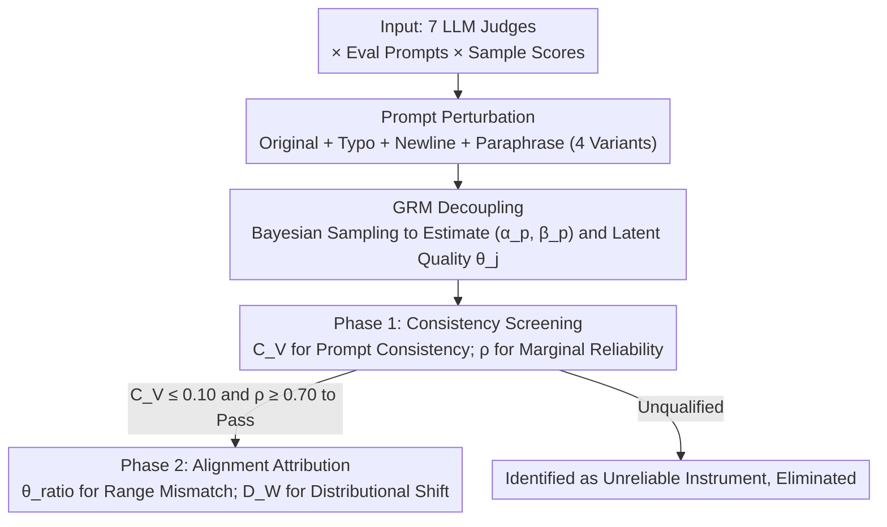

# Diagnosing the Reliability of LLM-as-a-Judge via Item Response Theory

**Conference**: ICML 2026  
**arXiv**: [2602.00521](https://arxiv.org/abs/2602.00521)  
**Code**: https://github.com/elu-lab/IRT-Judge  
**Area**: LLM Evaluation / LLM-as-a-Judge / Reliability Diagnosis  
**Keywords**: Item Response Theory, Graded Response Model, Judge Consistency, Human Alignment, Latent Quality  

## TL;DR
This paper applies the Graded Response Model (GRM) from psychometric Item Response Theory (IRT) to LLM-as-a-Judge. It decomposes "judgment scores" into judge attributes $(\alpha, \beta)$ and latent sample quality $\theta$. Using four interpretable metrics, it systematically diagnoses whether 7 mainstream LLMs across 11 evaluation criteria act as "stable measurement instruments" through a two-stage process (intrinsic consistency + human alignment).

## Background & Motivation
**Background**: LLM-as-a-Judge has permeated scenarios such as summarization evaluation, dialogue evaluation, visual generation evaluation, and RLHF reward modeling because it is cheaper and more scalable than human annotation. Validating its reliability primarily follows two paths: *intrinsic consistency* (whether the same sample receives the same score with a different prompt) and *human alignment* (whether it matches human scoring).

**Limitations of Prior Work**: These two paths are usually executed separately and remain at the "output level." Consistency is often measured via inter-rater agreement, re-running with different seeds, McDonald's $\omega$, or token probability uncertainty. However, these metrics only consider the final discrete scores and cannot separate the "judge's measurement characteristics" from the "inherent variance in sample quality." Alignment is measured using aggregated metrics like Pearson/Spearman/Kendall correlation, Cohen's $\kappa$, or Krippendorff's $\alpha$, which only indicate how similar results are without revealing whether the judge is "systematically strict/lenient" or "lacks discrimination."

**Key Challenge**: Existing methods conflate "measurement error" with "sample variance." Consequently, even if an LLM judge is found to be unstable, it is unclear if the root cause is prompt sensitivity, poor model discrimination, or the inherent difficulty of the evaluation dimension. A statistical framework is needed to disentangle instrument characteristics from object characteristics.

**Goal**: Establish a unified framework to simultaneously answer two questions: (1) Is the LLM judge stable as a "measurement instrument"? (2) Is its "measurement result" aligned with humans? Furthermore, the diagnostic signals for these questions must be interpretable and attributable to specific factors.

**Key Insight**: The authors draw inspiration from a century of Item Response Theory in psychometrics. Just as IRT in educational testing evaluates whether "test items can reliably measure student ability," it can be used to evaluate whether "LLM judges can reliably measure sample quality." Specifically, the Graded Response Model (GRM) is selected because judgment scores are typically Likert-style ordered discrete categories.

**Core Idea**: Model "LLM judgment score = judge characteristics $(\alpha, \beta)$ × latent quality $\theta$" as a generative probabilistic model and estimate all three via Bayesian inference. Four diagnostic metrics are then extracted from the estimated $\theta$ distribution and $(\alpha, \beta)$ to attribute "measurement instability" to "prompt sensitivity vs. lack of discrimination vs. systematic bias vs. range mismatch."

## Method

### Overall Architecture
This framework addresses the issue where existing methods conflate measurement error with true sample variance, making it impossible to identify why an LLM judge is unstable. The approach treats the judgment process as a psychometric measurement, using GRM to infer three types of latent variables for detailed diagnosis. The process follows three steps: first, generate three semantically invariant perturbations (typo, newline, paraphrase) for each original prompt (4 variants total); then, feed scores from "7 LLMs × each prompt variant × each sample" into the GRM to simultaneously estimate discrimination and thresholds $(\alpha_p, \boldsymbol{\beta}_p)$ for each prompt variant and a shared latent quality $\theta_j$ for each sample; finally, perform a two-stage diagnosis—Phase 1 uses consistency metrics to filter out "unstable instruments," and only those that pass proceed to Phase 2 for comparison with human latent quality distributions.

### Key Designs

**1. GRM Decoupling: Extracting Prompt Effects from True Sample Quality**

Existing consistency and alignment metrics only focus on final discrete scores, failing to answer whether a score difference stems from true sample quality or prompt sensitivity. GRM intervenes at the generative model level: for $K$ scoring levels, the probability that judge $p$ gives sample $j$ a score $\ge k$ is modeled as $P(Y_{pj} \ge k \mid \theta_j) = \sigma(\alpha_p (\theta_j - \beta_{pk}))$, where $\theta_j$ is the latent quality shared by all prompt variants, $\alpha_p$ is the discrimination (steepness of the response curve), and $\boldsymbol{\beta}_p$ is the sequence of thresholds between adjacent levels (enforced to be monotonically increasing). Priors are set as $\theta_j \sim \mathcal{N}(0,1)$, $\alpha_p \sim \text{LogNormal}(0, 0.5)$, and $\beta_{pk} \sim \mathcal{N}(0,1)$, with NUTS used to sample all parameters. The ingenuity lies in the 4 variants sharing the same $\theta_j$: score differences caused by "judge sensitivity to wording" are absorbed into $(\alpha, \boldsymbol{\beta})$, while "true sample quality variance" is absorbed into $\theta$. This natural decoupling allows model comparison using only $\theta$ distributions, bypassing the difficulty of comparing models that use different numbers of scoring levels. GRM was chosen over Nominal Response Models (which lose order info) or Partial Credit Models (which force a shared $\alpha$) because judgment scores are ordered Likert scales.

**2. Phase 1 Consistency Screening: Differential Diagnosis via $C_V$ and $\rho$**

The term "unstable judgment" is vague; this paper decomposes it using two orthogonal metrics. $C_V$ measures prompt consistency: first calculate $\bar V_p$, the "mean variance of $\theta_j$ within the same scoring category" for each variant $p$, then calculate the coefficient of variation $C_V = \sigma_V / \mu_V$ across all $\bar V_p$. $\rho$ measures marginal reliability: $\rho = \text{Var}(\hat\theta_j) / (\text{Var}(\hat\theta_j) + \mathbb{E}[\sigma_j^2])$, where the numerator is the variance of the posterior mean of $\theta$ (true quality variance) and the denominator adds the expectation of the NUTS posterior variance (measurement uncertainty). Thus, $\rho$ represents the proportion of $\theta$ variance derived from true quality. Thresholds follow psychometric conventions—$C_V < 0.10$ is derived from Chebyshev's inequality (ensuring 75% of samples fall within mean ±20%) and analytical chemistry standards, while $\rho > 0.70$ is Nunnally's classic threshold. Combining them allows for differential attribution: high $C_V$ + high $\rho$ suggests the issue is prompt sensitivity, while low $\rho$ indicates insufficient discrimination regardless of $C_V$. This phase also acts as a gatekeeper—only judges with $C_V \le 0.10$ and $\rho \ge 0.70$ proceed to Phase 2, avoiding meaningless human alignment calculations on broken instruments.

**3. Phase 2 Alignment Attribution: Decomposing Human Gaps via $\theta_{\text{ratio}}$ and $D_W$**

Traditional Spearman/Kendall correlations only provide a yes/no on alignment without revealing if a judge is systematically strict or has a discrimination mismatch. This paper uses two metrics for decomposition. $\theta_{\text{ratio}} = \theta_{\text{range}}^{(\text{LLM})} / \theta_{\text{range}}^{(\text{Human})}$, where $\theta_{\text{range}}$ is defined as the "median $\theta$ of high-score samples minus the median $\theta$ of low-score samples." $\theta_{\text{ratio}} < 1$ indicates the LLM compresses the quality range (hypersensitive, cannot separate samples humans see as different), while $> 1$ indicates range expansion (numb, exaggerating differences humans see as negligible). $D_W = W_1(\hat\theta^{(\text{LLM})}, \hat\theta^{(\text{Human})})$ measures the 1-Wasserstein distance between LLM and human $\theta$ distributions. Wasserstein is used instead of correlation (which ignores distribution shape) or KL divergence (which is asymmetric and undefined for non-overlapping supports) because it captures both "position shift" and "shape difference" with physical meaning. Interpretation is clear: $\theta_{\text{ratio}} \approx 1$ but high $D_W$ implies equivalent discrimination but systematic bias; $\theta_{\text{ratio}} \ne 1$ but low $D_W$ implies overall alignment but different sensitivity. Failure in both suggests a fundamental disagreement on the definition of "quality."

### Loss & Training
The framework does not involve end-to-end training but is a posterior inference process. The GRM probabilistic model is implemented in PyMC, using NUTS (NumPyro backend, 4 chains, 1000 warmup + 1000 samples, target acceptance 0.95) for Bayesian sampling. For binary ratings (e.g., Understandability in TopicalChat), a 2-PL logistic model replaces the GRM. Prompt perturbations were implemented as follows: typos via AugLy on the 5 tokens with highest attention in Qwen3-8B's last layer, newlines via 3 random insertions, and paraphrasing by extracting 5 verbs/adjectives via NLTK and replacing them with synonyms using GPT-4o-mini.

## Key Experimental Results

### Main Results
Evaluated across 7 models (Gemini 2.5 Flash, GPT-4o, GPT-4o-mini, Qwen3-30B-A3B, Qwen3-235B-A22B, Llama-4-Maverick, Llama-4-Scout; Qwen3-VL for vision) on 3 NLP benchmarks (SummEval, TopicalChat, HelpSteer-2) and 1 vision benchmark (VIEScore).

**Phase 1 Key Results** ($C_V \le 0.10$ and $\rho \ge 0.70$ required for qualification):

| Task / Model | $C_V$ | $\rho$ | Qualified? | Interpretation |
| :--- | :--- | :--- | :--- | :--- |
| SummEval Relevance / GPT-4o | 0.05 | 0.92 | ✓ | Most stable summarization eval |
| SummEval Consistency / GPT-4o-mini | 0.92 | 0.88 | ✗ | High $\rho$ but extreme $C_V$ → Prompt sensitive |
| TopicalChat Understandability / Qwen3-235B| 0.27 | 0.34 | ✗ | Low $\rho$ → Insufficient discrimination |
| HelpSteer-2 Helpfulness / Gemini-2.5 | 0.03 | 0.86 | ✓ | Best performer |
| VIEScore CIG-SC / Gemini-2.5 | 1.32 | 0.94 | ✗ | High $\rho$ but extreme $C_V$ → Typical prompt sensitivity |

**Phase 2 Key Results** ($\theta_{\text{ratio}}$, $D_W$):

| Task / Model | $\theta_{\text{ratio}}$ | $D_W$ | Interpretation |
| :--- | :--- | :--- | :--- |
| SummEval Relevance / Gemini-2.5 | 0.96 | 0.30 | Range matched, slight drift |
| TopicalChat Understandability / GPT-4o | 2.59 | 0.33 | High "numbness," quality range stretched 2.6× |
| VIEScore TIE-PQ / GPT-4o | 4.40 | 0.60 | Range expanded 4×, significant drift |
| HelpSteer-2 Coherence / Qwen3-30B | 1.03 | 0.16 | Rare "range match + high alignment" |

### Ablation Study (Prompt detail / CoT / Score scales on TopicalChat)

| Configuration | Key Finding | Description |
| :--- | :--- | :--- |
| Simple → Detailed Prompt | $C_V$ drops significantly | Detailed instructions stabilize prompt consistency |
| Detailed + CoT | $C_V$ drops further | CoT provides additional stability (e.g., GPT-4o $C_V = 0.01$) |
| 3-level → 5-level Score | $\rho$ increases slightly | Moderate increases in levels improve reliability |
| 3-level → 7-level Score | $\rho$ may decrease | Diminishing returns; more levels are not always better |
| Any configuration → $\rho$ | Marginal gains | Detailed instructions fix $C_V$, but help $\rho$ very little |

### Key Findings
- **No Free Lunch**: None of the 7 LLMs met the $C_V \le 0.10$ and $\rho \ge 0.70$ criteria across all 11 evaluation dimensions, indicating that a "universally reliable LLM judge" does not yet exist.
- **Vision vs. Text**: VIEScore (visual eval) $C_V$ values (0.16-1.32) are much higher than NLP (0.03-0.30), meaning visual eval is extremely prompt-sensitive. However, VIEScore $\rho$ values (0.80-0.96) are often higher than NLP—internal ranking is stable once the prompt is fixed.
- **Divergent Scaling Laws**: In NLP, larger models consistently yield lower $C_V$ and higher $\rho$. In VIEScore, this trend disappears—scale does not guarantee stability in visual evaluation.
- **Universal $\theta_{\text{ratio}} > 1$**: Almost all LLMs are more "numb" than humans, exaggerating quality differences. This is particularly severe in TopicalChat (2-3×) and VIEScore (up to 4×), a systematic pattern invisible to traditional correlation metrics.
- **Prompt detail for $C_V$, Scale for $\rho$**: Detailed instructions + CoT are the primary cure for $C_V$; discrimination $\rho$ is better addressed by tuning scoring scales (5-level is generally better than 3).

## Highlights & Insights
- **Adopting IRT for LLM Evaluation**: Leverages 70+ years of psychometric maturity. This is the first systematic attempt to use GRM to diagnose LLM-as-a-Judge, treating the judge as an instrument to be calibrated. IRT offers a generative model, interpretable parameters, and established threshold conventions.
- **Gated Two-Stage Design**: Screening via Phase 1 before calculating Phase 2 avoids the common pitfall of reporting "human alignment" numbers on measurement instruments that are inherently noisy—numbers that are often meaningless in such contexts.
- **Revealing Hidden Mismatches**: $\theta_{\text{ratio}}$ exposes that many LLMs with decent Spearman correlations are actually "numb" to human-perceived quality levels, a finding that the traditional correlation framework fails to capture.
- **Strong Transferability**: The framework is model-agnostic and task-agnostic, requiring only ordered discrete outputs. Open-sourced code provides a standardized process for validating new evaluation criteria.

## Limitations & Future Work
- **Strong GRM Assumptions**: Requires ordered categories and a shared latent trait $\theta$; if judgment is categorical (e.g., win/lose/tie without intrinsic order), GRM is inapplicable.
- **NUTS Computational Cost**: Sampling for 7 models across 11 criteria with 4 variants each is computationally expensive and requires engineering optimization for larger benchmarks.
- **Limited Prompt Perturbations**: Only surface-level perturbations (typo, newline, paraphrase) were tested. Structural changes (reordering rubrics, framing changes) should likely be treated as "new instruments" in Phase 1.
- **Human Baseline Reliability**: Human scores were treated as the "gold standard" to estimate $\theta^{(\text{Human})}$, but human inter-annotator disagreement was not explicitly modeled.
- **No "Prescription" for Fixes**: After diagnosing low $\rho$ or high $C_V$, the framework does not yet prescribe whether to change the model, modify the prompt, or redefine the task.

## Related Work & Insights
- **vs. Traditional Inter-rater Agreement**: Traditional methods fail to separate prompt sensitivity from sample variance; Ours uses GRM at the generative level to enable differential diagnosis.
- **vs. Uncertainty Quantification**: Uncertainty based on token probabilities only looks at single outputs; $C_V$ captures the structural stability across prompts.
- **vs. Correlation / Cohens's $\kappa$**: These aggregate metrics are blind to systematic strictness or range mismatch; $\theta_{\text{ratio}}$ + $D_W$ decompose alignment failures into actionable dimensions.
- **vs. Selective Evaluation / Statistical Replacement**: Those works decide *when* an LLM can replace a human; Ours performs the upstream diagnosis of whether the judge is a qualified measurement instrument.

## Rating
- Novelty: ⭐⭐⭐⭐ Clear cross-disciplinary transfer of IRT/GRM to LLM eval with a complete framework.
- Experimental Thoroughness: ⭐⭐⭐⭐ Broad coverage of NLP and Vision across 7 models.
- Writing Quality: ⭐⭐⭐⭐ Clear definitions and practical "differential diagnosis" guides, though terminology density is high.
- Value: ⭐⭐⭐⭐ Provides the first theoretically grounded, standardized calibration process for LLM judges.

<!-- RELATED:START -->

## Related Papers

- [\[ACL 2025\] IRT-Router: Effective and Interpretable Multi-LLM Routing via Item Response Theory](../../ACL2025/interpretability/irt_router_multi_llm.md)
- [\[ICML 2026\] From Rashomon Theory to PRAXIS: Efficient Decision Tree Rashomon Sets](from_rashomon_theory_to_praxis_efficient_decision_tree_rashomon_sets.md)
- [\[ICML 2026\] Prompt Optimization Is a Coin Flip: Diagnosing When It Helps in Compound AI Systems](prompt_optimization_is_a_coin_flip_diagnosing_when_it_helps_in_compound_ai_syste.md)
- [\[ICML 2026\] Steer Like the LLM: Activation Steering that Mimics Prompting](steer_like_the_llm_activation_steering_that_mimics_prompting.md)
- [\[ICML 2026\] GEM: Geometric Entropy Mixing for Optimal LLM Data Curation](gem_geometric_entropy_mixing_for_optimal_llm_data_curation.md)

<!-- RELATED:END -->
