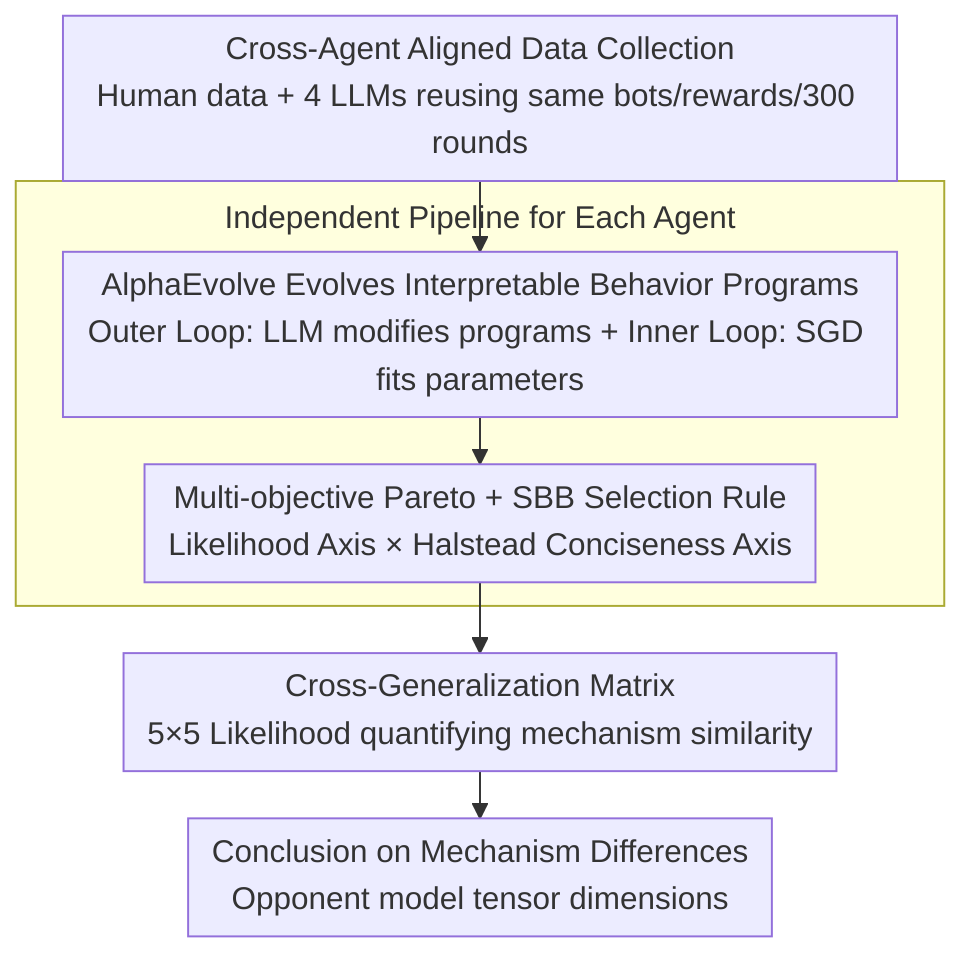

# Discovering Differences in Strategic Behavior Between Humans and LLMs

**Conference**: ICML 2026  
**arXiv**: [2602.10324](https://arxiv.org/abs/2602.10324)  
**Code**: Not yet released  
**Area**: Interpretability / Behavioral Game Theory / LLM Evaluation  
**Keywords**: Behavioral Game Theory, AlphaEvolve, Program Synthesis, Iterated Rock-Paper-Scissors, Opponent Modeling

## TL;DR
This paper utilizes AlphaEvolve (an LLM-based program synthesis framework) to "evolve" interpretable Python behavior models directly from behavioral data. By comparing humans with frontier LLMs in Iterated Rock-Paper-Scissors (IRPS), the study finds that Gemini 2.5 Pro/Flash and GPT 5.1 significantly outperform humans in both win rates and "opponent modeling" dimensions, whereas GPT OSS 120B exhibits deteriorating performance over time.

## Background & Motivation

**Background**: LLMs are increasingly deployed in social interaction scenarios (negotiation, customer service, virtual companions) and are used as "cheap human proxies" for behavioral simulation in social science and market research. Distinguishing differences between LLM and human behavior is a traditional topic in Behavioral Game Theory (BGT). Mainstream methods either report aggregate statistics (win rates, first-hand distribution) or manually design parametric mathematical models (such as EWA, Sophisticated EWA, Cognitive Hierarchy) to fit human behavior.

**Limitations of Prior Work**: Aggregate statistics only describe trends without explaining mechanisms. Hand-designed BGT models are created for humans, and their priors (e.g., "Rock preference for the first move," "win-stay-lose-shift") may not accurately characterize the non-human behaviors of LLMs. On the other hand, black-box neural network models fit data well, but the cost of interpretation is pushed to the model decoding stage, failing to provide direct "mechanism hypotheses."

**Key Challenge**: A trade-off exists between interpretability and fitting capability—traditional BGT formulas are readable but have limited capacity and are human-biased; neural networks have high capacity but are unreadable. To "fit LLMs while directly reading out mechanism differences," it is necessary to break through "human-preset mathematical templates."

**Goal**: (1) Openly search a **program space** rather than a predefined family of formulas, allowing the data to select the simplest structure that characterizes the agent (Human/LLM). (2) Compare the strategic behavior of humans and multiple frontier LLMs under a unified interpretable representation and pinpoint the structural level of "which mechanisms cause the differences."

**Key Insight**: Rewrite the "behavior model" of BGT as a Python function with a fixed signature `agent(params, choice, opp_choice, reward, state) → (logits, state)`. Utilize AlphaEvolve (LLM-driven program evolution) for outer-loop search over the program space, combined with SGD for inner-loop fitting in the parameter space, constructing a bi-level optimization process.

**Core Idea**: Transform the task of "finding the behavior model that best fits the agent" from "manual formula writing" into "LLM-based program evolution." Use a multi-objective Pareto front (likelihood + program conciseness) to filter the "simplest but best" (SBB) program as the mechanism hypothesis, then compare Human vs. LLM at the program text level.

## Method

### Overall Architecture
This paper addresses the limitation where traditional BGT cannot "fit LLM behavior while directly reading out mechanism differences" by replacing "handwritten mathematical formulas" with "LLM-evolved Python programs." Specifically, any BGT model is unified into the function signature `agent(params, choice, opp_choice, reward, state) → (logits, state)` (inputting the agent's previous action, opponent's action, reward, and internal state to output the next action distribution and new state). AlphaEvolve performs an outer-loop search in the program space, while SGD performs inner-loop fitting in the parameter space. The "simplest but best" program is selected from the multi-objective Pareto front as the agent's mechanism hypothesis. Finally, a cross-generalization matrix is used to contrast human and LLM mechanisms.

The study reuses the IRPS dataset from Brockbank & Vul (2024) (411 subjects / 129,087 choices) and collects alignment data for 4 LLMs (20 games × 15 bots × 300 rounds = 90,000 choices per LLM). IRPS is fixed at 300 rounds with 15 bots (including nonadaptive transition-based and adaptive followers), with rewards of Win +3 / Tie 0 / Loss -1. Each agent (Human, Gemini 2.5 Pro/Flash, GPT 5.1, GPT OSS 120B) undergoes the same pipeline to ensure fair comparison.

### Key Designs

**1. AlphaEvolve Evolves Interpretable Behavior Programs: LLM as "Hypothesis Generator"**

BGT has long been limited by researchers testing only the formulas they conceive; manual formulas lack capacity and are biased towards human priors. This paper directly searches the program space for the Python function that "best predicts the agent's next move." The search starts from a template program equivalent to the Nash equilibrium (uniform logits). Each generation feeds the parent program, historical samples, and fitness scores to an LLM (Gemini 2.5 Flash), which is tasked to "propose modifications to improve the score." The parameters $\theta$ of each candidate are fitted via SGD using maximum likelihood $\arg\max_\theta \sum_t \log \hat{p}_{\theta}(a_t \mid h_t)$, using normalized likelihood from two-fold cross-validation as the performance axis. This forms a bi-level outer-program/inner-parameter optimization. Programs are chosen over formulas or neural networks because they retain Turing-complete expressiveness and possess readable internal structures (conditional branches, Q-tables, opponent frequency tables), precluding the need for secondary interpretations. Frontier LLMs are well-suited for this role as hypothesis generators due to the vast behavioral science knowledge in their training data.

**2. Multi-objective Pareto + SBB Selection Rule: Algorithmic Occam's Razor**

The programs that truly reveal mechanisms are often not the "best-fit" programs (which tend to be bloated with multiple heuristics) but the "simplest but best" programs near the "elbow" of the Pareto front. Fitness tracks each program's cross-validated likelihood $\ell(\phi)$ and negative Halstead effort $s(\phi)$. All non-dominated solutions form the Pareto front $\mathrm{PF}(\hat{\Phi})$, from which the Simplest-But-Best (SBB) program is defined: $\mathrm{SBB}(\epsilon) \in \arg\max_{\phi \in \mathrm{PF}(\hat{\Phi})} \{ s(\phi) \mid \ell(\phi) > \max_{\phi'} \ell(\phi') - \epsilon \}$. Setting $\epsilon = 0.005$ follows the intuition of selecting the simplest program given a negligible loss in likelihood. This rule converts mechanism interpretation from a subjective manual selection into a reproducible algorithmic step.

**3. Cross-Agent Aligned Collection and Cross-Generalization Matrix: Quantifying Mechanism Similarity**

To ensure that "Human vs. LLM" differences converge on strategic mechanisms rather than environmental differences, the 4 LLMs reuse the 15 bots, reward matrices, and 300-round lengths from the human dataset. A 5×5 cross-generalization matrix $M_{ij}$ is constructed: row $i$ and column $j$ contain the likelihood obtained by applying Agent $j$'s SBB program (with re-fitted parameters) to Agent $i$'s data. Diagonal dominance indicates that SBB programs capture agent-specific traits, while high off-diagonal values expose behavioral similarities. This matrix statistically demonstrates that models designed for humans systematically lose predictive power on LLM behavior, supporting the claim that LLMs are not cheap human surrogates.

### Loss & Training
Inner-loop parameter optimization uses SGD implemented in JAX to maximize the negative NLL. Outer-loop program evolution uses AlphaEvolve with island-based evolution on multi-objective fitness, run independently 3 times per dataset. Baselines include Nash equilibrium, Contextual Sophisticated EWA (CS-EWA, extending Sophisticated EWA to maintain attraction vectors for joint history of length L=2), and a GRU-based RNN.

## Key Experimental Results

### Main Results
**Win Rate Comparison** (Average win rate over 300 rounds across 15 bots):

| Agent | Avg. Win Rate vs Nonadaptive Bots | Convergence Speed | Gap from Oracle |
|--------|------|------|------|
| Random Baseline | ~0% (Zero-sum) | Not converging | Large |
| Human | Medium | Slow | Medium |
| Gemini 2.5 Flash / Pro | Significantly higher than humans | Fast (near oracle in dozens of rounds) | Small |
| GPT 5.1 | Significantly higher than humans | Fast | Small |
| GPT OSS 120B | Human-level start, **decreases over time** | Reverse | Widening gap |

**Behavioral Model Quality** (Normalized likelihood gain over Nash baseline, higher is better; 2-fold CV):

| Model | Human | Gemini 2.5 Pro | Gemini 2.5 Flash | GPT 5.1 | GPT OSS 120B |
|------|------|----------------|------------------|---------|--------------|
| Nash | 0 (Baseline 1/3) | 0 | 0 | 0 | 0 |
| CS-EWA | Significant positive gain | Significant positive gain | Significant positive gain | Significant positive gain | Significant positive gain |
| GRU-RNN | Comparable to AlphaEvolve | < AlphaEvolve | < AlphaEvolve | < AlphaEvolve | Comparable to AlphaEvolve |
| **AlphaEvolve** | **Comparable/Slightly better** | **Better than RNN** | **Better than RNN** | **Better than RNN** | **Comparable to RNN** |

All comparisons of AlphaEvolve vs. CS-EWA show $p < 0.001$ (Wilcoxon signed-rank + Bonferroni correction, $Z \le -7.148$).

### Ablation Study
Mechanism configurations of SBB programs:

| Agent | Q-Table Dimension (Value Learning) | Opponent Model Dimension | Choice Stickiness |
|--------|----------------------|--------------|----------|
| Human | 3×3×3 ($Q(a_t, a^o_{t-1}, a_{t-1})$) | 1D (Frequency only) | Yes |
| Gemini 2.5 Flash | 3×3×3 | **3×3** (Conditioned on last move) | Yes |
| Gemini 2.5 Pro | 3×3×3 | **3×3** + Counterfactual updates | Yes |
| GPT 5.1 | 3×3×3 | **3×3×3** (Highest dimension) | No |
| GPT OSS 120B | **1D** ($Q(a_t)$, weakest) | 1D | Yes |

### Key Findings
- **Dimension is Capability**: The strategic advantage of frontier LLMs is localized to a specific structure—they maintain higher-dimensional opponent model matrices. Gemini 2.5 Pro further introduces counterfactual reward updates, which are absent in human SBB programs.
- **GPT OSS 120B as a Negative Control**: This is the only agent where the Q-table degrades to 1D and whose performance worsens over time, confirming that weak LLMs fail to synthesize strategy in long contexts. This suggests opponent modeling is an emergent capability linked to scale.
- **Humans are poor predictors for LLMs, and vice versa**: The cross-generalization matrix shows high mutual predictability among Gemini 2.5 Pro/Flash and GPT 5.1, but significant performance drops ($p < 0.001$) when applying human programs to LLM data or vice versa. This refutes the idea of LLMs as cheap human substitutes.
- **All Agents are Level-1 Players**: No SBB program exhibits recursive "the opponent is modeling me" logic; consequently, all agents fail against level-1 adaptive bots, with win rates falling toward random chance.

## Highlights & Insights
- **Advancing BGT to Data-Driven Program Synthesis**: Traditional BGT relies on manual formulas; this paper proves LLM + evolutionary algorithms can automatically produce readable Python behavior models with fit quality equal to or better than RNNs. This represents a paradigm shift toward "interpretability by design" in selection rules.
- **Algorithmic Occam's Razor**: SBB(ε) formalizes the subjective process of picking mechanism representatives, ensuring structural comparisons across agents are reproducible.
- **Structural Differences in Scalar Dimensions**: Identifying strategic differences as "opponent model tensor dimensions" provides a concrete, falsifiable structural variable. This provides a handle for alignment: to make LLMs "more human-like," one can restrict their opponent model capacity.
- **Complement to CoT Monitoring**: The authors note that this method doesn't rely on reasoning traces (which may be unfaithful), making it a useful supplement to CoT monitoring in AI safety.

## Limitations & Future Work
- **Single Game Validation**: IRPS is simple; whether results transfer to non-zero-sum, multi-player, or asymmetric information games (e.g., negotiation) is unverified.
- **Average Human Representation**: Human data is aggregated, potentially masking individual expert behavior.
- **Mechanism Hypothesis ≠ Mechanism itself**: SBB programs are predictive hypotheses, not proof of internal implementation. Future work involves mechanistic interpretability (probes, logit lens) for verification.
- **AlphaEvolve Biases**: Using an LLM to generate programs to study LLMs may introduce inductive biases favoring BGT-like code structures.

## Related Work & Insights
- **vs. Fan et al. (2024)**: Contrary to their finding that GPT-4 is inferior to humans in IRPS, this study shows frontier LLMs have achieved a generational leap.
- **vs. Castro et al. (2025)**: Adapts the concept of "program synthesis for cognitive modeling" but upgrades to AlphaEvolve and multi-objective Pareto analysis.
- **vs. Traditional BGT**: Proves AlphaEvolve significantly outperforms manually expanded EWA variants (CS-EWA).
- **vs. RNN Fitting**: AlphaEvolve provides readable Python functions, bypassing the interpretation bottlenecks of black-box neural networks while achieving superior robustness against overfitting.

## Rating
- Novelty: ⭐⭐⭐⭐⭐
- Experimental Thoroughness: ⭐⭐⭐⭐
- Writing Quality: ⭐⭐⭐⭐⭐
- Value: ⭐⭐⭐⭐⭐

<!-- RELATED:START -->

## Related Papers

- [\[AAAI 2026\] ElementaryNet: A Non-Strategic Neural Network for Predicting Human Behavior in Normal-Form Games](../../AAAI2026/interpretability/elementarynet_a_non-strategic_neural_network_for_predicting_human_behavior_in_no.md)
- [\[ICLR 2026\] From Tokens to Thoughts: How LLMs and Humans Trade Compression for Meaning](../../ICLR2026/interpretability/from_tokens_to_thoughts_how_llms_and_humans_trade_compression_for_meaning.md)
- [\[ICML 2026\] Discovering Implicit Large Language Model Alignment Objectives](discovering_implicit_large_language_model_alignment_objectives.md)
- [\[ICML 2026\] On the Relationship Between Activation Outliers and Feature Death in Sparse Autoencoders](on_the_relationship_between_activation_outliers_and_feature_death_in_sparse_auto.md)
- [\[AAAI 2026\] Finding the Translation Switch: Discovering and Exploiting the Task-Initiation Features in LLMs](../../AAAI2026/interpretability/finding_the_translation_switch_discovering_and_exploiting_the_task-initiation_fe.md)

<!-- RELATED:END -->
