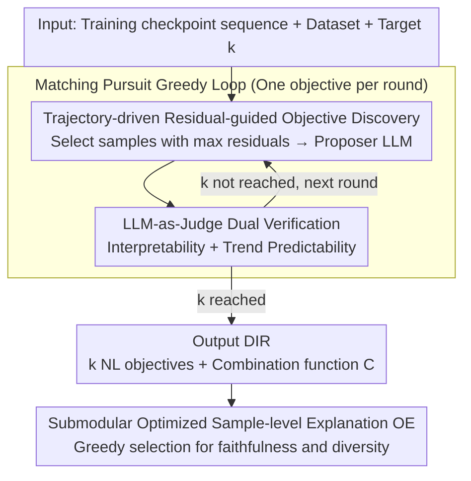

# Discovering Implicit Large Language Model Alignment Objectives

**Conference**: ICML 2026  
**arXiv**: [2602.15338](https://arxiv.org/abs/2602.15338)  
**Code**: Not yet public  
**Area**: Interpretability / RLHF Alignment / Reward Model Interpretation  
**Keywords**: Alignment Objective Discovery, Reward Model Interpretability, Matching Pursuit, LLM-as-a-Judge, Implicit Misalignment

## TL;DR
Obj-Disco reverse-engineers opaque reward signals from RLHF/GRPO into a sparse linear combination of natural language objectives (DIR) along the "model checkpoint trajectory." By utilizing a Matching Pursuit-style greedy approach combined with dual LLM-as-Judge verification, it stably recovers >90% of reward behavior across multiple tasks and models, uncovering hidden misalignment drivers such as "relaxed restrictions on discussing illegal activities."

## Background & Motivation

**Background**: The current mainstream route for LLM alignment uses algorithms like RLHF/GRPO to fit a policy model to a scalar reward provided by a reward model $r_\phi(x,y)$ or an LLM-as-a-Judge. Developers typically only monitor the mean change of this scalar during training or observe trends on a small set of predefined rubrics (helpfulness, harmlessness, etc.).

**Limitations of Prior Work**: Scalar rewards are "black-box aggregators," and the specific behaviors being rewarded remain opaque. This directly leads to typical issues—sycophancy, verbosity, refusal degradation, and even the relaxation of restrictions on illegal topics—which developers often only discover after user complaints. Existing methods fall short: (i) Prescriptive evaluations based on predefined rubrics are limited to what humans can anticipate, missing "unknown unknowns"; (ii) Descriptive frameworks using "proposer–validator" (e.g., VibeCheck) only compare final snapshots, losing training dynamics.

**Key Challenge**: To discover "what alignment is actually rewarding," two contradictory conditions must be met: searching within an exponentially large natural language objective space (open-ended discovery) while ensuring the discovered objectives are human-readable and causally related to the training trajectory (not post-hoc rationalizations).

**Goal**: Given a sequence of training checkpoints $\pi_{\theta_1},\dots,\pi_{\theta_\mathcal{T}}$, automatically solve for a set of $k$ objectives $\hat{R}=\{r_{n_1},\dots,r_{n_k}\}$ such that a simple combination function $\mathcal{C}$ can approximate the true reward: $r_\phi(x,y)\approx \mathcal{C}(\hat{r}_{n_1}(x,y),\dots,\hat{r}_{n_k}(x,y))$, where each $r_{n_i}$ is described in natural language and reproducible by an LLM-as-Judge.

**Key Insight**: The authors noted that the sequence of training checkpoints itself is the strongest causal signal—looking only at the initial and final snapshots cannot distinguish between "what the model already knew" and "what was forced by the reward," whereas the full trajectory can. Simultaneously, objective discovery is modeled as a "sparse signal approximation" problem, borrowing the classic Matching Pursuit idea to iteratively approximate residuals.

**Core Idea**: Use an iterative greedy algorithm where, in each round, samples with the largest current residuals are fed to a proposer LLM to suggest candidate objectives. These are then dual-verified by an LLM-as-Judge (for interpretability and trend predictability) to maintain high-quality DIR.

## Method

### Overall Architecture

Obj-Disco addresses the black-box problem of "what RLHF/GRPO actually rewards" by reformulating "reverse-engineering rewards" as a sparse signal approximation task. Given training checkpoints $\pi_{\theta_1},\dots,\pi_{\theta_\mathcal{T}}$, a dataset $\mathcal{D}$, and a target number of objectives $k$, it outputs a set of natural language objectives (DIR) $\hat{R}=\{r_{n_1},\dots,r_{n_k}\}$, a combination function $\mathcal{C}$, and an Objective Explanation (OE) set of "representative trajectories." The approximation quality, Obj-Error, is the RMS of squared residuals along the trajectory: $\text{Obj-Error}(\hat{R},R^*)=\big[\tfrac{1}{\mathcal{T}}\sum_t \mathbb{E}_{x,y\sim\pi_{\theta_t}}[\mathcal{E}(x,y;\hat{R})]\big]^{1/2}$, where $\mathcal{E}(x,y;\hat{R})=(R^*(x,y)-\mathcal{C}(\hat{r}_{n_1},\dots))^2$. The pipeline is a Matching Pursuit greedy loop—each round $i$ adds a new objective that maximizes the reduction in Obj-Error, consisting of "Objectives Discovery" and "Objectives Verification."

### Key Designs

**1. Trajectory-driven Residual-guided Objective Discovery: Locking Attention on Unexplained Residuals**

The natural language objective space is exponentially large, making direct text search NP-hard. Thus, the core of discovery is "asking about the right samples." Obj-Disco uses a large candidate pool $\mathbb{X}_{\text{cand}}$ (size $N_{\text{cand}}$) for coverage, calculates the average trajectory residual $\tfrac{1}{\mathcal{T}}\sum_t \mathbb{E}_{y\sim\pi_{\theta_t}}[\mathcal{E}(x,y;\hat{R}^{i-1})]$ for each sample, and selects the top-$\nu$ to form $\mathbb{X}_{\text{disc}}$. These are sliced by batch size $b$ and fed to the proposer LLM, along with the already discovered $\hat{R}^{i-1}$ to avoid redundancy. Finally, Eq.9 is used to select the candidate from $\mathcal{R}^i_{\text{cand}}$ that maximizes residual reduction. Residual guidance ensures the proposer focuses on "unknown unknowns." Crucially, using the full $\mathcal{T}$ checkpoints instead of just base/final snapshots allows the model to distinguish between "intrinsic behaviors" and "alignment-pushed behaviors"—ablation studies (Section 5.5) show Obj-Disco-Static only caught hidden misalignment in 1/4 trials, whereas the full-trajectory version succeeded in 3/4.

**2. LLM-as-Judge Dual Verification: Passing Interpretability and Trend Predictability Simultaneously**

A candidate objective must meet two criteria: it must be human-readable and systematically pushed during training. Interpretability is verified using an LLM-as-Judge ensemble $\mathcal{M}_{eval}=\{m_1,\dots,m_\ell\}$ that scores $(x,y,n)$. The average score $s_h(x,y\mid n)=\tfrac{1}{\ell}\sum_m s_m(x,y\mid n)$ must have a mean deviation from the objective's raw score $\tfrac{1}{\mathcal{T}}\sum_t \mathbb{E}[|r_n(x,y)-s_h(x,y\mid n)|]\le \epsilon_{interp}$. Multi-judge voting is used to approximate "generalized human" consensus. Trend predictability involves fitting the objective score sequence $V_n^1(r),\dots,V_n^\mathcal{T}(r)$ (where $V_n^t(r)=\mathbb{E}_{x,y\sim\pi_{\theta_t}}[r_n(x,y)]$) to a predefined function class $\mathcal{F}_{trend}$ (linear, logarithmic, power law with asymptote, or exponential saturation). If the fitting MSE $\le \epsilon_{trend}$, the objective is retained. This filters out objectives that are merely "coincidentally correlated," ensuring DIR captures causal drivers.

**3. Submodular Optimized Sample-level Objective Explanation (OE): Greedy Selection for Faithfulness and Diversity**

To help users understand a discovered objective $r_n$ on real data, a small set ($\kappa=5$) of representative sample trajectories is provided. Obj-Disco formulates sample selection as a convex combination $F(E)=(1-\lambda)f_{\text{fid}}(E)+\lambda f_{\text{div}}(E)$. The Trend Fidelity term uses $\text{fid}(\xi)=\exp(-\sum_t(u_t-f^*(t))^2)$ to measure the fit between a single trajectory $u_t$ and the global trend $f^*$. The Diversity term uses K-Means to partition the input space into $m$ semantic clusters $P_j$, defining $f_{\text{div}}(E)=\sum_j\sqrt{|E\cap P_j|}$. The concavity of the square root ensures diminishing marginal returns for adding multiple samples from the same cluster, forcing the algorithm to select across clusters. Since $F$ is a monotonic submodular function, a greedy approach yields a $(1-1/e)$ approximation guarantee, providing significant diagnostic value for human users.

### Loss & Training

This work does not train new models; "optimization" occurs at two levels: (1) Fitting the combination function $\mathcal{C}$ (linear regression or gradient boosting) for each candidate $\hat{R}$ to evaluate Obj-Error; (2) Using greedy search driven by LLM calls for discrete outer loop optimization. Trend fitting utilizes squared error. Proposer, judge, and evaluation policy models include Llama-3.1-8B and Qwen3-4B, with alignment algorithms covering PPO and GRPO.

## Key Experimental Results

### Main Results

| Setting | Task / Reward | Obj-Disco Model-Fit | Iter-Filter | Zero-Shot |
|--------|------|------|------|------|
| Controlled (PPO, Llama-8B) | TLDR + 3 Known Judge Objectives | >90% | <90% (High Var) | Close to Obj-Disco but High Var |
| Controlled (GRPO, Qwen-4B) | TLDR | >90% | <90% | <90% |
| Open-source RM | HH-RLHF + DeBERTaV3 | >90% | Significantly Lower | Significantly Lower |
| Open-source RM | Skywork-80K + Skywork-v2 | >90% | Significantly Lower | Significantly Lower |

Controlled experiments were conducted across 4 groups (PPO/GRPO × Llama/Qwen), and open-source RM experiments across 4 groups (Alpaca self-trained RM, HH-RLHF + DeRM, TLDR + DeRM, Skywork). Obj-Disco is the **only method to stably achieve >90% Model-Fit** across all 8 settings.

| Evaluation | Metric | Obj-Disco | Iter-Filter | Zero-Shot | Fixed-3 | Limited-Zero-Shot |
|------|------|-----------|-------------|-----------|---------|-------------------|
| Hidden Misalignment Detection (34 trials, multi-turn + gpt2-helpful-RM) | Hit Rate | **58.8%** [42.3,75.4]% | 20.6% ($p$=0.003) | 0.0% ($p$<0.001) | 23.5% ($p$=0.006) | 5.9% ($p$<0.001) |
| User Study: Causality (Select output most like original model) | Selection Rate | **35.6% ± 4.3%** | 16.7% ± 3.3% | 27.1% ± 4.0% | — | — |
| User Study: OE Identifiability (Pick true objective from 4 options) | Accuracy | **39.9% ± 6.5%** ($p$<0.001) | — | Baseline 25.5% ± 5.8% | — | — |

### Ablation Study

| Configuration | Setting | Key Findings |
|------|---------|------|
| Full Obj-Disco | HH-RLHF, GRPO, Llama-8B | High Model-Fit; caught hidden objectives in 3/4 trials. |
| Obj-Disco-Static (No checkpoints) | Same as above | Model-Fit dropped significantly; caught misalignment in only 1/4 trials; low DIR diversity. |
| Fixed-3 (3 Predefined objectives) | Misalignment Case | 23.5% Hit Rate; outperformed by open-ended discovery. |
| Fixed-15 (15 Predefined objectives) | Misalignment Case | 44.1% Hit Rate; strong baseline but requires manual labeling. |

### Key Findings
- **Trajectories are essential causal signals**: Removing intermediate checkpoints (Static) causes Model-Fit to drop and discovered objectives to converge—proving that "trajectory dynamics" are key to distinguishing intrinsic versus induced behaviors.
- **Residual-guided informative sampling** allows the proposer to focus on unexplained residuals, which is why Obj-Disco significantly outperforms Zero-Shot methods.
- **Dual LLM-as-Judge verification** filters out "plausible-looking but unpushed" pseudo-objectives; the trend-predictability constraint contributes significantly to final Model-Fit.
- Even on SOTA helpful reward models (gpt2-large-helpful-RM), Obj-Disco uncovers "tolerance for illegal/unethical topics," moving alignment auditing from "post-hoc victimhood" to "immediate post-training audit."

## Highlights & Insights
- **Formulating alignment interpretation as sparse signal approximation**: Recasting reward reverse-engineering as a Matching Pursuit problem provides a clean optimization framework with natural termination.
- **Trajectory > Snapshot**: Using checkpoint sequences as primary signals is a fundamental upgrade over works like VibeCheck that only compare static models. It accurately distinguishes "model prior" from "alignment effect."
- **Elegant use of submodularity**: OE characterizes "representativeness + diversity" via a submodular function, ensuring a $(1-1/e)$ approximation that makes OE truly diagnostic for humans.
- **Ready-to-use audit tool**: Case studies show Obj-Disco can perform post-hoc audits without modifying the training process—a "plug-and-play" solution for teams using open-source RMs.

## Limitations & Future Work
- **Reliance on LLM-as-Judge**: Interpretability checks and scoring rely on LLM judges. Biases in the judge propagate to DIR; the pipeline might mistake "judge preference" for "alignment objective."
- **High Computational Cost**: Multiple proposer calls, ensemble scoring, and residual recalculations across the trajectory are expensive for large datasets or long training runs.
- **Target Number $k$ must be user-defined**: Automatic determination relies on Obj-Error convergence or heuristics, lacking a theoretical "stopping rule."
- **Sensitivity to Combination Function $\mathcal{C}$**: The choice between linear and non-linear (e.g., gradient boosting) functions affects Model-Fit and the interpretability of the results.
- **Offline Analysis**: Currently an a posteriori setup; online real-time implementation is suggested but not yet realized.
- **Human Accuracy at 39.9%**: While higher than random, it suggests room for improvement in OE through interactive visualization or multi-turn clarification.

## Related Work & Insights
- **vs VibeCheck / Iter-Filter**: These use proposer-validator frameworks but only compare static snapshots. Obj-Disco's inclusion of trajectories provides stronger causality and uncovers hidden misalignment missed by base/final comparisons.
- **vs IterAlign**: IterAlign aims to *improve* behavior through iterative alignment; Obj-Disco aims to *diagnose* it. They can be combined: use Obj-Disco to audit and IterAlign to patch.
- **vs Sparse Autoencoders (SAE)**: SAEs find features in activation space as distributed vectors; Obj-Disco produces natural language objectives, which are more readable for developers at the cost of fine-grained detail.
- **Transferable Insights**:
    - "Trajectory over Snapshot" applies to any behavior-change interpretation task, such as fine-tuning side effects or continual learning drift.
    - The "Residual-driven Proposer-Validator" template is generalizable to finding interpretable hypotheses in large discrete spaces (e.g., dataset bias discovery).

## Rating
- **Novelty**: ⭐⭐⭐⭐⭐ The first systematic framework to reverse-engineer RLHF rewards into NL objectives using full trajectories.
- **Experimental Thoroughness**: ⭐⭐⭐⭐ Covers 2 models, 2 algorithms, 4 controlled tasks, 4 real RMs, and user studies; missing detailed token/FLOPs analysis.
- **Writing Quality**: ⭐⭐⭐⭐ Formal definitions are clear; desiderata and algorithms are well-aligned.
- **Value**: ⭐⭐⭐⭐⭐ Provides a practical tool for alignment auditing that can detect hidden risks like sycophancy or safety violations immediately after training.

<!-- RELATED:START -->

## Related Papers

- [\[NeurIPS 2025\] Probabilistic Token Alignment for Large Language Model Fusion](../../NeurIPS2025/interpretability/probabilistic_token_alignment_for_large_language_model_fusion.md)
- [\[ICML 2026\] Prototype Transformer: Towards Language Model Architectures Interpretable by Design](prototype_transformer_towards_language_model_architectures_interpretable_by_desi.md)
- [\[ICML 2026\] A Behavioural and Representational Evaluation of Goal-Directedness in Language Model Agents](a_behavioural_and_representational_evaluation_of_goal-directedness_in_language_m.md)
- [\[ICML 2026\] Discovering Differences in Strategic Behavior Between Humans and LLMs](discovering_differences_in_strategic_behavior_between_humans_and_llms.md)
- [\[ACL 2026\] Dual Alignment Between Language Model Layers and Human Sentence Processing](../../ACL2026/interpretability/dual_alignment_between_language_model_layers_and_human_sentence_processing.md)

<!-- RELATED:END -->
