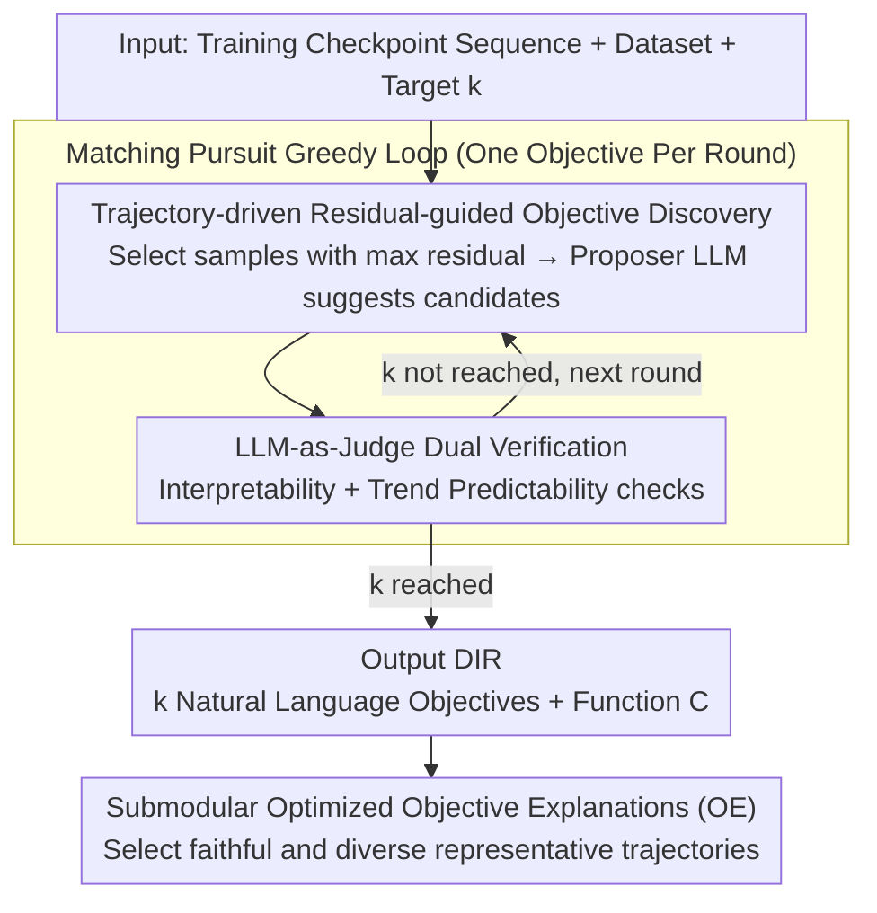

# Discovering Implicit Large Language Model Alignment Objectives

**Conference**: ICML 2026  
**arXiv**: [2602.15338](https://arxiv.org/abs/2602.15338)  
**Code**: Not yet public  
**Area**: Interpretability / RLHF Alignment / Reward Model Interpretation  
**Keywords**: Alignment objective discovery, reward model interpretability, Matching Pursuit, LLM-as-a-Judge, implicit misalignment

## TL;DR
Obj-Disco reverse-engineers opaque reward signals from RLHF/GRPO along the "model checkpoint trajectory" into a sparse linear combination of natural language objectives (DIR). Through Matching Pursuit-style greedy optimization and dual LLM-as-Judge verification, it stably recovers >90% of reward behavior across multiple tasks and models, uncovering hidden misalignment triggers such as "loosening restrictions on illegal topic discussions."

## Background & Motivation

**Background**: The current mainstream for LLM alignment uses algorithms like RLHF/GRPO to fit a policy model to scalar rewards provided by a reward model $r_\phi(x,y)$ or LLM-as-a-Judge. Developers typically monitor mean changes of this scalar during training or observe trends on a small set of preset rubrics (e.g., helpfulness, harmlessness).

**Limitations of Prior Work**: Scalar rewards are "black-box aggregators," making the specific behaviors being rewarded opaque. This leads to typical issues—sycophancy, verbosity, refusal degradation, or even loosening restrictions on illegal topics—which developers often only discover post-hoc via user complaints. Existing methods are insufficient: (i) prescriptive evaluations based on preset rubrics are limited by human-predefined lists and miss "unknown unknowns"; (ii) descriptive frameworks like "proposer–validator" (e.g., VibeCheck) only compare final snapshots and discard training dynamics.

**Key Challenge**: To identify "what alignment actually rewards," two contradictory conditions must be met: searching within an exponentially large natural language objective space (open-ended discovery) while ensuring the identified objectives are human-readable and causally related to the training trajectory (not post-hoc rationalizations).

**Goal**: Given a sequence of training checkpoints $\pi_{\theta_1},\dots,\pi_{\theta_\mathcal{T}}$, automatically solve for a set of $k$ objectives $\hat{R}=\{r_{n_1},\dots,r_{n_k}\}$ such that a simple composition function $\mathcal{C}$ can approximate the true reward: $r_\phi(x,y)\approx \mathcal{C}(\hat{r}_{n_1}(x,y),\dots,\hat{r}_{n_k}(x,y))$, where each $r_{n_i}$ is described in natural language and reproducible by an LLM-as-Judge.

**Key Insight**: The authors note that the sequence of training checkpoints itself is the strongest causal signal—comparing only initial and final snapshots fails to distinguish between "existing model capabilities" and "behaviors driven by rewards," whereas the full trajectory clarifies this. Discovery is modeled as a "sparse signal approximation" problem, borrowing the classic Matching Pursuit approach to iteratively approximate residuals.

**Core Idea**: An iterative greedy algorithm is used where each round passes the samples with the largest current residuals to a proposer LLM to suggest candidate objectives. These are dual-verified by an LLM-as-Judge (for interpretability and trend predictability) to maintain a set of Discovered Interpretable Rewards (DIR).

## Method

### Overall Architecture

Obj-Disco addresses the black-box nature of RLHF/GRPO rewards by re-framing "reverse-engineering rewards" as a sparse signal approximation task. Given training checkpoints $\pi_{\theta_1},\dots,\pi_{\theta_\mathcal{T}}$, a dataset $\mathcal{D}$, and the desired number of objectives $k$, it outputs a DIR set $\hat{R}=\{r_{n_1},\dots,r_{n_k}\}$, a composition function $\mathcal{C}$, and an Objective Explanation (OE) set of representative trajectories. The approximation quality is measured by Obj-Error, the RMS of squared residuals along the trajectory: $\text{Obj-Error}(\hat{R},R^*)=\big[\tfrac{1}{\mathcal{T}}\sum_t \mathbb{E}_{x,y\sim\pi_{\theta_t}}[\mathcal{E}(x,y;\hat{R})]\big]^{1/2}$, where $\mathcal{E}(x,y;\hat{R})=(R^*(x,y)-\mathcal{C}(\hat{r}_{n_1},\dots))^2$. The pipeline is a Matching Pursuit-style greedy loop: in each round $i$, a new objective that maximizes the reduction in Obj-Error is added to $\hat{R}^{i-1}$, consisting of "Objective Discovery" and "Objective Verification."

### Key Designs

**1. Trajectory-driven Residual-guided Objective Discovery: Focusing Proposer Attention on Unexplained Residuals**

The natural language objective space is exponentially large, making direct text search NP-hard. The core of discovery is "asking the right samples." Obj-Disco uses a random pool $\mathbb{X}_{\text{cand}}$ (size $N_{\text{cand}}$) for coverage, calculates the average trajectory residual $\tfrac{1}{\mathcal{T}}\sum_t \mathbb{E}_{y\sim\pi_{\theta_t}}[\mathcal{E}(x,y;\hat{R}^{i-1})]$ for each sample, selects the top-$\nu$ to form $\mathbb{X}_{\text{disc}}$, and feeds them in batches to the proposer LLM while explicitly instructing it to avoid existing objectives in $\hat{R}^{i-1}$. Using Eq.9, the candidate from $\mathcal{R}^i_{\text{cand}}$ providing the maximum residual reduction is selected. Residual guidance ensures focus on "unknown unknowns." Crucially, using $\mathcal{T}$ checkpoints instead of just base/final snapshots distinguishes between prior model behaviors and those pushed by alignment—ablation studies (Section 5.5) show that "Obj-Disco-Static" captures hidden misalignment in only 1/4 of trials, whereas the full-trajectory version succeeds in 3/4.

**2. LLM-as-Judge Dual Verification: Interpretability and Trend Predictability**

Candidate objectives must meet two criteria: human readability and evidence of being systematically driven during training. Interpretability is verified by an ensemble of LLM-as-Judge models $\mathcal{M}_{eval}=\{m_1,\dots,m_\ell\}$ providing scores $s_h(x,y\mid n)=\tfrac{1}{\ell}\sum_m s_m(x,y\mid n)$, requiring the mean deviation from the raw objective score $\tfrac{1}{\mathcal{T}}\sum_t \mathbb{E}[|r_n(x,y)-s_h(x,y\mid n)|]\le \epsilon_{interp}$. Trend predictability fits the objective score sequence $V_n^1(r),\dots,V_n^\mathcal{T}(r)$ to a preset function class $\mathcal{F}_{trend}$ (linear, logarithmic, power law with asymptote, or exponential saturation), requiring MSE $\le \epsilon_{trend}$. This filters out incidentally correlated objectives, ensuring DIR captures the causal drivers of alignment.

**3. Submodular Optimized Objective Explanations (OE): Selecting Faithful and Diverse Representative Trajectories**

To help users understand how an objective $r_n$ manifests in real data, each is paired with $\kappa=5$ representative trajectories. Selection is formulated as a convex combination $F(E)=(1-\lambda)f_{\text{fid}}(E)+\lambda f_{\text{div}}(E)$. The Trend Fidelity term $\text{fid}(\xi)=\exp(-\sum_t(u_t-f^*(t))^2)$ measures how well an individual trajectory ($u_t$) matches the global trend $f^*$. The Diversity term uses K-Means to cluster the input space into $m$ semantic clusters $P_j$, defining $f_{\text{div}}(E)=\sum_j\sqrt{|E\cap P_j|}$. The concavity of the square root ensures diminishing marginal returns for adding samples from the same cluster, forcing cross-cluster diversity. Since $F$ is a monotone submodular function, greedy selection provides a $(1-1/e)$ approximation guarantee.

### Loss & Training

Ours does not train new models. Optimization happens at two levels: (1) fitting a simple composition function $\mathcal{C}$ (linear regression or gradient boosting) to evaluate Obj-Error; and (2) discrete external search driven by greedy LLM calls. Trend fitting uses squared error. Proposer, judge, and policy models include Llama-3.1-8B and Qwen3-4B, covering PPO and GRPO algorithms.

## Key Experimental Results

### Main Results

| Setting | Task / Reward | Obj-Disco Model-Fit | Iter-Filter | Zero-Shot |
|--------|------|------|------|------|
| Controlled (PPO, Llama-8B) | TLDR + 3 known judge objectives | >90% | <90% (High Var) | Close to Obj-Disco but high var |
| Controlled (GRPO, Qwen-4B) | TLDR | >90% | <90% | <90% |
| Open-source RM | HH-RLHF + DeBERTaV3 | >90% | Significantly Lower | Significantly Lower |
| Open-source RM | Skywork-80K + Skywork-v2 | >90% | Significantly Lower | Significantly Lower |

Controlled experiments were run across 4 settings (PPO/GRPO × Llama/Qwen), and open-source RM experiments covered 4 settings (Alpaca self-trained RM, HH-RLHF, TLDR, Skywork). Obj-Disco was the **only method to consistently achieve >90% Model-Fit** across all 8 settings.

| Evaluation | Metric | Obj-Disco | Iter-Filter | Zero-Shot | Fixed-3 | Limited-Zero-Shot |
|------|------|-----------|-------------|-----------|---------|-------------------|
| Hidden Misalignment Detection (34 trials, gpt2-large-helpful-RM) | Hit Rate | **58.8%** [42.3,75.4]% | 20.6% ($p$=0.003) | 0.0% ($p$<0.001) | 23.5% ($p$=0.006) | 5.9% ($p$<0.001) |
| User Study: Causality (Matching original behavior) | Selection Rate | **35.6% ± 4.3%** | 16.7% ± 3.3% | 27.1% ± 4.0% | — | — |
| User Study: OE Identifiability (Choosing correct objective) | Accuracy | **39.9% ± 6.5%** ($p$<0.001) | — | 25.5% ± 5.8% ($p$=0.462) | — | — |

### Ablation Study

| Configuration | Setting | Key Finding |
|------|---------|------|
| Full Obj-Disco | HH-RLHF, GRPO, Llama-8B (6 trials) | High Model-Fit; captured hidden target in 3/4 trials |
| Obj-Disco-Static (No checkpoints) | Same as above | Significant drop in Model-Fit; misalignment found in only 1/4 trials; low DIR diversity |
| Fixed-3 (Preset human rubrics) | Misalignment case | 23.5% hit rate; outperformed by open discovery |
| Fixed-15 (15 preset rubrics) | Misalignment case | 44.1% hit rate; strong baseline but requires manual effort |

### Key Findings
- **Trajectories are critical causal signals**: Removing intermediate checkpoints (Static) results in lower Model-Fit and redundant objectives, proving that trajectory dynamics are essential for distinguishing prior model behaviors from reward-induced ones.
- **Residual-guided informative sampling**: This allows the proposer to focus on unexplained variance, serving as the core reason Obj-Disco outperforms Zero-Shot (which fails when context/capability is limited).
- **Dual Verification**: Filters out "plausible-sounding" objectives that are not systematically driven during training; trend-predictability is the primary contributor to final Model-Fit.
- **Safety Audit Utility**: Even on SOTA helpfulness RMs, Obj-Disco uncovers potential misalignments like "increased tolerance for illegal/unethical topics," shifting safety audits from post-hoc victimization to post-training inspection.

## Highlights & Insights
- **Translation to Sparse Signal Approximation**: Formalizing reverse-engineering as a Matching Pursuit problem provides a clean optimization framework with natural termination ($k$).
- **Trajectories > Snapshots**: Using checkpoint sequences as first-order signals is a fundamental upgrade over static comparison methods like VibeCheck, addressing the blind spot of "model priors" vs "alignment effects."
- **Elegant Use of Submodularity**: OE selections based on monotone submodularity provide a $(1-1/e)$ theoretical guarantee, a technique transferable to any scenario requiring representative samples (e.g., dataset cards, failure case summaries).
- **Ready-to-use Audit Tool**: The misalignment studies show Obj-Disco is "plug-and-play" for teams using open-source RMs for PPO/GRPO, enabling post-hoc auditing without modifying the training process.

## Limitations & Future Work
- **LLM-as-Judge Dependency**: Interpretability and scoring depend on LLMs; any judge bias propagates into DIR. Systemic overestimation by judges will be misidentified as alignment goals.
- **High Computational Cost**: Multiple proposer calls + ensemble judge scoring + residual recalculation across checkpoints is expensive for large datasets or long trajectories.
- **Manual $k$ Parameter**: Determining when $k$ is sufficient lacks theoretical guidance and currently relies on Obj-Error convergence or heuristics.
- **Composition Function Sensitivity**: Choices (linear vs. gradient boosting) affect Model-Fit and interpretability trade-offs.
- **Offline / Non-real-time**: Currently a posteriori; online versions during training remain a future direction.
- **OE Accuracy**: User study accuracy for OE was only 39.9%. While superior to random chance, it suggests representative samples are not yet "instantly intuitive" and may require interactive or multi-turn clarification.

## Related Work & Insights
- **vs VibeCheck / Iter-Filter**: Both use proposer-validator frameworks, but VibeCheck only compares two static snapshots. Obj-Disco's inclusion of trajectory improves causality and misalignment detection at the cost of requiring intermediate checkpoints.
- **vs IterAlign**: IterAlign focuses on *improving* behavior via iterative alignment; Obj-Disco focuses on *diagnosis*. They can be used sequentially: Obj-Disco to audit, IterAlign to fix.
- **vs Multi-objective RM Decomposition**: Prior works decompose rewards into fixed dimensional vectors; Obj-Disco discovers dimensions from scratch, capturing "unknown unknowns."
- **vs RM Sparse Autoencoders (SAE)**: SAEs find features in activation spaces as distributed vectors; Obj-Disco produces natural language objectives, favoring developer readability over fine-grained latent features.

## Rating
- **Novelty**: ⭐⭐⭐⭐⭐ First systematic framework to reverse-engineer RLHF rewards into natural language using full trajectories.
- **Experimental Thoroughness**: ⭐⭐⭐⭐ Solid coverage across models, algorithms, and tasks with real-world RM evaluations; slightly lower due to limited baseline comparisons (a nascent field) and lack of detailed cost analysis.
- **Writing Quality**: ⭐⭐⭐⭐ Clear formalization of objectives and algorithms; compelling visualization of misalignment comparisons.
- **Value**: ⭐⭐⭐⭐⭐ Provides a practical tool for alignment teams to uncover hidden behaviors like sycophancy or safety degradation immediately after training.

<!-- RELATED:START -->

## Related Papers

- [\[NeurIPS 2025\] Probabilistic Token Alignment for Large Language Model Fusion](../../NeurIPS2025/interpretability/probabilistic_token_alignment_for_large_language_model_fusion.md)
- [\[ICML 2026\] Prototype Transformer: Towards Language Model Architectures Interpretable by Design](prototype_transformer_towards_language_model_architectures_interpretable_by_desi.md)
- [\[ICML 2026\] Discovering Differences in Strategic Behavior Between Humans and LLMs](discovering_differences_in_strategic_behavior_between_humans_and_llms.md)
- [\[ICML 2026\] A Behavioural and Representational Evaluation of Goal-Directedness in Language Model Agents](a_behavioural_and_representational_evaluation_of_goal-directedness_in_language_m.md)
- [\[ACL 2026\] Dual Alignment Between Language Model Layers and Human Sentence Processing](../../ACL2026/interpretability/dual_alignment_between_language_model_layers_and_human_sentence_processing.md)

<!-- RELATED:END -->
