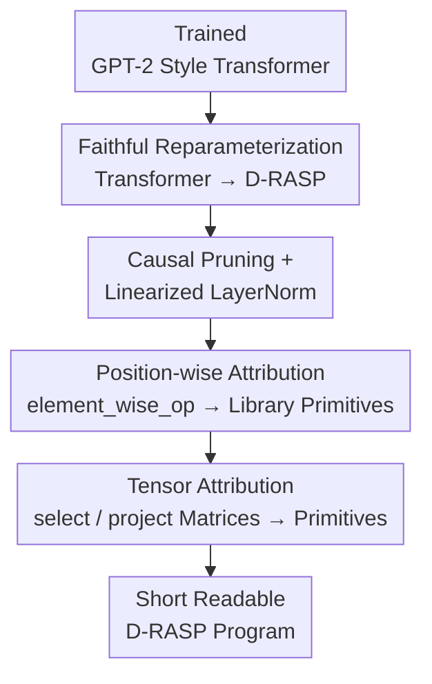

# Discovering Interpretable Algorithms by Decompiling Transformers to RASP

**Conference**: ICML2026  
**arXiv**: [2602.08857](https://arxiv.org/abs/2602.08857)  
**Code**: https://github.com/lacoco-lab/decompiling_transformers  
**Area**: Interpretability / Mechanistic Interpretability  
**Keywords**: RASP, Decompilation, Causal Intervention, Length Generalization, Transformer Mechanisms

## TL;DR
This paper proposes a "decompilation" pipeline that **faithfully** rewrites a trained GPT-2 style Transformer into an equivalent RASP program (D-RASP), then prunes it using causal intervention into a **short, readable symbolic algorithm**. Experiments demonstrate the automatic recovery of known algorithms such as histogram mode, induction head copying, and Dyck counting from length-generalizing small models, providing the most direct evidence to date that Transformers indeed implement simple RASP programs internally.

## Background & Motivation

**Background**: Recent theoretical work (Weiss et al.'s RASP language and its dialects) has proven that Transformer computation can be simulated by the RASP family of languages. This led to a core proposition: "short programs imply robust generalization"—if a task has a short RASP program, a Transformer trained on short inputs can generalize to longer ones (the RASP Length Generalization Conjecture).

**Limitations of Prior Work**: Theory only proves that Transformers **can** implement RASP-style computation (existence and expressivity), but does not prove that **trained models actually do so in a human-readable manner**. Existing interpretability methods (e.g., circuit discovery) find sparse computation graphs supporting a behavior, but produce "circuits" rather than "programs." These circuits are typically bound to specific input lengths and templates, failing to provide a **unified algorithm** for all lengths. Lindner et al. (2023) performed forward RASP→Transformer compilation, but the **inverse problem** (recovering compact symbolic programs from trained Transformers) remained open.

**Key Challenge**: The gap in the length generalization conjecture is exactly what needs validation—if successful length-generalizing models work because they implement a short RASP program internally, researchers should be able to **extract and read that program**. However, the "natural" translation provided by expressivity proofs scales **exponentially** with depth (too many paths in the residual stream) and is unreadable.

**Goal**: To provide a general method for extracting truly readable RASP-style algorithms from trained Transformers and to verify the link: "Length Generalization ⇔ Internal Simple Program."

**Key Insight**: Reframe the interpretability problem as a **program decompilation** problem—first translate losslessly into a program (ensuring identical behavior), then use causal intervention to find a **minimal sufficient sub-program**.

**Core Idea**: Reparameterize-and-simplify. Define a dialect, D-RASP, whose primitives mirror Transformer computation but whose intermediate variables reside in **interpretable bases** such as tokens or positions. Translate the model losslessly into this dialect, then prune and replace components with simple library primitives.

## Method

### Overall Architecture
The method takes a GPT-2 style Transformer with absolute position encoding (viewed as a length-preserving function mapping length $N$ sequences to next-token logits) and outputs a short, readable D-RASP program that maintains **predictive consistency** with the original model. The pipeline consists of two steps: Step 1 **faithfully translates** the Transformer into a behaviorally equivalent (but exponentially large) D-RASP program. Step 2 uses causal intervention to **prune and simplify** this program into a few lines of readable code, provided the "match accuracy" (proportion of inputs where predictions match the original model) remains $\ge 90\%$.

D-RASP is a RASP dialect featuring four primitive types: `select` (selector, capturing self-attention), `aggregate` (aggregation, corresponding to attention-weighted sums, normalized via softmax to fit Transformers), `element_wise_op` (position-wise operators, capturing MLPs), and `project` (projection to next-token logits). Crucially, its variables reside in **interpretable dimensions**: the program starts with two initial variables `token` (one-hot, dimension $|\Sigma|$) and `pos` (one-hot, dimension $T$). All subsequent variables are generated by operators, allowing any intermediate variable to be read in terms of "which token" or "which position."

### Key Designs

**1. D-RASP Dialect: Readable Intermediate Variables Aligned with C-RASP**

The original RASP dialect does not perfectly align with Transformer semantics, and variables in abstract space are difficult to interpret. D-RASP uses softmax for aggregation (consistent with Transformers), supporting both non-uniform attention and attention over unbounded positions. By forcing initial variables `token` and `pos` onto one-hot bases, any derived variable can be visualized along token/position dimensions. The aggregation semantic is:

$$v(i)=\sum_{j\le i} a_{i,j}\,w(j),\qquad a_{i,s}=\frac{\exp\big(\sum_p \alpha_p(i,s)\big)}{\sum_{s'\le i}\exp\big(\sum_p \alpha_p(i,s')\big)}$$

where the selector score is $\alpha(i,s)=v_q(i)^\top A\,v_k(s)$. Theorem 2.1 proves that by disabling `pos`, adding rationality constraints to tensor parameters, and applying $p$-bit rounding to outputs, a D-RASP fragment is **strictly equivalent to C-RASP**—a dialect linked to length generalization. This connects readable programs directly to length generalization theory.

**2. Faithful Reparameterization (Step 1): Expanding Residual Streams as Program Variables**

To translate continuous tensor computation into a symbolic program without changing input-output behavior, this work relies on a **Linear LayerNorm Assumption (LLNA)**: each LayerNorm can be approximated by a linear mapping with constant parameter $\gamma'$, i.e., $\dfrac{x-\bar x}{\sqrt{\sigma^2(x)+\epsilon}}\gamma+\beta \Rightarrow (x-\bar x)\gamma'+\beta$. This holds empirically for length-generalizing models. Under LLNA (Theorem 3.2), a GPT-2 Transformer has a D-RASP program that defines the same mapping. Input layers are written as $E\,\text{token}+P\,\text{pos}$; each attention head defines four selectors $\alpha_{h}$ based on token/pos key-query combinations, aggregating into variables $v_{\langle\text{pos}\rangle}, v_{\langle\text{tok}\rangle}$. Residual streams at any layer are written as linear combinations $\sum_i C_i v_i$. The resulting program scales **exponentially** with depth, necessitating Step 2.

**3. Causal Pruning + Position-wise Attribution (Step 2): Compressing Programs**

This step converts "faithful but unreadable" programs into "readable" ones through three interleaved sub-steps: (2.1) **Causal Pruning**: For each `aggregate`, the selector is replaced with 0 or a key-only selector; for `element_wise_op`, inputs are removed. Trainable gates with KL divergence and sparsity penalties are used to delete causal-irrelevant edges. LayerNorm is linearized using trained $\gamma'$. Multi-stage expansion-pruning is used to manage the exponential size. (2.2) **Position-wise Attribution**: Multi-input `element_wise_op` are split into sums of single-input operators, then replaced with library primitives (e.g., identity `no-op`, hard-max) via closed-form fitting $\lVert v-Cw\rVert_F^2$. (2.3) **Tensor Attribution**: Matrices $A, b$ in `select`/`project` are replaced with primitives (e.g., $k==q$ identity) or optimized into sparse integer matrices. The threshold is always match accuracy $\ge 90\%$.

### A Example: Recovering "Induction Head Copying"
For the UNIQUE COPY task (`BOS 1 3 4 2 SEP` → `1 3 4 2 EOS`), the decompiled program has only 6 lines: ① `s1 = select(q=pos, k=pos, op=(k==q-1))` shifts the position; ② `a1 = aggregate(s1, token)` stores the "previous token"; ③ `s2 = select(q=token, k=a1, op=(k==q), special=(k==BOS))` finds where the "previous token equals current token"; ④ `a2 = aggregate(s2, token)` retrieves the token at that position; ⑤⑥ Projection to logits with a bias towards `EOS`. This **automatically** recovers the well-known **induction head** motif without manual circuit construction.

## Key Experimental Results

### Main Results
Decompilation was performed on small GPT-2 style models (1-layer/4-heads to 4-layer/4-heads) trained on algorithmic tasks. The core conclusion: "Length Generalization ⇔ Ability to recover a simple program."

| Task | Recovered Algorithm (Program Motif) | Corresponding Known Hypothesis |
|------|--------------------------|--------------|
| MOST FREQUENT | Histogram-style majority (aggregate token freq → argmax) | cf. Weiss et al. 2021 |
| UNIQUE COPY | Induction head copy (bigram → retrieve next token) | Olsson 2022 / Zhou 2024 |
| SORT | Select based on token magnitude then aggregate | — |
| Bounded-depth Dyck | Parenthesis counting | Yao 2021 / Wen 2023 |

### Ablation Study

| Model Category | LLNA Status | Decompilation Success (Match Acc $\ge 90\%$, Short/Readable) |
|----------|----------------|-----------------------------------------------|
| Length-Generalizing Models | Tends to hold | Success: Compact programs matching theoretical hypotheses. |
| Non-Generalizing Models | Tends not to hold| Failure: Cannot be compressed into readable programs. |

### Key Findings
- **Length generalization is the watershed for decompilation**: Generalizing models can be compressed into short programs matching known motifs (histograms, induction heads). Non-generalizing models fail simplification, suggesting reliance on entangled, non-programmatic mechanisms.
- **Match Accuracy $\ge 90\%$ is a hard constraint**: Since pruning/replacement must match original predictions, the recovered algorithms are causally sufficient sub-programs, not post-hoc stories.
- **D-RASP↔C-RASP equivalence** (under rounding) provides empirical support for the "short program ⇒ generalization" theory from the inverse direction.

## Highlights & Insights
- **Interpretability as Decompilation**: The two-step "translate then prune" approach avoids the limitations of circuit discovery, which binds to specific lengths. The output is a universal algorithm.
- **Variables on Interpretable Bases**: D-RASP forces variables onto token/position one-hot bases, ensuring every variable can be "read" via plots.
- **LLNA as a Pivotal Hypothesis**: It is both a technical prerequisite for translation and a property that naturally emerges in length-generalizing models.
- **Improved LogitLens**: When attributing position-wise operators, the method considers effects across downstream paths, avoiding the bias of ignoring side-paths in standard LogitLens.

## Limitations & Future Work
- **Architecture Constraints**: Restricted to GPT-2 style models with absolute PE; modern LLMs using RoPE are not yet covered.
- **Scalability**: Tested on small models. Step 1's exponential program growth remains a bottleneck for larger models.
- **Dependence on LLNA**: Linear LayerNorm is an approximation requiring training or fine-tuning; the method degrades if LLNA does not hold.
- **Outlook**: Extending D-RASP to relative position encodings and improving pruning scalability are key to applying this to real-world LLMs.

## Related Work & Insights
- **vs. Circuit Discovery (e.g., ACDC)**: These find sparse computation graphs for specific lengths/templates. This work finds cross-length symbolic programs and uses causal pruning to ensure sufficiency.
- **vs. Tracr / Lindner et al. (2023)**: They perform forward compilation (handwriting programs to generate weights). This work performs the inverse, filling an open gap.
- **vs. C-RASP Theory**: While theory argues "short program ⇒ generalization," this work provides empirical proof by extracting programs from trained models.

## Rating
- Novelty: ⭐⭐⭐⭐⭐ First general method to decompile trained Transformers into readable RASP programs.
- Experimental Thoroughness: ⭐⭐⭐⭐ Solid evidence on algorithmic tasks; limited by the absence of natural language/large model validation.
- Writing Quality: ⭐⭐⭐⭐⭐ Clear presentation of theorems and the two-step pipeline with visualizations.
- Value: ⭐⭐⭐⭐⭐ Significant progress in mechanistic interpretability, providing direct evidence for the length generalization conjecture.

<!-- RELATED:START -->

## Related Papers

- [\[ICML 2026\] Discovering Differences in Strategic Behavior Between Humans and LLMs](discovering_differences_in_strategic_behavior_between_humans_and_llms.md)
- [\[ICML 2026\] Discovering Implicit Large Language Model Alignment Objectives](discovering_implicit_large_language_model_alignment_objectives.md)
- [\[CVPR 2025\] Prompt-CAM: Making Vision Transformers Interpretable for Fine-Grained Analysis](../../CVPR2025/interpretability/prompt-cam_making_vision_transformers_interpretable_for_fine-grained_analysis.md)
- [\[ICML 2026\] Cognitive Fatigue in Autoregressive Transformers: Formalization and Measurement](cognitive_fatigue_in_autoregressive_transformers_formalization_and_measurement.md)
- [\[AAAI 2026\] Finding the Translation Switch: Discovering and Exploiting the Task-Initiation Features in LLMs](../../AAAI2026/interpretability/finding_the_translation_switch_discovering_and_exploiting_the_task-initiation_fe.md)

<!-- RELATED:END -->
