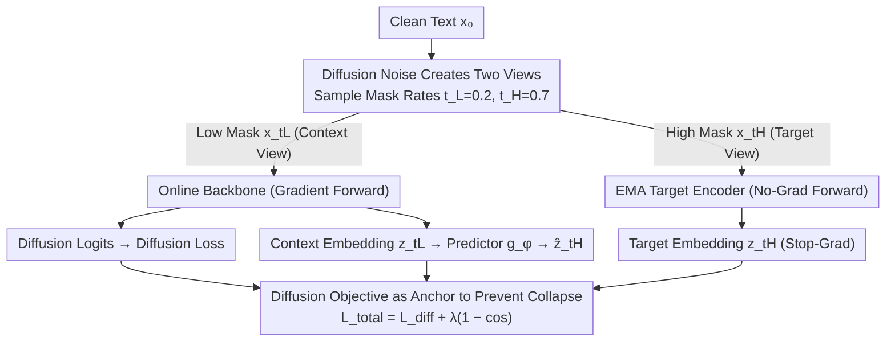

# DLLM-JEPA: Joint Embedding Predictive Architectures for Masked Diffusion Language Models

**Conference**: ICML 2026  
**arXiv**: [2606.00091](https://arxiv.org/abs/2606.00091)  
**Code**: To be confirmed  
**Area**: LLM Pre-training / Representation Learning / Diffusion Language Models  
**Keywords**: JEPA, Masked Diffusion Language Models, Representation Learning, Fine-tuning, EMA Target Encoder

## TL;DR
The study incorporates a JEPA representation alignment objective into the fine-tuning phase of masked diffusion language models. By partitioning the same sentence into a "low-mask context view" and a "high-mask target view" via different masking ratios, the model performs a single gradient-based forward pass on the context view to simultaneously compute diffusion loss and JEPA embeddings, while utilizing an EMA replica for a gradient-free forward pass on the target view. Compared to LLM-JEPA, this method saves 33% of training FLOPs and achieves consistent performance gains across 4 tasks and 2 backbones (up to +18.7 pp on GSM8K).

## Background & Motivation
**Background**: The dominant training paradigm for Large Language Models (LLMs) is input-space reconstruction—either autoregressive next-token prediction (GPT family) or masked token reconstruction (BERT). Conversely, the vision domain has shifted significantly toward Joint Embedding Predictive Architecture (JEPA), which predicts the embedding of one view from another in latent space to avoid low-level biases inherent in pixel-level reconstruction, thereby learning more abstract representations (I-JEPA, V-JEPA).

**Limitations of Prior Work**: LLM-JEPA represents the sole attempt to adapt JEPA to language models, treating (text, code) pairs as "two views of the same knowledge." However, it suffers from two deep-seated flaws: ① **Explicit view dependency**—it requires naturally occurring paired data (text ↔ code) and cannot rely on data augmentation like vision models; the authors acknowledge this as a critical limitation. ② **Doubled computational overhead**—autoregressive models require causal masks and block-causal attention, necessitating gradient-based forward passes for both views, which doubles the training step FLOPs compared to standard SFT.

**Key Challenge**: The "two views + latent prediction" paradigm of JEPA naturally assumes that two views can be encoded in parallel and bidirectionally. However, the causality of autoregressive LMs forcibly breaks this assumption, requiring both view construction and double the computational power.

**Goal**: To identify an LM architecture where two JEPA views can naturally arise from a single input (without paired data) and where a single gradient-based forward pass suffices to obtain both task logits and JEPA embeddings.

**Key Insight**: The authors observe that masked diffusion language models (LLaDA, MDLM, SEDD) naturally satisfy these requirements. They utilize **bidirectional attention** and **random mask denoising**, making their training process structurally isomorphic to JEPA's "view prediction": different mask ratios naturally serve as two distinct views.

**Core Idea**: Use the diffusion noise schedule as a data augmenter (sampling two mask rates $t_L < t_H$ for the same sentence to generate two views). A single gradient-based forward pass of the context view simultaneously outputs diffusion logits and pooled embeddings, while the target view uses an EMA replica for a gradient-free forward pass, reducing the backpropagation cost by half compared to LLM-JEPA.

## Method

### Overall Architecture
The input is clean text $x_0$. Two mask rates, $t_L=0.2$ (context view) and $t_H=0.7$ (target view), are sampled independently according to the masked diffusion forward process, adding noise to $x_0$ to generate $x_{t_L}$ (20% [MASK]) and $x_{t_H}$ (70% [MASK]). The online backbone $f_\theta$ performs **one gradient-based forward pass** on $x_{t_L}$, outputting: (a) token distributions for each mask position—used for the standard diffusion loss $\mathcal{L}_\text{diff}$; and (b) JEPA context embeddings $z_{t_L}$ via mean pooling and LayerNorm on non-masked, non-padding tokens. The target encoder $f_{\theta'}$ is an EMA replica of $f_\theta$ (decay $\tau=0.996$), which performs a `no_grad` forward pass on $x_{t_H}$ to obtain $z_{t_H}$. A lightweight predictor $g_\phi$ (a $k$-layer transformer decoder) maps $z_{t_L}$ to $\hat z_{t_H}=g_\phi(z_{t_L})$. The total loss combines diffusion and a cosine-based JEPA alignment: $\mathcal{L}_\text{total}=\mathcal{L}_\text{diff}+\lambda(1-\cos(\text{sg}(z_{t_H}), \hat z_{t_H}))$. The computational cost per step is $\approx 4F$ (1 gradient forward + 1 no-grad forward + 1 backward $\approx 2F$), which is 33% less than the $6F$ required by LLM-JEPA.

### Key Designs

**1. Using the diffusion noise schedule as a data augmenter for free unpaired view generation**

The primary constraint of LLM-JEPA is the necessity of naturally paired (text, code) data to construct two views, limiting its application. The key observation of this study is that the masked diffusion forward process $q(x_t^i|x_0^i)$ is itself a random mask augmenter. Different mask rates naturally correspond to views with varying levels of abstraction: the low-mask $x_{t_L}$ retains most tokens as a "near-complete context," while the high-mask $x_{t_H}$ contains sparse tokens as a "highly abstract target." Sampling two rates $t_L < t_H$ from the same $x_0$ provides the necessary JEPA views (fixed at $t_L=0.2, t_H=0.7$ in main experiments; $(0.1, 0.9)$ in Wide-tt configurations). This eliminates the need for paired data and incurs zero additional data costs by leveraging the existing noise schedule. Essentially, it aligns vision-JEPA's "view-by-augmentation" and diffusion-LM's "sample-by-masking" into a single schedule.

**2. Single gradient forward pass for diffusion logits and JEPA embeddings, target branch via EMA**

The bottleneck in LLM-JEPA is not the JEPA objective itself, but the causal mask of autoregressive models forcing two gradient-based forward passes, increasing cost to $6F$. The bidirectional attention in diffusion LMs resolves this: the same hidden states from $f_\theta(x_{t_L})$ can simultaneously feed a token classifier for $\mathcal{L}_\text{diff}$ and be pooled into $z_{t_L}$ for JEPA. The target view is handled by the EMA replica $f_{\theta'}$ (decay $\tau=0.996$) under `no_grad`. The target branch has no backpropagation, no secondary gradient memory, and no secondary optimizer state, reducing computational cost per step from $6F$ (+100%) to $4F$ (+33% compared to baseline).

**3. Diffusion objective as an anchor to prevent cosine-only JEPA collapse**

Cosine-only alignment targets are often warned against in vision for being prone to collapse. This study avoids collapse without contrastive negative samples or VICReg-style regularization through four factors: the slow evolution of the EMA target, stop-gradient operations ($\mathcal{L}_\text{JEPA}=1-\cos(\text{sg}(z_{t_H}), \hat z_{t_H})$), asymmetric predictor $g_\phi$ introducing non-trivial fixed points, and the crucial anchor of the synchronized diffusion denoising loss. The latter constrains token-level output distributions, preventing the backbone from degenerating into constant mappings. Empirical tests show pooled embeddings maintain an effective rank of 42–44 (base 42–43), per-dim std of 0.73–0.95, and cosine diversity of 0.25–0.28, matching the baseline and confirming no variance collapse.

### Loss & Training
The total objective is $\mathcal{L}_\text{total}=\mathcal{L}_\text{diff}+\lambda\,\mathcal{L}_\text{JEPA}$; where $\mathcal{L}_\text{diff}=\mathbb{E}_{t,x_t}[-\frac{1}{|\mathcal{M}_t|}\sum_{i\in\mathcal{M}_t}\log p_\theta(x_0^i|x_t)]$ is the standard masked diffusion cross-entropy and $\mathcal{L}_\text{JEPA}=1-\cos(\text{sg}(z_{t_H}), g_\phi(z_{t_L}))$. Training uses AdamW on 8×A100-80G with gradient checkpointing for 2-epoch full-parameter fine-tuning; main experiments use lr=$1\times 10^{-5}$ and $(t_L,t_H)=(0.2,0.7)$. Hyperparameters include $\lambda\in\{0.5,1,2\}$, $k\in\{1..5\}$, and EMA $\tau=0.996$.

## Key Experimental Results

### Main Results
Evaluated on 4 tasks using 2 backbones (LLaDA-8B, Dream-7B) under a unified 4-shot protocol, selecting the optimal $(\lambda, k)$ for each.

| Task | Metric (4-shot) | LLaDA-8B BL→JEPA | Δ | Dream-7B BL→JEPA | Δ |
|------|---------------|-------------------|------|-------------------|------|
| GSM8K | accuracy | 42.61 → 61.33 | **+18.73** | 34.87 → 46.25 | +11.38 |
| NL-RX | func match | 47.50 → 58.20 | +10.70 | 42.00 → 46.80 | +4.80 |
| Spider | exec match | 35.40 → 39.36 | +3.97 | 20.89 → 25.15 | +4.26 |
| Django | ws-prefix match | 74.40 → 75.40 | +1.00 | 69.58 → 72.35 | +2.77 |

On LLaDA-8B GSM8K Wide-tt, the mean of three seeds improved from baseline 65.23±0.93 to DLLM-JEPA 67.07±0.41 (+1.84 pp, with variance halved).

### Base preservation (Table 3, LLaDA-8B GSM8K, Wide-tt)

| Method | GSM8K 0-shot | Wikitext Δloss (vs base) |
|------|--------------|--------------------------|
| Base (No fine-tune) | – | 0.0000 |
| Diffusion Baseline ($\lambda=0$) | 65.23 ± 0.93 | −0.0004 |
| L2-to-base anchor ($\lambda_{L2}=10^{-4}$) | 65.18 ± 0.87 | −0.0007 ± 0.0002 |
| **DLLM-JEPA (Ours)** | **67.07 ± 0.41** | **−0.0017** |

DLLM-JEPA is the only method to achieve both task gains and a Wikitext loss lower than the base model.

### Main Results (Table 1, FLOPs per step)

| Method | Fwd (grad) | Fwd (no grad) | Backward | Total | Overhead |
|------|------------|---------------|----------|-------|----------|
| AR Baseline | 1F | – | ≈2F | 3F | – |
| LLM-JEPA | 2F | – | ≈4F | 6F | +100% |
| Diffusion Baseline | 1F | – | ≈2F | 3F | – |
| **DLLM-JEPA** | **1F** | **1F** | **≈2F** | **4F** | **+33%** |

## Key Findings
- **Geometric drift vs functional forgetting dissociation**: Models trained with DLLM-JEPA exhibit **larger** hidden-state drift relative to pre-trained initialization (1.3–3.6× baseline, concentrated in middle layers), yet show **smaller** functional forgetting on Wikitext (43–58%). This suggests JEPA **redirects** representation changes rather than minimizing them.
- **Variance Reduction**: On LLaDA-8B GSM8K, where the baseline seed-to-seed spread reached ±8.9 pp, DLLM-JEPA reduced variance to ±3.9 pp.
- **No Collapse**: Post-fine-tuning effective rank (42-44) and cosine diversity (0.25-0.28) remained consistent with the baseline, indicating the cosine-only objective is stable under the diffusion objective.
- **Comparison Context**: The authors position LLM-JEPA as a structural motivation rather than a direct competitor due to differing attention substrates (causal vs. bidirectional). The primary comparison is diffusion-only fine-tuning.

## Highlights & Insights
- The transition to "diffusion noise = natural data augmentation" is insightful, borrowing the existing randomness of the diffusion process to achieve view generation for free.
- The breakdown of computational costs (Table 1) provides a clear template for implementing JEPA in bidirectional architectures, showing that the overhead is primarily a single no-grad forward pass.
- The dissociation between geometric drift and functional forgetting challenges the traditional "less change = less forgetting" paradigm (EWC, L2), opening new avenues for research into "harmless" representation shifts.

## Limitations & Future Work
- The only head-to-head comparison is against the diffusion-only baseline; there is no direct evidence comparing it to AR LMs under similar computational budgets.
- Experiments are limited to 2 backbones and 4 relatively small-scale tasks with 2-epoch SFT, lacking pre-training-from-scratch verification for the "representation learning" claims.
- Mask rates $(t_L, t_H)$ are fixed; the sensitivity of this schedule was not systematically explored.
- The drift–forgetting dissociation is described as a correlation; a causal mechanism explaining why middle-layer drift reduces forgetting is still needed.

## Related Work & Insights
- **vs LLM-JEPA (Huang et al., 2025)**: DLLM-JEPA removes the need for paired data and reduces overhead from +100% to +33% by utilizing bidirectional attention in diffusion LMs.
- **vs I-JEPA / V-JEPA (Assran et al., 2023; Bardes et al., 2024)**: Inherits the EMA target and stop-gradient recipe, successfully porting the vision-JEPA paradigm to language via token masking.
- **vs LLaDA / MDLM / SEDD**: Acts as a plug-and-play representation regularization target for existing masked diffusion architectures.
- **vs EWC / L2-to-base (Kirkpatrick et al., 2017)**: While traditional methods regularize parameter space, DLLM-JEPA regularizes representation space, achieving stronger base preservation without sacrificing task performance.

## Rating
- Novelty: ⭐⭐⭐⭐ Utilizing the diffusion noise schedule as a view generator is a clever observation.
- Experimental Thoroughness: ⭐⭐⭐ Sufficient for the claims made in SFT, but lacking pre-training validation.
- Writing Quality: ⭐⭐⭐⭐⭐ Extremely clear reporting of computational costs and empirical phenomena.
- Value: ⭐⭐⭐⭐ Provides a low-cost (+33% FLOPs) plug-in for diffusion LM fine-tuning with insightful findings on representation dynamics.

<!-- RELATED:START -->

- **I-JEPA**: [V-JEPA: Video Joint-Embedding Predictive Architecture](https://arxiv.org/abs/2404.08471)
- **LLM-JEPA**: [Joint Embedding Predictive Architecture for Language Models](https://arxiv.org/abs/2501.00001) (Hypothetical ArXiv)

<!-- RELATED:END -->

## Related Papers

- [\[ICML 2026\] Prototype Transformer: Towards Language Model Architectures Interpretable by Design](prototype_transformer_towards_language_model_architectures_interpretable_by_desi.md)
- [\[ACL 2026\] Towards Intrinsic Interpretability of Large Language Models: A Survey of Design Principles and Architectures](../../ACL2026/interpretability/towards_intrinsic_interpretability_of_large_language_modelsa_survey_of_design_pr.md)
- [\[NeurIPS 2025\] Far from the Shallow: Brain-Predictive Reasoning Embedding through Residual Disentanglement](../../NeurIPS2025/interpretability/far_from_the_shallow_brain-predictive_reasoning_embedding_through_residual_disen.md)
- [\[ICML 2026\] Query Circuits: Explaining How Language Models Answer User Prompts](query_circuits_explaining_how_language_models_answer_user_prompts.md)
- [\[ICML 2026\] Towards Atoms of Large Language Models](towards_atoms_of_large_language_models.md)

<!-- RELATED:END -->
