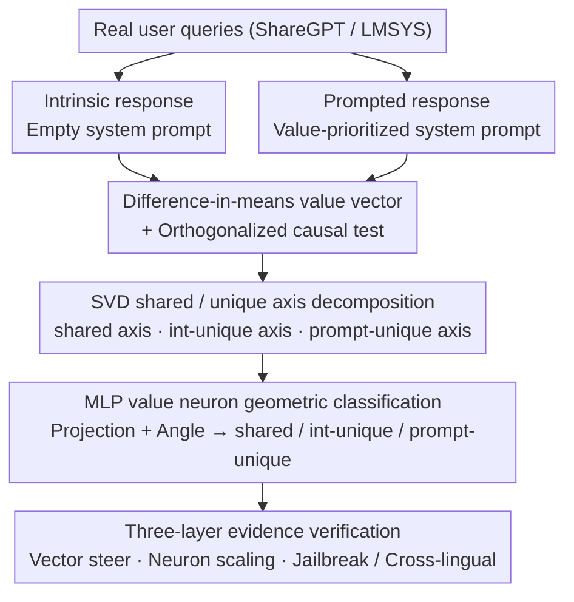

# Dual Mechanisms of Value Expression: Intrinsic vs. Prompted Values in Large Language Models

**Conference**: ICML 2026  
**arXiv**: [2509.24319](https://arxiv.org/abs/2509.24319)  
**Code**: https://github.com/holi-lab/ValueMechanism (Available)  
**Area**: Interpretability / Mechanistic Interpretability / Value Alignment  
**Keywords**: Value vectors, value neurons, Schwartz basic values, residual stream direction, instruction following

## TL;DR
This paper uses difference-in-means to extract "intrinsic" (no system prompt) and "prompted" (with value-prioritized system prompts) directions for 10 Schwartz values within the residual stream. By decomposing these pairs into shared and unique axes using SVD, the authors provide causal evidence at both the vector level and MLP neuron level: the shared component carries true value semantics, generalizes across languages, and recovers the Schwartz circumplex structure; the intrinsic-unique component contributes to lexical and semantic diversity; and the prompted-unique component encodes a value-independent "general instruction-following" channel, which can directly increase jailbreak attack success rates from 13%–27% to 83%–97%.

## Background & Motivation
**Background**: Current mainstream multi-value alignment follows two paths: preference learning (RLHF / DPO), which bakes fixed value biases into weights (corresponding to *intrinsic value expression*); and inference-time system prompting ("Please prioritize cultural traditions"), corresponding to *prompted value expression*. Both approaches are widely used, but researchers typically choose between them based on intuition.

**Limitations of Prior Work**: Existing literature on activation engineering either extracts directions only in prompted settings (Su et al. 2025) or only in intrinsic settings (Jin et al. 2025). The relationship between these two types of directions has never been systematically compared—specifically, whether they represent different entry points to the same mechanism or two independent circuits within the model. This directly impacts the interpretability and safety of alignment methods.

**Key Challenge**: Intuitively, a prompt should trigger existing intrinsic values, suggesting the use of the same circuit. However, empirical observations show that prompted responses often appear "forced and unnatural" (Shao et al. 2023; Malik et al. 2024), implying the inclusion of non-value components. Without clear distinction, interventions based on value directions will entangle "value" with "compliance."

**Goal**: This work aims to answer at both the residual stream direction and MLP neuron levels: (1) how much these two mechanisms overlap; (2) whether the overlap represents true value semantics; and (3) what specific functions the unique components perform.

**Key Insight**: Building on the linear representation hypothesis, the 10 universal values proposed by Schwartz are treated as linear subspaces in the residual stream. Directions are extracted under both intrinsic and prompted conditions using the same set of prompts. SVD is then used to decompose paired directions into "shared + unique" components, which are subsequently attributed to specific neurons by projecting them onto MLP output columns.

**Core Idea**: By treating the paired (intrinsic, prompted) value directions as a 2D subspace and using Singular Value Decomposition to explicitly separate the "shared semantic axis" from the "difference axis," the paper allows vector-level interventions (direction orthogonalization) and neuron-level interventions (neuron sets categorized by angle) to corroborate each other.

## Method

### Overall Architecture
This paper investigates whether prompt-triggered value expression and intrinsic value expression utilize the same circuit by packaging each pair of directions into a single geometric object for decomposition. All analyses center on a (value $s$, layer $\ell$, expression type $e\in\{\text{int},\text{prompt}\}$) tuple. The process involves extracting residual stream directions under empty system prompts (intrinsic) and value-prioritized system prompts (prompted), decomposing them via SVD into shared and unique axes, and attributing these directions to specific MLP neurons. The backbone model is Qwen2.5-7B-Instruct, with robustness checks extended to Qwen2.5-1.5B/32B, Llama-3.1-8B-Instruct, Gemma2-9b-it, and Qwen3-8B/14B.

### Key Designs

**1. Difference-in-means value vector + Orthogonalized causal test: Compressing value expression into a direction and testing substitutability**

To compare the two mechanisms, "value expression" is first converted into an operable object. Starting from 26,334 real user queries (ShareGPT/LMSYS), responses are generated under two conditions: empty system prompts for intrinsic expression, and randomly sampled value-prioritized prompts (from 500 GPT-4o-mini templates) for prompted expression. Responses are binary-classified by GPT-4o-mini into "expressing the value $R_{\text{exp}}$" and "not expressing the value $R_{\text{unexp}}$." For each response, the token average is taken $\bar a^\ell(r)=\frac{1}{|r|}\sum_t a^\ell_t(r)$. The value vector is the difference between group means: $v^\ell=\frac{1}{|R_{\text{exp}}|}\sum_{r\in R_{\text{exp}}}\bar a^\ell(r)-\frac{1}{|R_{\text{unexp}}|}\sum_{r\in R_{\text{unexp}}}\bar a^\ell(r)$. Difference-in-means is used as it is theoretically a worst-case optimal concept editing direction (Belrose 2023), and averaging across diverse prompts cancels out prompt-specific noise.

The "oneness" of the mechanisms is tested via orthogonalization: the intrinsic direction is stripped of its projection onto the prompted direction $v^\ell_{s,\text{int}(\perp\text{prompt})}=v^\ell_{s,\text{int}}-\frac{\langle v^\ell_{s,\text{int}},\,v^\ell_{s,\text{prompt}}\rangle}{\langle v^\ell_{s,\text{prompt}},\,v^\ell_{s,\text{prompt}}\rangle}\,v^\ell_{s,\text{prompt}}$. If the remaining unique component can still steer the model, the mechanisms are distinct. Interventions use activation addition $(a^\ell_t)^*=a^\ell_t+\alpha v^\ell_{s,e}$, with $\alpha$ capped by a safety constraint (MMLU drop < 5 points; $\alpha=4$ for Qwen2.5-7B).

**2. SVD shared/unique axis decomposition: Identifying consensus and opposition within a 2D subspace**

Orthogonalization identifies what remains when the other component is removed, but does not identify the "consensus axis." To decouple shared and difference components, paired directions are concatenated into a matrix $V^\ell_s=[v^\ell_{s,\text{int}},\,v^\ell_{s,\text{prompt}}]$ and decomposed via SVD: $V^\ell_s=U\Sigma R^\top$. The first left singular vector $u_{\text{shared}}=U[:,1]$ captures the direction of maximum variance (consensus), while the second $u_{\text{diff}}=U[:,2]$ captures the difference. The difference axis is oriented as $u_{\text{int}}$ based on the sign of $\langle u_{\text{diff}},\,v^\ell_{s,\text{int}}-v^\ell_{s,\text{prompt}}\rangle$, with $u_{\text{prompt}}=-u_{\text{int}}$.

**3. MLP value neuron geometric classification: Mapping directions to specific units**

To attribute directions to specific neurons, this work utilizes the property that MLP residual updates in pre-LayerNorm Transformers can be written as a sum of rank-1 updates $\Delta x^\ell=\sum_i \sigma(\langle x^\ell, w^\ell_{\text{in},i}\rangle)\,w^\ell_{\text{out},i}$. Each neuron's output column $w^\ell_{\text{out},i}$ is projected onto the 2D value subspace $p_i=\text{Proj}_{S^\ell_s}(w^\ell_{\text{out},i})$. Reliability is scored by the projection norm $\|p_i\|_2$ (retaining top $k\%$). Neurons are categorized as shared, intrinsic-unique, or prompted-unique based on the smallest angle $\theta(p_i,u)=\arccos\!\big(\langle p_i,u\rangle/(\|p_i\|_2\|u\|_2)\big)$ to the reference axes, provided the angle is $<30°$. Neuron-level interventions involve scaling selected units by $\beta>1$. Outcomes are cross-referenced with automated neuron explanations (Bills et al. 2023).

## Key Experimental Results

### Main Results
Evaluation covers PVQ-40 / PVQ-RR (6-point scale), free-form PVQ-40 (GPT-4o 0–10 score), situational dilemmas (GPT-4o-mini win rate), and Value Portrait. It includes cross-lingual (en/zh/es/fr/ko) and jailbreak (HarmBench, AdvBench) verification.

| Dataset | Metric | Intrinsic | Prompted | Intrinsic⊥ | Prompted⊥ |
|--------|------|-----------|----------|-----------|-----------|
| PVQ 6-point (5-lang avg) | Score Gain | +1.74 | +2.21 | +0.47 | +1.62 |
| Free-form PVQ 10-point | Score Gain | +0.98 | +1.04 | +0.48 | +0.52 |
| AdvBench (Llama-3.1-8B) | ASR@9 | — | 13.3% | — | **97.2%** (steer via mean delta) |
| HarmBench (Llama-3.1-8B) | ASR@9 | — | 23.8% | — | **90.4%** |
| AdvBench (Qwen2.5-7B) | ASR@9 | — | 27.0% | — | **89.0%** |
| HarmBench (Qwen2.5-7B) | ASR@9 | — | 52.4% | — | **83.0%** |

Value vectors extracted in English generalize to other languages with moderate performance decay. Procrustes alignment of the PCA(shared axes) recovers the Schwartz circumplex with $R^2\approx 0.6$–$0.7$ across higher-order domains.

### Ablation Study

| Configuration | Key Metric | Description |
|------|---------|------|
| Intrinsic full direction | Distinct-2 0.362 | Reference for high lexical/semantic diversity |
| Prompted full direction | Distinct-2 0.342 | Narrower vocabulary focused on typical keywords |
| Intrinsic ⊥ Prompted | Distinct-2 **0.402** | Diversity increases after removing shared components |
| Prompted ⊥ Intrinsic | Distinct-2 0.203 | Diversity plummets but steering remains strong |
| Shared neuron scaling | PVQ Gain > Unique | Shared neurons are the primary causal drivers |
| Mean delta direction | Explains 48–68% variance | Reveals a value-agnostic "general compliance" channel |

### Key Findings
- **Shared Component = True Value Semantics**: Scaling shared neurons alone improves PVQ scores. PCA of shared axes recovers the Schwartz circumplex (e.g., Benevolence is opposite to Achievement), which does not hold for difference axes.
- **Intrinsic Unique = Diversity**: Intrinsic vectors produce higher entropy token distributions in unembedding projections. Intrinsic-unique neurons activate in contexts like "personal projects" that imply values without explicitly stating them, leading to more natural responses.
- **Prompted Unique = Instruction Following, Not Values**: Prompted-unique neurons are triggered by system prompt keywords (e.g., "warning"). The 10 delta directions are highly collinear. Steering along their mean direction increases jailbreak ASR from 13.3% to 97.2% (AdvBench) on Llama. This direction amplifies existing compliance rather than creating new capabilities.

## Highlights & Insights
- **Geometric Controlled Experiments**: Packaging intrinsic/prompted pairs into a 2D subspace and using dual SVD/orthogonalization transforms conceptual questions into falsifiable causal experiments.
- **Hidden Channels via Aggregation**: Individual delta directions look value-specific, but cross-value averaging reveals a collinear "compliance" axis, warning against mistaking "system prompt effects" for "conceptual semantics."
- **New Perspective on Jailbreaking**: While prior work attributes jailbreaking to the suppression of "refusal directions," this work provides a dual view: jailbreaking can also be caused by the amplification of a universal "prompt compliance channel" learned during alignment.

## Limitations & Future Work
- Evaluation relies on Schwartz's 10 categories, which may not capture the continuous real-world value spectrum. Systemic biases may exist in LLM-as-a-judge evaluations.
- Attribution relies on rank-1 decomposition of pre-LayerNorm Transformers; applicability to MoE architectures is unverified.
- While shared components recover the Schwartz circumplex, the $R^2$ suggests significant unexplained structure.
- Future work could observe the formation of these directions during RLHF or regularize the compliance channel vs. value directions during training to reduce jailbreak risks.

## Related Work & Insights
- **vs. Persona Vectors (Chen et al. 2025)**: Persona vectors extract prompted directions; this work identifies that true semantics actually reside in the shared axes.
- **vs. Refusal-mediated Jailbreak (Arditi et al. 2024)**: This work complements the refusal-suppression theory by demonstrating that compliance-amplification achieves similar ASR.
- **vs. SAE Feature Extraction**: While SAEs provide a dictionary of features, this work explicitly characterizes "mechanistic differences" via SVD, offering a lightweight alternative for interpretability.

## Rating
- Novelty: ⭐⭐⭐⭐ First systematic comparison of intrinsic vs. prompted mechanisms as decomposable geometric objects.
- Experimental Thoroughness: ⭐⭐⭐⭐⭐ Comprehensive coverage across 5 models, 5 languages, and multiple safety/value benchmarks.
- Writing Quality: ⭐⭐⭐⭐ Clear geometric illustrations and structured evidence.
- Value: ⭐⭐⭐⭐⭐ Provides reusable geometric tools for alignment and safety research; the dual view of compliance is highly relevant for red-teaming.

<!-- RELATED:START -->

## Related Papers

- [\[CVPR 2026\] Understanding Counting Mechanisms in Large Language and Vision-Language Models](../../CVPR2026/interpretability/understanding_counting_mechanisms_in_large_language_and_vision-language_models.md)
- [\[ACL 2026\] Towards Intrinsic Interpretability of Large Language Models: A Survey of Design Principles and Architectures](../../ACL2026/interpretability/towards_intrinsic_interpretability_of_large_language_modelsa_survey_of_design_pr.md)
- [\[ACL 2026\] DPN-LE: Dual Personality Neuron Localization and Editing for Large Language Models](../../ACL2026/interpretability/dpn-le_dual_personality_neuron_localization_and_editing_for_large_language_model.md)
- [\[ICML 2026\] Towards Atoms of Large Language Models](towards_atoms_of_large_language_models.md)
- [\[ACL 2026\] Fine-Grained Analysis of Shared Syntactic Mechanisms in Language Models](../../ACL2026/interpretability/fine-grained_analysis_of_shared_syntactic_mechanisms_in_language_models.md)

<!-- RELATED:END -->
