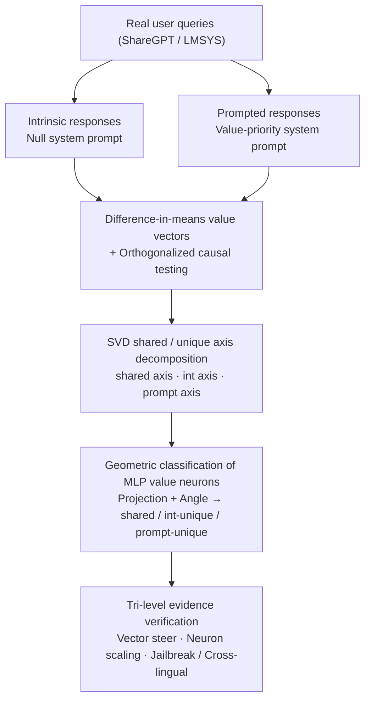

# Dual Mechanisms of Value Expression: Intrinsic vs. Prompted Values in Large Language Models

**Conference**: ICML 2026  
**arXiv**: [2509.24319](https://arxiv.org/abs/2509.24319)  
**Code**: https://github.com/holi-lab/ValueMechanism (Available)  
**Area**: Interpretability / Mechanistic Interpretability / Value Alignment  
**Keywords**: Value vectors, value neurons, Schwartz basic values, residual stream direction, instruction following

## TL;DR
This paper utilizes difference-in-means to extract "intrinsic" (no system prompt) and "prompted" (with value-based system prompts) directions representing 10 Schwartz values in the residual stream. Using SVD, these directions are decomposed into shared and unique axes. Causal evidence at both the vector and MLP neuron levels demonstrates that: the shared component carries true value semantics and generalizes across languages, replicating the Schwartz circumplex structure; the intrinsic-unique component contributes to lexical/semantic diversity; and the prompted-unique component encodes a value-agnostic "universal instruction-following" channel that increases jailbreak attack success rates from 13%–27% to 83%–97%.

## Background & Motivation
**Background**: Current mainstream pluralistic value alignment follows two paths: preference learning (RLHF / DPO) which bakes fixed value biases into weights (corresponding to *intrinsic value expression*), and inference-time system prompting ("Please prioritize cultural traditions"), corresponding to *prompted value expression*. Both approaches are widely used, but researchers typically choose between them based on intuition.

**Limitations of Prior Work**: Existing activation engineering literature either extracts directions only in prompted settings (Su et al. 2025) or only in intrinsic settings (Jin et al. 2025). The relationship between these two types of directions has never been systematically compared—whether they represent different entry points into the same mechanism or independent internal circuits remains unknown. This directly impacts the interpretability and safety of alignment methods.

**Key Challenge**: Intuitively, a prompt should simply trigger pre-existing intrinsic values, suggesting they share the same circuit. However, empirically, prompted responses often appear "over-optimized or unnatural" (Shao et al. 2023; Malik et al. 2024), implying the inclusion of non-value components. Without distinguishing these, value-direction-based interventions entangle "values" with "compliance."

**Goal**: To answer at both the residual stream direction and MLP neuron granularities: (1) how much these two mechanisms overlap; (2) whether the overlap represents true value semantics; and (3) what specific functions the unique components perform.

**Key Insight**: Relying on the Linear Representation Hypothesis, the 10 universal values proposed by Schwartz are treated as linear subspaces in the residual stream. Directions are extracted under both intrinsic and prompted conditions using the same prompt set. SVD is then used to decompose paired directions into "shared + unique" components, which are further attributed to specific neurons by projecting onto MLP output columns.

**Core Idea**: Treat paired (intrinsic, prompted) value directions as a 2D subspace. Use SVD to explicitly separate the "shared semantic axis" from "divergent axes," then validate via vector-level interventions (orthogonalized directions) and neuron-level interventions (neuron sets categorized by angle) to ensure conclusions are derived from the same geometric object.

## Method

### Overall Architecture
Ours addresses whether prompt-triggered value expression and intrinsic model value expression share the same circuit by placing each pair of directions into a single geometric object for decomposition. All analyses revolve around the tuple (value $s$, layer $\ell$, expression type $e\in\{\text{int},\text{prompt}\}$). Value directions are extracted under null system prompts (intrinsic) and value-priority prompts (prompted), decomposed into shared and unique axes via SVD, and attributed to MLP neurons. This allows vector-level, neuron-level, and behavioral evidence to corroborate within the same coordinate system. The backbone model is Qwen2.5-7B-Instruct, with robustness checks extended to Qwen2.5-1.5B/32B, Llama-3.1-8B-Instruct, Gemma2-9b-it, and Qwen3-8B/14B.

### Key Designs

**1. Difference-in-means value vectors + Orthogonalized causal testing: Compressing value expression into a direction and verifying substitutability**

To compare the two mechanisms, the first step is converting the abstract concept of "value expression" into an operable object. Starting from 26,334 real user queries, responses are generated under two conditions: a null system prompt (intrinsic) and a value-priority prompt randomly sampled from 500 GPT-4o-mini augmented templates (prompted). GPT-4o-mini binary classifies responses into "expressing the value $R_{\text{exp}}$" and "not expressing the value $R_{\text{unexp}}$." For each response, the token average $\bar a^\ell(r)=\frac{1}{|r|}\sum_t a^\ell_t(r)$ is computed. The value vector is the difference between group means: $v^\ell=\frac{1}{|R_{\text{exp}}|}\sum_{r\in R_{\text{exp}}}\bar a^\ell(r)-\frac{1}{|R_{\text{unexp}}|}\sum_{r\in R_{\text{unexp}}}\bar a^\ell(r)$. Difference-in-means is chosen as it is theoretically the worst-case optimal concept editing direction (Belrose 2023), and averaging across diverse prompts cancels prompt-specific noise.

The "identity of mechanisms" is tested via orthogonalization: removing the projection of the intrinsic direction onto the prompted direction $v^\ell_{s,\text{int}(\perp\text{prompt})}=v^\ell_{s,\text{int}}-\frac{\langle v^\ell_{s,\text{int}},\,v^\ell_{s,\text{prompt}}\rangle}{\langle v^\ell_{s,\text{prompt}},\,v^\ell_{s,\text{prompt}}\rangle}\,v^\ell_{s,\text{prompt}}$ to see if the unique component still steers effectively. All interventions use activation addition $(a^\ell_t)^*=a^\ell_t+\alpha v^\ell_{s,e}$, where $\alpha$ is capped by a "MMLU drop < 5 points" threshold (e.g., $\alpha=4$ for Qwen2.5-7B).

**2. SVD shared/unique axis decomposition: Identifying consensus and divergent axes in 2D subspace**

Orthogonalization reveals what remains after removing the counterpart but does not identify the common axis. To test the hypothesis that "shared components carry semantics while unique components carry distribution," SVD is used to decouple them. Paired directions are concatenated into $V^\ell_s=[v^\ell_{s,\text{int}},\,v^\ell_{s,\text{prompt}}]$ for $V^\ell_s=U\Sigma R^\top$. The first left singular vector $u_{\text{shared}}=U[:,1]$ captures the maximum variance within the subspace (the shared axis). The second vector $u_{\text{diff}}=U[:,2]$ acts as the difference axis, oriented via the sign of $\langle u_{\text{diff}},\,v^\ell_{s,\text{int}}-v^\ell_{s,\text{prompt}}\rangle$ to get $u_{\text{int}}$, with $u_{\text{prompt}}=-u_{\text{int}}$. This provides orthogonal axes for individual steering, ablation, and neuron classification.

**3. Geometric classification of MLP value neurons: Mapping directions to specific units**

The residual stream is an overlap of numerous components. To attribute directions to specific MLP neurons, Ours utilizes the property that MLP residual updates in pre-LayerNorm Transformers can be written as a sum of rank-1 updates $\Delta x^\ell=\sum_i \sigma(\langle x^\ell, w^\ell_{\text{in},i}\rangle)\,w^\ell_{\text{out},i}$. Each neuron's output column $w^\ell_{\text{out},i}$ is projected onto the 2D value subspace $p_i=\text{Proj}_{S^\ell_s}(w^\ell_{\text{out},i})$. The projection norm $\|p_i\|_2$ scores value relevance (top-$k\%$ retained). The angle $\theta(p_i,u)=\arccos\!\big(\langle p_i,u\rangle/(\|p_i\|_2\|u\|_2)\big)$ between $p_i$ and the three reference axes $\{u_{\text{shared}},u_{\text{int}},u_{\text{prompt}}\}$ determines the label (shared / intrinsic-unique / prompted-unique) based on the minimum angle $(<30°)$. Neuron-level interventions scale activations of selected units by $\beta>1$.

## Key Experimental Results

### Main Results
Evaluations cover PVQ-40 / PVQ-RR, free-form PVQ-40, situational dilemmas, and Value Portrait, plus cross-lingual (en/zh/es/fr/ko) and jailbreak (HarmBench, AdvBench) validation.

| Dataset | Metric | Intrinsic | Prompted | Intrinsic⊥ | Prompted⊥ |
|:---|:---|:---|:---|:---|:---|
| PVQ 6-point (5-lang mean) | Score Gain | +1.74 | +2.21 | +0.47 | +1.62 |
| Free-form PVQ 10-point | Score Gain | +0.98 | +1.04 | +0.48 | +0.52 |
| AdvBench (Llama-3.1-8B) | ASR@9 | — | 13.3% | — | **97.2%** (Mean delta steering) |
| HarmBench (Llama-3.1-8B) | ASR@9 | — | 23.8% | — | **90.4%** |
| AdvBench (Qwen2.5-7B) | ASR@9 | — | 27.0% | — | **89.0%** |
| HarmBench (Qwen2.5-7B) | ASR@9 | — | 52.4% | — | **83.0%** |

Value vectors extracted in English transfer to other languages with minimal decay. Procrustes alignment of PCA(shared axes) with the Schwartz circumplex shows $R^2\approx 0.6–0.7$ on the 4 higher-order domains; hierarchical 10-value structure is significantly higher than random baselines.

### Ablation Study

| Configuration | Key Metric | Description |
|:---|:---|:---|
| Full Intrinsic direction | Distinct-2 0.362 / Highest diversity | Baseline for lexical/semantic diversity |
| Full Prompted direction | Distinct-2 0.342 | Narrower vocabulary focused on "achievement/growth/goals" |
| Intrinsic ⊥ Prompted | Distinct-2 **0.402** / EAD-2 **0.345** | Diversity increases after removing shared components |
| Prompted ⊥ Intrinsic | Distinct-2 0.203 / Steer norm 32–73% | Diversity collapses but steering power remains strong |
| Shared neuron scaling ($\beta>1$) | PVQ gain > Unique neurons | Shared neurons are the primary causal drivers of values |
| Mean delta direction | Explains 48–68% delta variance | Reveals a value-agnostic "universal compliance" channel |

### Key Findings
- **Shared Component = True Value Semantics**: Scaling shared neurons alone improves PVQ scores. PCA on the 10 shared axes recovers the Schwartz circumplex (e.g., Benevolence near Universalism, opposite Achievement). Automated neuron explanations for shared units identify abstract concepts like "institutional risk" or "collective welfare."
- **Intrinsic-Unique = Diversity**: Intrinsic vectors yield higher-entropy token distributions in unembedding projections. Intrinsic-unique neurons activate on contexts like "personal projects" or "overcoming setbacks"—related to values but not explicitly naming them—explaining why intrinsic expression feels more natural.
- **Prompted-Unique = Instruction Following, Not Values**: Prompted-unique neurons are triggered by system prompt keywords like "warning" or "threat." Crucially, the 10 delta directions are highly collinear. Steering along their mean direction causes ASR to skyrocket (e.g., from 13.3% to 97.2% on Llama). This direction also improves compliance in non-value tasks like gendered translation but fails on tasks beyond model capability (e.g., strict JSON formatting), suggesting it "amplifies existing intent" rather than "creating capability."

## Highlights & Insights
- **Geometric Controlled Experiments**: Packaging intrinsic/prompted directions into a 2D subspace and using SVD/orthogonalization converts conceptual questions into falsifiable causal experiments. This framework is extensible to persona, emotion, or refusal scenarios.
- **Cross-Value Aggregation Unveils Hidden Channels**: While individual delta directions seem value-specific, their cross-value average reveals a "compliance" axis. This warns researchers that difference directions in prompted settings likely capture "system prompt effects" rather than "concept semantics."
- **New Perspective on Jailbreaking**: While prior work attributes jailbreaking to the suppression of "refusal directions" (Arditi et al. 2024), Ours provides a dual perspective: jailbreaking can also be caused by the amplification of a "universal compliance channel" learned during alignment.
- **Transferable Interpretability**: Shared axes can serve as lightweight "pluralistic alignment control axes," while prompted-unique directions are suitable for detecting "system prompt abuse" attacks.

## Limitations & Future Work
- Evaluation relies heavily on Schwartz's 10 categories; real-world values are more continuous and intersecting. Situational dilemmas and PVQ depend on LLM-as-a-judge, which has systemic biases.
- Value expression classification depends on GPT-4o-mini; boundaries are inherently fuzzy, affecting the difference-in-means estimation.
- Neuron attribution assumes rank-1 decomposition of pre-LayerNorm Transformers; validity for MoE or sparse architectures is unverified.
- While shared components replicate the Schwartz circumplex, $R^2 \approx 0.6–0.7$ leaves significant structural variance unexplained.
- Future work could observe the formation of shared/unique directions during RLHF or regularize the compliance channel's norm to mitigate jailbreak risks.

## Related Work & Insights
- **vs. Persona Vectors (Chen et al. 2025)**: Persona vectors extract directions in prompted settings; Ours distinguishes that true "altruism" signals reside in the shared axis, showing high cosine similarity with persona vectors.
- **vs. Refusal-mediated Jailbreak (Arditi et al. 2024)**: Arditi links jailbreaking to refusal modulation; Ours provides the dual "compliance-side" view.
- **vs. SAE Feature Extraction (Bayat et al. 2025; Kang et al. 2025)**: SAEs provide dictionaries but don't distinguish mechanism sources; Ours uses SVD to characterize "mechanistic divergence" as a lightweight alternative.
- **vs. Su et al. 2025 / Jin et al. 2025**: Both extracted directions in isolated settings; Ours integrates them to show they are two sides of the same coin.

## Rating
- Novelty: ⭐⭐⭐⭐ First to treat intrinsic vs. prompted as decomposable geometric objects; the discovery of a value-agnostic compliance channel linked to jailbreaking is significant.
- Experimental Thoroughness: ⭐⭐⭐⭐⭐ 5 models × 5 languages × 4 evaluation types + jailbreak + diversity + automated neuron explanation.
- Writing Quality: ⭐⭐⭐⭐ Geometric figures and evidence layers are well-organized, though the mean delta discovery is only fully explained in later sections.
- Value: ⭐⭐⭐⭐⭐ Provides reusable geometric tools for pluralistic alignment and safety research; the compliance/refusal dual-view has practical implications for red-teaming.

<!-- RELATED:START -->

## Related Papers

- [\[ACL 2026\] Towards Intrinsic Interpretability of Large Language Models: A Survey of Design Principles and Architectures](../../ACL2026/interpretability/towards_intrinsic_interpretability_of_large_language_modelsa_survey_of_design_pr.md)
- [\[ACL 2026\] DPN-LE: Dual Personality Neuron Localization and Editing for Large Language Models](../../ACL2026/interpretability/dpn-le_dual_personality_neuron_localization_and_editing_for_large_language_model.md)
- [\[ICML 2026\] Towards Atoms of Large Language Models](towards_atoms_of_large_language_models.md)
- [\[ACL 2026\] Fine-Grained Analysis of Shared Syntactic Mechanisms in Language Models](../../ACL2026/interpretability/fine-grained_analysis_of_shared_syntactic_mechanisms_in_language_models.md)
- [\[ICML 2026\] Discovering Implicit Large Language Model Alignment Objectives](discovering_implicit_large_language_model_alignment_objectives.md)

<!-- RELATED:END -->
