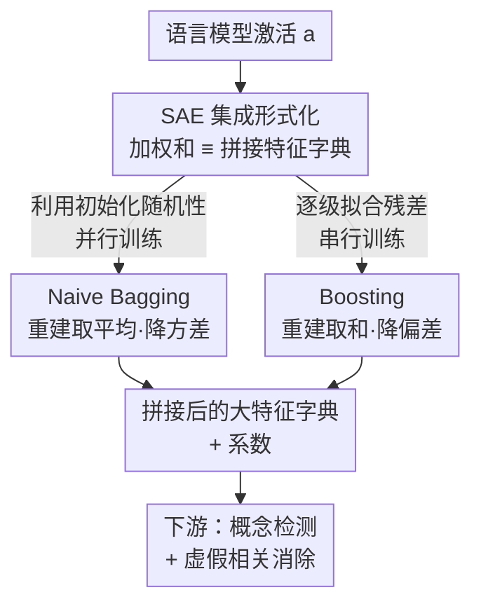

# Ensembling Sparse Autoencoders

**Conference**: ICML2026  
**arXiv**: [2505.16077](https://arxiv.org/abs/2505.16077)  
**Code**: Submitted with supplementary material (as noted in paper footnotes)  
**Area**: Interpretability / Mechanistic Interpretability  
**Keywords**: Sparse Autoencoders, Ensemble Learning, Bagging, Boosting, Feature Interpretability

## TL;DR
A single Sparse Autoencoder (SAE) only captures a limited subset of features in the activation space. This paper adapts bagging and boosting from supervised learning to SAEs, demonstrating that "ensembling multiple SAE reconstructions" is mathematically equivalent to "concatenating their feature dictionaries." Using naive bagging and boosting implementations, the authors simultaneously improve reconstruction quality, feature stability, and downstream task performance.

## Background & Motivation
**Background**: SAEs have become a primary tool for mechanistic interpretability. They decompose activations from a specific layer of a neural network (especially language models) into a high-dimensional, sparse feature space where each dimension often corresponds to a human-readable concept. They are widely used for concept detection, circuit analysis, and steering. In practice, researchers typically train a single SAE and use its features for downstream analysis.

**Limitations of Prior Work**: Recent work has found that a single SAE trained on the same activations only "fishes out" a limited subset of all extractable features (Fel et al. 2025; Paulo & Belrose 2025). In other words, even with identical architectures and hyperparameters, two SAEs will learn different and incomplete features due merely to different initial weights. This implies that choosing an SAE is somewhat a matter of "luck," and the resulting features are unstable.

**Key Challenge**: To capture more features, a natural instinct is to scale up the SAE (increasing dictionary dimension $k$). However, experiments in this paper show that while larger SAEs may improve reconstruction, their feature **stability** is poor—the feature similarity of a large SAE across multiple retrains is often less than half that of an ensemble of smaller SAEs. This is fatal for interpretability applications requiring "reliable features," creating a trade-off between "reconstruction quality" and "feature stability."

**Goal**: Can we combine multiple SAEs, similar to ensembling weak learners in supervised learning, to achieve better reconstruction, stable features, and stronger downstream utility simultaneously?

**Key Insight**: In supervised learning, bagging utilizes "model variance from randomness" to reduce variance, while boosting utilizes "differences in optimization targets" to reduce bias. Since these two types of differences naturally exist between SAEs (initialization randomness + fitting residuals for subsequent SAEs), the ensemble approach has a solid theoretical basis for SAEs.

**Core Idea**: First, formalize the "SAE ensemble" by proving that the ensemble output (a weighted sum in activation space) is equivalent to **concatenating** their decoder matrices (feature dictionaries) and coefficients. Then, instantiate this using two meta-algorithms: naive bagging (parallel training, averaged reconstruction) and boosting (serial training, step-wise residual fitting).

## Method

### Overall Architecture
An SAE is an autoencoder of the form $g(\mathbf{a};\theta)=\mathbf{W}_{\text{dec}}\,h(\mathbf{W}_{\text{enc}}\mathbf{a}+\mathbf{b}_{\text{enc}})+\mathbf{b}_{\text{dec}}$, which encodes a $d$-dimensional activation $\mathbf{a}$ into $k$-dimensional sparse coefficients ($k>d$) before decoding back. The key observation is that each column of the decoder matrix $\mathbf{W}_{\text{dec}}$ is a "feature" $\mathbf{f}_i$, so the reconstruction can be written as a sparse linear combination of features: $g(\mathbf{a};\theta)=\sum_{i=1}^{k}\mathbf{c}_i\mathbf{f}_i+\mathbf{b}_{\text{dec}}$.

The overall logic of the paper is divided into three steps: (1) **Formalization**—Define an ensemble of $J$ SAEs as a weighted sum in the activation space $\sum_j \alpha^{(j)}g(\cdot;\theta^{(j)})$ and prove this is equivalent to concatenating the feature dictionaries and coefficients of all SAEs (Proposition 3.1). Thus, the ensemble itself remains a "larger SAE" that can seamlessly plug into existing downstream pipelines; (2) **Two Instantiations**—Naive bagging uses different initializations for multiple SAEs, trains them in parallel, and averages their reconstructions to **reduce variance** for stability; Promoting uses each subsequent SAE to fit the **residual** left by all previous SAEs, trains them serially, and sums the reconstructions to **reduce bias** for accuracy; (3) **Evaluation**—Validate using intrinsic metrics (reconstruction, connectivity, stability) + AutoInterp + two downstream tasks.

### Key Designs

**1. Formalization of SAE Ensembles: Converting "Ensemble Reconstruction" to "Concatenating Dictionaries"**

The most naive way to write an ensemble is a weighted sum of $J$ SAE outputs: $\sum_{j=1}^{J}\alpha^{(j)}g(\cdot;\theta^{(j)})$. However, the value of an SAE lies not just in reconstruction but in the produced **features** and **coefficients** for downstream analysis. A simple weighted sum doesn't reveal what the "feature dictionary" of the ensemble looks like. Proposition 3.1 provides the bridge: because each SAE output is a linear combination of its features, ensembling their reconstructions is exactly equivalent to horizontally concatenating all decoder matrices $\mathbf{W}_{\text{dec}}=[\mathbf{W}_{\text{dec}}^{(1)}\cdots\mathbf{W}_{\text{dec}}^{(J)}]\in\mathbb{R}^{d\times kJ}$ and vertically concatenating the coefficients (scaled by ensemble weights) $\mathbf{c}=[\alpha^{(1)}\mathbf{c}^{(1)};\cdots;\alpha^{(J)}\mathbf{c}^{(J)}]$, with the bias being a weighted sum. The reconstruction is written as $\hat{\mathbf{a}}=\sum_{i'=1}^{kJ}\mathbf{c}_{i'}\mathbf{f}_{i'}+\mathbf{b}_{\text{dec}}$.

The significance of this is that an ensemble is mathematically a "large SAE" with $kJ$ features. All downstream tools designed for single SAEs (concept detection, circuit analysis, steering) can be used without modification. The paper also notes (Remark 3.2) that since feature vectors are often constrained to unit norm for directional interpretation, ensemble weights $\alpha^{(j)}$ should be folded into the coefficients $\mathbf{c}$ rather than the dictionary to maintain feature norms.

**2. Naive Bagging: Trading Initialization Randomness for Feature Stability**

To address the issue that single SAE features are unstable and change upon retraining, naive bagging trains $J$ SAEs that differ **only in initial weights**, with identical architectures and hyperparameters. After parallel training, reconstructions are averaged:

$$g_{\text{NB}}(\mathbf{a};\{\theta^{(j)}\})=\frac{1}{J}\sum_{j=1}^{J}g(\mathbf{a};\theta^{(j)})$$

It is called "naive" because it **does not use classical bootstrap sampling**. This is to isolate "initialization variance" as a single variable and because SAEs are often trained on billions of tokens, making bootstrap sampling impractical for memory/storage. The choice of uniform weights $\alpha^{(j)}=1/J$ corresponds to the "variance reduction" perspective in bias-variance decomposition (Appendix Proposition A.2): independently initialized SAEs capture different, incomplete feature subsets; averaging them reduces the variance term of the reconstruction, significantly increasing the stability of finding similar features across multiple retrains. The cost is that pure reconstruction accuracy might be lower than a single expanded SAE of equivalent size, illustrating the "stability-reconstruction trade-off."

**3. Boosting: Focusing Subsequent SAEs on Residuals for Reconstruction Accuracy**

A risk of naive bagging is that differently initialized SAEs might still learn many **overlapping** features, introducing redundancy. Boosting targets this directly: starting from an initial SAE, the $j$-th SAE no longer fits the original activations but reconstructs the **residual** left by the previous $j-1$ SAEs. The input for the $j$-th SAE is defined as:

$$\mathbf{a}^{(n,j)}=\mathbf{a}^{(n)}-\sum_{\ell=1}^{j-1}g(\mathbf{a}^{(n,\ell)};\theta^{(\ell)})\quad(j>1)$$

The final ensemble reconstruction is the sum of all SAE reconstructions: $g_{\text{Boost}}=\sum_{j=1}^{J}g(\mathbf{a}^{(*,j)};\theta^{(j)})$. Intuitively, each new SAE is forced to capture components missed by predecessors, greatly reducing redundancy. Theoretically, this corresponds to the "bias reduction" perspective (Appendix Proposition A.8 provides bounds on the bias term). The paper distinguishes this from MP-SAE: while MP-SAE also iterates on residuals, all iterations **share the same feature set**, whereas boosting learns an **independent** set of features for each round. The trade-off is that boosting must be trained serially and performed serially during inference; additionally, later SAEs tend to learn very specific, low-level features, making stability slightly lower than bagging.

### Loss & Training
The training objective for a single SAE is reconstruction loss plus a sparsity penalty: $\mathcal{L}_{\text{SAE}}=\frac{1}{N}\sum_n[\|\mathbf{a}^{(n)}-g(\mathbf{a}^{(n)};\theta)\|_2^2+\lambda\|\mathbf{c}^{(n)}\|_p]$, where TopK SAEs have $\lambda=0$ due to hard sparsity. Boosting uses the same $\lambda, p$ for each round, only replacing the input with the previous round's residual. All SAEs are trained using Adam. Architectures used include ReLU, TopK, and JumpReLU across three models. Hyperparameters were selected via a sweep to achieve ~90% Explained Variance, ensuring the base SAEs are practical.

## Key Experimental Results

### Main Results
On three language models (GELU-1L, Pythia-160M, Gemma 2-2B), 8 SAEs were ensembled (where metrics typically saturate) and compared against an "Expanded SAE" with the same number of features across four intrinsic metrics. Explained Variance (EV) and Connectivity should be high, MSE should be low, and Stability should be high.

| Model | Method | EV↑ | MSE↓ | Connectivity↑ | Stability↑ |
|------|------|----------|------|--------|--------|
| GELU-1L | Expanded SAE | 0.946 | 17.893 | 0.959 | 0.372 |
| GELU-1L | Naive Bagging | 0.895 | 35.147 | 0.307 | **0.745** |
| GELU-1L | Boosting | **0.961** | **12.542** | 0.945 | 0.707 |
| Pythia-160M | Expanded SAE | 0.987 | 4.387 | 0.978 | 0.204 |
| Pythia-160M | Naive Bagging | 0.929 | 24.704 | 0.912 | **0.731** |
| Pythia-160M | Boosting | **0.998** | **0.845** | **0.986** | 0.680 |
| Gemma 2-2B | Expanded SAE | 0.948 | 472.330 | 0.993 | 0.268 |
| Gemma 2-2B | Naive Bagging | 0.974 | 234.128 | 0.769 | 0.633 |
| Gemma 2-2B | Boosting | **0.995** | **46.538** | 0.989 | **0.583** |

Key Observations: **Boosting almost uniformly outperforms Expanded SAE in reconstruction (EV/MSE)**; on Gemma 2-2B, MSE dropped from 472 to 46 with higher stability. **Naive bagging sacrifices reconstruction for the highest stability**; on GELU-1L, stability doubled from 0.372 to 0.745. This demonstrates that ensemble gains are **not simply from having more features**—the Expanded SAE has the same feature count but its stability is often less than half that of the ensemble, indicating its features are unreliable.

### AutoInterp and Downstream Tasks
A counter-intuitive concern is whether ensembling increases the aggregated $L_0$ (sparsity) and thus harms interpretability. AutoInterp scores (where an LLM generates and evaluates feature explanations) show that this is **not the case**:

| Method | GELU-1L | Pythia-160M | Gemma 2-2B |
|------|---------|-------------|-----------|
| Expanded SAE | 0.714 | 0.852 | 0.805 |
| Naive Bagging | 0.738 | 0.857 | 0.799 |
| Boosting | **0.863** | 0.852 | **0.814** |

The AutoInterp scores for ensemble SAEs are at least as high as Expanded SAEs despite a larger aggregate $L_0$, suggesting that aggregate sparsity is not a reliable proxy for interpretability. In downstream tasks: for **Concept Detection** (Sentiment, Code, Topic, Language), naive bagging excels when mapping concepts to a single feature, while boosting takes the lead when multiple features (Top-2+) are allowed. The **Spurious Correlation Removal** task also confirms ensembles outperform single SAEs.

### Key Findings
- **Boosting targets reconstruction; Bagging targets stability.** These align perfectly with the bias/variance theoretical framework: Boosting beats Bagging on all metrics except stability.
- **Ensemble gains do not come from "more features"**: Compared to Expanded SAEs with identical feature counts, ensembles significantly lead in stability, showing that features from a large single SAE are unreliable.
- **Aggregate $L_0$ is not a good proxy for interpretability**: Despite worse sparsity after concatenation, AutoInterp remained stable or improved.
- **Later SAEs in Boosting learn specific features**: In Pythia-160M, the first SAE learns generalized "programming concepts," while the last learns specific tokens like "syntax error" or "Java."

## Highlights & Insights
- **An Elegant Equivalence Theorem**: Proving that "ensemble reconstruction" is "dictionary concatenation" allows ensembles to reuse all existing SAE analysis tools, serving as the bridge to introduce ensemble theory to interpretability.
- **Bias-Variance Decomposition for SAEs**: The paper clearly explains the roles of bagging and boosting through the lens of bias/variance, with experimental metrics corresponding precisely to theoretical predictions.
- **Stability as a First-Class Citizen**: The authors emphasize that interpretability needs **reliable** features. Since simply scaling SAEs sacrifices stability, this trade-off is highly instructive for practitioners.
- **Meta-algorithm Property**: Ensembling is compatible with any SAE architecture (ReLU/TopK/JumpReLU) and hyperparameters, making it "plug-and-play."

## Limitations & Future Work
- **Computational Cost of Boosting**: Training and inference must be serial across $J$ SAEs, which is more expensive for large models compared to bagging. Training/inference time was mostly relegated to the appendix.
- **Homogeneous Ensembles**: The study only looked at ensembles of SAEs with the same architecture and hyperparameters. Heterogeneous ensembles (akin to stacking) might offer richer feature diversity.
- **Task-Dependent Performance**: Whether bagging or boosting is superior depends on the concept-to-feature mapping ratio; there is no one-size-fits-all winner.
- **Empirical Ensemble Size**: Choosing 8 SAEs was based on observed saturation; more systematic scale-benefit analysis is needed.

## Related Work & Insights
- **vs. Switch SAE (Mudide et al. 2024)**: Switch SAE trains multiple experts but selects only **one** during inference for efficiency. This paper trains and uses multiple SAEs **together** for better feature coverage.
- **vs. SAE Boost (Koriagin et al. 2025)**: SAE Boost uses a single residual correction for domain adaptation. Boosting here is a general multi-round process learning independent features.
- **vs. MP-SAE (Costa et al. 2025)**: MP-SAE uses iterations for residual matching but **shares the same features** across iterations. Boosting here learns **independent** feature sets per round.
- **vs. Classical Supervised Ensembles**: This work translates bagging/boosting from supervised prediction to unsupervised activation decomposition, filling the theoretical gap of "ensemble $\equiv$ concatenated dictionary."

## Rating
- Novelty: ⭐⭐⭐⭐ Systematically introduces ensemble theory to SAEs with a elegant equivalence theorem.
- Experimental Thoroughness: ⭐⭐⭐⭐ Covers various models/architectures, intrinsic metrics, AutoInterp, and downstream tasks.
- Writing Quality: ⭐⭐⭐⭐ Clear formalization and theoretical alignment, though some cost details are in the appendix.
- Value: ⭐⭐⭐⭐ Provides a plug-and-play meta-method to improve stability and reconstruction for SAE practitioners.

<!-- RELATED:START -->

## Related Papers

- [\[ICML 2026\] Sparse Autoencoders are Topic Models](sparse_autoencoders_are_topic_models.md)
- [\[ICLR 2026\] The Price of Amortized inference in Sparse Autoencoders](../../ICLR2026/interpretability/the_price_of_amortized_inference_in_sparse_autoencoders.md)
- [\[ICML 2026\] On the Relationship Between Activation Outliers and Feature Death in Sparse Autoencoders](on_the_relationship_between_activation_outliers_and_feature_death_in_sparse_auto.md)
- [\[ICML 2026\] PolySAE: Modeling Feature Interactions in Sparse Autoencoders via Polynomial Decoding](polysae_modeling_feature_interactions_in_sparse_autoencoders_via_polynomial_deco.md)
- [\[ICLR 2026\] Toward Faithful Retrieval-Augmented Generation with Sparse Autoencoders](../../ICLR2026/interpretability/toward_faithful_retrieval-augmented_generation_with_sparse_autoencoders.md)

<!-- RELATED:END -->
