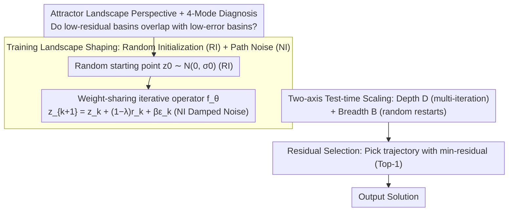

# Equilibrium Reasoners: Learning Attractors Enables Scalable Reasoning

**Conference**: ICML 2026  
**arXiv**: [2605.21488](https://arxiv.org/abs/2605.21488)  
**Code**: https://github.com/locuslab/EqR (Available)  
**Area**: LLM Reasoning / Iterative Latent Reasoning / Test-time Compute Scaling  
**Keywords**: Fixed-point Dynamical Systems, Attractors, Weight-sharing Iteration, Depth-Breadth Scaling, Sudoku-Extreme

## TL;DR
This paper reinterprets models that "reason via iterative latent updates" as learned attractor dynamical systems and proposes Equilibrium Reasoners (EqR). By using two lightweight training interventions—Random Initialization (RI) and Path Noise (NI)—to shape the attractor landscape, combined with "Depth (iterations $D$) + Breadth (random restarts $B$)" scaling and a residual-based selection rule, EqR improves Sudoku-Extreme accuracy from 2.6% (feedforward) to 99.8% (equivalent to 40,000 layers), despite being trained with only 16 iterations.

## Background & Motivation

**Background**: Modern reasoning models increasingly rely on test-time compute—ranging from search-based AlphaZero to CoT, and recently to weight-sharing iterative models like HRM, TRM, and URM. These models deepen reasoning by repeatedly executing the same update module. HRM and TRM iteratively update a latent state, achieving results on long-range constraint satisfaction tasks like Sudoku that far exceed standard feedforward networks.

**Limitations of Prior Work**: Increasing test-time compute is not always effective; previous literature has reported diminishing or even negative returns from test-time scaling. HRM describes its behavior as "hierarchical convergence," while TRM explicitly notes that latent residuals do not reach zero even after training, thus rejecting a strict fixed-point interpretation. Consequently, a mechanistic explanation for why iterative reasoning works and when it scales effectively is still missing.

**Key Challenge**: The assumption of "convergence to a unique fixed point" is too restrictive (as residuals do not vanish), but completely abandoning the convergence perspective fails to explain the empirical phenomenon where "more iterations lead to better performance." A middle-ground perspective between "strict fixed points" and "black boxes" is needed.

**Goal**: (i) Provide a more relaxed yet falsifiable mechanistic explanation for iterative reasoning than Deep Equilibrium Models (DEQ); (ii) Translate this explanation into specific training interventions and test-time scaling strategies; (iii) Verify on controlled benchmarks whether "residual convergence" serves as a reliable scaling signal.

**Key Insight**: Treat the iterative operator $\mathbf{z}_{k+1}=f_\theta(\mathbf{z}_k;\mathbf{x})$ as a task-conditioned dynamical system, shifting the goal from "finding an exact fixed point" to "finding attractors"—stable local regions of entrapment. A "well-aligned" attractor landscape should ensure that its internal low-residual basins overlap with the task's low-error basins. Thus, training becomes the process of shaping the internal landscape into a differentiable surrogate of the task metric, and reasoning becomes an adaptive search on this landscape.

**Core Idea**: Use "attractor landscape shaping" to unify the explanation for training and test-time scaling. On the training side, use Random Initialization (RI) and Path Noise (NI) to make correct attractors both broad and stable. During inference, scale along both "Depth $D$ (more iterations on the same trajectory)" and "Breadth $B$ (multiple random restarts)," selecting the Top-1 result based on the trajectory with the smallest residual. Consequently, performance increases predictably as $D{\cdot}B$ grows.

## Method

### Overall Architecture
EqR addresses the mechanistic question of "why iterative latent reasoning works and when extra computation is effective" by treating the operator $\mathbf{z}_{k+1}=f_\theta(\mathbf{z}_k;\mathbf{x})$ as a task-conditioned dynamical system. The objective is relaxed from DEQ's "unique fixed point" to "shaping a well-aligned attractor landscape." The architecture follows a TRM-style hierarchical iteration: maintaining a pair of latent states $(\mathbf{z}_H, \mathbf{z}_L)$, where the inner loop updates $\mathbf{z}_L$ for $n$ steps conditioned on $\mathbf{z}_H$, and the outer loop updates $\mathbf{z}_H$ once using $\mathbf{z}_L$. This is repeated for $T$ outer steps, with the first $T-1$ steps utilizing `no_grad` and detaching (truncated gradient), followed by an ACT head $\hat q = f_\phi(\mathbf{z}_H)$ for difficulty-aware early stopping. Compared to HRM/TRM, EqR introduces three innovations: random starting points for trajectories (broad coverage), damped noise in updates (light perturbation), and dual-axis scaling with residual-based selection.

### Key Designs

**1. Attractor Landscape Perspective + 4-Mode Diagnosis: Elevating "Residual" to a Task-Agnostic Metric**

The DEQ binary focus on "convergence to a unique fixed point" cannot explain the empirical observation in HRM/TRM where residuals decrease without reaching zero while accuracy continues to rise. EqR adopts a relaxed attractor perspective: the set of stable long-term states the model can converge to for input $\mathbf{x}$ is denoted as $\mathcal{Z}^*_\theta(\mathbf{x})$. The focus is on task alignment (do these attractors decode to correct solutions?) and reachability (are their basins easy to enter?). This leads to four landscape categories: (a) No correct attractor exists (misjudgment; scaling is futile); (b) Correct and incorrect attractors coexist (basin selection failure; requires breadth $B$ rather than depth $D$); (c) Correct attractors exist but basins are narrow/weak (reachability failure; $B$ helps find the basin, $D$ helps stabilize); (d) Broad and stable correct basins (ideal state; $D$ dominates). By aligning these categories with "Residual vs. Task Error correlation," $\|f_\theta(\mathbf{z};\mathbf{x})-\mathbf{z}\|$ becomes a task-agnostic diagnostic: in mode (d), residual and accuracy are strongly correlated, whereas they decouple in mode (a). This allows for non-zero residuals and multiple attractors, fitting scenarios like Sudoku with multiple candidates and long-range constraints.

**2. Training Landscape Shaping: Random Initialization (RI) + Path Noise (NI)**

HRM/TRM models are trained with a single fixed $\mathbf{z}_0$, which localizes shaping to one basin and leads to train-test mismatch during random-start inference. They also struggle with "prematurely trapping" in incorrect basins (modes b and c). EqR introduces two lightweight interventions. RI initializes $\mathbf{z}_0\sim\mathcal{N}(0,\sigma_0 I)$ instead of zero, allowing the model to "see" more basins and expand the explored state space. Training the same $(\mathbf{x},\mathbf{y})$ with various $\mathbf{z}_0$ values implicitly encourages path independence. NI formulates each update with damped noise: $\mathbf{z}_{k+1}=\mathbf{z}_k+(1-\lambda)\,r_\theta(\mathbf{z}_k;\mathbf{x})+\beta\,\varepsilon_k$ (where $\varepsilon_k\sim\mathcal{N}(0,I)$, with $\lambda=0.05, \beta=0.01$). This acts as a trajectory-level stochastic regularization, allowing the model to escape spurious attractors in modes (b) and (c) to find the correct basin. During inference, $\beta$ can be increased to enhance exploration, complementing breadth scaling.

**3. Two-Axis Test-Time Scaling + Residual Selection: Replacing External Verifiers with Geometric Signals**

EqR decouples compute scaling into two knobs: Depth $D$ (iterations within one trajectory, refining the basin) and Breadth $B$ (independent restarts, switching basins), denoted as $\mathrm{NFE}=D\cdot B$. Ablations show that weight-sharing is essential for generalization. Despite training with $\le 16$ steps, EqR extrapolates to $>1024$ steps (equivalent to 40,000 layers) where residual and error continue to decrease synchronously. For breadth, Pareto experiments suggest $B$ only becomes effective when $D\gtrsim 4$, as trajectories must be long enough to meaningfully probe the basin. Finally, trajectories are selected not by majority vote, but by picking the one with the smallest average residual in the final steps (Top-1 Converged selection). This utilizes the internal landscape's alignment with task accuracy, providing a selection signal that is more compute-efficient than voting and requires no external task-specific prior.

### Loss & Training
The primary loss follows the TRM style: a CE loss supervises the LM head $\hat{\mathbf{y}}$ at each "supervised outer step," and a BCE loss supervises the halting head $\hat q$ to fit $\mathbf{1}[\hat{\mathbf{y}}=\text{gt}]$. Segmented Online Training (SOT) splits trajectories into segments; each segment end involves supervision and an optimizer step, with the next segment starting from a "detached carry + updated parameters." This approximates the attractor learning objective: latent updates seek reachable low-residual states, while parameter updates align those states with the ground truth. Truncated gradients save memory. ACT is active during training: when the model is confident ($\hat q$ is high), samples are moved out of the batch to prioritize harder samples.

## Key Experimental Results

### Main Results

Exact accuracy on **Sudoku-Extreme (9×9 ultra-hard)** and **Maze-Unique (30×30 unique solution)**:

| Method | Sudoku | Maze | Note |
|------|--------|------|------|
| 64-Layer Feedforward | 2.6 | 0.0 | Incremental depth is ineffective |
| HRM (Wang 2025) | 55.0† | 0.3 | Hierarchical iteration baseline |
| TRM (Jolicoeur-Martineau 2025) | 84.8† | 44.9 | Prev. SOTA |
| URM (Gao 2025) | 77.6† | 51.4 | — |
| **EqR baseline ($D{=}16,B{=}1$)** | 86.4 | 82.2 | +RI+NI on TRM skeleton |
| **EqR + depth ($D{=}64,B{=}1$)** | 93.0 | 88.9 | Multi-iteration/trajectory |
| **Ours (EqR + depth+breadth, $D{=}64,B{=}128$)** | **99.8** | **93.0** | Residual selection |

The most significant gain is in Maze, where TRM's 44.9 is boosted to 93.0. RI alone pushes Maze to 68.6, and adding NI reaches 82.2, indicating that "incorrect basin selection" rather than capacity was the primary bottleneck.

### Ablation Study

Evolution of the model (Sudoku-Extreme):

| Configuration | Blocks | Params | NLE | Eval Acc |
|------|--------|--------|-----|----------|
| Vanilla feedforward | 42 | 105.6M | 42 | 2.6 |
| + weight-tied | 2 | 5.03M | 42 | 32.6 |
| + SOT + depth ×16 | 2 | 5.03M | 672 | 74.7 |
| + hierarchical recurrence | 2 | 5.03M | 672 | 76.5 |
| + ACT training | 2 | 5.03M | 672 | 84.8 |

Landscape shaping interventions (Baseline: $D{=}16,B{=}1$):

| Intervention | Sudoku | Maze |
|------|--------|------|
| Baseline (no RI/NI) | 84.8 | 44.9 |
| + RI | 86.0 | 68.6 |
| + RI + NI (Ours) | 86.4 | 82.2 |

### Key Findings
- **Weight-sharing is necessary for generalization**: Compressing parameters from 105.6M (42-layer feedforward) to 5.03M (2-block weight-tied) while maintaining 42 NLE improved eval accuracy from 2.6 → 32.6.
- **Extrapolation from 16 to 1024+ steps**: While trained on 16 iterations, inference at 1024 iterations (40,000 equivalent layers) shows continuing residual decrease and accuracy gain.
- **Breadth threshold $D\gtrsim 4$**: Pareto analysis shows $B$ is only effective after $D$ provides sufficient depth ($\approx 168$ equivalent layers) to probe basins; otherwise, restarts just oscillate near the origin.
- **Residual selection ≥ Majority vote**: Because the landscape is well-aligned, Top-1 Converged selection matches or exceeds majority voting performance while avoiding voting overhead.
- **Improved NFE efficiency**: On Sudoku-Lite (92.99% target), Ours reduces NFE by 3.76× over baseline, and EqR+ACT reduces it by 11.34×, proving gains stem from better landscape reachability.

## Highlights & Insights
- **Elevating Residual to a Theoretical Metric**: Shifting the role of $\|f_\theta(\mathbf{z};\mathbf{x})-\mathbf{z}\|$ from a convergence monitor to an internal proxy for task accuracy enables a practical selection rule without external verifiers.
- **Transferable "Landscape Alignment" Metaphor**: Training to overlap attractors with low-error basins can be generalized to diffusion sampling, energy-based models, or KV-cache iterative refinement.
- **RI/NI: Minimal Cost, High Gain**: These interventions add zero parameters and negligible compute but dramatically improved Maze performance, suggesting exploration injection is more cost-effective than scaling model size for constrained tasks.
- **Decoupling Train-Test Compute**: The ability to train at 16 steps and scale to 1024 steps at inference is valuable for deployment scenarios where training budgets are limited but inference resources are available.
- **Dynamic Selection Probe**: Switching from majority vote to Top-1 Converged serves as a diagnostic tool for whether a model has truly learned aligned attractors.

## Limitations & Future Work
- Evaluation is limited to discrete constraint satisfaction (Sudoku, Maze) and has not addressed natural language or open-ended generation where token-level noise is higher.
- Hyperparameters $\lambda=0.05, \beta=0.01$ were tuned for Sudoku/Maze; scaling laws for these values across different tasks are not established.
- High NFE ($D=64, B=128$) may be economically unviable for tasks insensitive to marginal accuracy gains.
- The reliability of the residual proxy depends on landscape alignment; it will fail in modes where the model is fundamentally misaligned.
- Future work could include learning the initialization distribution or making the noise schedule $\beta$ time-dependent.

## Related Work & Insights
- **vs DEQ (Bai et al. 2019)**: DEQ requires contraction to a unique fixed point; EqR relaxes this to a set of attractors, allowing non-zero residuals and multiple solutions.
- **vs HRM (Wang et al. 2025) / TRM (Jolicoeur-Martineau 2025)**: EqR shares the hierarchical skeleton but introduces landscape shaping via RI+NI, pushing performance significantly beyond TRM (84.8/44.9 → 99.8/93.0).
- **vs URM (Gao et al. 2025)**: EqR demonstrates that "stochasticity in training distribution + path noise" is more effective than structural changes (URM scored 51.4 on Maze).
- **vs Path-Independence (Anil et al. 2022)**: While prior work explicitly regularized for path independence, EqR achieves it implicitly through RI training across multiple trajectories.
- **vs CoT / Search-based Reasoning**: EqR performs scaling in the latent space rather than the token space, using internal residuals rather than majority votes or external verifiers as the selection signal.

## Rating
- Novelty: ⭐⭐⭐⭐ Attractor perspective provides a unified explanation for DEQ/HRM/TRM; RI+NI are well-grounded within this framework.
- Experimental Thoroughness: ⭐⭐⭐⭐ Clean ablation paths and diagnostic plots; lacks comparison on NLP tasks.
- Writing Quality: ⭐⭐⭐⭐⭐ Clear conceptual framework followed by empirical validation; consistent terminology and intuitive metaphors.
- Value: ⭐⭐⭐⭐ Provides one of the first mechanistic explanations for why latent test-time scaling works and provides portable, low-cost training interventions.

<!-- RELATED:START -->

## Related Papers

- [\[ICLR 2026\] SEED-SET: Scalable Evolving Experimental Design for System-level Ethical Testing](../../ICLR2026/interpretability/seed-set_scalable_evolving_experimental_design_for_system-level_ethical_testing.md)
- [\[ICLR 2026\] RADAR: Reasoning-Ability and Difficulty-Aware Routing for Reasoning LLMs](../../ICLR2026/interpretability/radar_reasoning-ability_and_difficulty-aware_routing_for_reasoning_llms.md)
- [\[ICML 2025\] Ab Initio Nonparametric Variable Selection for Scalable Symbolic Regression with Large p](../../ICML2025/interpretability/ab_initio_nonparametric_variable_selection_for_scalable_symbolic_regression_with.md)
- [\[ICML 2026\] Learning Coherent Representations: A Topological Approach to Interpretability](learning_coherent_representations_a_topological_approach_to_interpretability.md)
- [\[CVPR 2025\] TIDE: Training Locally Interpretable Domain Generalization Models Enables Test-time Correction](../../CVPR2025/interpretability/tide_domain_generalization.md)

<!-- RELATED:END -->
