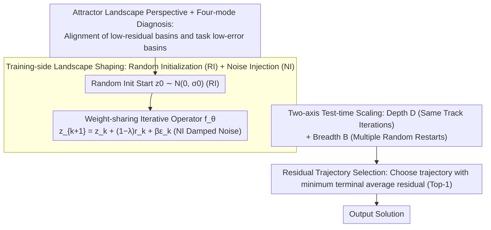

# Equilibrium Reasoners: Learning Attractors Enables Scalable Reasoning

**Conference**: ICML 2026  
**arXiv**: [2605.21488](https://arxiv.org/abs/2605.21488)  
**Code**: https://github.com/locuslab/EqR (Available)  
**Area**: LLM Reasoning / Iterative Latent Reasoning / Test-time Compute Scaling  
**Keywords**: Fixed-point dynamical systems, Attractors, Weight-sharing iteration, Depth-Breadth scaling, Sudoku-Extreme

## TL;DR
This paper reinterprets models performing reasoning via iterative latent variable updates as learned attractor dynamical systems. It proposes Equilibrium Reasoners (EqR), which use two lightweight training interventions—Random Initialization (RI) and Path Noise Injection (NI)—to shape the attractor landscape. Combined with a "Depth (iteration steps $D$) + Breadth (random restarts $B$)" test-time scaling strategy and a selection rule based on residual convergence, EqR improves the exact accuracy on Sudoku-Extreme from 2.6% (feedforward) to 99.8% (equivalent to 40,000 layers) while being trained with only 16 iterations.

## Background & Motivation

**Background**: Modern reasoning models increasingly rely on test-time compute—ranging from search-based AlphaZero to Chain-of-Thought (CoT), and recently to weight-sharing iterative models like HRM, TRM, and URM. These models deepen reasoning by repeatedly executing the same update module. HRM and TRM iteratively update a latent state, achieving performance far exceeding standard feedforward networks on long-range constraint satisfaction tasks like Sudoku.

**Limitations of Prior Work**: Increasing test-time compute is not always effective; literature has frequently reported diminishing or even negative returns from test-time scaling. HRM describes its behavior as "hierarchical convergence," while TRM explicitly notes that latent residuals do not reach zero even after training, thus rejecting a strict fixed-point interpretation. In other words, a mechanistic explanation for why iterative reasoning works and when it scales effectively is still lacking.

**Key Challenge**: The assumption of "convergence to a unique fixed point" is too restrictive (as residuals do not vanish), but completely abandoning the convergence perspective fails to explain the empirical phenomenon where "more iterations lead to better performance." A middle-ground perspective between "strict fixed points" and "complete black boxes" is needed.

**Goal**: (i) Provide an internal mechanistic explanation for iterative reasoning that is more relaxed than Deep Equilibrium Models (DEQ) but still falsifiable; (ii) translate this explanation into specific training interventions and test-time scaling strategies; (iii) verify on controlled benchmarks whether "residual convergence" can serve as a reliable scaling signal.

**Key Insight**: The iterative operator $\mathbf{z}_{k+1}=f_\theta(\mathbf{z}_k;\mathbf{x})$ is viewed as a task-conditioned dynamical system, but the objective is relaxed from "finding an exact fixed point" to "finding attractors"—stable local regions of entrapment. A "well-aligned" attractor landscape should satisfy the condition that the low-residual basins of the internal landscape coincide with the low-error basins of the task metric. Thus, training becomes the shaping of the internal landscape into a differentiable surrogate of the task metric, and reasoning becomes an adaptive search on this landscape.

**Core Idea**: Training and test-time scaling are unified under the framework of "attractor landscape shaping." On the training side, Random Initialization (RI) and Path Noise (NI) are used to make correct attractors both broad and stable. On the reasoning side, scaling occurs along the "Depth $D$ (more iterations on the same trajectory) + Breadth $B$ (multiple random restarts)" axes, using the trajectory with the minimum residual for Top-1 selection. Consequently, performance increases predictably as $D{\cdot}B$ grows.

## Method

### Overall Architecture
EqR addresses the mechanistic question of why iterative latent reasoning works and when extra computation is effective by treating the iterative operator $\mathbf{z}_{k+1}=f_\theta(\mathbf{z}_k;\mathbf{x})$ as a task-conditioned dynamical system. The goal is shifted from DEQ's "finding a unique fixed point" to "shaping a well-aligned attractor landscape." The bone structure follows the hierarchical iteration style of TRM: maintaining a latent state pair $(\mathbf{z}_H, \mathbf{z}_L)$, where the inner loop updates $\mathbf{z}_L$ for $n$ steps conditioned on $\mathbf{z}_H$, and the outer loop updates $\mathbf{z}_H$ once using the resulting $\mathbf{z}_L$. This is repeated for $T$ outer steps, with the first $T-1$ steps using `no_grad`+detach (truncated gradient), and an ACT (Adaptive Computation Time) head $\hat q = f_\phi(\mathbf{z}_H)$ is attached for difficulty-aware early stopping. Compared to HRM/TRM, EqR introduces three key innovations: random starting points for trajectories (broad coverage), damped noise injection for updates (light perturbation), and dual-axis test-time scaling with residual-based selection (aligned selection signal).

### Key Designs

**1. Attractor Landscape Perspective + Four-mode Diagnosis: Elevating "Residuals" to Task-agnostic Diagnostics**

The binary DEQ criterion of "convergence to a unique fixed point" cannot explain the empirical observation in HRM/TRM that residuals decrease without reaching zero while accuracy continues to rise. EqR adopts a more relaxed attractor perspective: it considers the set of all stable long-term states the model can converge to for input $\mathbf{x}$ as the attractor set $\mathcal{Z}^*_\theta(\mathbf{x})$. It focuses on two properties: task alignment (whether these attractors decode to correct solutions) and reachability (whether their basins are easy to enter). Based on this, landscapes are categorized into four modes: (a) no correct attractor exists (misclassification, scaling is useless); (b) correct and incorrect attractors coexist (basin selection failure, requires breadth $B$ rather than depth $D$); (c) correct attractors exist but basins are narrow/weak (reachability failure, $B$ helps select the basin, $D$ helps stabilize); (d) correct basins are wide and stable (ideal state, $D$ dominates). By aligning these modes with the correlation between "residual vs. task error," $\|f_\theta(\mathbf{z};\mathbf{x})-\mathbf{z}\|$ becomes a task-independent internal diagnostic metric. In mode (d), residuals and accuracy are strongly correlated, while in mode (a), they decouple.

**2. Training-side Landscape Shaping: Random Initialization (RI) + Path Noise (NI)**

HRM/TRM train with a single fixed $\mathbf{z}_0$, which is equivalent to shaping only one local basin. Once random starting points are used for voting during reasoning, a train-test mismatch occurs. They are also powerless against mode (b) and (c) where the model is trapped in incorrect solutions. EqR applies two interventions with minimal code and zero extra parameters. RI sets the start point $\mathbf{z}_0\sim\mathcal{N}(0,\sigma_0 I)$ instead of zero, allowing the model to "see" more basins and expand the shaped state space region. Since the same $(\mathbf{x},\mathbf{y})$ is paired with multiple $\mathbf{z}_0$, it implicitly encourages path independence. NI formulates each update as a damped noisy step $\mathbf{z}_{k+1}=\mathbf{z}_k+(1-\lambda)\,r_\theta(\mathbf{z}_k;\mathbf{x})+\beta\,\varepsilon_k$ ($\varepsilon_k\sim\mathcal{N}(0,I)$, default $\lambda=0.05, \beta=0.01$), acting as a stochastic perturbation regulator that allows the model to escape spurious attractors in (b) and (c) landscapes. During inference, $\beta$ can be increased to enhance exploration, complementing breadth scaling.

**3. Two-axis Test-time Scaling + Residual Selection: Replacing External Verifiers with Internal Geometry**

EqR decomposes compute scaling into two independently tunable knobs: Depth $D$ (iterations within a single trajectory to refine the basin) and Breadth $B$ (independent restarts to switch basins), with total cost denoted as $\mathrm{NFE}=D\cdot B$. Weight-sharing is first proven necessary for iterative reasoning generalization. The model, trained on $\le 16$ steps, can extrapolate to $>1024$ steps (equivalent to 40,000 layers) such that residuals and accuracy continue to decrease in tandem. Pareto experiments show that $B$ is only effective when $D\gtrsim 4$, as trajectories must run enough steps to meaningfully probe a basin. Finally, instead of majority voting, the trajectory with the "minimum average residual in the final steps" is chosen. Since the landscape shaping ensures residuals are highly correlated with task accuracy, this "trust convergence" rule eliminates the need for external verifiers or task-specific priors and is more computationally efficient than voting.

### Loss & Training
The primary loss follows the TRM style: at each "supervised outer step," the LM head $\hat{\mathbf{y}}$ is trained with Cross-Entropy (CE), and the halting head $\hat q$ is trained with Binary Cross-Entropy (BCE) to fit $\mathbf{1}[\hat{\mathbf{y}}=\text{gt}]$. Segmented Online Training (SOT) partitions the trajectory; at the end of each segment, supervision is applied followed by an optimizer step, and the next segment begins with a "detached carry + updated parameters." This approximates the attractor learning objective: latent updates seek reachable low-residual states, while parameter updates align those states with the correct answer. Truncated gradients (detached carry) are used to save memory. ACT is active during training: once the model is confident, $\hat q$ rises and the sample is removed from the batch, allocating compute to difficult samples.

## Key Experimental Results

### Main Results

Exact accuracy (1 only if all tokens are correct) on **Sudoku-Extreme (9×9 ultra-hard)** and **Maze-Unique (30×30 unique solution)**:

| Method | Sudoku | Maze | Remarks |
|:---|:---:|:---:|:---|
| 64-Layer Feedforward | 2.6 | 0.0 | Pure depth stacking is ineffective |
| HRM (Wang 2025) | 55.0† | 0.3 | Hierarchical iteration baseline |
| TRM (Jolicoeur-Martineau 2025) | 84.8† | 44.9 | Current iterative reasoning SOTA |
| URM (Gao 2025) | 77.6† | 51.4 | — |
| **EqR baseline ($D{=}16,B{=}1$)** | 86.4 | 82.2 | +RI+NI on TRM backbone |
| **EqR + depth ($D{=}64,B{=}1$)** | 93.0 | 88.9 | More iterations on same trajectory |
| **EqR + depth+breadth ($D{=}64,B{=}128$)** | **99.8** | **93.0** | Residual trajectory selection |

The most dramatic contrast is in Maze: accuracy jumps from TRM's 44.9 to 93.0. RI alone pushes Maze to 68.6, and adding NI brings it to 82.2, indicating that "basin selection" is the true bottleneck in Maze, not capacity.

### Ablation Study

Building the pipeline (Sudoku-Extreme, step-by-step components):

| Configuration | Blocks | Params | NLE | Eval Acc |
|:---|:---:|:---:|:---:|:---:|
| Vanilla feedforward | 42 | 105.6M | 42 | 2.6 |
| + weight-tied | 2 | 5.03M | 42 | 32.6 |
| + SOT + depth ×16 | 2 | 5.03M | 672 | 74.7 |
| + hierarchical recurrence | 2 | 5.03M | 672 | 76.5 |
| + ACT training | 2 | 5.03M | 672 | 84.8 |

Landscape shaping interventions (based on the last row above, $D{=}16,B{=}1$):

| Intervention | Sudoku | Maze |
|:---|:---:|:---:|
| baseline (no RI/NI) | 84.8 | 44.9 |
| + RI | 86.0 | 68.6 |
| + RI + NI (EqR) | 86.4 | 82.2 |

### Key Findings
- **Weight-sharing is necessary for iterative reasoning generalization**: Compressing parameters from 105.6M (42-layer feedforward) to 5.03M (2-block weight-tied) while maintaining 42 NLE prevents OOD failure, with eval accuracy improving from 2.6 → 32.6.
- **Extrapolation from 16 training steps to 1024+ inference steps**: Accuracy and residuals continue to improve up to 1024 iterations (40,000 equivalent layers), providing robust evidence for the effectiveness of test-time scaling.
- **Breadth requires a "threshold" of $D\gtrsim 4$**: Pareto heatmaps show $B$ is only effective when $D$ is large enough, confirming that landscape exploration and internal basin refinement are distinct processes.
- **Residual selection ≥ majority vote**: Since the landscape is well-aligned with task metrics, "Top-1 Converged" (minimum residual) performs as well as or better than majority voting while saving computational overhead.
- **Significant NFE savings for the same accuracy**: For a 92.99% accuracy target on Sudoku-Lite, EqR saves 3.76× NFE compared to the baseline, and EqR+ACT saves 11.34×, proving that gains stem from superior landscape shaping rather than just more computation.

## Highlights & Insights
- **Elevating "Residuals" to a theoretical quantity**: In previous iterative reasoning research, $\|f_\theta(\mathbf{z};\mathbf{x})-\mathbf{z}\|$ was merely a convergence monitor. This work argues it is an internal proxy for task correctness, leading to the practical "residual selection" rule.
- **Transferability of the "Landscape Alignment" metaphor**: Training shapes an internal landscape so its attractors coincide with the low-error basins of a task metric. This can be applied to diffusion sampling, energy-based models, or KV-cache iterative refinement.
- **Minimal cost vs. massive gain of RI/NI**: Both interventions require zero extra parameters and minimal code but push Maze accuracy from 44.9 to 82.2, showing that "exploration injection" can be more effective than scaling model size for constrained tasks.
- **Decoupling of train-test compute**: The ability to train on 16 steps and test on 1024 steps while gaining performance decouples the training compute ceiling from the inference ceiling—highly valuable for deployment with limited training budgets.
- **Dynamics-space selection**: Switching from majority vote to Top-1 Converged shifts the selection signal from the "output space" to the "dynamical space," serving as a cheap probe to evaluate if a model has truly learned aligned attractors.

## Limitations & Future Work
- Evaluation is limited to "fully controllable discrete constraint satisfaction" benchmarks (Sudoku/Maze) and does not address natural language or open-ended generation; the stability of attractor landscapes under token-level noise remains unknown.
- Parameters $\lambda=0.05, \beta=0.01$ were tuned for Sudoku/Maze; whether they need readjustment for other tasks or follow a scaling law is not discussed.
- With $D{=}64,B{=}128$, the $\mathrm{NFE}=8192$ is very high. The economic viability depends on the marginal sensitivity of the task to accuracy.
- There is no formal guarantee for the "residual as correctness proxy" outside of empirical observation; residual selection will fail in modes (a) and (b).
- The reliability of ACT's $\hat q$ in predicting correct solutions hasn't been systematically mapped, which is a risk for real-world tasks lacking ground-truth verifiers.

## Related Work & Insights
- **vs DEQ (Bai et al. 2019)**: DEQ solves for a strict unique fixed point $\mathbf{z}^*=f_\theta(\mathbf{z}^*;\mathbf{x})$. EqR relaxes this to an attractor set, allowing multiple attractors and non-zero residuals, which better explains the behavior of HRM/TRM and fits tasks with multiple candidate solutions.
- **vs HRM (Wang et al. 2025) / TRM (Jolicoeur-Martineau 2025)**: EqR shares their backbone but uses RI+NI to reform the training distribution and residual-based selection to unify depth/breadth scaling, pushing performance from ~84.8 to 99.8.
- **vs URM (Gao et al. 2025)**: URM also pursues unified iterative reasoning but achieves 51.4 on Maze. EqR's RI+NI interventions show that "stochasticity in training distribution" is more cost-effective than architectural changes.
- **vs Path-Independence (Anil et al. 2022)**: That work explicitly regularizes different starts to converge to the same solution. EqR achieves this implicitly via RI, saving on explicit constraints.
- **vs CoT / Search-based reasoning (Wei 2022; Silver 2018)**: While CoT scales in token space and requires verifiers, EqR scales in latent space using internal residuals, providing a clear alternative for test-time scaling.

## Rating
- Novelty: ⭐⭐⭐⭐ The attractor perspective provides a unified explanation for DEQ/HRM/TRM, and the RI+NI interventions have clear theoretical grounding.
- Experimental Thoroughness: ⭐⭐⭐⭐ Clean ablation paths and detailed Pareto heatmaps. However, benchmarks are missing for NL tasks.
- Writing Quality: ⭐⭐⭐⭐⭐ Clear conceptual framework followed by empirical validation; consistent terminology and intuitive metaphors.
- Value: ⭐⭐⭐⭐ Provides the first Mechanistic explanation for why test-time compute works in latent reasoning that also guides training. RI+NI+Residual Selection is highly practical.

<!-- RELATED:START -->

## Related Papers

- [\[ICML 2026\] Scalable Circuit Learning for Interpreting Large Language Models](scalable_circuit_learning_for_interpreting_large_language_models.md)
- [\[ICLR 2026\] Mixture of Cognitive Reasoners: Modular Reasoning with Brain-Like Specialization](../../ICLR2026/interpretability/mixture_of_cognitive_reasoners_modular_reasoning_with_brain-like_specialization.md)
- [\[ICLR 2026\] xRFM: Accurate, scalable, and interpretable feature learning models for tabular data](../../ICLR2026/interpretability/xrfm_accurate_scalable_and_interpretable_feature_learning_models_for_tabular_dat.md)
- [\[ICML 2026\] Formal Concept Lattices are Good Semantic Scaffolds for Concept-Based Learning](formal_concept_lattices_are_good_semantic_scaffolds_for_concept-based_learning.md)
- [\[ICLR 2026\] LLMs are Single-threaded Reasoners: Demystifying the Working Mechanism of Soft Thinking](../../ICLR2026/interpretability/llms_are_single-threaded_reasoners_demystifying_the_working_mechanism_of_soft_th.md)

<!-- RELATED:END -->
