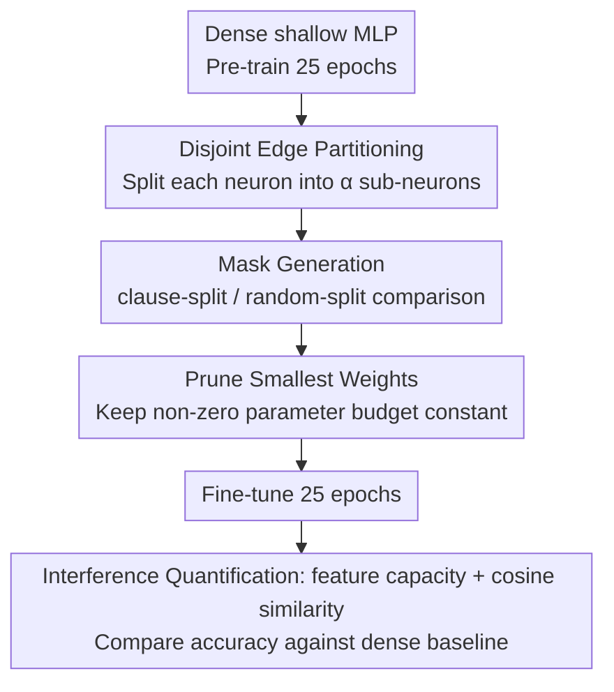

# Expand Neurons, Not Parameters

**Conference**: ICML 2026  
**arXiv**: [2510.04500](https://arxiv.org/abs/2510.04500)  
**Code**: Not disclosed  
**Area**: Interpretability / Superposition Hypothesis / Sparse Networks  
**Keywords**: Neuron expansion, Superposition hypothesis, Polysemanticity, Fixed parameters, Feature interference

## TL;DR
By "splitting" each neuron into $\alpha$ sparse sub-neurons that partition the original input edges while keeping the total number of non-zero parameters constant, feature interference (polysemanticity) between neurons can be significantly reduced. This leads to consistent accuracy improvements across Boolean tasks and real-world vision tasks such as CLIP, CNN, and ImageNet.

## Background & Motivation

**Background**: As neural network scales increase, individual neurons often remain "polysemantic"—a single neuron encodes multiple features simultaneously. This phenomenon is frequently observed in the mechanistic interpretability community. The superposition hypothesis posits that when the number of features exceeds the number of neurons, the network "squeezes" multiple features into the same neuron, leading to feature interference that harms both interpretability and performance. Another line of research (the Lottery Ticket Hypothesis) has found that sparse subnetworks can match or even exceed the accuracy of dense networks, suggesting that "structure" is more critical than "density."

**Limitations of Prior Work**: Existing efforts to mitigate superposition mostly stay at the "analytical" level (e.g., Sparse Autoencoders (SAE) learning a sparse dictionary on activations) without altering the underlying network. While pruning and dynamic sparsification methods can change structure, their primary goals are parameter compression or inference acceleration rather than "reducing polysemanticity." No prior work has addressed "reducing superposition interference" as an optimization objective to guide architecture design.

**Key Challenge**: Under a fixed parameter budget, the number of neurons and the connection density of each neuron are coupled. To make a neuron more "specialized" (monosemantic), more neurons are needed, typically implying more parameters. Conversely, maintaining the parameter count usually requires tolerating polysemanticity. Can these two axes be decoupled?

**Goal**: Under the strict constraint of a fixed number of non-zero parameters, make the network "wider" rather than "denser" to verify: (a) whether this reduces collisions and interference between features; (b) whether the reduction in interference directly translates to improved accuracy; and (c) whether this benefit is most significant in scenarios with "high superposition pressure" (few neurons, many features).

**Key Insight**: The root cause of feature interference is that features are forced to "share" the input edges of the same neuron. If the $d$ input edges of a neuron are partitioned into a disjoint partition for $\alpha$ sub-neurons, where each sub-neuron sees only $d/\alpha$ edges, the probability of two features colliding in the same sub-neuron decreases exponentially. Meanwhile, each feature still has a high probability of being covered by some sub-neuron. Theoretically, it can be proven that the collision probability is $\approx \alpha^{-(2k-1)}$ (where $k$ is the number of literals per clause), while the coverage remains nearly constant.

**Core Idea**: Use "edge partitioning" as a mechanistic probe—expand each neuron into $\alpha$ sparse sub-neurons without increasing non-zero parameters. These sub-neurons cover the input of the original neuron but do not overlap, thereby maximizing feature coverage and minimizing feature collision.

## Method

### Overall Architecture

The method is called **Fixed Parameter Expansion (FPE)**, positioned as a "mechanistic probe" rather than a deployable recipe. It answers whether increasing the number of neurons and making each connection sparser—while keeping the total non-zero parameters strictly constant—can reduce feature interference and yield accuracy gains. Specifically, a dense shallow MLP is trained near convergence, then the hidden layer is "widened": each original neuron is replicated into $\alpha$ sub-neurons that partition the original input edges. Excess parameters from replication are compensated for by pruning the smallest weights. Finally, the network is fine-tuned under the same settings and compared with the dense baseline for accuracy and interference metrics.

### Key Designs

**1. Disjoint Edge Partitioning: Expanding feature capacity with more neurons instead of more parameters**

Superposition interference stems from multiple features sharing the input edges of the same neuron. FPE addresses this directly. Given a hidden width $h$ and expansion factor $\alpha > 1$, the width is expanded to $h' = \alpha h$. The original $i$-th neuron weight $\mathbf{w}_i$ is copied to $\alpha$ sub-neurons, and $d$ input dimensions are partitioned using $\alpha$ disjoint binary masks $\mathbf{m}_{(i_k)} \in \{0, 1\}^d$ (where $\sum_k \mathbf{m}_{(i_k)} = \mathbf{1}_d$). The second layer $\mathbf{W}_2 \in \mathbb{R}^{C \times h}$ replicates each output weight $\alpha$ times to $\mathbf{W}_2' \in \mathbb{R}^{C \times h'}$. To maintain the budget, weights with the smallest absolute values in $\mathbf{W}_1', \mathbf{W}_2'$ are pruned such that $\|\mathbf{W}_1'\|_0 = \|\mathbf{W}_1\|_0$ is strictly satisfied. From a feature channel coding perspective, FPE increases the number of available rows without increasing the parameter budget, raising the capacity upper bound.

**2. Mask Generation: Dissecting mechanisms via clause-split and random-split**

The masks determine which input dimensions a sub-neuron inherits. Two methods are compared: *clause-aware split* (grouping literals of the same clause into the same sub-neuron for Boolean tasks) and *random-split* (partitioning input dimensions randomly). The inclusion of random-split tests whether reducing collisions alone—without precise feature identification—provides benefits. Results show that random-split outperforms the dense baseline in all settings, confirming that collision reduction, rather than semantic alignment, is the primary driver.

**3. Interference Quantification: Linking mechanism to performance via feature capacity and cosine similarity**

To prove that reducing superposition is the cause of improvement, the authors define feature capacity $C_i = (W_{\cdot,i} \cdot W_{\cdot,i})^2 / \sum_j (W_{\cdot,i} \cdot W_{\cdot,j})^2$. A higher $C_i$ indicates a larger "exclusive" representation subspace for feature $i$. They also calculate the average cosine similarity of all neuron weight vectors; lower values represent more orthogonal, decoupled features. Least-squares regression shows a strong correlation between these metrics and relative accuracy gains, quantitatively linking "Width $\uparrow \rightarrow$ Interference $\downarrow \rightarrow$ Accuracy $\uparrow$".

### Loss & Training

The task uses standard classification losses: Sigmoid + BCE for binary classification and Softmax + Cross-entropy for multi-class classification, without additional regularization. Training consists of two stages: a 25-epoch warmup, followed by the application of FPE and a 25-epoch fine-tuning. The dense baseline is trained for the full 50 epochs for a fair comparison. Masks are fixed after initialization.

## Key Experimental Results

### Main Results

| Task / Setting | Configuration | Dense Baseline | FPE (random) | FPE (clause/feature) | Gain |
| :--- | :--- | :--- | :--- | :--- | :--- |
| Boolean DNF, 8 clauses, 8 neurons, $\alpha=2$ | symbolic | 78.7% | 88.7% | **99.4%** | +26% |
| CLIP-CIFAR-100, 32 pre-expand neurons, $\alpha=4$ | frozen embed | — | ≈ Matches 1.2× param dense model | — | Equivalent to doubling params |
| FashionMNIST / CLIP-ImageNet-100 / CLIP-ImageNet-1k | Multiple widths | baseline | Consistent improvement | Consistent improvement | Significant |
| CIFAR-100 + Trainable CNN backbone (256/512 dim) | joint learning | baseline | Consistent improvement | Consistent improvement | Largest gain at minimum width |

On CLIP-CIFAR-100 with small neuron counts, FPE nearly doubles accuracy. Random-split and feature-based split perform similarly on real data, unlike in Boolean tasks where clause-split leads significantly.

### Ablation Study

| Configuration | Key Findings |
| :--- | :--- |
| Increase $\alpha$ ($2 \to 4$) | Gains continue to rise, validating theoretical exponential decay of interference. |
| Increase clause count (fixed 8 neurons) | Gains rise then saturate at ≈16 clauses; extreme superposition cannot be fully decoupled. |
| Increase neuron count (fixed 8 clauses) | Gain monotonically decreases as superposition pressure drops with more neurons. |
| Overlapping inputs with sub-neurons | Significantly worse than FPE, proving disjointness is the key factor. |
| vs DropConnect (same budget) | FPE is equal or superior, excluding "simple random sparse regularization" as an explanation. |

### Key Findings

- **Collision, not semantic alignment, is the primary cause**: Random-split outperforms the dense baseline across all settings and matches feature-based split on real-world vision tasks.
- **Interference metrics correlate strongly with accuracy**: Changes in feature capacity and cosine similarity can linearly predict relative accuracy improvements ($R^2$ is high).
- **Higher superposition pressure yields higher FPE returns**: Relative gains are largest when the ratio of features to neurons is high.
- **Hardware Friendship**: Maintaining non-zero parameters while increasing neuron count fits modern accelerators where memory transfer is a bottleneck (provided sparse kernels are supported).

## Highlights & Insights

- **Applying interpretability insights "in reverse" for architecture design**: While mechanistic interpretability is usually used to explain trained models, this work uses the superposition hypothesis to guide design choices ("more neurons + sparser edges").
- **Analytic collision estimates match empirical gains**: The theoretical collision decay rate of $\alpha^{-(2k-1)}$ aligns with the empirical gain curves as $\alpha$ increases.
- **Is disjointness necessary?**: Through strict comparisons between disjoint and non-disjoint inputs, the authors prove that it is not enough to simply widen or add randomness; one must explicitly ensure that sub-neurons do not share inputs.

## Limitations & Future Work

- **Concept Validation**: FPE is a "mechanistic proof of concept," not a production-ready recipe. Real-world acceleration requires specialized sparse kernels.
- **Heuristic Feature Partitioning**: Gram clustering on real data does not guarantee the recovery of "true" feature structures and does not outperform random-split, suggesting a need for better feature attribution tools (like SAE).
- **Structural Assumptions**: Disjoint input partitioning might be unfriendly to low-dimensional or tightly coupled features.
- **Future Directions**: Combining FPE with SAE (using SAE to identify true features for splitting) and scaling to Transformer architectures.

## Related Work & Insights

- **vs Superposition / SAE (Elhage 2022; Cunningham 2023)**: These works use sparse dictionaries to "analyze" superposition. This paper is the first to "reverse" this perspective to modify the network structure to reduce it.
- **vs Lottery Ticket / Pruning (Frankle & Carbin 2018)**: Pruning aims for compression; FPE "widens and sparsifies" to reduce interference while strictly maintaining the parameter count.
- **vs Network Growth**: Growth methods increase parameters; FPE decouples neuron count from parameter count.
- **vs DropConnect (Wan 2013)**: DropConnect uses random sparsity as regularization; FPE is a deterministic, permanent disjoint sparse architecture aimed at collision reduction.

## Rating
- Novelty: ⭐⭐⭐⭐ Implementation of superposition hypothesis as an architecture design principle is unique.
- Experimental Thoroughness: ⭐⭐⭐⭐ Broad coverage from Boolean tasks to ImageNet-1k, providing mechanistic evidence.
- Writing Quality: ⭐⭐⭐⭐ Clear progression from theory to Boolean validation to real-world tasks.
- Value: ⭐⭐⭐⭐ Provides actionable evidence for the "superposition $\to$ polysemanticity $\to$ performance loss" chain.

<!-- RELATED:START -->

## Related Papers

- [\[ICLR 2026\] Learning to Weight Parameters for Training Data Attribution](../../ICLR2026/interpretability/learning_to_weight_parameters_for_training_data_attribution.md)
- [\[ICML 2026\] LLMs Lean on Priors, Not Programming Language Semantics](llms_lean_on_priors_not_programming_language_semantics.md)
- [\[ICML 2026\] Position: Zeroth-Order Optimization in Deep Learning Is Underexplored, Not Underpowered](position_zeroth-order_optimization_in_deep_learning_is_underexplored_not_underpo.md)
- [\[ICLR 2026\] Hedonic Neurons: A Mechanistic Mapping of Latent Coalitions in Transformer MLPs](../../ICLR2026/interpretability/hedonic_neurons_a_mechanistic_mapping_of_latent_coalitions_in_transformer_mlps.md)
- [\[ICLR 2026\] The Achilles' Heel of LLMs: How Altering a Handful of Neurons Can Cripple Language Abilities](../../ICLR2026/interpretability/the_achilles_heel_of_llms_how_altering_a_handful_of_neurons_can_cripple_language.md)

<!-- RELATED:END -->
## Related Papers

- [\[ICML 2026\] LLMs Lean on Priors, Not Programming Language Semantics](llms_lean_on_priors_not_programming_language_semantics.md)
- [\[ICML 2026\] Position: Zeroth-Order Optimization in Deep Learning Is Underexplored, Not Underpowered](position_zeroth-order_optimization_in_deep_learning_is_underexplored_not_underpo.md)
- [\[ACL 2025\] The Knowledge Microscope: Features as Better Analytical Lenses than Neurons](../../ACL2025/interpretability/the_knowledge_microscope_features_as_better_analytical_lenses_than_neurons.md)
- [\[NeurIPS 2025\] Dense SAE Latents Are Features, Not Bugs](../../NeurIPS2025/interpretability/dense_sae_latents_are_features_not_bugs.md)
- [\[ACL 2025\] Cracking Factual Knowledge: A Comprehensive Analysis of Degenerate Knowledge Neurons in Large Language Models](../../ACL2025/interpretability/degenerate_knowledge_neurons.md)

<!-- RELATED:END -->
