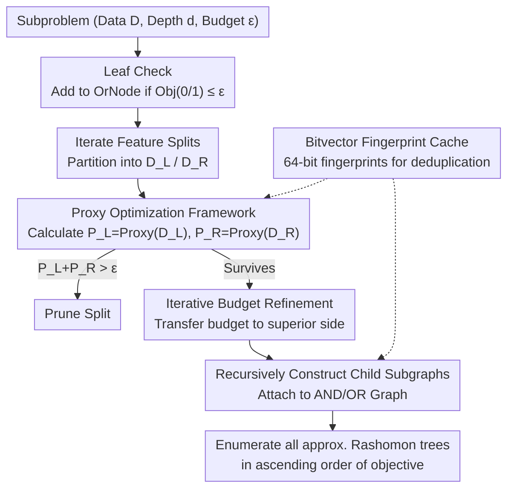

# From Rashomon Theory to PRAXIS: Efficient Decision Tree Rashomon Sets

**Conference**: ICML 2026  
**arXiv**: [2606.00202](https://arxiv.org/abs/2606.00202)  
**Code**: https://github.com/zakk-h/PRAXIS  
**Area**: Explainable Machine Learning / Rashomon Sets / Sparse Decision Trees  
**Keywords**: Rashomon Sets, Sparse Decision Trees, Approximation Algorithms, Proxy Optimization, Branch-and-Bound

## TL;DR
PRAXIS utilizes a "fast but approximate" proxy algorithm (an improved version of LicketySPLIT) to estimate the optimal objective value of subproblems, enabling "expand-on-demand" pruning search for sparse decision tree Rashomon sets. This reduces runtime and memory complexity from being exponential in tree space to "polynomial time per output tree," successfully processing datasets with 11M samples and 472 features while maintaining recall $\ge 0.98$.

## Background & Motivation

**Background**: The Rashomon set (the collection of all "near-optimal" models for a given dataset and loss) is a crucial paradigm in explainable ML. Once all near-optimal sparse decision trees are enumerated, users can apply secondary objectives—such as fairness, causal constraints, or specific feature requirements—by simply traversing the set. Representative works include TreeFARMS (Xin 2022) and SORTeD (Arslan 2026), both of which exactly enumerate Rashomon sets using branch-and-bound and dynamic programming.

**Limitations of Prior Work**: Exact algorithms suffer from exponential growth in runtime and memory relative to depth and feature count. The paper highlights stark contrasts: the search space for a tree with depth 4 and 20 features is approximately $8.4 \times 10^{18}$. On real-world data, TreeFARMS frequently encounters OOM (Out-of-Memory) with over 100 features, and SORTeD requires nearly 35 hours for the Churn dataset (472 features). RESPLIT (Babbar 2025) is the SOTA approximate method but remains "exponential in the worst case for each tree" and shows very low recall on true Rashomon sets (Figure 3 shows 0 trees actually falling into the target Rashomon set for Churn/Electricity).

**Key Challenge**: The decision tree Rashomon set itself may occupy an extremely tiny fraction of the hypothesis space (estimated at $10^{-37}$ by Semenova 2022). However, existing algorithms' overheads are proportional to the entire search space rather than the size of the output set, leading to "exponential waste to output a single tree."

**Goal**: Construct an approximation algorithm for Rashomon sets such that the **marginal cost per output tree is polynomial**, while maintaining recall close to 1.

**Key Insight**: The authors draw on the "pilot method" concept—LicketySPLIT is a single-tree version that uses a fast greedy completion to estimate the true cost of splits. This work generalizes this to Rashomon set enumeration: using a proxy to estimate the optimal objective $\text{Obj}^*$ for each subproblem, and directly pruning any split where $\text{Proxy}(D_L) + \text{Proxy}(D_R) > \varepsilon_{\text{abs}}$.

**Core Idea**: Replace expensive lower-bound estimates with a PROXY algorithm satisfying "recursive refinement" (Definition 3.1), and design an "iterative budget refinement for sibling subproblems" process to ensure pruning is aggressive without losing true members of the Rashomon set.

## Method

### Overall Architecture

PRAXIS aims to enumerate all near-optimal sparse decision trees. The difficulty lies in the fact that exact algorithms scale exponentially with the total tree space. Its solution is to use a fast approximate proxy to estimate "how well a subproblem can perform." Any split that fails the budget even under the proxy is pruned immediately, focusing the search only on branches likely to produce Rashomon trees.

Specifically, PRAXIS maintains an AND/OR search graph for compact representation. Each subproblem is a triple (data subset $D$, remaining depth $d$, global budget $\varepsilon_{\text{abs}}$), expanded recursively: it first checks if the objectives for leaf nodes (predicting 0 or 1), $C_b = \gamma + |\{y_i \neq b\}|$, are within budget and adds them to the OrNode if so. It then iterates through each feature split $j$ partitioning data into $(D_L, D_R)$, calculates $P_L=\text{Proxy}(D_L,d-1,\gamma)$ and $P_R=\text{Proxy}(D_R,d-1,\gamma)$, and prunes splits where $P_L+P_R>\varepsilon_{\text{abs}}$. Surviving splits are handled by `Solve_Siblings`, which allocates budget to siblings, recursively constructs the subgraph, and attaches it back to the OR-graph. The final graph allows enumeration of all approximate Rashomon trees in ascending order of objective values. The budget can be explicit or multiplicative $(1+\varepsilon_{\text{mult}})\cdot\text{Proxy}(D,d,\gamma)$. The objective function is fixed as $\text{Obj}(t,D,\gamma)=\gamma|t|+\sum_i \mathbb{1}\{t(x_i)\neq y_i\}$, where $|t|$ is the number of leaves and $\gamma=\lambda|D|$.

### Key Designs

**1. Proxy Optimization Framework: Replacing Exponential Bounds with Fast Approximations**

Exact algorithms (like TreeFARMS) use "optimal subtree objectives" as lower bounds for pruning, but calculating these bounds themselves requires exponential search. PRAXIS uses a proxy satisfying "recursive refinement" (Def 3.1): $\text{Proxy}(D,d,\gamma)=\text{Obj}(t)$ for some real tree $t$, and its child estimates must not exceed the true values of those subtrees. This enables safe pruning using $P_L+P_R>\varepsilon_{\text{abs}}$ while turning the framework into a spectrum: when the proxy is optimal, PRAXIS becomes exact enumeration; when approximate, it still prunes aggressively. The default proxy is an improved LicketySPLIT, which calculates leaf objectives, greedily finds splits, and minimizes between leaves and recursive calls. The cost per proxy call is only $O(nk^2d^2)$, pushing overall complexity to $O(|R|nk^3d^3)$—meaning the **marginal cost per Rashomon tree is polynomial** (Theorem 3.2), providing a super-polynomial speedup over optimal DP (Corollary 3.3).

**2. Iterative Budget Refinement: Preventing Loss of Trees due to Pessimistic Proxies**

Allocating the root budget $\varepsilon_{\text{abs}}$ to siblings is critical. Since proxies are pessimistic estimates, a simple split might stifle valid branches if both sides are better than the proxy. `Solve_Siblings` (Algorithm 3) uses a "ping-pong" iteration: it first assumes the right side only achieves its proxy level, providing the left side with $\varepsilon_L^{\text{new}}=\varepsilon_{\text{abs}}-P_R$ to find $G_L$ and its true minimum objective $G_L.\text{min\_obj}$. This tighter value then relaxes the right budget $\varepsilon_R^{\text{new}}=\varepsilon_{\text{abs}}-G_L.\text{min\_obj}$ to solve $G_R$, and so on. This reallocates excess budget to the side producing better trees without re-running the entire search, helping satisfy the recovery conditions (Theorem 3.5 "frontier cut").

**3. Bitvector Fingerprint Cache: Combining TreeFARMS Reuse with SORTeD Memory Efficiency**

Different split sequences often result in the same data subset. TreeFARMS uses $n$-length bitvectors as keys for exact deduplication, which is memory-intensive. SORTeD uses split sets as keys to save memory but misses equivalent subsets from different paths. PRAXIS hashes each bitvector alongside depth and budget into a 64-bit fingerprint as a cache key. Every subproblem encountered in the proxy and greedy routines is cached. This allows memory to store only fingerprints/solutions while time complexity benefits from reusing truly equivalent subproblems. The actual memory complexity is $O(nk+\sum_{t\in R}|t|)$ (Theorem 3.4).

### Loss & Training

No continuous training loss (discrete decision tree structure + 0/1 loss). Optimization objective: $\text{Obj}(t, D, \gamma) = \gamma |t| + \sum_i \mathbb{1}\{t(x_i) \neq y_i\}$; $\gamma$ is constrained to integers to avoid floating-point issues. Experiments use $\lambda \in \{0.005, 0.01, 0.02\}$, $\varepsilon_{\text{mult}} = 0.03$, and depth $d=5$ (some $d=7$).

## Key Experimental Results

### Main Results

Comparison of PRAXIS / TreeFARMS / SORTeD / RESPLIT on 50 dataset-binarization combinations ($\lambda=0.02, \varepsilon=0.03, d=5$); "–" indicates timeout (90h) or OOM (200GB RAM):

| Dataset ($n / k$) | PRAXIS Time (s) | SORTeD Time (s) | RESPLIT Time (s) | PRAXIS Peak MB | SORTeD Peak MB |
|------|------|------|------|------|------|
| Churn (5K / 472) | **34.84** | 123776 (~34h) | 2564 | 279 | 22013 |
| Christine (5.4K / 231) | **944** | 38971 (~10.8h) | 12625 | 10439 | 12710 |
| Covertype (581K / 96) | **358** | 64673 (~18h) | 10102 | 1301 | 16107 |
| Higgs (11M / 84) | **2375** (~40 min) | – | – | 21537 | – |
| Compas (5K / 44) | **0.09** | 7.23 | 11.90 | 130 | 163 |

PRAXIS achieves up to a 5-order-of-magnitude speedup over TreeFARMS, 3 over SORTeD, and 2 over RESPLIT. Memory efficiency is $\approx 5\times$ relative to RESPLIT and up to 4 orders of magnitude better than TreeFARMS.

### Key Findings

- **Proxy Quality is Paramount**: Using weaker proxies (e.g., pure greedy CART) severely degrades recall and speed (Appendix D.5). Small refinements to LicketySPLIT (post-recursive leaf comparison and $d=1$ accuracy maximization) are crucial for high recall.
- **Approximation Quality**: In 22 datasets with ground truth, average recall was $\ge 0.98$ (Table 2). On massive datasets where TreeFARMS/SORTeD fail (e.g., Churn), PRAXIS finds over 1M trees better than RESPLIT's best tree, whereas **none of RESPLIT's trees** fall within the target Rashomon set (Figure 3).
- **Single-Tree Competitiveness**: As a single-tree solver, PRAXIS recovers the global optimum in all 50 datasets at $\lambda=0.02$ and is up to 3 orders of magnitude faster than STreeD/GOSDT (e.g., <3 min vs >20h on News).
- **Depth Scalability**: At $d=7$, PRAXIS completes in 11s while SORTeD fails within 150h, showing a 4-order-of-magnitude speedup over RESPLIT.

## Highlights & Insights

- **Output-Sensitive Complexity**: A theoretical paradigm shift—rewriting Rashomon set enumeration complexity from search-space-dependent to output-size-dependent $O(|R| n k^3 d^3)$, with proven super-polynomial speedup (Cor 3.3).
- **Generalization of Pilot Methods**: Transitioning from selecting a single best split (LicketySPLIT) to pruning an entire collection. The proxy supports evaluation, pruning, and budget refinement simultaneously within a unified caching system.
- **Frontier Cut & Iterative Refinement**: Theorem 3.5 defines a sufficient condition for recall. The iterative refinement in Algorithm 3 ensures that even when proxies overestimate costs, high-quality trees are "saved" by reallocating budget.
- **Scalability**: Successfully pushes the Rashomon set paradigm from "hundreds of features" to "hundreds of features + tens of millions of samples," moving it from academic demos to practical utility.

## Limitations & Future Work

- **Binary Focus**: Only supports binary classification and binary features. Continuous features require pre-binarization, and multi-class/regression are not explored.
- **Proxy Tradeoff**: Stronger proxies yield higher recall but slower individual calls. The "family of proxy algorithms" (Appendix B.5) is not systematically discussed regarding optimal selection.
- **Theoretical Gaps**: The "frontier cut" condition is hard to verify a priori, and Cor 3.6 provides only worst-case bounds. While empirical recall is near 1.0, it is not strictly guaranteed.
- **Hash Collisions**: 64-bit fingerprints could theoretically collide in extreme cases ($n \to \infty$ or massive subproblem counts), though the paper notes this probability is vanishingly small.

## Related Work & Insights

- **vs TreeFARMS (2022)**: Both target Rashomon sets; TreeFARMS uses bitvectors + exact DP but suffers from memory explosion. PRAXIS uses proxies + fingerprint caching to achieve linear memory relative to the output.
- **vs SORTeD (2026)**: SORTeD saves memory using split-based keys but misses equivalent subsets. PRAXIS combines the best of both worlds with fingerprinting and reduces per-tree cost to polynomial.
- **vs RESPLIT (2025)**: Both are approximate; RESPLIT uses exact subproblems with approximate stitching (still worst-case exponential per tree). Ours uses global approximate search with proxy pruning, significantly outperforming RESPLIT in recall and speed.
- **vs GOSDT / STreeD**: These are optimal single-tree solvers. PRAXIS can function as an extremely fast approximate optimal tree solver, showing 3 orders of magnitude speedup.

## Rating
- **Novelty**: ⭐⭐⭐⭐ Systematically adapts pilot/rollout methods for set enumeration and proves output-sensitive polynomial complexity.
- **Experimental Thoroughness**: ⭐⭐⭐⭐⭐ Extensive testing across 50 datasets, 11M samples, and 472 features, evaluating time, memory, recall, and optimality.
- **Writing Quality**: ⭐⭐⭐⭐ Algorithms are clearly delineated; theoretical results and engineering optimizations (caching, proxies) are well-integrated.
- **Value**: ⭐⭐⭐⭐⭐ Enables practical application of Rashomon sets for explainable ML, fairness auditing, and variable importance on industrial-scale data.

<!-- RELATED:START -->

## Related Papers

- [\[ICLR 2026\] DIVERSE: Disagreement-Inducing Vector Evolution for Rashomon Set Exploration](../../ICLR2026/interpretability/diverse_disagreement-inducing_vector_evolution_for_rashomon_set_exploration.md)
- [\[ICML 2026\] Diagnosing the Reliability of LLM-as-a-Judge via Item Response Theory](diagnosing_the_reliability_of_llm-as-a-judge_via_item_response_theory.md)
- [\[ICML 2026\] PINE: Pruning Boosted Tree Ensembles with Conformal In-Distribution Prediction Equivalence](pine_pruning_boosted_tree_ensembles_with_conformal_in-distribution_prediction_eq.md)
- [\[ICML 2026\] Verified SHAP: Provable Bounds for Precise Shapley Values in Neural Networks](verified_shap_provable_bounds_for_exact_shapley_values_of_neural_networks.md)
- [\[ICML 2026\] Formal Concept Lattices are Good Semantic Scaffolds for Concept-Based Learning](formal_concept_lattices_are_good_semantic_scaffolds_for_concept-based_learning.md)

<!-- RELATED:END -->
