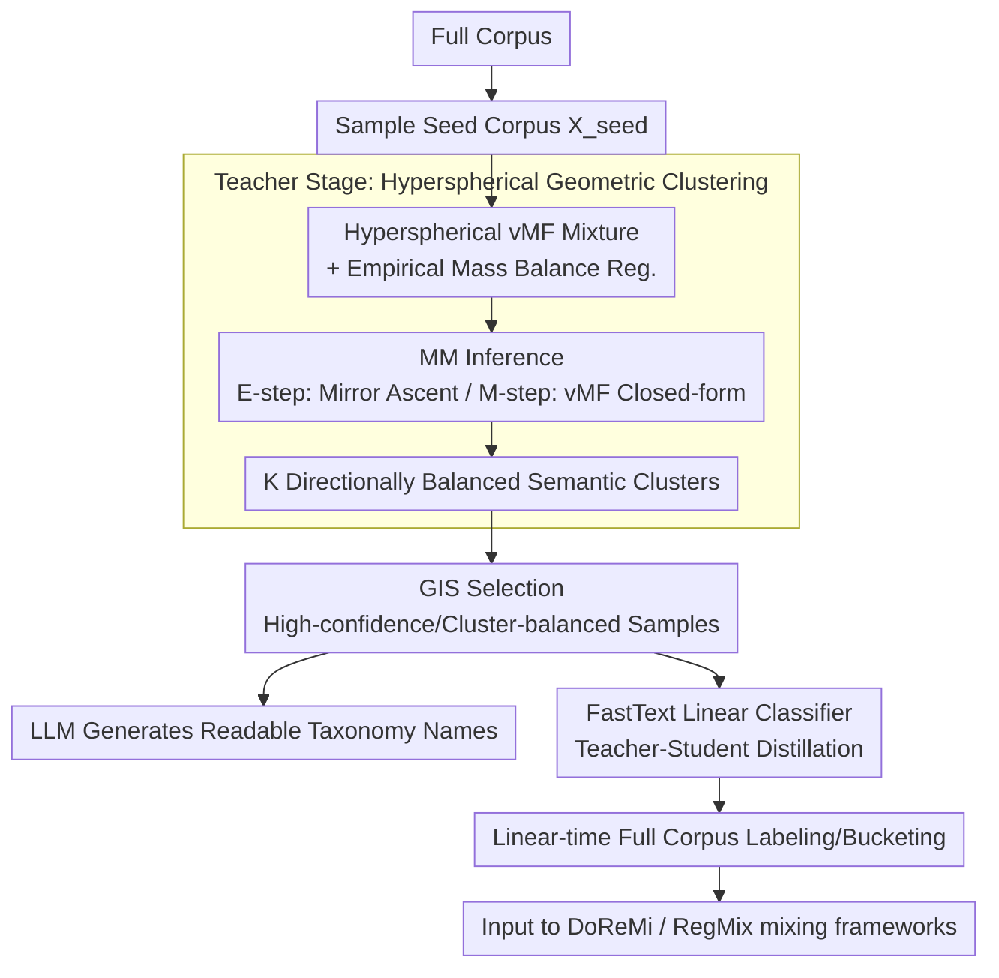

# GEM: Geometric Entropy Mixing for Optimal LLM Data Curation

**Conference**: ICML 2026  
**arXiv**: [2605.26121](https://arxiv.org/abs/2605.26121)  
**Code**: TBD  
**Area**: LLM Pre-training / Data Mixing  
**Keywords**: Data Mixing, Hyperspherical Clustering, von Mises-Fisher, MM Algorithm, Balance Regularization

## TL;DR
GEM reformulates the LLM pre-training data categorization problem as a variational objective involving vMF mixtures on a hypersphere combined with balance regularization. Solved via a provably monotonic Minorize-Maximize (MM) algorithm and distilled into a FastText classifier via a Teacher-Student setup, GEM achieves an average improvement of approximately 1.2% across DoReMi, Perf, and RegMix frameworks on 1.1B models.

## Background & Motivation

**Background**: The effectiveness of LLM pre-training increasingly depends on "data proportions." Dynamic mixing methods such as DoReMi, RegMix, Aioli, and SampleMix have become mainstream, all of which presuppose the division of corpora into several "semantic buckets" before learning the weights between them.

**Limitations of Prior Work**: Existing "bucketing" schemes fall into two categories, each with significant drawbacks. One category includes manual taxonomy-based methods like WebOrganizer/TnT-LLM, which use LLMs to label web pages. These human-defined taxonomies suffer from ontological misalignment (mismatch between human categories and actual model-perceived semantic granularity) and unsustainable costs for frequent updates. The other category includes unsupervised methods like K-Means/HDBSCAN. While scalable, these are based on Euclidean geometry, which is inherently incompatible with modern text embeddings (e.g., BGE, RoBERTa) trained using cosine similarity. Combined with the anisotropy/cone effect (embeddings concentrated in a narrow cone), this leads to cluster collapse—where a few large buckets consume all long-tail semantics, causing diversity collapse.

**Key Challenge**: While actual embeddings reside on the high-dimensional hypersphere $\mathcal{S}^{d-1}$ and signals are contained in directions (cosine similarity), clustering objectives are built in Euclidean space. Furthermore, the mixture weights $\alpha_k$ learned in standard EM exhibit a "rich-get-richer" feedback loop, further pushing mass toward a few dominant clusters.

**Goal**: (i) Establish semantic division based on directional statistics on the hypersphere, naturally compatible with cosine similarity; (ii) explicitly suppress cluster mass collapse to obtain "balanced and semantically distinct" buckets; and (iii) enable low-cost deployment on trillion-token corpora.

**Key Insight**: Use von Mises-Fisher (vMF) mixtures for directional generative modeling—where the sufficient statistics $\mu_k^\top x$ correspond precisely to cosine similarity. Address the "collapse" problem by decoupling the generative prior $\alpha_k$ from the empirical soft mass $\mathbf{\pi}(\Gamma)$, applying a quadratic balance regularization $-\tfrac{\lambda}{2}\lVert\mathbf{\pi}-\mathbf{u}\rVert_2^2$ directly to the empirical mass.

**Core Idea**: Perform joint variational optimization of "entropy-regularized ELBO + empirical mass balance" on the hypersphere. Derive an E-step that is decomposable across all samples and provably monotonic using the Minorize-Maximize (MM) algorithm to stably solve for directionally balanced semantic buckets.

## Method

### Overall Architecture
GEM addresses the "categorization into semantic buckets" step—it does not learn mixing weights itself but provides optimized buckets for algorithms like DoReMi/RegMix. It replaces Euclidean clustering with vMF mixture modeling on the hypersphere, augmented by balance regularization to suppress long-tail collapse, and distills the result into a linear classifier. The pipeline consists of two stages: The **Teacher Stage** performs vMF mixture clustering on a sampled seed corpus $\mathcal{X}_{seed}$. MM iterations update the Riemannian parameters $(\mu_k, \kappa_k)$ and soft assignments $\gamma_{ik}$ to identify $K$ directionally balanced clusters. Geometric Influence Score (GIS) is then used to select representative samples for each cluster to generate human-readable taxonomy names via an LLM. The **Student Stage** uses high-confidence, cluster-balanced pseudo-labels selected by GIS to distill a lightweight FastText classifier, reducing the labeling time for the full corpus to linear complexity. The resulting buckets are fed into any mixing framework.

### Key Designs

**1. Hyperspherical vMF Mixture + Empirical Mass Balance Regularization: Aligning Metric with Cosine and Decoupling Collapse Mitigation**

The pain point is that modern text embeddings are trained via cosine similarity, with signals residing in directions, yet K-Means models the objective in Euclidean space. GEM models each cluster as a vMF component $f_{\text{vMF}}(x\mid\mu_k,\kappa_k)=C_d(\kappa_k)\exp(\kappa_k\mu_k^\top x)$, where the sufficient statistic is the directional dot product $\mu_k^\top x$, aligning the "geometric space" with the "embedding space." Collapse is treated separately: the mixture prior is fixed at $\alpha_k\equiv 1/K$ to break the "rich-get-richer" EM feedback loop, and a quadratic penalty $-\tfrac{\lambda}{2}\lVert\boldsymbol{\pi}(\Gamma)-\mathbf{u}\rVert_2^2$ (where $\mathbf{u}=\tfrac{1}{K}\mathbf{1}$) is added to the entropy-regularized ELBO focusing solely on the empirical soft mass $\pi_k(\Gamma)=\tfrac{1}{N}\sum_i\gamma_{ik}$. Applying balance to the empirical mass rather than the generative prior preserves interpretability while supporting long-tail clusters under anisotropic embeddings.

**2. Provably Monotonic MM Inference: Decomposing Globally Coupled Regularization into Per-sample Local Updates**

Direct maximization of the objective is difficult because $\boldsymbol{\pi}(\Gamma)$ couples all samples, preventing distributed optimization. GEM leverages the fact that the regularization term $R(\boldsymbol{\pi})$ is a $\lambda$-smooth concave quadratic function to construct a global quadratic minorizer: $R(\boldsymbol{\pi})\geq R(\boldsymbol{\pi}^{(t)})+\langle\nabla R(\boldsymbol{\pi}^{(t)}),\boldsymbol{\pi}-\boldsymbol{\pi}^{(t)}\rangle-\tfrac{\lambda}{2}\lVert\boldsymbol{\pi}-\boldsymbol{\pi}^{(t)}\rVert_2^2$. Substituting this lower bound into the E-step results in a surrogate objective $\widetilde{\mathcal{F}}_t(\Gamma)$ that is concave and decomposable for each $\gamma_i$, solvable via mirror ascent. The M-step provides closed-form vMF updates: $r_k=\sum_i\gamma_{ik}x_i$, $\mu_k=r_k/\lVert r_k\rVert_2$, and concentration $\kappa_k$ estimated from $\bar R_k=\lVert r_k\rVert_2/\sum_i\gamma_{ik}$ via the high-dimensional approximation $\kappa_k\approx(\bar R_k d-\bar R_k^3)/(1-\bar R_k^2)$. The MM surrogate ensures that each step is non-decreasing ($\mathcal{F}(\Theta^{(t)},\Gamma^{(t+1)})\geq\mathcal{F}(\Theta^{(t)},\Gamma^{(t)})$), ensuring stable convergence on large-scale data.

**3. GIS Selection + Teacher-Student Distillation to FastText: Compressing Geometric EM into Online-ready Linear Inference**

Web-scale corpora are extremely sensitive to latency. GEM uses Geometric Influence Score to select high-confidence, cluster-balanced representative samples as a pseudo-label set to distill a FastText linear classifier. This fixes the categorization step to linear time. The same GIS samples are provided to an LLM to write semantic descriptions, automatically generating a readable taxonomy. This preserves the geometric balance of GEM while ensuring the categorization latency remains manageable for mainstream mixing pipelines.

### Loss & Training
The variational objective is given by Eq.(3): $\max_{\Theta,\Gamma}\sum_i\sum_k\gamma_{ik}\log(\alpha_k f_{ik}(\Theta))+\sum_i H(\gamma_i)-\tfrac{\lambda}{2}\lVert\boldsymbol{\pi}(\Gamma)-\mathbf{u}\rVert_2^2$. In main experiments, $K=24$ and $\lambda=5000$ (aligned with the logit scale of learned concentration $\kappa\approx 900$). The backbone is a 1.1B LLaMA-style Transformer with a 25B token pre-training budget; data is sourced from CommonCrawl refined through RefinedWeb-style cleaning.

## Key Experimental Results

### Main Results
Gains from replacing the bucketing module with GEM across three mixing frameworks, with 9 OLMES tasks summarized across Science QA, Commonsense, and Logic & Linguistics (selected from Table 1):

| Mixing Framework | Bucketing Method | Science QA | Commonsense | Logic & Ling. | Average |
|---|---|---|---|---|---|
| DoReMi | Spherical K-Means | 34.62 | 38.97 | 54.72 | 42.77 |
| DoReMi | WebOrganizer (Format) | 34.44 | 38.73 | 55.19 | 42.79 |
| DoReMi | **GEM** | **34.79** | **39.96** | **57.11** | **43.95** |
| Perf | WebOrganizer (Format) | 35.06 | 39.73 | 57.97 | 44.25 |
| Perf | **GEM** | **35.96** | **40.43** | **57.98** | **44.79** |
| RegMix | WebOrganizer (Format) | 34.12 | 33.94 | 54.26 | 40.77 |
| RegMix | **GEM** | **34.07** | **35.30** | **54.97** | **41.45** |

Under DoReMi, GEM improves upon the strongest baseline (WebOrganizer) by +1.23 pt and +1.76 pt in Commonsense and Logic tasks, respectively. The overall Average improvement is approximately 0.7–1.2 pt.

### Ablation Study
Ablation of "Geometry + Balance" dimensions (from Figure 6 and GEM analysis):

| Configuration | Average | Description |
|---|---|---|
| K-Means (Euclidean + Hard) | 38.5 | Fully Euclidean; most severe cluster collapse. |
| Spherical K-Means (Spherical + Hard) | ↑ | Metric shifted to cosine; mitigates anisotropy. |
| Vanilla vMF (Spherical Soft, No Reg.) | ↑↑ | Riemannian generative model used; still prone to collapse. |
| **GEM (Full)** | **Highest** | Addition of empirical mass balance regularization truly opens long-tail. |

Sensitivity to cluster count $K\in\{12, 16, 24, 32, 36, 48\}$ (Figure 5): Performance peaks at $K=36$ (41.21%) and drops slightly at $K=48$, indicating that "over-fragmentation" introduces noise.

### Key Findings
- "Spherical geometry" and "balance regularization" provide monotonically cumulative gains (Euclidean $\rightarrow$ Spherical $\rightarrow$ vMF $\rightarrow$ GEM). Effective long-tail cluster preservation requires both components.
- Using RegMix as a "taxonomy predictability" probe (Spearman $\rho$ distribution across 10 splits in Figure 4), GEM shows a higher median and narrower IQR. This indicates that loss changes resulting from mixing weight perturbations are more "linear" and predictable—a prerequisite for efficient mixing weight search.
- The choice of $\lambda=5000$ aligns with the vMF logit scale ($\kappa\approx 900$), suggesting that balance regularization and the generative model must be matched in magnitude to be effective.

## Highlights & Insights
- **Decoupling Prior and Mass is a Transferable Trick**: Many EM-like algorithms suffer from feedback loops. GEM fixes $\alpha_k$ to a uniform prior and moves balance to the empirical soft mass $\boldsymbol{\pi}(\Gamma)$, effectively separating "distribution modeling" from "empirical distribution." This can be applied to MoE routing load balancing or category distribution in retrieval.
- **Categorization of "Bucket Quality" as "Mixing Predictability"**: Unlike traditional geometric metrics (NMI/Silhouette), GEM uses RegMix Spearman $\rho$ to measure if bucketing provides a smooth optimization coordinate system for mixing—a metric more closely aligned with "data curation" goals.
- **MM over EM**: To maintain decomposability and monotonicity in E-steps for regularized ELBOs, GEM uses a global quadratic minorizer for $\lambda$-smooth concave functions. This template is reusable for any probability model combining likelihood with global regularization.

## Limitations & Future Work
- Main experiments used a 1.1B model and 25B token budget. It remains unverified if the ~1.2% gains persist at 7B+ scales or longer training; mixing gains often narrow as scale increases.
- Geographic quality depends on the text encoder (BGE/RoBERTa used). If switched to more non-isotropic encoders or instruction-tuned models, the strength of the hyperspherical hypothesis is unknown.
- Balance regularization targets a uniform distribution $\mathbf{u}=\tfrac{1}{K}\mathbf{1}$, assuming semantic classes should be equal. However, the real world contains inherently rare topics. Adaptation of $\mathbf{u}$ via downstream rewards could resolve this.
- The distillation student (FastText) is a linear model and may lose fine-grained polysemy. Lightweight students using hyperbolic or product-of-spheres spaces could enhance expressiveness under the same latency constraints.

## Related Work & Insights
- **vs WebOrganizer / TnT-LLM**: These use LLMs to label documents with human taxonomies, which are readable but prone to misalignment and expensive to update. GEM "grows" labels from embedding geometry and uses LLMs for naming, aligning labels with model-perceived semantic granularity.
- **vs Spherical K-Means / Vanilla vMFMM**: While clustering on the sphere, these lack explicit suppression of cluster collapse; GEM fills this gap with empirical mass balance regularization.
- **vs DoReMi / RegMix / Aioli / SampleMix**: These methods assume given buckets; GEM solves their "input" problem. GEM acts as a plug-and-play categorization layer, providing evidence that "optimizing buckets first" is more effective than "adjusting weights on poor buckets."

## Rating
- Novelty: ⭐⭐⭐⭐ The combination of "vMF Mixture + Empirical Mass Balance + MM Inference" is a clear and novel direction.
- Experimental Thoroughness: ⭐⭐⭐⭐ Covering three mixing frameworks, 9 benchmarks, and sensitivity analysis for $K$/$\lambda$/seed; limited to 1.1B scale.
- Writing Quality: ⭐⭐⭐⭐ Motivated clearly with proof-supported lemmas and clean summaries.
- Value: ⭐⭐⭐⭐ Provides a provable, online-ready solution for the categorization pre-requisite of the data mixing community.

<!-- RELATED:START -->

## Related Papers

- [\[ICML 2026\] Position: Let's Develop Data Probes to Fundamentally Understand How Data Affects LLM Performance](position_lets_develop_data_probes_to_fundamentally_understand_how_data_affects_l.md)
- [\[ICML 2026\] Optimal Attention Temperature Improves the Robustness of In-Context Learning under Distribution Shift in High Dimensions](optimal_attention_temperature_improves_the_robustness_of_in-context_learning_und.md)
- [\[ICML 2026\] MiniMax Learning of Interpretable Factored Stochastic Policies from Conjoint Data, with Uncertainty Quantification](minimax_learning_of_interpretable_factored_stochastic_policies_from_conjoint_dat.md)
- [\[ICML 2026\] Diagnosing the Reliability of LLM-as-a-Judge via Item Response Theory](diagnosing_the_reliability_of_llm-as-a-judge_via_item_response_theory.md)
- [\[ICML 2026\] Steer Like the LLM: Activation Steering that Mimics Prompting](steer_like_the_llm_activation_steering_that_mimics_prompting.md)

<!-- RELATED:END -->
