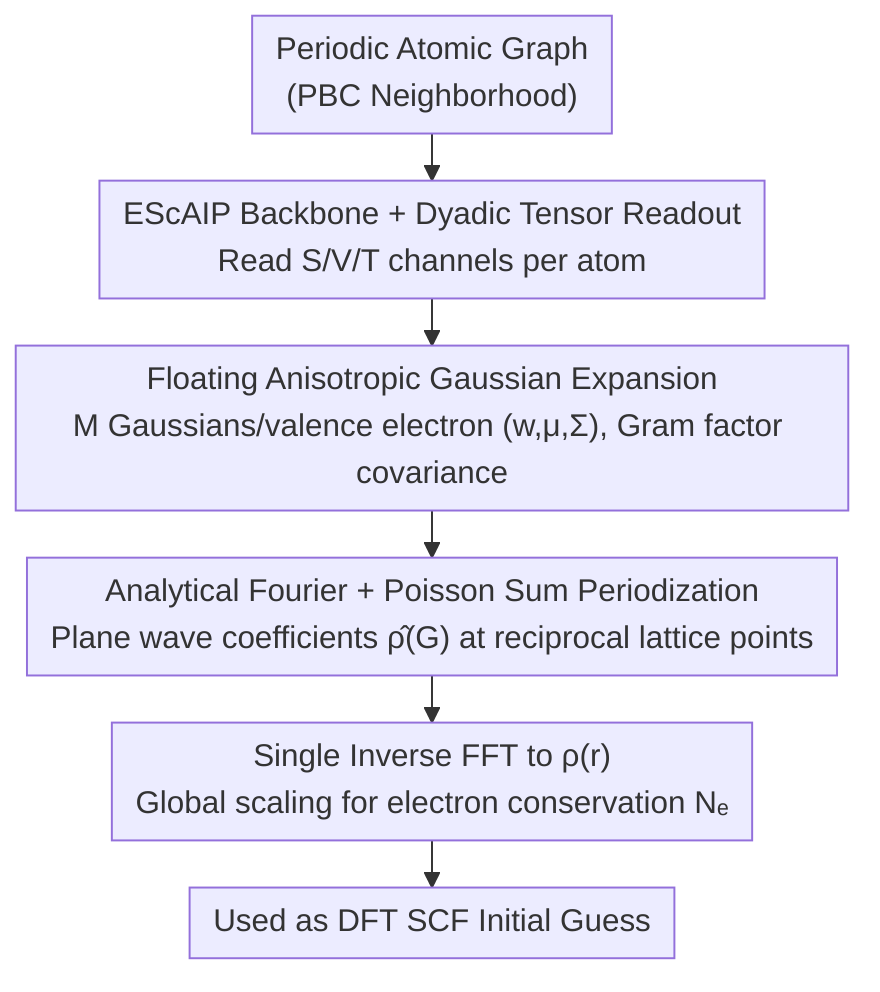

# Global Plane Waves from Local Gaussians: Periodic Charge Densities in a Blink

**Conference**: ICML 2026  
**arXiv**: [2601.19966](https://arxiv.org/abs/2601.19966)  
**Code**: https://github.com/Jotels/ELECTRAFI (Available)  
**Area**: Scientific Computing / Machine Learning + DFT / Electronic Structure  
**Keywords**: Charge density prediction, Plane wave basis sets, Anisotropic Gaussians, Poisson summation, DFT initial guess acceleration

## TL;DR
ELECTRAFI predicts the parameters of a set of anisotropic Gaussians in real space, then utilizes the analytical Fourier transform of Gaussians combined with the Poisson summation formula to compute the plane wave coefficients of the periodic crystal's charge density in reciprocal space in a single pass. A single inverse FFT yields the full-field density. While its NMAE is comparable to or better than ChargE3Net, the inference is $463\times \sim 633\times$ faster, truly reducing the total end-to-end DFT time by $\sim 20\%$.

## Background & Motivation

**Background**: Kohn–Sham DFT is the most common electronic structure method in physics, chemistry, and materials science. Mainstream acceleration strategies follow two paths: (1) Machine Learning Interatomic Potentials (MLIP) directly predicting energy/forces to bypass the SCF cycle; (2) retaining the DFT workflow and using ML to predict a high-quality initial charge density $\rho(\mathbf{r})$ as the SCF starting point, thereby reducing the number of self-consistent iterations. The benefit of the latter is that the system still converges to the rigorous self-consistent solution of the target functional via DFT.

**Limitations of Prior Work**: ML density models for periodic systems are split into two camps: **Orbital models** expand density using atom-centered spherical harmonics and radial bases, which works well for small molecules but leads to an explosion of high $l$ and diffuse basis sets for metals/inorganic crystals. **Probe models** (e.g., ChargE3Net, DeepDFT) treat real-space grid points as graph nodes in a GNN; although accurate, they must query $\sim 10^7$ grid points per structure. Inference for a single structure often takes $30\sim80$ seconds, meaning the **saved SCF time is consumed by inference time**, potentially slowing down the end-to-end process.

**Key Challenge**: Periodicity and long-range Coulomb interactions naturally belong in reciprocal space. However, existing models either perform expensive periodic image summation and spherical harmonic expansion in real space or directly use NNs to predict plane wave coefficients (where output dimensions scale with the FFT grid, making them poorly scalable). **Accuracy and inference cost must be jointly optimized** to achieve true DFT wall-clock savings.

**Goal**: Construct a charge density model that is (1) naturally periodic, (2) aligned with plane-wave DFT encoding, (3) capable of analytically handling long-range structures, and (4) has an inference time negligible compared to DFT, ultimately achieving a **net time saving** in real VASP pipelines.

**Key Insight**: Gaussian functions remain Gaussian under Fourier transform and have closed-form expressions. Simultaneously, the **Poisson summation formula** can equivalently rewrite the "summation of Gaussians over all space" as a "Fourier series on reciprocal lattice points." If a set of floating Gaussians is used for local density expansion, the "periodization" step can be offloaded to analytical transforms instead of real-space image sums.

**Core Idea**: Predict local anisotropic Gaussian parameters $(w^{(j)},\boldsymbol{\mu}^{(j)},\boldsymbol{\Sigma}^{(j)})$ in real space → analytically write the Fourier coefficients for each Gaussian at reciprocal lattice points $\mathbf{G}$ → sum to obtain $\hat{\rho}(\mathbf{G})$ → perform one inverse FFT to restore periodic real-space density $\rho(\mathbf{r})$.

## Method

### Overall Architecture
ELECTRAFI addresses how to make ML-predicted initial charge densities naturally satisfy crystal periodicity while being fast enough to be negligible relative to DFT. It splits the task into two parts: the network only predicts local anisotropic Gaussian parameters $(w^{(j)},\boldsymbol{\mu}^{(j)},\boldsymbol{\Sigma}^{(j)})$ in real space, while the expensive "periodization + long-range structure" is handled by analytical Fourier transforms and Poisson summation. The process is as follows: a periodic crystal atomic graph is fed into an attention GNN modified from EScAIP (updating scalar/vector/tensor streams via PBC neighborhoods). Through dyadic neighborhood aggregation, three types of channels are read out for each atom: $S\in\mathbb{R}^{N\times C}$, $V\in\mathbb{R}^{N\times C\times 3}$, and $T\in\mathbb{R}^{N\times C\times 3\times 3}$. Using an allocation of "$M$ Gaussians per valence electron," atom $a$ is assigned $n_a=Mv_a$ slots, totaling $N_\mathcal{N}=M\sum_a v_a$ Gaussians for the whole structure. Finally, these Gaussians are analytically transformed and summed at reciprocal lattice points to obtain $\hat\rho(\mathbf{G})$, restored to $\rho(\mathbf{r})$ via a single inverse FFT, and globally scaled to conserve the electron count $\int_\Omega\rho\,d\mathbf{r}=N_e$.

### Key Designs

**1. EScAIP backbone + dyadic tensor readout: Trading strict equivariance for inference speed**

Part of the reason probe/orbital models are slow is the backbone: strictly SO(3) equivariant high-order tensor products (like irreps and Gaunt contractions in MACE/Equiformer) become cost-prohibitive on large cells as $L_{\max}$ increases. ELECTRAFI abandons hard equivariance, choosing instead to stack capacity in scalar streams via multi-head attention and feed-forward networks. Vector/tensor heads perform attention-weighted sums based on unit edge directions $\hat{\mathbf{e}}_{ij}$ and their traceless dyads $\hat{\mathbf{e}}_{ij}\hat{\mathbf{e}}_{ij}^\top$, creating geometrically aligned features to feed the $(\boldsymbol{\mu},\boldsymbol{\Sigma},w)$ prediction heads. The complexity scales linearly with the number of edges and avoids explicit triplet enumeration.

Offloading equivariance as a geometric inductive bias to data augmentation might seem risky, but experiments show it is sufficient: without augmentation, the NMAE on rotation tests rises from 1.35% to 1.69%; with random rotation augmentation, it drops back to 1.33%. Concentrating compute on attention and FFN is key to ELECTRAFI's 0.1-second end-to-end inference.

**2. Floating anisotropic Gaussian expansion + Gram factor covariance: Compact representation of diffuse valence density**

Valence electron densities in inorganic crystals are wide and diffuse. Fixed atom-centered LCAO representations require many high-$l$ diffuse basis functions to describe them efficiently. ELECTRAFI allows each Gaussian to drift through a predicted displacement $\mathbf{d}^{(j)}$ (center $\boldsymbol{\mu}^{(j)}=\mathbf{R}_{a(j)}+\mathbf{d}^{(j)}$) to bond midpoints or interstitial positions. Covariances are written in Gram form $\boldsymbol{\Sigma}^{(j)}=\gamma^{(j)}\mathbf{A}^{(j)}\mathbf{A}^{(j)\top}$, which is naturally symmetric positive-definite and allows for adjustments in both orientation and shape. Signed weights $w^{(j)}=\tanh(\mathrm{MLP}(S^{(j)}))$ can be positive or negative, allowing for subtractions to characterize fine structures.

Anisotropic covariance eliminates dependence on high-order spherical harmonics, reducing the parameter count from $O(L_{\max}^2)$ to a few $3\times3$ tensors. This dramatically speeds up inference and remains insensitive to element type.

**3. Analytical Fourier + Poisson summation periodization: Replacing infinite image sums with finite lattice sums**

The biggest obstacle for periodic systems is ensuring the density field naturally satisfies translational symmetry without the cost of real-space image sums. ELECTRAFI introduces an auxiliary non-periodic function $\tilde\rho(\mathbf{r})=\sum_j w^{(j)}\mathcal{N}(\mathbf{r};\boldsymbol{\mu}^{(j)},\boldsymbol{\Sigma}^{(j)})$, which is never explicitly evaluated in real space. Instead, utilizing Gaussian self-reciprocity, each component has a closed form at reciprocal lattice points $\mathbf{G}$: $\hat{\mathcal{N}}(\mathbf{G})=\exp(-\tfrac{1}{2}\mathbf{G}^\top\boldsymbol{\Sigma}\mathbf{G})e^{-i\mathbf{G}\cdot\boldsymbol{\mu}}$. By the Poisson summation formula $\sum_{\mathbf{R}\in\Lambda}\rho(\mathbf{r}+\mathbf{R})=\frac{1}{|\Omega|}\sum_{\mathbf{G}\in\Lambda^*}\hat\rho(\mathbf{G})e^{i\mathbf{G}\cdot\mathbf{r}}$, the "all-space Gaussian superposition" is equivalently rewritten as a "Fourier series on reciprocal lattice points." Periodization is thus offloaded to analytical transforms.

This construction is efficient because naive image summation even at $N=1$ (27 adjacent cells) costs 27 times more and is still not truly periodic. Directly predicting $\hat\rho(\mathbf{G})$ with an NN causes the output dimension to explode with the FFT grid. Truncating the reciprocal lattice $\Lambda^*$ only introduces low-pass filtering, and since DFT density itself is low-pass, it is nearly lossless. Truncating the real-space lattice $\Lambda$ would leave discontinuities at boundaries. Consequently, the learnable parameters are decoupled from resolution—**the network scale is independent of cell size and plane-wave cutoff**.

### Loss & Training
The NMAE is used directly as the training objective: $\mathcal{L}=\mathrm{NMAE}(\rho_{\mathrm{pred}},\rho_{\mathrm{ref}})=\frac{\int_\Omega|\rho_{\mathrm{ref}}-\rho_{\mathrm{pred}}|\,dV}{\int_\Omega\rho_{\mathrm{ref}}\,dV}$. The numerator is the integral of the absolute error in real space, and the denominator is the total electron count of the reference density. Calculations are performed on the full real-space grid (no sub-sampling). Results are reported as $\mathrm{NMAE}[\%]=100\times\mathrm{NMAE}$. The MP-Full training set includes 117,876 structures.

## Key Experimental Results

### Main Results
All tests were conducted on a single A100-40GB GPU; VASP DFT was run on 24-core Intel Xeon E5-2650 (Broadwell) CPUs.

| Dataset | Metric | ELECTRAFI | ChargE3Net | DeepDFT / GPWNO / InfGCN |
|--------|------|-----------|-----------|---------------------------|
| MP-Full | NMAE [%] | **0.58** | 0.54 | 0.80 (DeepDFT) |
| MP-Full | $t_{\mathrm{inf}}$ [s] | **0.17** | 78.73 | — |
| MP-Full | Speedup | **463×** | — | — |
| GNoME | NMAE [%] | 0.93 | **0.69** | — |
| GNoME | $t_{\mathrm{inf}}$ [s] | **0.11** | 33.28 | — |
| GNoME | Speedup | **302×** | — | — |
| ECD-HSE06 | NMAE [%] | **1.35** | 1.53 | — |
| ECD-HSE06 | $t_{\mathrm{inf}}$ [s] | **0.05** | 31.65 | — |
| ECD-HSE06 | Speedup | **633×** | — | — |
| MP-Mixed | NMAE [%] | **1.24** | — | 11.50 / 4.83 / 5.11 |
| Cubic | NMAE [%] | **1.37** | — | 10.37 / 7.69 / 8.98 (SCDP 2.59) |

Regarding NMAE, ELECTRAFI achieves SOTA or parity in 4 out of 5 benchmarks. It is slightly behind ChargE3Net on MP-Full/GNoME by 0.04 to 0.24 percentage points, but its **inference is two to three orders of magnitude faster**.

### Main Results: End-to-End DFT Acceleration

| Dataset | Method | NMAE | ML Inference Time | SCF Steps | DFT Time | **Total Time** | Total Savings |
|--------|------|------|------------|---------|----------|----------|----------|
| MP | SAD (Default) | — | 0 | 16.80 | 266.34 s | 266.34 s | 0% |
| MP | SC (Upper Bound) | — | 0 | 8.73 | 161.98 s | 161.98 s | 39.18% |
| MP | **ELECTRAFI** | 0.55% | 0.17 s | 13.33 | 219.57 s | **219.74 s** | **+17.50%** |
| MP | ChargE3Net | 0.50% | 72.11 s | 12.09 | 208.26 s | 280.37 s | **−5.27%** |
| GNoME | SAD | — | 0 | 13.49 | 119.98 s | 119.98 s | 0% |
| GNoME | SC (Upper Bound) | — | 0 | 6.88 | 77.91 s | 77.91 s | 39.75% |
| GNoME | **ELECTRAFI** | 0.88% | 0.11 s | 10.11 | 95.06 s | **95.17 s** | **+20.68%** |
| GNoME | ChargE3Net | 0.59% | 28.29 s | 9.50 | 92.67 s | 120.96 s | **−0.82%** |

### Key Findings
- **Inference time is non-negligible**: While ChargE3Net is slightly faster in DFT clock time (fewer SCF steps), its high inference cost leads to a **net slowdown of 0.8%~5.3%**. Since ELECTRAFI's inference is nearly free, its SCF reduction translates directly into a 17%~21% end-to-end saving.
- **Structural stability gap**: ELECTRAFI increases the total time only in 13.4% (MP) / 7.2% (GNoME) of structures, whereas ChargE3Net increases it in 84.3% / 74.6%.
- **Elemental complementarity**: Error analysis shows ELECTRAFI is more accurate for alkali/alkaline earth/halogens/heavy elements (smoother, more diffuse densities), while ChargE3Net excels in light covalent elements and open-shell transition metals (localized directional bonding).
- **Rotation robustness**: The architecture is not explicitly equivariant, yet random rotation augmentation allows the model to achieve performance comparable to or better than non-augmented tests.
- **Upper bound analysis**: Using the converged density (SC) as a guess yields a maximum saving of ~40%. ELECTRAFI captures about 50% of this potential, suggesting that SCF convergence is limited by long-wavelength slow modes.

## Highlights & Insights
- **"Local Prediction + Global Analytical Transform" is an elegant decoupling**: It separates "what the network should learn" (local Gaussian parameters) from "how to handle periodicity/long-range structure" (analytical Fourier + Poisson summation).
- **Proposing inference cost as a first-class metric**: The authors note that looking solely at NMAE or SCF steps is insufficient; end-to-end DFT wall-clock time is the ultimate metric.
- **Transferable Trick**: Replacing spherical harmonic expansion with floating anisotropic Gaussians + Gram factor SPD covariance is a technique applicable to any task involving 3D field approximation.
- **Soft Equivariance is viable**: For large periodic systems, hard SO(3) equivariance may not be cost-effective. "Fast backbone + rotation augmentation" is shown to be a practical route.

## Limitations & Future Work
- **Performance floor**: The NMAE floor for periodic charge densities is inherently higher than for molecules. SCF savings are also capped by the slow convergence of long-wavelength modes in the initial guess.
- **Unexploited complementarity**: There is a potential for hybrid models combining ELECTRAFI's global Fourier representation with ChargE3Net's local real-space corrections.
- **Lack of magnetic system support**: Current models do not predict spin-resolved densities, so spin-polarized DFT cannot yet benefit from this acceleration.
- **Incomplete metadata**: Standard datasets lack some input information (e.g., augmentation occupancies) required for rigorous end-to-end DFT benchmarks.

## Related Work & Insights
- **vs ChargE3Net**: Probe models query $\sim 10^7$ points, leading to 30-80s inference. ELECTRAFI uses local Gaussian expansions to reduce this to 0.1s.
- **vs DeepDFT / GPWNO / InfGCN**: These models show NMAE between 4.8% and 11% on certain benchmarks; ELECTRAFI achieves 1.24%/1.37%, showing the superior efficiency of anisotropic Gaussians for materials.
- **vs ELECTRA (Predecessor)**: The earlier work focused on molecules; this work extends it to crystal periodicity using Poisson summation.
- **vs Plane-Wave Add-on**: Previous works treated plane waves as small corrections to atom-centered representations. ELECTRAFI makes reciprocal space the center of the representation.

## Rating
- Novelty: ⭐⭐⭐⭐⭐ "Local Gaussians + Analytical Fourier + Poisson Summation" solve the real-space image sum problem elegantly.
- Experimental Thoroughness: ⭐⭐⭐⭐⭐ Five benchmarks plus end-to-end VASP tests and error analysis.
- Writing Quality: ⭐⭐⭐⭐ Clear derivations of method and trade-offs.
- Value: ⭐⭐⭐⭐⭐ The first periodic density model to achieve actual end-to-end DFT wall-clock savings.

<!-- RELATED:START -->

## Related Papers

- [\[CVPR 2025\] KVQ: Boosting Video Quality Assessment via Saliency-Guided Local Perception](../../CVPR2025/interpretability/kvq_boosting_video_quality_assessment_via_saliency-guided_local_perception.md)
- [\[AAAI 2026\] PragWorld: A Benchmark Evaluating LLMs' Local World Model under Minimal Linguistic Alterations and Conversational Dynamics](../../AAAI2026/interpretability/pragworld_a_benchmark_evaluating_llms_local_world_model_under_minimal_linguistic.md)
- [\[ICML 2026\] Formal Concept Lattices are Good Semantic Scaffolds for Concept-Based Learning](formal_concept_lattices_are_good_semantic_scaffolds_for_concept-based_learning.md)
- [\[ICML 2026\] BLOCK-EM: Preventing Emergent Misalignment via Latent Blocking](block-em_preventing_emergent_misalignment_via_latent_blocking.md)
- [\[ICML 2026\] Courtroom Analogy: New Perspective on Uncertainty-Aware Classification](courtroom_analogy_new_perspective_on_uncertainty-aware_classification.md)

<!-- RELATED:END -->
