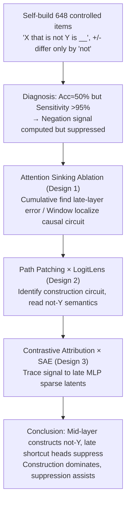

# How Language Models Process Negation

**Conference**: ICML2026  
**arXiv**: [2605.03052](https://arxiv.org/abs/2605.03052)  
**Code**: https://github.com/Ja1Zhou/LM_Negation  
**Area**: Interpretability  
**Keywords**: Negation understanding, Mechanistic Interpretability, Attention shortcut, Construction and Suppression, LogitLens

## TL;DR
This paper employs mechanistic interpretability to dissect the internal circuits of Llama-3.1-8B and Mistral-7B when processing negation sentences like "X that is not Y is __". It discovers that models can actually "perform" negation (middle-layer attention constructs the $\bar Y$ representation directly at the final position, e.g., "not gas" → solid). However, this is suppressed by "shortcut" attention heads in later layers. Ablating these heads via "attention sinking" achieves an absolute accuracy improvement of up to 17% on negation tasks.

## Background & Motivation
**Background**: The current mainstream focus of Mechanistic Interpretability (MI) is on "fact recall" prompts (e.g., "The Colosseum is in __"), which can be explained by the additive contribution of tokens to the answer. Common tools include LogitLens, causal tracing, and path patching.

**Limitations of Prior Work**: Negation inherently does not fit the additive paradigm—"not" itself carries no stackable factual information but affects the answer only when combined with the negated concept Y. Moreover, multiple studies from the BERT/RoBERTa era reported that LMs perform like "random guessing" (accuracy ~50%) on negation tasks, yet signs suggest models are internally sensitive to negation. These contradictory pieces of evidence remain unexplained at the circuit level regarding "why they fail" and "how negation is actually computed."

**Key Challenge**: Prior MI work (e.g., negative mover heads by Wang et al. 2023, McDougall et al. 2024) favors the "suppression hypothesis"—the model lists Y-related tokens and then suppresses them. Conversely, neuroscience and some prompting studies (Geva 2021) support the "construction hypothesis"—the model explicitly generates a representation of $\bar Y = \text{not } Y$, which then triggers the correct answer. No unified answer exists on which hypothesis holds, whether they coexist, or if "distractor terms" are present.

**Goal**: The research is divided into three sub-questions: (i) Do current open-source LLMs actually "know" how to negate? Which part of the circuit fails? (ii) Can these "malicious" circuits be identified and ablated to recover negation accuracy? (iii) Does the model utilize construction, suppression, or both? Which dominates?

**Key Insight**: The authors start from the divergence between "output accuracy" and "logit difference sensitivity"—accuracy is ~50%, but logit difference shows 95%+ consistent response to the presence of "not". This indicates the negation signal is computed but obscured by subsequent components. Locating this "obscuring pressure" through residual flows and attention maps allows for circuit verification.

**Core Idea**: By combining "Attention Sinking" (forcing specific attention heads to focus only on the initial and current tokens, thereby "gently" disabling their transport function), path patching, LogitLens, and SAE contrastive attribution, the negation circuit is decomposed into a four-stage pipeline: "Early layers move 'not' to the Y position" → "Middle layers construct $\bar Y$ and move it to the final position" → "Middle layers simultaneously perform weak suppression of Y" → "Late MLP layers amplify $\bar Y$ into the correct answer." The authors identify late-layer "shortcut heads" as the source of error.

## Method

### Overall Architecture
The core question is whether models can negate, what the negation circuit looks like, and where it fails. This is transformed into a controlled experiment using a self-constructed dataset of 162 questions × 4 templates = 648 items $\mathcal D=\{(P_+,P_-,y_+,y_-)\}$. Positive examples take the form "An animal that is an amphibian is a frog", while negative examples insert "not" (answering "mammal"), where $y_+, y_-$ are single tokens. The process follows two stages: identifying the divergence between accuracy and sensitivity in 6 open-source models and using Cumulative Attention Sink to identify late layers as the error source; then, using window Attention Sink and path patching on Llama-3.1-8B/Mistral-7B to localize the causal circuit in middle layers, LogitLens to read the constructed semantics, and contrastive attribution with pretrained SAEs to trace signals to specific late-layer MLP latents.

### Key Designs

**1. Attention Sinking Ablation: Disabling attention heads via inherent "laziness"**

Mechanistic localization typically uses Attention Knockout to zero out a token in attention, but this introduces noise and relies on counterfactual prompts. Following the attention sink phenomenon (Xiao et al. 2024), where the last token places 64%–80% of attention on the first and current tokens (Table 1) as a "default idle state," the authors rewrite the attention pattern of target heads to "only see the first token and itself." This cuts off cross-position information transport while preserving local value/MLP computation. This method has two configurations: "Cumulative" (sink from layer $i$ to $L$) to find error sources, and "Window" (sink a specific range) to localize causal circuits. It serves as a training-free inference-time fix, improving negation accuracy from 50.5% to 67.8% on Llama-3.1-8B (Table 3).

**2. Path Patching × LogitLens: Identifying the "Construction Circuit" and Its Semantics**

To confirm how middle layers perform the "not Y" composition, the authors use a modified path patching: the sender is the attention output $\mathcal{AO}_\ell$ of a layer, and the receiver is the final output embedding. When running the negative example $P_-$, $\mathcal{AO}_\ell(P_-)$ is replaced with $\mathcal{AO}_\ell(P_+)$. If the logit difference $\Delta(P_-;y_-,y_+)>0$ flips, the layer is considered causally important. LogitLens is then applied to $\mathcal{AO}_\ell$ at the final position to project it back to the vocabulary. GPT-OSS-120B is used to label whether the top-10 promoted tokens are related to "not Y". Results show >80% of samples find $\bar Y$ related tokens in at least one layer (e.g., "not gas" → solid), confirming construction as a statistically significant mechanism over suppression (~30% hit rate).

**3. Contrastive Attribution × SAE: Tracing Signals to MLP Latents**

The final circuit segment is the amplification of $\bar Y$ into $y_-$ via late-layer MLPs. The authors use the unembedding row difference $d=W_U(y_-)-W_U(y_+)$ as the "negative-positive answer difference direction." Contribution of component $x$ is defined as $\mathcal C(x,P)=\langle W_U^\top \mathcal{LN}_{L+1}(x),d\rangle$. Contrastive analysis $\mathcal C(\mathcal{MO}_i,P_-)-\mathcal C(\mathcal{MO}_i,P_+)$ filters out stable background signals and highlights components contributing to $y_-$ in $P_-$. Key MLPs (layers 17–25) are analyzed using pretrained SAEs (He et al. 2024) to expand outputs into sparse latents $\mathcal{MO}_i\approx\sum_j\beta_j f_j$. LogitLens on these sparse latents reveals interpretable concepts (e.g., "not open source" → 'Windows', '.exe'), further validating "construction > suppression."

### Loss & Training
This work utilizes inference-time mechanistic analysis without additional training. SAEs are reused from the Llama-3.1-8B suite (He et al. 2024). LLM labeling uses openai/gpt-oss-120b. Evaluations are performed by reading logits at the last-token position.

## Key Experimental Results

### Main Results

Dataset: 648 "X that is not Y is __" controlled items. Metrics: positive/negative accuracy and sensitivity (proportion of samples where $\Delta(P_-;y_-,y_+)>\Delta(P_+;y_-,y_+)$).

| Model | Pos Acc (%) | Neg Acc (%) | Sensitivity (%) | Neg Acc after Attn Sink (%) | Neg Acc after LogitLens (%) |
| :--- | :--- | :--- | :--- | :--- | :--- |
| Llama-3.1-8B | 95.2 | 50.5 | 97.4 | 67.8 (+17.3) | 53.6 |
| Mistral-7B-v0.1 | 96.3 | 45.2 | 95.1 | 65.9 (+20.7, rel 46%) | 61.6 |
| Qwen2.5 | 93.5 | 57.6 | 96.0 | 65.4 | 59.4 |
| Qwen3 | 91.8 | 55.7 | 95.2 | 64.2 | 59.6 |
| Gemma-2 | 96.5 | 49.7 | 97.5 | 66.1 | 59.7 |
| OLMo-2 | 96.3 | 54.0 | 97.8 | 68.7 | 61.6 |

### Ablation Study

| Configuration | Key Metric | Description |
| :--- | :--- | :--- |
| Vanilla full model | Neg Acc ≈ 50% | Accuracy near random but sensitivity high → negation circuit exists but is suppressed |
| Cumulative Attn Sink from optimal layer | Neg Acc +17% absolute | Optimal layers are consistently >0.5L → shortcut heads cluster in middle-late stages |
| Window Attn Sink @ layer 14 | Neg Acc drops significantly | This window is the causal core of the construction circuit |
| Window Attn Sink @ layer 17 | Neg Acc increases | Validates that layers around 17 contain "shortcut heads" |
| LogitLens on $\mathcal{AO}_\ell$ | >80% samples find "not Y" tokens | Supports the construction hypothesis |

### Key Findings
- **"Computed but Obscured"**: All 6 open-source models show sensitivity ≥ 95% while negative accuracy stays between 45–58%. Black-box metrics severely underestimate internal negation capabilities. This gap is caused by mid-to-late layer attention shortcuts; sinking them releases 17%+ gain without training.
- **Construction Dominates, Suppression Assists**: LogitLens hit rates for construction (>80%) far exceed suppression (~30%). SAE latents show interpretable promoted tokens, while demoted tokens appear nonsensical, independently confirming construction is central.
- **Shortcuts Emerge Early in Pre-training**: OLMo-2 checkpoints show that Neg Acc plunges early in training and is only later recovered by the negation circuit. This suggests shortcut heads are byproducts of "X is Y" co-occurrence statistics in pre-training.

## Highlights & Insights
- **Attention Sinking as a "Gentle" Ablation**: Rather than zeroing out tokens (Attention Knockout), sinking leverages the model's natural "lazy" attention to the first token. It introduces minimal distribution shift and serves as both a localization tool and an inference-time fix.
- **Sensitivity vs. Accuracy Divergence**: This serves as a general signal for hidden capabilities. If a model fails a black-box metric but shows high logit sensitivity, the capability exists but is likely suppressed by later layers.
- **Scalable MLP Analysis via SAEs**: Using $d=W_U(y_-)-W_U(y_+)$ as a projection and contrastive analysis reduces manual verification from ten-thousand-dimensional activations to ~50 sparse latents per sample.

## Limitations & Future Work
- Focuses only on "explicit negation" (not/no/cannot). Does not cover lexical negation ("unhappy"), adverbial negation ("seldom"), or negative pronouns ("nobody").
- Small dataset (648 items) with rigid templates and single-token answers. Generalization to long contexts or conversational negation remains unverified.
- No systematic evaluation of the side effects of Attention Sinking on general QA tasks. Shortcut heads might serve as useful "statistical priors" in other contexts.
- Future work: Incorporating Attention Sinking into training objectives, extending contrastive attribution to counterfactuals, and using circuit evidence to guide negation data augmentation during pre-training.

## Related Work & Insights
- **vs Wang et al. 2023 / McDougall et al. 2024**: While they identified "negative mover heads" supporting suppression, this paper shows construction is the dominant mechanism.
- **vs Geva 2021/2023**: Fact recall is often additive (MLP key-values). This paper shows negation breaks this paradigm, requiring a three-stage non-additive pipeline.
- **vs Hermann et al. 2024 / Mann et al. 2025**: This paper localizes observed "shortcut features" to specific attention heads and provides a mitigation tool (Attention Sinking).

## Rating
- Novelty: ⭐⭐⭐⭐⭐ Proposes Attention Sinking and Contrastive SAE attribution; systematically proves "construction > suppression".
- Experimental Thoroughness: ⭐⭐⭐⭐ 6 models + OLMo-2 time series + cross-method validation; dataset is somewhat narrow.
- Writing Quality: ⭐⭐⭐⭐⭐ Clear logical flow from hypothesis to evidence and counter-evidence.
- Value: ⭐⭐⭐⭐⭐ Provides a training-free accuracy boost and expands MI research to compositional semantics.

<!-- RELATED:START -->

## Related Papers

- [\[ICML 2026\] Query Circuits: Explaining How Language Models Answer User Prompts](query_circuits_explaining_how_language_models_answer_user_prompts.md)
- [\[ICLR 2026\] Mixing Mechanisms: How Language Models Retrieve Bound Entities In-Context](../../ICLR2026/interpretability/mixing_mechanisms_how_language_models_retrieve_bound_entities_in-context.md)
- [\[ICML 2026\] Scalable Circuit Learning for Interpreting Large Language Models](scalable_circuit_learning_for_interpreting_large_language_models.md)
- [\[ICML 2026\] Textual Supervision Enhances Geospatial Representations in Vision-Language Models](textual_supervision_enhances_geospatial_representations_in_vision-language_model.md)
- [\[ICML 2026\] Towards Atoms of Large Language Models](towards_atoms_of_large_language_models.md)

<!-- RELATED:END -->
