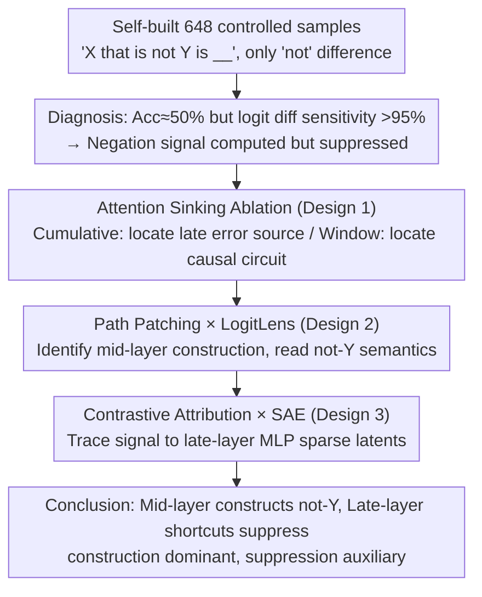

# How Language Models Process Negation

**Conference**: ICML2026  
**arXiv**: [2605.03052](https://arxiv.org/abs/2605.03052)  
**Code**: https://github.com/Ja1Zhou/LM_Negation  
**Area**: Interpretability  
**Keywords**: Negation understanding, mechanistic interpretability, attention shortcuts, construction and suppression, LogitLens

## TL;DR
This paper uses mechanistic interpretability methods to dissect the internal circuits of Llama-3.1-8B / Mistral-7B processing negation sentences of the type "X that is not Y is __". It discovers that models "know" how to process negation (mid-layer attention directly constructs $\bar Y$ representations at the final position, e.g., "not gas" → solid), but are suppressed by late-layer "shortcut" attention heads. Ablating these heads via "attention sinking" can improve negation accuracy by up to 17% absolute.

## Background & Motivation
**Background**: The current mainstream of mechanistic interpretability (MI) focuses on "fact recall" prompts (e.g., "The Colosseum is in __"), which can be explained by the additive contribution of tokens to the answer. Common tools include LogitLens, causal tracing, and path patching.

**Limitations of Prior Work**: Negation naturally does not follow the additive paradigm—"not" itself carries no additive factual information; it must be combined with the negated concept Y to influence the answer. Meanwhile, multiple studies from the BERT/RoBERTa era report that LMs seem to "guess randomly" on negation tasks (accuracy ~50%), yet there are signs that models are internally sensitive to negation. These two types of evidence appear contradictory, and no prior work has simultaneously explained "why they fail" and "how negation is computed internally" at the circuit level.

**Key Challenge**: Prior MI work (e.g., negative mover heads by Wang et al. 2023; McDougall et al. 2024) favors the "suppression hypothesis"—the model lists tokens related to Y and then suppresses some. In contrast, neuroscience and some prompting studies (Geva 2021) support the "construction hypothesis"—the model explicitly generates a representation of $\bar Y = \text{not } Y$, which directly triggers the correct answer. It remains unclear which hypothesis holds, whether they coexist, or if "misleading terms" exist.

**Goal**: The research is divided into three sub-questions: (i) Do current open-source LLMs "know" how to negate, and at which part of the circuit does it fail? (ii) Can this "malicious" circuit be identified and ablated to recover negation accuracy? (iii) Does the model actually use construction, suppression, or both, and which is dominant?

**Key Insight**: The authors start from the divergence between the "output accuracy" and "logit difference sensitivity" curves—accuracy is ~50%, but logit difference shows a 95%+ consistent response to the presence of "not". This indicates that the negation signal has been computed but is covered by subsequent layers. By locating this "covering pressure" through residual streams and attention maps, the entire circuit can be verified.

**Core Idea**: Using a combination of "Attention Sinking" (forcing certain attention heads to focus only on the first and current tokens, thereby "gently" removing their transport function) + path patching + LogitLens + SAE contrastive attribution, the negation circuit is decomposed into a four-stage pipeline: "early layers move 'not' to the Y position" → "mid-layers construct $\bar Y$ and move it to the final position" → "mid-layers simultaneously perform weak suppression of Y" → "late-layer MLPs amplify $\bar Y$ into the correct answer." Late-layer "shortcut heads" are identified as the source of error.

## Method

### Overall Architecture
The core problem of "whether models can negate, what the circuit looks like, and where it fails" is transformed into a controlled experiment: a self-built dataset $\mathcal D=\{(P_+,P_-,y_+,y_-)\}$ with 162 questions × 4 templates = 648 entries. Positive examples follow "An animal that is an amphibian is a frog", while negative examples insert "not" (answering "mammal"), where $y_+, y_-$ are single tokens. The study proceeds in two stages: first, demonstrating that the negation signal is computed but obscured using the divergence between accuracy and sensitivity across six models, then identifying late layers as the error source via Cumulative Attention Sink. Subsequently, mid-layer causal circuits are located using window Attention Sink + path patching on Llama-3.1-8B / Mistral-7B, semantics are read via LogitLens, and signals are traced to specific late-layer MLP latent variables using contrastive attribution + pretrained SAEs.

### Key Designs

**1. Attention Sinking Ablation: Gently disabling attention heads using intrinsic "laziness"**

Mechanistic localization typically uses Attention Knockout to zero out a token in attention, but this introduces "out-of-distribution" noise and relies on contrastive prompts, making it hard to distinguish between losing causality of $\mathcal{AO}(P_-)$ and forcing $\mathcal{AP}(P_+)$. This work is inspired by the "attention sink" phenomenon (Xiao et al. 2024), where the final token in LLMs places 64%–80% of attention mass on the first and current tokens (Table 1), representing a "default idle state." The authors rewrite the target head's attention pattern to "only look at the first token and itself," cutting off cross-position information transport while preserving local MLP/value computation. Since attention mass remains normalized on two "uninformative" tokens, numerical stability is maintained. This method uses two granularities: "Cumulative" (sinking from layer $i$ to $L$) to find error sources, and "Window" (sinking a specific range) to locate causal circuits. Due to minimal side effects, it serves as a training-free inference-time fix, improving negation accuracy from 50.5% to 67.8% on Llama-3.1-8B and 45.2% to 65.9% on Mistral-7B (Table 3).

**2. Path Patching × LogitLens: Identifying the mid-layer "construction circuit" and reading its semantics**

After identifying late layers as "shortcuts," the authors address which mid-layer attention module performs the "not Y" composition. Using modified path patching, the sender is the attention output $\mathcal{AO}_\ell$ and the receiver is the final output embedding. When running $P_-$ forward, the target layer's $\mathcal{AO}_\ell(P_-^{pp})$ is replaced with $\mathcal{AO}_\ell(P_+)$; if $\Delta(P_-;y_-,y_+)>0$ flips to $\Delta(P_-^{pp};y_+,y_-)>0$, the layer is deemed causal. This is cross-validated with window Attention Sink (both peaks align at Llama-3.1-8B layer 14 and layer 17). To confirmsemantics, $\mathcal{AO}_\ell$ is projected back to the vocabulary via LogitLens at the final token, and top-10 promoted tokens are labeled by gpt-oss-120B for "not Y" relevance. Results show >80% of samples find $\bar Y$ related tokens in at least one layer ("not gas" → solid, "not in Asia" → America); this establishes "construction" as a statistically significant conclusion rather than anecdotal.

**3. Contrastive Attribution × SAE: Tracing signals to specific MLP latents**

The final circuit stage is "mid-layer construction of $\bar Y$ → late-layer MLP amplification into $y_-$". To find specific MLP units promoting the negated answer, the authors use the unembedding row difference $d=W_U(y_-)-W_U(y_+)$ as the "negative-positive answer direction." Contribution is defined as $\mathcal C(x,P)=\langle W_U^\top \mathcal{LN}_{L+1}(x),d\rangle$, followed by two contrastive sets: $\mathcal C(\mathcal{MO}_i,P_-)-\mathcal C(\mathcal{MO}_i,P_+)$ and $\mathcal C(\mathcal{MO}_i,P_-)-\mathcal C(\mathcal{MO}_i,P_-^{as})$. This design eliminates stable background noise unrelated to the answer direction. The intersection of top-10 MLPs (approx. layers 17–25) is mapped to sparse latents using pretrained SAEs (He et al. 2024), reducing >10k-dimensional activation to <100 interpretable latents. Top latents are inspected via LogitLens for promoted/demoted tokens (e.g., "not open source" → 'Windows', Table 4).

### Loss & Training
This work is entirely inference-time mechanistic analysis with no new training loss. SAEs are reused from He et al. 2024 for Llama-3.1-8B, LLM labeling uses gpt-oss-120b, and all evaluations are performed at the last-token position using logits.

## Key Experimental Results

### Main Results

Dataset: 648 self-built "X that is not Y is __" controlled samples. Metrics include positive/negative accuracy (based on $\Delta$ sign at final logit) and sensitivity (percentage of samples where $\Delta(P_-;y_-,y_+)>\Delta(P_+;y_-,y_+)$).

| Model | Pos Acc (%) | Neg Acc (%) | Sensitivity (%) | Neg Acc after Attn Sink (%) | Neg Acc via LogitLens (%) |
|------|------------|-------------|-----------------|-----------------------------|----------------------------|
| Llama-3.1-8B | 95.2 | 50.5 | 97.4 | 67.8 (+17.3) | 53.6 |
| Mistral-7B-v0.1 | 96.3 | 45.2 | 95.1 | 65.9 (+20.7, rel. 46%) | 61.6 |
| Qwen2.5 | 93.5 | 57.6 | 96.0 | 65.4 | 59.4 |
| Qwen3 | 91.8 | 55.7 | 95.2 | 64.2 | 59.6 |
| Gemma-2 | 96.5 | 49.7 | 97.5 | 66.1 | 59.7 |
| OLMo-2 | 96.3 | 54.0 | 97.8 | 68.7 | 61.6 |

### Ablation Study

| Configuration | Key Metric | Description |
|------|---------|------|
| Vanilla full model | Neg Acc ≈ 50% | Accuracy near random but high sensitivity → Negation circuit exists but is suppressed |
| Cumulative Attn Sink from optimal layer | Neg Acc +17% Absolute | Optimal layers are consistently >0.5L → Shortcut heads concentrated in mid-late layers |
| Window Attn Sink @ layer 14 | Neg Acc significantly drops | This window is the causal core of the construction circuit |
| Window Attn Sink @ layer 17 | Neg Acc increases | Verifies layer 17 vicinity contains "shortcut heads" |
| LogitLens on $\mathcal{AO}_\ell$ | >80% samples find "not Y" promoted tokens | Supports construction hypothesis |
| Finding "Y" demoted tokens | ~30% sample hit rate | Suppression exists but is weaker than construction |
| OLMo-2 pretraining checkpoint scan | Neg Acc drops early then recovers | Shortcut heads form during early pretraining |

### Key Findings
- **"Computed but Obscured"**: Sensitivity across 6 models is ≥ 95% while negative accuracy stays between 45–58%, indicating black-box metrics severely underestimate internal negation ability. This gap is caused by mid-to-late layer attention shortcuts; sinking them yields 17%+ Gain without training.
- **Construction Dominant, Suppression Auxiliary**: LogitLens pipelines show construction evidence in >80% of samples vs. ~30% for suppression. SAE top promoted tokens are interpretable concepts, while top demoted tokens are often gibberish, confirming "construction is more central."
- **Shortcut Heads Emerge Early**: OLMo-2 checkpoint scans show Neg Acc plunging early in training before recovering as the negation circuit develops. This suggest shortcuts are a byproduct of "X is Y" co-occurrence statistics in early pretraining.

## Highlights & Insights
- **Attention Sinking as a "Gentle" Ablation**: Unlike zeroing out tokens, sinking leverages the model's inherent "lazy" behavior, avoiding distribution shifts. It serves both for causal localization and as a lightweight inference-time fix.
- **Divergence as a Diagnostic Signal**: The "Accuracy vs. Sensitivity" gap suggests that poor black-box performance doesn't mean a missing capability—it may be a late-layer circuit pulling in the opposite direction.
- **Scalable MLP Inspection**: The Contrastive Attribution × SAE recipe reduces the burden of verifying thousands of MLP neurons to inspecting ~50 latents per sample, a method transferable to studying bias or refusal mechanisms.

## Limitations & Future Work
- Ours only investigates "explicit negation" (not/no/cannot), excluding lexical negation ("unhappy") or adverbial negation ("seldom"), which may use different circuits.
- Small data scale (648 samples, single-token answers) makes generalization to long contexts or nested negations ("not X but Y") uncertain.
- No systematic evaluation of potential side effects of Attention Sinking on general QA tasks was performed. Shortcut heads might represent important statistical priors.

## Related Work & Insights
- **vs Wang et al. 2023 / McDougall et al. 2024**: While they identified "negative mover heads" supporting suppression, Ours uses LogitLens + LLM labeling to show this is partial; models also explicitly construct $\bar Y$ in mid-layers with higher evidence frequency.
- **vs Geva 2021/2023**: Those works explain recall as additive MLP K-V pairs; Ours shows negation breaks the additive paradigm, requiring a three-stage non-additive pipeline.
- **vs Hermann et al. 2024**: This work moves from describing shortcut phenomenology to precisely locating "shortcut attention heads" and providing mitigation via sinking.

## Rating
- Novelty: ⭐⭐⭐⭐⭐ Proposes Attention Sinking and Contrastive Attribution × SAE; first to systematize construction vs. suppression.
- Experimental Thoroughness: ⭐⭐⭐⭐ Cross-model validation + time-series checkpoints, though the dataset is narrow.
- Writing Quality: ⭐⭐⭐⭐⭐ Clean logical closure from hypothesis to evidence.
- Value: ⭐⭐⭐⭐⭐ Provides a training-free boost to negation accuracy and expands MI research to compositional semantics.

<!-- RELATED:START -->

## Related Papers

- [\[ICML 2026\] Query Circuits: Explaining How Language Models Answer User Prompts](query_circuits_explaining_how_language_models_answer_user_prompts.md)
- [\[ICML 2026\] Towards Atoms of Large Language Models](towards_atoms_of_large_language_models.md)
- [\[ACL 2026\] How Language Models Conflate Logical Validity with Plausibility: A Representational Analysis of Content Effects](../../ACL2026/interpretability/how_language_models_conflate_logical_validity_with_plausibility_a_representation.md)
- [\[CVPR 2026\] Understanding Counting Mechanisms in Large Language and Vision-Language Models](../../CVPR2026/interpretability/understanding_counting_mechanisms_in_large_language_and_vision-language_models.md)
- [\[NeurIPS 2025\] Base Models Know How to Reason, Thinking Models Learn When](../../NeurIPS2025/interpretability/base_models_know_how_to_reason_thinking_models_learn_when.md)

<!-- RELATED:END -->
