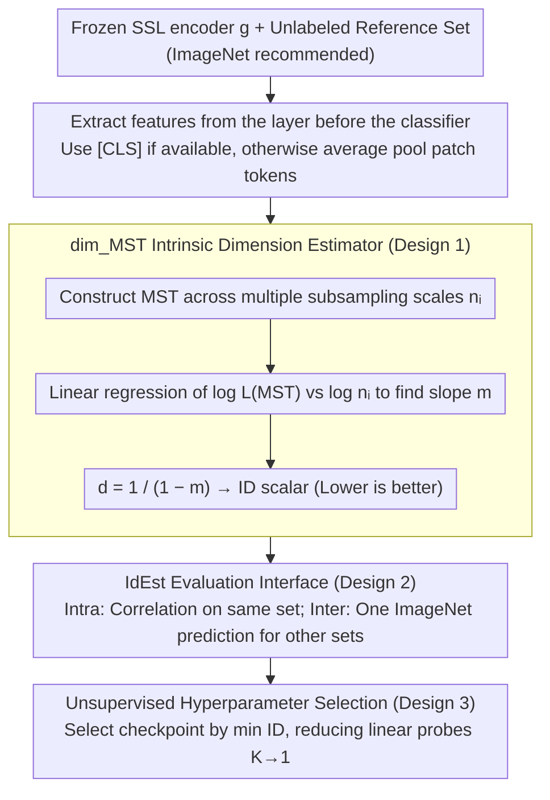

# IdEst: Assessing Self-Supervised Learning Representations via Intrinsic Dimension

**Conference**: ICML2026  
**arXiv**: [2606.03338](https://arxiv.org/abs/2606.03338)  
**Code**: TBD  
**Area**: Self-Supervised Learning / Representation Evaluation  
**Keywords**: Self-Supervised Learning, Intrinsic Dimension, Minimum Spanning Tree, Representation Quality Assessment, Unsupervised Model Selection

## TL;DR
This paper introduces IdEst: utilizing the Minimum Spanning Tree dimension estimator $\mathrm{dim}_{\mathrm{MST}}$ to measure the intrinsic dimension (ID) of self-supervised representations. Using this unlabeled geometric quantity as a proxy for downstream linear probe accuracy, it achieves a Spearman $\rho \approx -0.8$ across 33 SSL models and enables unlabeled hyperparameter selection.

## Background & Motivation

**Background**: Self-Supervised Learning (SSL) has become the dominant paradigm for learning representations from unlabeled data (SimCLR / DINO / I-JEPA / CLIP, etc.). However, the standard practice for evaluating these representations remains **linear probing**—training a linear classification head on frozen features using a labeled downstream dataset (e.g., ImageNet). This protocol entails three major costs: high computational overhead, sensitivity to hyperparameters (learning rate, weight decay, epochs), and providing only a scalar score with almost no insight into the **geometric structure** of the representation.

**Limitations of Prior Work**: Existing "unsupervised proxy metrics" have limitations. $\alpha$-ReQ assumes the feature spectrum follows a power law and fails during representation collapse (rank-deficiency); RankMe calculates the effective rank and is primarily designed for Joint-Embedding Architectures (JEA), performing weakly on joint-prediction methods like I-JEPA; LiDAR performs well but **requires the data augmentations used during SSL pre-training**, making it unfriendly to downstream users who only have access to frozen representations.

**Key Challenge**: To evaluate SSL representation quality in an "unsupervised, cross-paradigm manner using only frozen features." Theoretically, existing results (Konz & Mazurowski, 2024) indicate that generalization error is approximately $\mathcal{L} \sim \mathcal{O}(K_L N_D^{-1/d})$, where $d$ is the intrinsic dimension of the representation manifold—suggesting that **lower ID is equivalent to higher quality representations**. However, in practice, common ID estimators like TwoNN and MLE rely on local isotropy and i.i.d. assumptions. These become severely unstable in SSL scenarios where $n \approx d$ is non-asymptotic and data points have strong dependencies (multiple views of the same image). Figure 2 shows TwoNN even diverging to infinity on a simple 1D helix.

**Goal**: To find an ID estimator that remains stable under the "harsh conditions" of SSL (non-asymptotic, high-dimensional, strong dependencies) and verify if it truly reflects downstream performance.

**Key Insight**: Derived from the **Euclidean functional theory** of Costa & Hero (2006)—the length growth rate of a Minimum Spanning Tree (MST) is asymptotically proportional to the Rényi entropy of the data distribution. This leads to an ID estimator $\mathrm{dim}_{\mathrm{MST}}$ that is robust to data density changes and noise, and insensitive to the ambient dimension.

**Core Idea**: Utilize the scaling law of MST length $L(\mathrm{MST}(X_n)) \propto n^{(d-1)/d}$ to back-calculate $d$. Applying this to the frozen representations of any SSL model yields an unsupervised "representation quality meter"—IdEst.

## Method

### Overall Architecture
IdEst addresses the problem of judging the quality of representations learned by an SSL encoder without labels, retraining, or access to original augmentations. Its solution is not to design another SSL loss, but to convert "representation quality" into a pure geometric quantity—the intrinsic dimension (ID) of the representation manifold. Given a trained encoder $g$ and unlabeled data $\mathcal{X}$ (ImageNet is recommended as a reference set), frozen features are first extracted (using the [CLS] token if available; otherwise, average pooling patch tokens for methods like I-JEPA). Then, the MST dimension estimator is run on the feature point cloud to calculate an ID scalar; lower values represent more compact representations and better downstream performance. This value can be used to rank different checkpoints, track training curves, or perform unlabeled hyperparameter selection.

### Key Designs

**1. MST Dimension Estimator $\mathrm{dim}_{\mathrm{MST}}$: Replacing Fragile Local Assumptions with Global Connectivity**

The bottleneck for ID estimation in SSL is that classical estimators like TwoNN/MLE are built on "local isotropy + i.i.d. Poisson neighbors." SSL features, however, are "harsh point clouds" where $n \approx d$ and strong dependencies exist between views of the same image. Figure 2 demonstrates TwoNN diverging to infinity on a 1D helix. $\mathrm{dim}_{\mathrm{MST}}$ adopts the Costa-Hero Euclidean functional approach: for $n$ i.i.d. points sampled from a compact Riemannian $d$-manifold, the total MST length satisfies $n^{-(d-1)/d} \cdot L(\mathrm{MST}(X_n)) \to C' \int f_X^{(d-1)/d}\,d\mathcal{H}$ almost everywhere. By taking a series of subsampling scales $n_i$ and performing a 1D linear regression of $\log L(\mathrm{MST}(X_{n_i}))$ against $\log n_i$, the slope $m$ yields $d = 1/(1-m)$. Its stability stems from MST encoding both local and global connectivity rather than just nearest neighbors, making it robust to noise and density variations. Crucially, it is equivalent to the 0-dimensional Persistent Homology dimension $\mathrm{dim}_{\mathrm{PH}}^0$ (Adams et al., 2020), inheriting the stability guarantees of TDA (Chazal et al., 2014). On the 1D helix, $\mathrm{dim}_{\mathrm{MST}}$ converges stably to $d=1$.

**2. IdEst Evaluation Interface: A "Plug-and-Play" Metric Comparable to Linear Probing**

To enable zero-cost adoption for SSL practitioners, IdEst calculates $\mathrm{dim}_{\mathrm{MST}}$ on the features from the layer immediately preceding the classifier head in each SSL method's **official evaluation protocol**. The resulting ID is strictly aligned and directly comparable with the linear probe accuracy of the method. The entire process requires no retraining, labels, or original augmentations, running only a single forward pass. The interface provides two use cases: **Intra-Dataset**, calculating ID and accuracy on the same target set to check correlation; and **Inter-Dataset**, calculating ID once on ImageNet to predict performance rankings on iNat / CIFAR / kNN / ImageNet-v2. The success of the latter proves that ID reflects the properties of the model itself rather than dataset bias; in practice, a single reference set suffices.

**3. Unsupervised Hyperparameter Selector: Reducing Linear Probes from $K$ to 1**

Linear probing is a significant computational bottleneck in SSL pipelines, becoming prohibitively expensive with large hyperparameter grids and datasets. IdEst replaces the costly "sweep hyperparameters + run one linear probe per group" loop with "one forward pass per group + MST geometric calculation." Models are trained for different candidate hyperparameters (learning rate, weight decay, teacher-student temperature, target-context size, etc.), the optimal checkpoint is selected based on the minimum ID, and finally, a single downstream evaluation is performed only for that checkpoint. Compared to using ImageNet as an oracle for individual probing, the number of linear probes is reduced from $K$ to 1, cutting hyperparameter search costs by an order of magnitude without ever touching downstream labels.

### Loss & Training
IdEst is a **post-hoc evaluation metric** and does not introduce any new losses or training processes. MST construction uses classic Prim/Kruskal algorithms with complexity $O(n^2)$ or better; ID regression is a simple 1D linear fit. The complete algorithm is detailed in Algorithm 1 of the original text.

## Key Experimental Results

### Main Results: Correlation Across 33 Models
Evaluated across 14 methods spanning 4 SSL paradigms (joint-embedding / joint-predictive / combinations / vision-language), 2 architectures (ResNet / ViT), and various scales (ViT-S to ViT-G), totaling 33 checkpoints.

| Evaluation Setting | Reference Dataset | Target Dataset / Protocol | Kendall $\tau$ | Spearman $\rho$ |
|---------|-----------|------------------|----------------|-----------------|
| Intra-Dataset | ImageNet | ImageNet linear probe | $\approx -0.6$ | $\approx -0.8$ |
| Intra-Dataset | iNat-18 | iNat-18 linear probe | $\approx -0.6$ | $\approx -0.8$ |
| Intra-Dataset | SUN397 | SUN397 linear probe | $\approx -0.6$ | $\approx -0.8$ |
| Inter-Dataset | ImageNet | CIFAR-10 / CIFAR-100 / iNat | Strong Negative | Strong Negative |
| Alt. Protocol | ImageNet | kNN / ImageNet-v2 | Strong Negative | Strong Negative |

The negative signs are expected: **Lower ID correlates with higher downstream accuracy**.

### Ablation Study: Comparison with Existing Unsupervised Metrics + Robustness

| Config / Metric | Access to Pre-train Augs Needed | Performance on I-JEPA | Cross-Paradigm Robustness |
|------------|---------------------|--------------|---------------------|
| $\alpha$-ReQ | No | Fails when assumptions collapse | Weak |
| RankMe | No | Weak (Designed for JEA) | JEA Only |
| LiDAR | **Yes** | Strong | Strong but dep. on augs |
| **IdEst** | No | Strong | Strong across all 4 paradigms |

### Key Findings
- **ID is a Unified Geometric Descriptor Cross SSL Paradigms**: Consistent negative correlations are observed across radically different objectives (joint-embedding / joint-predictive / vision-language), showing it captures "how compact the representation is" rather than the signature of a specific SSL loss.
- **Strong Inter-Dataset Transferability**: Calculating IdEst on ImageNet alone predicts performance rankings on iNat / CIFAR / kNN / ImageNet-v2, implying **a single reference dataset is sufficient** in practice.
- **Traceable Training Dynamics**: Figure 7 shows that in offline/online probing for VICReg / DINO / I-JEPA, IdEst decreases monotonically and closely tracks the rising accuracy of linear probes (except for early fluctuations < 10 epochs).
- **Effective Hyperparameter Selection**: In hyperparameter grids for learning rate / weight decay / temperature / context size, the checkpoint selected by IdEst falls at the upper end of the accuracy range provided by the ImageNet Oracle for fine-grained tasks. (e.g., for DINO ViT-S, IdEst selects 65.5, while the Oracle upper bound is 69.1 and lower bound is 48.4).

## Highlights & Insights
- **Direct Bridge from Theory to Practice**: The paper directly selects the "lower ID is better" direction from the Konz-Mazurowski $\mathcal{L} \sim N_D^{-1/d}$ scaling theorem and provides an estimator functional under $n \approx d$ via Costa-Hero’s MST asymptotic theorem. The argument chain is clear, and the reasons for excluding TwoNN/MLE (reliance on local Poisson + i.i.d.) are well-founded.
- **MST as the Bridge to 0D Persistent Homology**: The authors explicitly cite Adams et al. (2020) to equate $\mathrm{dim}_{\mathrm{MST}}$ and $\mathrm{dim}_{\mathrm{PH}}^0$ in TDA. This bridge allows ID estimation to inherit established TDA stability theories (Chazal et al., 2014), providing provable stability against noise and a natural entry point for future extensions using higher-dimensional PH.
- **Extensibility to Other Domains**: Core to the method is "estimating manifold dimension on frozen features," making it applicable to any unsupervised representations—LLM hidden states, graph embeddings, or speech encoders. While Tulchinskii et al. (2023) validated similar ideas for LLMs, this work fills the gap for vision SSL.

## Limitations & Future Work
- **Author Acknowledgments**: Representations are not yet "unfolded" before 10 epochs, rendering IdEst less informative early on; MST construction on $O(n^2)$ distance matrices remains costly for massive feature sets (millions of samples).
- **Independent Observations**: (i) Most models used are ImageNet pre-trained; sustainability of the negative correlation in cases of **large domain gaps** (e.g., medical/satellite imagery) remains unverified. (ii) In very high ambient dimensions (e.g., 1536 for ViT-G), regression slopes might be flattened by noise; the paper uses multiple subsampling $n_i$ but lacks sensitivity analysis on the sampling schedule. (iii) "Lower ID is better" assumes classification; its monotonicity for generative, retrieval, or dense prediction tasks is TBD.
- **Potential Improvements**: Replacing MST with **kNN graphs + spectral estimation** or performing lightweight dimensionality reduction (PCA/UMAP) before ID estimation might stabilize results for ViT-G sized features. Furthermore, IdEst could be integrated as a **regularization term** (minimizing ID) during SSL training rather than just a post-hoc metric.

## Related Work & Insights
- **vs RankMe**: RankMe measures effective rank, essentially a proxy for **linear separability** primarily for joint-embedding (to manage collapse). IdEst measures **geometric manifold dimension**, applicable across JEA / I-JEPA / CLIP.
- **vs LiDAR**: LiDAR calculates the rank of an LDA matrix for SSL surrogate tasks and shows strong correlation, but **must have original augmentations**, which is unfriendly to users with only frozen models. IdEst looks exclusively at frozen features.
- **vs TwoNN / MLE-based ID**: Previous ID estimators worked for supervised CNNs (Ansuini et al., 2019) but fail in SSL due to view dependencies and $n \approx d$; Figure 2 uses a 1D helix to demonstrate this failure. The MST estimator is a fundamental change in the underlying mechanism.
- **vs $\alpha$-ReQ**: $\alpha$-ReQ looks at spectral decay rates and fails immediately during representation collapse; IdEst provides meaningful ID even on rank-deficient representations.

## Rating
- Novelty: ⭐⭐⭐⭐ While applying MST dimension estimation is a known tool transfer, doing so with theoretical analysis and systematic cross-paradigm validation in SSL is a first.
- Experimental Thoroughness: ⭐⭐⭐⭐ 33 models × 4 paradigms × multiple datasets × various protocols (Linear/kNN/ImageNet-v2/Fine-grained). The practical data for hyperparameter selection is convincing.
- Writing Quality: ⭐⭐⭐⭐ The logic chain (Motivation—Theory—Estimator Limits—New Estimator—Experiments) is very smooth. Using the helix counter-example against TwoNN in Figure 2 is an excellent design.
- Value: ⭐⭐⭐⭐ Provides SSL practitioners with an unlabeled, cross-paradigm, and inexpensive evaluation tool; the reduction in hyperparameter search compute is a tangible benefit.

<!-- RELATED:START -->

## Related Papers

- [\[ICML 2026\] Interpretable Self-Supervised Learning via Representer Landmarks and Nyström Approximation](interpretable_self-supervised_learning_via_representer_landmarks_and_nyström_app.md)
- [\[CVPR 2025\] Probing the Mid-Level Vision Capabilities of Self-Supervised Learning](../../CVPR2025/interpretability/probing_the_mid-level_vision_capabilities_of_self-supervised_learning.md)
- [\[ICCV 2025\] AIM: Amending Inherent Interpretability via Self-Supervised Masking](../../ICCV2025/interpretability/aim_amending_inherent_interpretability_via_self-supervised_masking.md)
- [\[NeurIPS 2025\] Dataset Distillation for Pre-Trained Self-Supervised Vision Models](../../NeurIPS2025/interpretability/dataset_distillation_for_pre-trained_self-supervised_vision_models.md)
- [\[ICML 2026\] Learning Coherent Representations: A Topological Approach to Interpretability](learning_coherent_representations_a_topological_approach_to_interpretability.md)

<!-- RELATED:END -->
