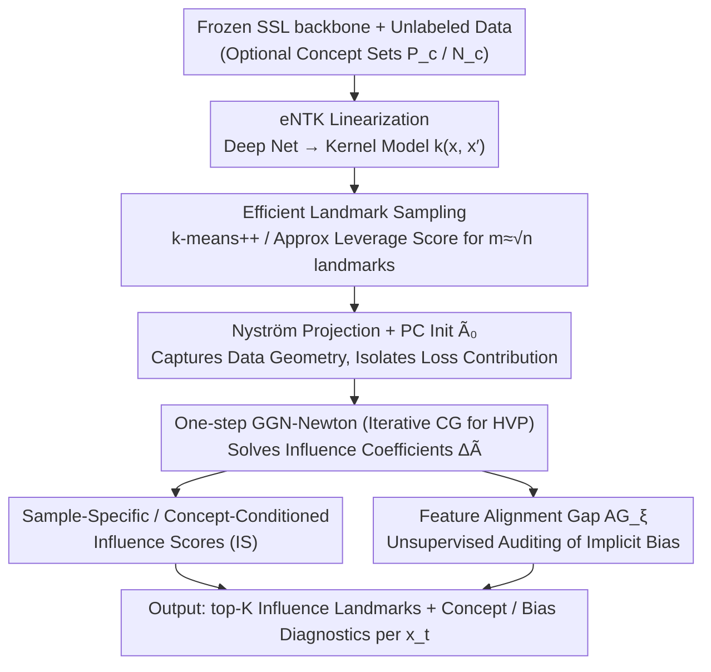

# Interpretable Self-Supervised Learning via Representer Landmarks and Nyström Approximation

**Conference**: ICML 2026  
**arXiv**: [2509.24467](https://arxiv.org/abs/2509.24467)  
**Code**: TBD  
**Area**: Interpretability / Self-Supervised Learning  
**Keywords**: Self-Supervised Learning, Interpretability, Representer Theorem, eNTK, Nyström Approximation

## TL;DR
KREPES utilizes eNTK to approximate arbitrary SSL models as kernel models, then leverages the Representer Theorem to express representations as kernel-weighted combinations of "landmark samples." By employing Nyström approximation and one-step GGN-Newton, it analytically solves the influence coefficients for non-convex objectives like SimCLR/BYOL/VICReg/Barlow Twins, enabling unsupervised auditing of SSL latent spaces at a scale of 1M+ samples.

## Background & Motivation

**Background**: Currently, SSL methods such as SimCLR, BYOL, VICReg, and Barlow Twins are the mainstream for learning representations from massive unlabeled data, but the trained networks remain black boxes. The community primarily relies on post-hoc methods like saliency maps and linear probes, or domain-specific interpretable architectures (e.g., geometric bottlenecks for video poses, prototype decoding for single-cell transcriptomics).

**Limitations of Prior Work**: Post-hoc methods fail to explain "what exactly is learned inside" SSL representations. Domain-specific solutions are tied to specific tasks and lack transferability. Conversely, "intrinsically interpretable" approaches based on the Representer Theorem (Yeh 2018, Tsai 2023, Engel 2023) depend entirely on supervision signals—they derive landmark coefficients $\alpha_i \propto \partial L/\partial f(x_i)$ via label gradients, becoming undefined without labels.

**Key Challenge**: (i) SSL lacks labels and specific prediction tasks, causing the standard feature-attribution paradigm to fail naturally. (ii) Utilizing kernel methods for sample-level explanation faces $O(n^2)$ memory and $O(n^3)$ time complexity on 1M+ samples, while existing Nyström/RFF accelerators (Rudi 2017, Della Vecchia 2024) target convex losses and cannot handle non-convex SSL objectives.

**Goal**: Construct a unified framework to provide "intrinsic interpretability" for networks trained with arbitrary SSL objectives. This includes tracing "why $x_t$ is mapped to its current position" at the sample level, querying "which concepts drive this embedding" at the concept level, and scaling to million-scale datasets like ImageNet-1K and Adult-1M.

**Key Insight**: The authors observe that eNTK can approximate deep networks as linear kernel models. Once linearized, the Representer Theorem allows the learned representation to be written as $f(x_t) = \sum_l k(x_l, x_t) A_{l,:}$. The remaining challenge is to analytically obtain the coefficients $A$ under non-convex SSL losses. The authors use Generalized Gauss–Newton (GGN) approximation to locally convexify the loss, then use Nyström to project the RKHS onto a finite-dimensional subspace spanned by $m \ll n$ landmarks.

**Core Idea**: Compress the SSL network into an eNTK + Representer Theorem form, then use "PC initialization + one-step GGN-Newton + CG-solved Hessian-Vector Product" to analytically obtain dual coefficients within the Nyström subspace. This ensures the entire interpretability pipeline completes within $O(n\sqrt{n})$ time.

## Method

### Overall Architecture
KREPES addresses the contradiction that SSL networks are black boxes without labels to leverage. It does not retrain the model but performs a post-training audit on a **frozen** pretrained backbone, rewriting the representation as a kernel-weighted combination of a set of "landmark samples" to trace the mapping of $x_t$ per sample. The implementation consists of three stages: first, linearizing the deep network into a kernel model $k(x, x')$ using eNTK at the parameter point; second, selecting $m \ll n$ landmarks for Nyström projection and solving for influence coefficients $\Delta\tilde{A}$ via one-step GGN-Newton starting from PC initialization; finally, using $\Delta\tilde{A}$ to calculate various influence scores for unsupervised diagnostics of the latent space. The input is a pretrained SSL backbone plus unlabeled data $\{x_i\}$ (with optional concept sets $\mathcal{P}_c, \mathcal{N}_c$), and the output consists of top-K influence landmarks and concept scores for each test sample $x_t$.

### Key Designs

**1. Unsupervised SSL Influence via Representer + GGN: Decomposing Representations into Landmark Contributions**

Supervised Representer coefficients $\alpha_i \propto \partial L/\partial f(x_i)$ are undefined without labels, which is the deadlock for SSL explanation. KREPES solves this by first using the Representer Theorem to write the linearized representation as a kernel combination of landmarks: $f(x_t) = \sum_l k(\tilde{x}_l, x_t) \tilde{A}_{l,:}$. Consequently, the sensitivity of $f(x_t)$ with respect to the parameter $\tilde{A}_{l,:}$ via landmark $\tilde{x}_l$ is $\nabla_{\tilde{A}_{l,:}} f(x_t) = k(\tilde{x}_l, x_t) I_h$. Then, a Taylor expansion of the SSL loss is performed around $\tilde{A}_0$, replaced with the GGN proxy $\bar{H}_{GN} = J^\top Q J + \lambda I$ (which is locally PSD for arbitrary SSL objectives). Setting $\nabla_{\Delta\tilde{A}} \tilde{L} = 0$ yields the one-step Newton solution $\mathrm{vec}(\Delta\tilde{A}) = -\bar{H}_{GN}^{-1} \mathrm{vec}(\nabla_{\tilde{A}} L(\tilde{A}_0))$, quantifying the "causal impact of the training objective on geometry" without labels. With $\Delta\tilde{A}$, two tiers of metrics are defined: at the sample level, the **Sample-Specific Influence Score** $\mathrm{IS}(\tilde{x}_l, x_t) = \|\nabla_{\tilde{A}_{l,:}} f(x_t)\, \Delta\tilde{A}_{l,:}^\top\|_2$ measures the overall contribution of a landmark; at the concept level, utilizing CAV $v_c$ from Kim 2018 (learned on positive/negative concept sets), the **Concept-Conditioned Influence** is defined as $\mathrm{IS}(\tilde{x}_l, x_t; v_c) = \langle \nabla_{\tilde{A}_{l,:}} f(x_t)\, \Delta\tilde{A}_{l,:}^\top, v_c\rangle$, where positive values indicate the landmark pushes $x_t$ toward concept $c$. This clean decoupling is possible because the "geometric covariance of the data itself" is absorbed by the PC initialization $\tilde{A}_0$, leaving only the loss contribution for the Newton increment.

**2. Nyström + PC Init + GGN-HVP: Scaling One-step Newton to Million Samples**

Directly searching for parameters in the RKHS for the Newton step hits an $O(n^2)$ memory wall. KREPES uses Nyström to compress the function class into a finite-dimensional $f(x) = \sum_{i\in[m], j\in[p]} \tilde{\alpha}_i^j k(\tilde{x}_i^j, x) + \gamma$. It approximates the kernel $K_{nn} \approx K_{nm} K_{mm}^\dagger K_{mn}$ and takes the truncated eigen-decomposition $K_{mm} \approx U_h \Lambda_h U_h^\top$. Crucially, it fixes the Taylor expansion point at $\tilde{A}_0 = U_h \Lambda_h^{-1/2}$—where $f(X) = K_{nm}\tilde{A}_0$ exactly represents Nyström feature maps, effectively treating PCA components as a prior. This ensures the Newton increment $\Delta\tilde{A}$ reflects only the causal bias of the SSL objective rather than the data manifold geometry. When solving for $\Delta\tilde{A}$, the $O(m^3)$ dense Hessian is not explicitly formed; instead, $\bar{H}_{GN}\Delta\tilde{A} = -\nabla_{\tilde{A}} L(\tilde{A}_0)$ is treated as a linear system and solved via Conjugate Gradient (CG) iterations, requiring only one Hessian-Vector Product (HVP) per step. For different SSL objectives, HVPs are derived analytically, such as Barlow Twins as a nonlinear least squares of residuals $r(\theta) = \mathrm{vec}(W \odot (C - I))$, giving $\mathrm{HVP}_{BT}(d) = 2\cdot\mathrm{vjp}(r, \theta, \mathrm{jvp}(r, \theta, d))$. This batch-wise expectation accumulation avoids dense matrices and maintains an analytical one-step solution, bypassing the instability of non-convex optimization and reducing complexity from $O(n^2)$ to $O(n\sqrt{n})$.

**3. Feature Alignment Gap and Efficient Landmark Sampling: Unsupervised Bias Auditing**

In tabular scenarios like Adult, features themselves are semantic concepts, requiring no extra CAV training. KREPES directly uses features as concepts to audit implicit bias. It defines sample consistency $v_\xi(x_t, x_l) = 1 - \min(|x_{t,\xi} - x_{l,\xi}|/\Delta\xi, 1)$ for feature $\xi$, yielding the **Feature-Conditioned Influence** $\mathrm{IS}(\tilde{x}_l, x_t; v_\xi) = \|\nabla_{\tilde{A}_{l,:}} f(x_t)\|_2 \cdot v_\xi(x_t, x_l)$. This aggregates into the **Feature Alignment Gap** $\mathrm{AG}_\xi = \mathbb{E}_{x_t}[\Psi(x_t; v_\xi) - \Psi_{\mathcal{R}_{\mathrm{rand}}}(x_t; v_\xi)]$, representing the excess landmark contribution aligned by that feature relative to random landmarks. $\mathrm{AG}_\xi \gg 0$ indicates the SSL geometry systematically amplifies feature $\xi$, allowing the detection of biases like "model favoring gender/relationship over education" on Adult-1M without labels. For Nyström subspace quality, KREPES uses complementary strategies: k-means++ seeds $P(x_j) \propto \min_{c\in Z}\|x_j - c\|_2^2$ for geometric coverage, and approximate leverage score sampling $P(x_j) \propto \hat{\ell}_j(\lambda)/\|\hat{\ell}\|_1$ via Hutchinson estimator and CG to ensure spectral importance direction coverage without $O(n^3)$ inversion.

### Loss & Training
KREPES does not retrain the SSL model: it adds eNTK linearization + Nyström projection over a **frozen** pretrained backbone and solves a single GGN-Newton step. This is a "post-training audit," so there is no additional training loss. Key hyperparameters include the number of landmarks $m = O(\sqrt{n})$, Tikhonov regularization $\lambda$, and projection dimension $h$.

## Key Experimental Results

### Main Results

| Dataset (Size) | SSL Objective | KREPES Acc Gap $\Delta$ | Kendall-$\tau$ (NN vs KREPES) | Confidence Drop (random / KREPES) |
|--------|------|------|----------|------|
| Adult (1M) | BT / SimCLR / VICReg | +0.06 / +0.12 / +0.12 | 0.845 / 0.842 / 0.840 | .0002 / .0572 etc. |
| Higgs (1M) | BT / SimCLR / VICReg | +0.03 / -0.10 / +0.25 | 0.781 / 0.778 / 0.783 | .0003 / .0461 etc. |
| ImageNet (1.2M) | BT / SimCLR / VICReg | -0.24 / -0.39 / -0.31 | 0.801 / 0.797 / 0.790 | .0001 / .0583 etc. |
| CoverType (1M) | BT / SimCLR / VICReg | -0.41 / +0.87 / +0.47 | 0.872 / 0.861 / 0.863 | .0003 / .0810 etc. |
| CIFAR-10 (60k) | BT / SimCLR / VICReg | -0.92 / -0.38 / -1.10 | 0.878 / 0.881 / 0.880 | .0011 / .0667 etc. |

eNTK + KREPES accuracy is nearly parity with the original NN ($|\Delta| < 1\%$), and $\tau \geq 0.78$ indicates nearly identical decision boundaries. Removing top-10 landmarks identified by KREPES results in a k-NN ($k=50$) confidence drop hundreds of times greater than random removal, verifying landmarks as "causal pillars."

### Ablation Study

| Config / Metric | Value | Description |
|------|---------|------|
| CIFAR-10 Class Coverage $\kappa$ — Barlow Twins | 12 (Acc 91.18%) | 12 top-norm landmarks cover 10 classes; high semantic alignment |
| CIFAR-10 $\kappa$ — VICReg / BYOL / SimCLR | 18 / 26 / 27 | Smaller $\kappa$ correlates with higher downstream acc (unsupervised proxy) |
| CIFAR-10 $\kappa$ — Spectral Contrastive | 81 (Acc 89.75%) | Spectral Contrastive has worst coverage, validating ranking consistency |
| Adult Precision@1 — KREPES vs cosine baseline | 0.872 vs 0.809 | KREPES top-1 landmark shares class with test sample more often than NN |
| Cover Precision@1 — KREPES vs baseline | 0.772 vs 0.550 | Gap widens to 22 percentage points on complex tabular data |
| Adult/Bank Time Complexity | $O(n\sqrt{n})$ vs $O(n^2)$ | Slopes on log-log plots are significantly flatter with parity accuracy |

### Key Findings
- **Landmark Ranking as a Downstream Proxy**: On CIFAR-10, Barlow Twins' $\kappa=12$ corresponds to its highest linear probe accuracy (91.18%), suggesting that "class coverage of top-norm landmarks" is an unsupervised signal for SSL model quality.
- **Spectral Entropy for Hyperparameter Selection**: Sweeping $\lambda$ on MNIST + Barlow Twins shows that the peak normalized spectral entropy of $\tilde{A}^\top \tilde{A}$ aligns with the 10% linear probe accuracy peak, offering a zero-label tuning scheme.
- **Unsupervised Auditing of Implicit Bias**: On Adult-1M, the Alignment Gap reveals that the SSL model amplifies sensitive attributes like gender and relationship over education/occupation. On FairFace, KREPES shows Southeast Asians anchored by East Asian landmarks (33%), and Indians anchored by Middle Eastern (23%) and Latino (22%) landmarks, higher than their own group (30%), proving SSL pixel-space augmentation introduces cross-population confusion.
- **Repulsion Visualization**: KREPES models both positive and negative influences. Red "repulsive landmarks" show SSL explicitly pushing apart visually similar but semantically distinct samples (e.g., dark plane vs bird, white car vs plane fuselage), a phenomenon invisible to attraction-only explanation methods.

## Highlights & Insights
- **The three-stage integration of Representer + eNTK + GGN** is ingenious: eNTK linearizes the deep net to enable kernel frameworks, Representer Theorem provides the "landmark decomposition" form, and GGN reduces non-convex SSL objectives to a one-step solvable quadratic problem.
- **Significance of PC Initialization**: Fixing the Taylor expansion at Nyström principal components allows the Newton increment $\Delta\tilde{A}$ to capture only the SSL objective's "causal bias," decomposing representations into "data prior + loss contribution."
- **HVP-only Inference**: Relying entirely on CG + jvp/vjp to compute HVPs without explicitly forming the Hessian is the critical engineering trick for scaling kernel methods to 1M+ data, reusable for any second-order analysis of deep models.

## Limitations & Future Work
- The framework relies on **eNTK linearization**. For extremely deep or highly non-linear networks (e.g., global attention, complex normalization), eNTK fidelity might not be as high as on tabular/small models. While $\tau \geq 0.78$ is reported, the $\Delta$ on ImageNet reached -0.39, indicating systematic bias exists.
- **One-step GGN-Newton** assumes the loss curvature is well-captured by the PSD proxy. It might yield unreliable coefficients for SSL losses that are very plateaued or have severe saddle points (e.g., early training stages).
- **Concept sets require manual provision**: Concept-conditioned Influence Scores depend on predefined positive/negative sets. In open-domain scenarios without concept libraries, integration with automated concept discovery is needed.
- Future Directions: (i) Replacing one-step Newton with iterative steps or KFAC block-diagonal approximations to improve fidelity on larger models; (ii) extending Alignment Gap to sequential/multimodal features; (iii) utilizing "repulsive landmarks" as new contrastive learning regularizers to constrain SSL geometry.

## Related Work & Insights
- **vs. Yeh et al. 2018 / Tsai et al. 2023 / Engel et al. 2023 (kGLM)**: These works explain **supervised** DNNs using Representer Theorem with coefficients derived from label gradients. Ours is the first to port the Representer framework to SSL by using GGN to locally convexify non-convex objectives for label-free $\Delta\tilde{A}$.
- **vs. Rudi et al. 2017 / Della Vecchia et al. 2024 (Nyström)**: Their Nyström acceleration only supports convex losses (ranking, KRR). Ours extends Nyström to non-convex SSL objectives like SimCLR and Barlow Twins via GGN proxies.
- **vs. Cosine-similarity / Nearest-neighbor baseline**: Pure geometric proximity reflects distance in representation space without distinguishing "causal drivers" from "spurious correlations." KREPES outperforms baselines in Precision@1 by 6–22 points and identifies "repulsive landmarks," capturing causality.
- **vs. Koh & Liang 2017 (Influence Function)**: Classical IF requires the Hessian at the optimum to be PSD and relies on labels. KREPES uses eNTK as a Hessian alternative, GGN for PSD requirements, and the Representer Theorem to bypass label gradients.

## Rating
- Novelty: ⭐⭐⭐⭐⭐ First to extend Representer Theorem to SSL; eNTK + GGN + Nyström integration is highly complete.
- Experimental Thoroughness: ⭐⭐⭐⭐ Covers 1M+ image and tabular data across 4 SSL objectives, verifying accuracy parity, landmark causality, bias auditing, and label-free tuning; however, lacks Transformer-scale vision models.
- Writing Quality: ⭐⭐⭐⭐ Rigorous notation, clear three-stage diagram; density of metric definitions in Sec.3 may require re-reading.
- Value: ⭐⭐⭐⭐⭐ Provides a unified, scalable, and bias-auditable path for SSL interpretability, with direct utility for responsible AI and unsupervised model selection.

<!-- RELATED:START -->

## Related Papers

- [\[ICML 2026\] IdEst: Assessing Self-Supervised Learning Representations via Intrinsic Dimension](idest_assessing_self-supervised_learning_representations_via_intrinsic_dimension.md)
- [\[CVPR 2025\] Probing the Mid-Level Vision Capabilities of Self-Supervised Learning](../../CVPR2025/interpretability/probing_the_mid-level_vision_capabilities_of_self-supervised_learning.md)
- [\[ICCV 2025\] AIM: Amending Inherent Interpretability via Self-Supervised Masking](../../ICCV2025/interpretability/aim_amending_inherent_interpretability_via_self-supervised_masking.md)
- [\[NeurIPS 2025\] Dataset Distillation for Pre-Trained Self-Supervised Vision Models](../../NeurIPS2025/interpretability/dataset_distillation_for_pre-trained_self-supervised_vision_models.md)
- [\[CVPR 2026\] RiskProp: Collision-Anchored Self-Supervised Risk Propagation for Early Accident Anticipation](../../CVPR2026/interpretability/riskprop_collision-anchored_self-supervised_risk_propagation_for_early_accident_.md)

<!-- RELATED:END -->
