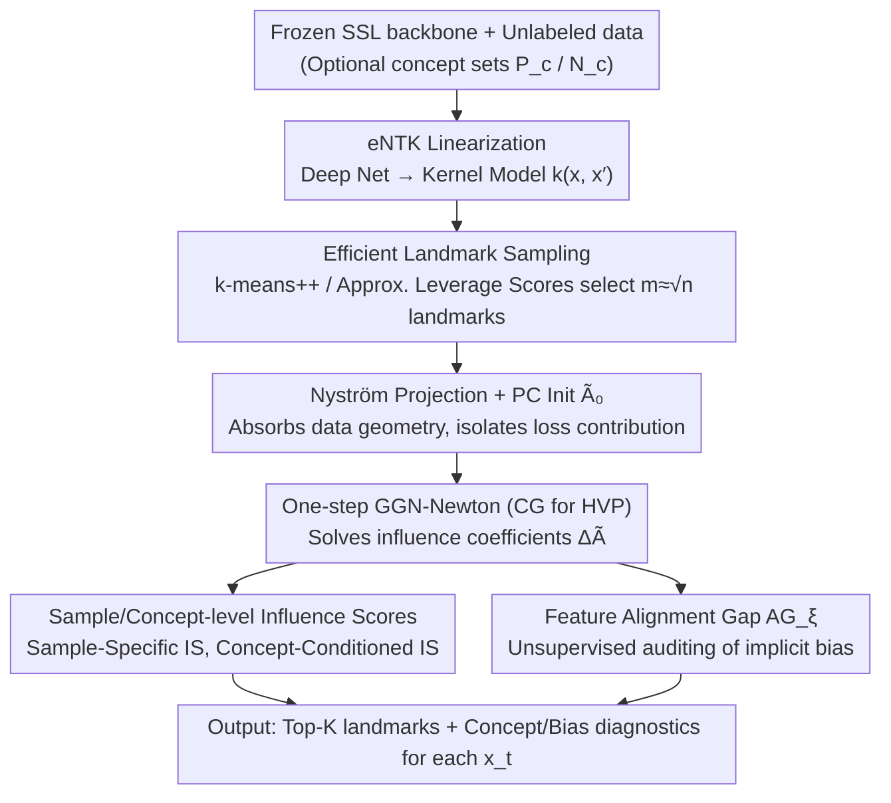

# Interpretable Self-Supervised Learning via Representer Landmarks and Nyström Approximation

**Conference**: ICML 2026  
**arXiv**: [2509.24467](https://arxiv.org/abs/2509.24467)  
**Code**: TBD  
**Area**: Interpretability / Self-Supervised Learning  
**Keywords**: Self-Supervised Learning, Interpretability, Representer Theorem, eNTK, Nyström Approximation

## TL;DR
KREPES utilizes eNTK to approximate arbitrary SSL models as kernel models, then leverages the Representer Theorem to express representations as kernel-weighted combinations of "landmark samples." Using Nyström approximation and one-step GGN-Newton, it analytically solves influence coefficients for non-convex objectives such as SimCLR, BYOL, VICReg, and Barlow Twins, enabling unsupervised auditing of SSL latent spaces on datasets exceeding 1M samples.

## Background & Motivation

**Background**: SSL methods like SimCLR, BYOL, VICReg, and Barlow Twins are mainstream for learning representations from massive unlabeled data, but the resulting networks remain black boxes. The community primarily relies on post-hoc methods like saliency maps and linear probes, or domain-specific interpretable architectures (e.g., geometric bottlenecks for video pose, prototypical decoding for single-cell transcriptomics).

**Limitations of Prior Work**: Post-hoc methods fail to explain "internally what the SSL representation has learned." Domain-specific solutions are tied to specific tasks and cannot be transferred. Furthermore, "intrinsically interpretable" approaches based on the Representer Theorem (Yeh 2018, Tsai 2023, Engel 2023) all depend on supervision signals—they use label gradients to derive sample coefficients $\alpha_i \propto \partial L/\partial f(x_i)$, which are undefined without labels.

**Key Challenge**: (i) SSL lacks labels and specific prediction tasks, causing the feature-attribution paradigm to fail natively; (ii) Using kernel methods for sample-level explanation incurs $O(n^2)$ memory and $O(n^3)$ time on 1M+ samples, and existing Nyström/RFF accelerators (Rudi 2017, Della Vecchia 2024) target only convex losses, failing to handle non-convex objectives like SimCLR/BYOL.

**Goal**: To construct a unified framework that adds "intrinsic interpretability" to networks trained with arbitrary SSL objectives—enabling sample-level tracing of "why $x_t$ is mapped here," concept-level auditing of "what concepts drive the embedding," and scalability to million-scale data like ImageNet-1K and Adult-1M.

**Key Insight**: The authors observe that eNTK can approximate deep networks as linear kernel models. Once linearized, the Representer Theorem allows the learned representation to be written as $f(x_t) = \sum_l k(x_l, x_t) A_{l,:}$. The remaining problem is solving for coefficients $A$ under non-convex SSL losses. The authors use Generalized Gauss–Newton (GGN) to locally convexify the loss and employ Nyström to project the RKHS onto a finite-dimensional subspace spanned by $m \ll n$ landmarks.

**Core Idea**: Compress the SSL network into an eNTK + Representer Theorem form, then use "PC initialization + one-step GGN-Newton + CG to solve Hessian-Vector Products" to analytically obtain dual coefficients in the Nyström subspace, completing the interpretability pipeline in $O(n\sqrt{n})$ time.

## Method

### Overall Architecture
KREPES resolves the contradiction of SSL networks being black boxes without labels. Instead of retraining, it performs a post-hoc audit on a **frozen** pretrained backbone, rewriting representations as kernel-weighted combinations of "landmark samples" to trace the mapping of $x_t$. The workflow consists of three stages: linearizing the deep network into a kernel model $k(x, x')$ using eNTK; selecting $m \ll n$ landmarks for Nyström projection and running one-step GGN-Newton from a PC initialization to solve for influence coefficients $\Delta\tilde{A}$; and using $\Delta\tilde{A}$ to calculate various influence scores for unsupervised diagnostics. The input is a pretrained SSL backbone and unlabeled data $\{x_i\}$ (optionally with concepts $\mathcal{P}_c, \mathcal{N}_c$); the output is top-K influential landmarks and concept scores for each test sample $x_t$.

### Key Designs

**1. Unsupervised SSL Influence via Representer + GGN: Decomposing Representations into Landmark Contributions**

Supervised Representer coefficients $\alpha_i \propto \partial L/\partial f(x_i)$ are undefined without labels, which is the bottleneck for SSL explanation. KREPES solves this by first using the Representer Theorem to write linearized representations as a kernel combination of landmarks $f(x_t) = \sum_l k(\tilde{x}_l, x_t) \tilde{A}_{l,:}$, where the sensitivity of $f(x_t)$ to landmark $\tilde{x}_l$ via parameter $\tilde{A}_{l,:}$ is $\nabla_{\tilde{A}_{l,:}} f(x_t) = k(\tilde{x}_l, x_t) I_h$. It then takes a Taylor expansion of the SSL loss w.r.t. global $\tilde{A}$ at $\tilde{A}_0$, replaces the non-convex Hessian with a GGN proxy $\bar{H}_{GN} = J^\top Q J + \lambda I$ (locally PSD for any SSL objective), and sets $\nabla_{\Delta\tilde{A}} \tilde{L} = 0$ to analytically obtain the one-step Newton solution $\mathrm{vec}(\Delta\tilde{A}) = -\bar{H}_{GN}^{-1} \mathrm{vec}(\nabla_{\tilde{A}} L(\tilde{A}_0))$. This quantifies the "causal influence of the training objective on geometry" without labels. With $\Delta\tilde{A}$, two metrics are defined: **Sample-Specific Influence Score** $\mathrm{IS}(\tilde{x}_l, x_t) = \|\nabla_{\tilde{A}_{l,:}} f(x_t)\, \Delta\tilde{A}_{l,:}^\top\|_2$ measures the landmark’s total contribution; **Concept-Conditioned Influence** $\mathrm{IS}(\tilde{x}_l, x_t; v_c) = \langle \nabla_{\tilde{A}_{l,:}} f(x_t)\, \Delta\tilde{A}_{l,:}^\top, v_c\rangle$ uses a CAV $v_c$ (learned from concept sets) to identify if a landmark pushes $x_t$ towards concept $c$. This clean decoupling is possible because "data geometric covariance" is absorbed by the PC initialization $\tilde{A}_0$, leaving only loss contributions for the Newton increment.

**2. Nyström + PC Initialization + GGN-HVP: Scaling One-step Newton to Million Samples**

Directly searching parameters in RKHS hits an $O(n^2)$ memory wall, and coefficients would be confounded by data covariance. KREPES uses Nyström to compress the function class into finite dimensions $f(x) = \sum_{i\in[m], j\in[p]} \tilde{\alpha}_i^j k(\tilde{x}_i^j, x) + \gamma$, approximating the kernel $K_{nn} \approx K_{nm} K_{mm}^\dagger K_{mn}$ and using a truncated eigen-decomposition $K_{mm} \approx U_h \Lambda_h U_h^\top$. Crucially, it fixes the Taylor expansion point at $\tilde{A}_0 = U_h \Lambda_h^{-1/2}$, such that $f(X) = K_{nm}\tilde{A}_0$ is exactly the Nyström feature map. This treats PCA components as a prior, ensuring $\Delta\tilde{A}$ reflects SSL objective bias rather than manifold geometry. To solve for $\Delta\tilde{A}$, it avoids forming the $O(m^3)$ dense Hessian, instead solving $\bar{H}_{GN}\Delta\tilde{A} = -\nabla_{\tilde{A}} L(\tilde{A}_0)$ via Conjugate Gradient (CG) iterations, requiring only Hessian-Vector Products (HVP). HVPs are analytically derived for SSL objectives; e.g., Barlow Twins is treated as non-linear least squares of residuals $r(\theta) = \mathrm{vec}(W \odot (C - I))$, yielding $\mathrm{HVP}_{BT}(d) = 2\cdot\mathrm{vjp}(r, \theta, \mathrm{jvp}(r, \theta, d))$. This batch-wise accumulation avoids dense matrices and ensures stability, reducing complexity from $O(n^2)$ to $O(n\sqrt{n})$.

**3. Feature Alignment Gap and Efficient Landmark Sampling: Unsupervised Bias Auditing**

In tabular scenarios (e.g., Adult), "features themselves" serve as semantic concepts without needing separate CAVs. KREPES audits implicit bias by defining feature consistency $v_\xi(x_t, x_l) = 1 - \min(|x_{t,\xi} - x_{l,\xi}|/\Delta\xi, 1)$. This leads to the **Feature-Conditioned Influence** and finally the **Feature Alignment Gap** $\mathrm{AG}_\xi = \mathbb{E}_{x_t}[\Psi(x_t; v_\xi) - \Psi_{\mathcal{R}_{\mathrm{random}}}(x_t; v_\xi)]$. An $\mathrm{AG}_\xi \gg 0$ indicates the SSL geometry systematically amplifies feature $\xi$. On Adult-1M, this reveals model preferences for gender/relationship over education without labels. For Nyström quality, KREPES uses two complementary strategies: k-means++ for uniform geometric coverage, and approximate leverage score sampling $P(x_j) \propto \hat{\ell}_j(\lambda)/\|\hat{\ell}\|_1$ via Hutchinson estimators and CG to capture spectral directions without $O(n^3)$ inversion.

### Loss & Training
KREPES does not retrain SSL models. It applies a post-training audit on a **frozen** pretrained backbone using eNTK linearization and Nyström projection. The primary hyperparameters are landmark count $m = O(\sqrt{n})$, Tikhonov regularization $\lambda$, and projection dimension $h$.

## Key Experimental Results

### Main Results

| Dataset (Size) | SSL Objective | KREPES Acc Gap $\Delta$ | Kendall-$\tau$ (NN vs KREPES) | Confidence Drop (random / KREPES) |
|--------|------|------|----------|------|
| Adult (1M) | BT / SimCLR / VICReg | +0.06 / +0.12 / +0.12 | 0.845 / 0.842 / 0.840 | .0002 / .0572 etc. |
| Higgs (1M) | BT / SimCLR / VICReg | +0.03 / -0.10 / +0.25 | 0.781 / 0.778 / 0.783 | .0003 / .0461 etc. |
| ImageNet (1.2M) | BT / SimCLR / VICReg | -0.24 / -0.39 / -0.31 | 0.801 / 0.797 / 0.790 | .0001 / .0583 etc. |
| CoverType (1M) | BT / SimCLR / VICReg | -0.41 / +0.87 / +0.47 | 0.872 / 0.861 / 0.863 | .0003 / .0810 etc. |
| CIFAR-10 (60k) | BT / SimCLR / VICReg | -0.92 / -0.38 / -1.10 | 0.878 / 0.881 / 0.880 | .0011 / .0667 etc. |

The accuracy of eNTK + KREPES nearly matches the original NN ($|\Delta| < 1\%$), and $\tau \geq 0.78$ indicates nearly identical decision boundaries. Removing the top-10 KREPES landmarks drops k-NN confidence hundreds of times more than random removal, verifying landmarks as "causal pillars."

### Ablation Study

| Config / Metric | Value | Description |
|------|---------|------|
| CIFAR-10 Class Coverage $\kappa$ — Barlow Twins | 12 (Acc 91.18%) | 12 top-norm landmarks cover 10 classes; landmarks align with semantics. |
| CIFAR-10 $\kappa$ — VICReg / BYOL / SimCLR | 18 / 26 / 27 | Lower $\kappa$ correlates with higher downstream Acc; unsupervised quality prediction. |
| CIFAR-10 $\kappa$ — Spectral Contrastive | 81 (Acc 89.75%) | Spectral contrastive has worst coverage, validating ranking consistency. |
| Adult Precision@1 — KREPES vs cosine baseline | 0.872 vs 0.809 | KREPES top-1 landmark shares class with test sample more often than nearest neighbors. |
| Cover Precision@1 — KREPES vs baseline | 0.772 vs 0.550 | Gap widens to 22 percentage points on complex tabular data. |
| Adult/Bank Time Complexity | $O(n\sqrt{n})$ vs Full Kernel $O(n^2)$ | Slopes on log-log plots are significantly flatter; Acc matches full kernel. |

### Key Findings
- **Landmark Ranking as Downstream Proxy**: On CIFAR-10, Barlow Twins' $\kappa=12$ corresponds to the highest linear probe accuracy (91.18%), suggesting that "how many classes top-norm landmarks cover" serves as an unsupervised quality signal.
- **Spectral Entropy for Hyperparameter Selection**: On MNIST + Barlow Twins, the normalized spectral entropy of $\tilde{A}^\top \tilde{A}$ peaks alongside 10% linear probe accuracy, offering a zero-label tuning scheme.
- **Unsupervised Audit of Implicit Bias**: Alignment Gap on Adult-1M reveals the SSL model amplifies gender and relationship over education. On FairFace, KREPES shows SE Asians are anchored by East Asian landmarks (33%), and Indians by Middle Eastern (23%) and Latino (22%) landmarks, indicating augmentation-induced cross-population confusion.
- **Repulsive Force Visualization**: KREPES models both positive and negative influence. Red "repulsive landmarks" show SSL explicitly pushing apart visually similar but semantically distinct samples (e.g., dark planes vs. birds, white cars vs. plane fuselages), a nuance missed by attraction-only methods.

## Highlights & Insights
- **Synergy of Representer + eNTK + GGN**: eNTK linearizes the network to use kernel frameworks, Representer defines the "landmark decomposition," and GGN reduces non-convex SSL to a solvable quadratic problem—allowing for unsupervised closed-form influence.
- **Geometric Significance of PC Initialization**: Fixing the Taylor expansion at Nyström principal components ensures $\Delta\tilde{A}$ only captures "causal bias" of the SSL goal, effectively decomposing representations into "data prior + task contribution."
- **HVP-only Inference**: Using CG + jvp/vjp to compute HVPs without ever forming the Hessian is the key technical trick to scaling kernel methods to 1M+ data points.

## Limitations & Future Work
- **eNTK Fidelity**: For extremely deep or non-linear networks (e.g., global attention, complex normalization), eNTK fidelity might decrease. The ImageNet $\Delta$ of -0.39 suggests systemic bias exists in large-scale settings.
- **One-step GGN-Newton**: Assumes loss curvature is well-captured by the PSD proxy. It might yield unreliable coefficients for SSL losses on plateaus or near collapse.
- **Concept Set Requirement**: Concept-Conditioned scores require pre-defined sets $\mathcal{P}_c, \mathcal{N}_c$. Automated concept discovery could be integrated for open-domain settings.
- **Future Directions**: (i) Replacing one-step Newton with iterations or KFAC for higher fidelity; (ii) Extending Alignment Gap to sequence/multimodal features; (iii) Using "repulsive landmarks" as a regularizer during SSL training.

## Related Work & Insights
- **vs Yeh et al. 2018 / Tsai et al. 2023 / Engel et al. 2023 (kGLM)**: These rely on label gradients for coefficients. KREPES is the first to bring the Representer framework to **unsupervised** SSL via GGN-based local convexification.
- **vs Rudi et al. 2017 / Della Vecchia et al. 2024**: Their Nyström acceleration supports only convex losses (KRR, etc.). KREPES extends this to non-convex SSL targets like SimCLR and Barlow Twins.
- **vs Cosine-similarity / Nearest-neighbor**: Simple geometric proximity does not distinguish "causal drivers" from "spurious correlations." KREPES outperforms these baselines by 6–22% in Precision@1 and identifies repulsive forces.
- **vs Koh & Liang 2017 (Influence Function)**: Classic IF requires PSD at the optimum and uses labels. KREPES uses eNTK as a proxy for the Hessian and GGN to satisfy the PSD requirement without labels.

## Rating
- Novelty: ⭐⭐⭐⭐⭐ First to extend Representer Theorem to SSL; brilliant integration of eNTK, GGN, and Nyström.
- Experimental Thoroughness: ⭐⭐⭐⭐ Covers 1M+ images/tables across 4 SSL objectives; validates Acc, causality, bias auditing, and label-free tuning; though lacks Transformer-scale vision models.
- Writing Quality: ⭐⭐⭐⭐ Rigorous notation and clear framework diagrams; metric definitions are dense in Sec 3.
- Value: ⭐⭐⭐⭐⭐ Provides a unified, scalable, and bias-auditable path for SSL interpretability with direct applications in Responsible AI.

<!-- RELATED:START -->

## Related Papers

- [\[ICML 2026\] IdEst: Assessing Self-Supervised Learning Representations via Intrinsic Dimension](idest_assessing_self-supervised_learning_representations_via_intrinsic_dimension.md)
- [\[CVPR 2025\] Probing the Mid-Level Vision Capabilities of Self-Supervised Learning](../../CVPR2025/interpretability/probing_the_mid-level_vision_capabilities_of_self-supervised_learning.md)
- [\[ICCV 2025\] AIM: Amending Inherent Interpretability via Self-Supervised Masking](../../ICCV2025/interpretability/aim_amending_inherent_interpretability_via_self-supervised_masking.md)
- [\[NeurIPS 2025\] Dataset Distillation for Pre-Trained Self-Supervised Vision Models](../../NeurIPS2025/interpretability/dataset_distillation_for_pre-trained_self-supervised_vision_models.md)
- [\[ICML 2026\] MiniMax Learning of Interpretable Factored Stochastic Policies from Conjoint Data, with Uncertainty Quantification](minimax_learning_of_interpretable_factored_stochastic_policies_from_conjoint_dat.md)

<!-- RELATED:END -->
