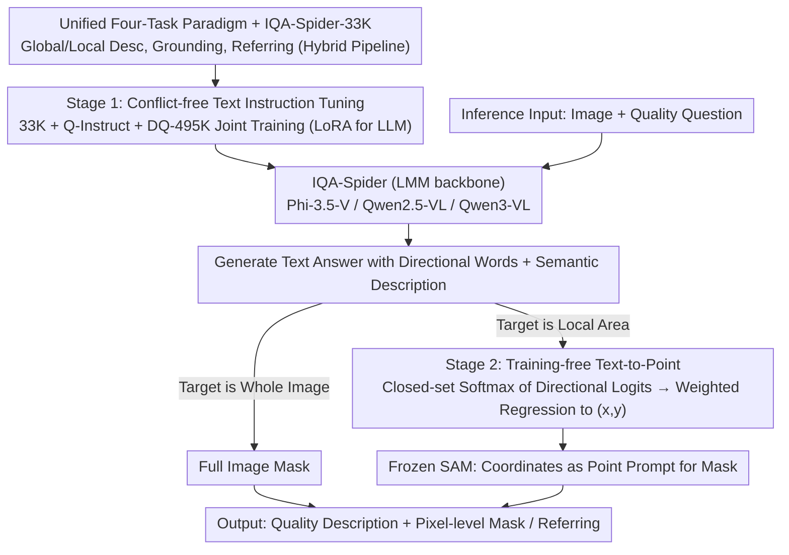

# IQA-Spider: Unifying Multi-Granularity Image Quality Assessment with Reasoning, Grounding and Referring

**Conference**: ICML 2026  
**arXiv**: [2605.24553](https://arxiv.org/abs/2605.24553)  
**Code**: https://github.com/Helen1p/IQA-Spider.git (Available)  
**Area**: Multimodal VLM / Image Quality Assessment  
**Keywords**: Multi-granularity IQA, LMM, Pixel-level grounding, text-to-point, training-free

## TL;DR
This paper proposes IQA-Spider, a multi-granularity image quality assessment method that unifies four categories of tasks—"global quality description + local quality description + pixel-level grounding + region-level referring"—into a single LMM framework. Accompanying this is a 33K-scale multi-task dataset and a training-free text-to-point paradigm that directly maps location word logits from the language model to point prompts for SAM. IQA-Spider comprehensively outperforms existing specialized models like Q-Instruct and Q-Ground on multi-granularity IQA benchmarks.

## Background & Motivation

**Background**: Image Quality Assessment (IQA) based on Large Multimodal Models (LMMs) has developed rapidly over the past two years. Several relatively independent technical routes have emerged, ranging from global scoring (Q-Bench / Q-Align) to quality description and reasoning (Q-Instruct / DepictQA-Wild) and pixel-level grounding (Q-Ground / Grounding-IQA).

**Limitations of Prior Work**: Existing methods typically cover only a single perceptual dimension—either they provide whole-image descriptions or perform pixel grounding based on fixed distortion categories. They cannot simultaneously "explain what is wrong" and "point out where it is" within a single model. DepictQA-Wild has strong descriptive capabilities but poor localization; Q-Ground performs grounding but is tied to a narrow distortion vocabulary. Furthermore, introducing special tokens like `<seg>` can damage the original instruction-following and reasoning capabilities of the LMM.

**Key Challenge**: The current coupling paradigm of "language tokens + special grounding tokens" faces a dilemma—either modifying the language space for grounding (at the cost of reasoning ability) or outputting pure text (failing to obtain pixel masks). Additionally, the data side lacks a unified task definition that covers global, local, grounding, and referring granularities while being scalable.

**Goal**: (1) Formalize multi-granularity IQA into a four-task system; (2) Create a corresponding dataset using a scalable pipeline; (3) Connect grounding to SAM without damaging the LMM's text reasoning capabilities.

**Key Insight**: A key observation is that when LMMs generate spatial descriptions (e.g., "top/bottom/left/right"), their native token logits already encode spatial distribution probabilities. There is no need to train special grounding tokens; location word logits can be weighted and regressed into coordinates to serve directly as point prompts for SAM.

**Core Idea**: By using a unified four-task definition and a two-stage training approach (text-based multi-granularity reasoning followed by training-free pixel grounding), "reasoning + grounding + referring" are integrated into the same LMM. Grounding is achieved by reusing native location word logits, requiring zero additional parameters and zero additional supervision.

## Method

### Overall Architecture

IQA-Spider aims to solve the problem of a single model being able to both explain quality defects and pinpoint them at the pixel level. It constructs a system combining an LMM backbone (Phi-3.5-Vision / Qwen2.5-VL / Qwen3-VL) with a frozen SAM segmentation head. The language model handles reasoning and description, while SAM produces masks. Given an image and a quality question, the LMM first generates a text answer containing directional words and semantic descriptions. If the answer implies the target is the entire image, a full-image mask is used; otherwise, the directional word logits are converted into a coordinate via a text-to-point module and fed to SAM as a point prompt for the final mask.

The training process is two-staged and conflict-free: the first stage involves multi-task instruction tuning at the text level (using LoRA for the LLM and full-parameter tuning for the vision encoder and projector) to learn global/local descriptions, text answers for grounding, and referring. The second stage requires no training; the text-to-point module converts the text-based spatial awareness learned in the first stage into pixel-level grounding at zero cost.

### Key Designs

**1. Unified Four-Task Paradigm + IQA-Spider-33K Dataset**
Previous IQA datasets either only labeled distortion categories (too narrow) or only provided whole-image descriptions (too coarse). To address the lack of a unified definition supporting region-aware multi-task training, this paper formalizes IQA into four task types: global quality description, local quality description, visual quality grounding, and visual quality referring (short/long answers). Grounding is further divided into HyD-G (Hybrid Distortion levels), SiD-G (Single Distortion level), and DAO-G (Distortion Accumulation Order), covering all granularities from full image to pixel. Data is generated via a hybrid pipeline: synthetic distortions use an automated pipeline (SSA extracts semantic regions → masks inject distortions → InternVL-2.5 generates QA), while real distortions use a semi-automated approach (manual region-level labels + InternVL-2.5 QA). Existing data like Q-Instruct and DQ-495K are integrated conflict-free. Human evaluation confirmed that >80% of samples scored 4-5 across semantic, spatial, distortion, and language dimensions.

**2. Text-to-Point Grounding Paradigm**
Existing SAM-based grounding (e.g., LISA, GLaMM) relies on special tokens like `<seg>`, which hard-binds language generation and pixel segmentation, potentially harming reasoning performance. Instead of extra encoders or memory-heavy attention maps, the authors observe that native token logits for directional words encode spatial probabilities. By performing a closed-set softmax on hidden states for directional sets $\{left, right\}$ and $\{top, bottom\}$: $p_{l_i} = e^{\chi_{l_i}/\tau} / \sum_j e^{\chi_{l_j}/\tau}$, and then taking a weighted average of normalized coordinates (e.g., left=0, right=1), coordinates $(x,y)$ are obtained. These serve as SAM point prompts. This path uses zero additional parameters and is reasoning-preserving.

**3. Two-Stage Conflict-Free Training**
To ensure the LMM masters all tasks without interference, Stage 1 uses joint instruction tuning on Q-Instruct, DQ-495K, and IQA-Spider-33K with standard cross-entropy loss. The segmentation head remains frozen, and no grounding-specific loss is introduced. Ablations (Tab. 4) reveal a non-monotonic trend: description tasks are sensitive to single external datasets, but performing best when all three datasets are combined. Grounding benefits primarily from explicit region-text alignment, while referring improves monotonically with data diversity.

## Key Experimental Results

### Main Results

| Dataset / Task | Metric | Ours (Qwen3-VL) | Prev. SOTA | Gain |
|---|---|---|---|---|
| Self-built benchmark — Global Des. | GPT-4V score (0-10) | 7.12 | 5.90 (Qwen3-VL Baseline) | +1.22 |
| Self-built benchmark — Local Des. | GPT-4V score (0-10) | 7.10 | 5.45 (Qwen3-VL) | +1.65 |
| Self-built benchmark — Grounding | GPT-4V score (0-5) | 2.41 | 1.25 (Qwen2.5-VL) | +1.16 |
| Self-built benchmark — Ref-long | Accuracy | 0.484 | 0.176 (Qwen3-VL) | +0.308 |
| Q-Bench-A1 (LLVisionQA-dev) | Accuracy | 74.45% | 67.56% (Q-Instruct) | +6.89% |
| Q-Ground-Test | mIoU | 0.338 | 0.271 (Q-Ground) | +0.067 |
| KADID-10K (Scoring) | SRCC/PLCC | 0.741/0.746 | 0.698/0.676 (Q-Instruct) | +0.043/+0.070 |

Notably, on Q-Ground-Test, IQA-Spider **was never trained on Q-Ground-100K and remains training-free for grounding**, yet it exceeds the Q-Ground baseline fine-tuned on that specific data.

### Ablation Study (Tab. 4, based on Qwen3-VL)

| Configuration | Global Des. | Local Des. | Grounding | Ref-short | Ref-long |
|---|---|---|---|---|---|
| Ours only | 7.01 | 7.07 | 2.42 | 0.541 | 0.458 |
| Ours + Q-Instruct | 6.99 | 7.03 | 2.53 | 0.542 | 0.466 |
| Ours + DQ-495K | 7.00 | 6.86 | 2.36 | 0.547 | 0.476 |
| Ours + ALL (IV) | **7.12** | **7.10** | 2.41 | **0.594** | **0.484** |

### Key Findings
- **Training-free text-to-point outperforms jointly trained EVF-SAM**: Native LMM location tokens encode sufficient spatial signals; training special tokens is unnecessary.
- **Dataset synergy is non-monotonic**: Adding Q-Instruct or DQ-495K alone can decrease description performance, but combining all three is optimal.
- **Backbone universal**: Consistent gains across Phi-3.5-V, Qwen2.5-VL, and Qwen3-VL verify the plug-and-play nature.
- **Strong cross-domain generalization**: Beating specialized models on Q-Ground-Test without training on its training set proves better generalization via decoupled spatial-semantic perception.

## Highlights & Insights
- **Zero-cost grounding integration**: Reusing native directional logits for SAM point prompts is elegant, preserving the language space and reasoning capabilities.
- **Systematic decomposition of IQA**: By completing the task space first, a relatively small dataset (33K) supports a robust benchmark.
- **Conflict-free data fusion**: Reveals that multi-source IQA joint training requires a "full union" for maximum benefit.
- **Transferability**: The text-to-point trick is applicable to any domain (e.g., medical, robotics) where an LMM describes locations and a segmentor provides masks.

## Limitations & Future Work
- Hard-coded to 4 directional words (top, bottom, left, right), which provides relatively coarse localization; expanding to more bins (e.g., 9-grid) is a future direction.
- Dataset scale is modest (33K), and quality is capped by the base LMM (InternVL-2.5) used for generation.
- High reliance on GPT-4V for evaluation introduces potential bias and reproduction difficulties.
- Grounding via a single point prompt makes it difficult to ground multiple independent distortion regions simultaneously.
- Distortion accumulation order (DAO-G) labeling depends heavily on predefined recognizable orders.

## Related Work & Insights
- **vs Q-Ground**: Q-Ground needs specific data and harms reasoning; Ours is training-free and generalizes better.
- **vs LISA / GLaMM**: These general `<seg>` paradigms perform poorly on IQA grounding (0.078-0.192 mIoU vs Ours 0.364-0.408).
- **vs DepictQA-Wild / Grounding-IQA**: Unifies strong description and referring/grounding capabilities that were previously separate.
- **vs EVF-SAM**: Refined logit signals are shown to be more effective than large-scale semantic encodings for grounding prompts.

## Rating
- Novelty: ⭐⭐⭐⭐
- Experimental Thoroughness: ⭐⭐⭐⭐
- Writing Quality: ⭐⭐⭐⭐
- Value: ⭐⭐⭐⭐

<!-- RELATED:START -->

## Related Papers

- [\[CVPR 2026\] Learning Where to Look and How to Judge: Resolution-agnostic Image Quality Assessment with Quality-aware Saliency](../../CVPR2026/interpretability/learning_where_to_look_and_how_to_judge_resolution-agnostic_image_quality_assess.md)
- [\[AAAI 2026\] DR.Experts: Differential Refinement of Distortion-Aware Experts for Blind Image Quality Assessment](../../AAAI2026/interpretability/drexperts_differential_refinement_of_distortion-aware_experts_for_blind_image_qu.md)
- [\[CVPR 2026\] HierUQ: Hierarchical Uncertainty Quantification with Adaptive Granularity Reconciliation for Degraded Image Classification](../../CVPR2026/interpretability/hieruq_hierarchical_uncertainty_quantification_with_adaptive_granularity_reconci.md)
- [\[CVPR 2026\] VIRO: Robust and Efficient Neuro-Symbolic Reasoning with Verification for Referring Expression Comprehension](../../CVPR2026/interpretability/viro_robust_and_efficient_neuro-symbolic_reasoning_with_verification_for_referri.md)
- [\[CVPR 2025\] KVQ: Boosting Video Quality Assessment via Saliency-Guided Local Perception](../../CVPR2025/interpretability/kvq_boosting_video_quality_assessment_via_saliency-guided_local_perception.md)

<!-- RELATED:END -->
