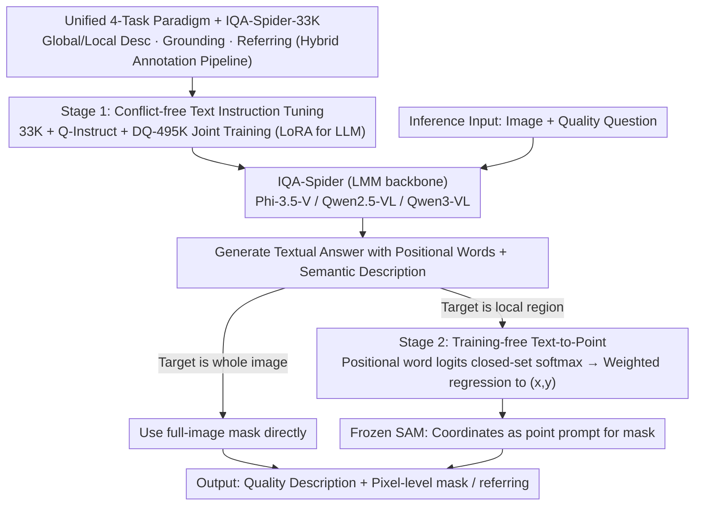

# IQA-Spider: Unifying Multi-Granularity Image Quality Assessment with Reasoning, Grounding and Referring

**Conference**: ICML 2026  
**arXiv**: [2605.24553](https://arxiv.org/abs/2605.24553)  
**Code**: https://github.com/Helen1p/IQA-Spider.git (Available)  
**Area**: Multimodal VLM / Image Quality Assessment  
**Keywords**: Multi-granularity IQA, LMM, Pixel-level grounding, text-to-point, training-free

## TL;DR
This paper proposes IQA-Spider, a multi-granularity image quality assessment method that unifies four types of tasks—"global quality description + local quality description + pixel-level grounding + region-level referring"—into a single LMM framework. Accompanied by a multi-task dataset of 33K scale, it introduces a training-free text-to-point paradigm that directly maps location word logits from the language model to point prompts for SAM. It comprehensively outperforms existing specialized models like Q-Instruct and Q-Ground on multi-granularity IQA benchmarks.

## Background & Motivation

**Background**: Image Quality Assessment (IQA) based on Large Multimodal Models (LMMs) has developed rapidly over the past two years. Several relatively independent technical routes have formed, ranging from global scoring in Q-Bench / Q-Align, to quality description and reasoning in Q-Instruct / DepictQA-Wild, and recently to pixel-level grounding in Q-Ground / Grounding-IQA.

**Limitations of Prior Work**: Existing methods typically cover only a single perceptual dimension—either generating whole-image descriptions or performing pixel grounding based on fixed distortion categories. They cannot simultaneously "explain what is wrong" and "point to where it is" within the same model. DepictQA-Wild possesses strong descriptive capabilities but poor localization; Q-Ground can perform grounding but is tied to a narrow distortion vocabulary; meanwhile, introducing special tokens like `<seg>` can degrade the original instruction-following and reasoning capabilities of the LMM.

**Key Challenge**: The current coupling paradigm of "language tokens + special grounding tokens" faces a dilemma: either modifying the language space to accommodate grounding (decreasing reasoning performance) or outputting pure text (failing to obtain pixel masks). Furthermore, the data side lacks a unified task definition that covers all four granularities—global, local, grounding, and referring—and is capable of scaling up.

**Goal**: (1) Formalize multi-granularity IQA into a four-task system; (2) Construct a corresponding dataset using a scalable pipeline; (3) Connect grounding to SAM without damaging the LMM's text reasoning capabilities.

**Key Insight**: A key observation of the authors is that when LMMs generate spatial descriptions (e.g., "top/bottom/left/right"), their native token logits already encode spatial distribution probabilities. There is no need to train special grounding tokens; by taking a weighted average of these positional word logits to regress coordinates, they can be directly used as point prompts for SAM.

**Core Idea**: By using a unified four-task definition and a two-stage training strategy (first text-based multi-granularity reasoning, then training-free pixel grounding), "reasoning + grounding + referring" are integrated into the same LMM. Grounding is achieved entirely by reusing native positional word logits, requiring zero additional parameters and zero additional supervision.

## Method

### Overall Architecture

IQA-Spider aims to solve the problem of "the same model being able to explain what is wrong with image quality and point out where it is at the pixel level." The approach couples an LMM backbone (Phi-3.5-Vision / Qwen2.5-VL / Qwen3-VL) with a completely frozen SAM segmentation head, where the language model handles reasoning and description while SAM generates masks. Given an image and a quality-related question, the LMM first generates a textual response containing directional words (top/left, etc.) and semantic descriptions. If the answer implies the target is the entire image, the whole-image mask is used directly; otherwise, the logits of the directional words are converted into a coordinate point via the text-to-point module, which serves as a point prompt for SAM to produce the final mask.

The entire training process is two-stage and conflict-free: the first stage performs multi-task instruction fine-tuning only at the text level (LoRA for the LLM, full-parameter fine-tuning for the vision encoder and projector) to learn global/local descriptions, text answers for grounding, and referring tasks. The second stage involves no training, utilizing text-to-point to upgrade the text-based spatial perception learned in the first stage to pixel-level grounding at "zero cost."

### Key Designs

**1. Unified 4-Task Paradigm + IQA-Spider-33K Dataset: Completing Task Space then Generating Data**

Previous IQA datasets either only labeled distortion categories (too narrow) or only provided whole-image descriptions (too coarse), lacking a unified definition to support "region perception + multi-task joint training." Thus, this work formalizes IQA into four task categories: global quality description, local quality description, visual quality grounding, and visual quality referring (with short/long answers). Grounding is further subdivided into HyD-G (Hybrid distortion intensity), SiD-G (Single distortion intensity), and DAO-G (distortion accumulation order), covering all granularities from whole images to pixels. Data is generated via a hybrid annotation pipeline: synthetic distortions use an automated pipeline (SSA extracts semantic instance regions → inject multiple distortions per mask → InternVL-2.5 generates multi-turn QA), while real distortions use a semi-automated approach (human labeling of region-level distortion tags + InternVL-2.5 writing QA). Existing data such as Q-Instruct and DQ-495K are integrated conflict-free. Finally, 10 human raters scored 40% of the samples, with >80% receiving 4-5 points across semantic, spatial, distortion, and language dimensions. The key is that this is not just scaling up, but establishing a task-and-data system that provides structured training signals for multi-granularity learning—allowing the relatively small 33K scale to support the entire benchmark.

**2. Text-to-Point Grounding Paradigm: Reusing Native Positional Word Logits as SAM Point Prompts**

Existing SAM-based grounding methods (e.g., LISA, GLaMM) rely on special tokens like `<seg>` to hard-bind language generation and pixel segmentation, which can damage original instruction-following and reasoning. Other methods using attention maps as implicit prompts (Wu 2024c, Cao 2024) either incur high memory costs or require additional image encoders. The authors' observation is that when an LMM generates positional words, its native token logits already encode spatial distribution probabilities, eliminating the need for special tokens. Specifically, a closed-set softmax is applied to the LMM hidden states over designated positional word sets $\{left, right\}$ and $\{top, bottom\}$: $p_{l_i} = e^{\chi_{l_i}/\tau} / \sum_j e^{\chi_{l_j}/\tau}$. A weighted average is then calculated based on normalized coordinates such as "left=0, right=1, top=0, bottom=1": $x = \sum_i p_{w_i} \times W,\ y = \sum_i p_{h_i} \times H$. The resulting coordinates $(x,y)$ serve directly as point prompts for SAM. This path requires zero additional parameters, zero additional supervision, and leaves the language space untouched, making it reasoning-preserving and plug-and-play for any LMM.

**3. Two-stage Conflict-free Training: "All-in-to-Win" for Multi-source IQA Data**

To enable an LMM to master global/local description, grounding, and referring simultaneously without interference, the first stage involves joint instruction tuning on Q-Instruct (global/local QA) + DQ-495K (distortion identification and reasoning) + the self-built IQA-Spider-33K. The loss function uses only standard next-token prediction cross-entropy; the segmentation head remains frozen throughout without any specialized grounding loss, and the second stage is entirely training-free. This design is justified by ablation studies (Tab. 4), which reveal a non-monotonic pattern: description tasks are sensitive to the addition of single external datasets and may slightly degrade, but combining all three datasets yields the best results. Grounding primarily benefits from data providing explicit region-text alignment, while referring improves monotonically with data diversity. The three datasets are complementary, and only conflict-free joint training can simultaneously support multi-granularity perception and conversational capabilities.

## Key Experimental Results

### Main Results

| Dataset / Task | Metric | Ours (Qwen3-VL) | Prev. SOTA | Gain |
|---|---|---|---|---|
| Self-built benchmark — Global Des. | GPT-4V score (0-10) | 7.12 | 5.90 (Qwen3-VL baseline) | +1.22 |
| Self-built benchmark — Local Des. | GPT-4V score (0-10) | 7.10 | 5.45 (Qwen3-VL) | +1.65 |
| Self-built benchmark — Grounding | GPT-4V score (0-5) | 2.41 | 1.25 (Qwen2.5-VL) | +1.16 |
| Self-built benchmark — Ref-long | Accuracy | 0.484 | 0.176 (Qwen3-VL) | +0.308 |
| Q-Bench-A1 (LLVisionQA-dev) | Accuracy | 74.45% | 67.56% (Q-Instruct) | +6.89% |
| Q-Ground-Test | mIoU | 0.338 | 0.271 (Q-Ground) | +0.067 |
| KADID-10K (Scoring) | SRCC/PLCC | 0.741/0.746 | 0.698/0.676 (Q-Instruct) | +0.043/+0.070 |

Notably, on Q-Ground-Test, IQA-Spider **was never trained on Q-Ground-100K and the grounding stage is training-free**, yet it still exceeds the Q-Ground baseline specifically fine-tuned on that data, demonstrating strong generalization.

### Ablation Study (Tab. 4, based on Qwen3-VL)

| Configuration | Global Des. | Local Des. | Grounding | Ref-short | Ref-long |
|---|---|---|---|---|---|
| Ours only | 7.01 | 7.07 | 2.42 | 0.541 | 0.458 |
| Ours + Q-Instruct | 6.99 | 7.03 | 2.53 | 0.542 | 0.466 |
| Ours + DQ-495K | 7.00 | 6.86 | 2.36 | 0.547 | 0.476 |
| Ours + All (IV) | **7.12** | **7.10** | 2.41 | **0.594** | **0.484** |

Additionally, regarding text-to-point vs. EVF-SAM (Fig. 5): the authors fed EVF-SAM with three types of text input (full answer / spatial only / semantic only). EVF-SAM performed best only with "pure semantic" input and still remained weaker than the training-free point prompt of this method.

### Key Findings
- **Training-free text-to-point is stronger than joint-trained EVF-SAM**: This suggests that native positional tokens in LMMs already encode sufficiently strong spatial distribution signals, making "hard-training special tokens" wasteful.
- **The synergistic effect of hybrid datasets is non-monotonic**: Adding Q-Instruct or DQ-495K individually can cause performance drops in description tasks, but adding all three together is optimal, indicating that data complementarity outweighs single-dataset scale.
- **The method is universal across backbones**: Consistent improvements were achieved across Phi-3.5-Vision (4B), Qwen2.5-VL (7B), and Qwen3-VL (7B), verifying its plug-and-play nature.
- **Strong cross-domain generalization**: Beating specialized models on Q-Ground-Test without training on Q-Ground-100K suggests that decoupling "position perception" from "semantic perception" via text-to-point improves generalization.

## Highlights & Insights
- **A truly "zero-cost" way to integrate grounding**: Reusing native LMM positional word logits → weighted regression to coordinates → SAM point prompt is an extremely concise path. It requires no new parameters, no new loss, and does not damage the language space, offering an elegant solution for the unified reasoning-grounding problem.
- **Systematic breakdown of IQA into four granular tasks**: Rather than just "pouring in more data," the focus is on completing the task space (especially the HyD-G / SiD-G / DAO-G grounding subtasks). Consequently, a relatively small dataset (33K) can support the benchmark.
- **Conflict-free data fusion**: Revealed a non-trivial law for joint training of multi-source IQA data—individual additions may lead to drops, while full combination leads to gains. This provides direct reference for future multi-task IQA data mixing.
- **Portability**: The text-to-point trick is not limited to IQA. Any unified architecture where "the language model describes a location + a segmentation model outputs a mask" (e.g., medical image analysis, robot vision instructions) can directly reuse this, provided the LMM output contains explicit directional words.

## Limitations & Future Work
- Positional words are strictly limited to four (top/bottom/left/right), which only expresses a coarse location via "quantiles + weighting." This may not be accurate for complex regions like centers, corners, or elongated shapes; expanding to a 9-grid or finer token set is a natural next step.
- The dataset scale is relatively small (33K) and relies on InternVL-2.5 for QA generation; the upper bound of QA quality is constrained by the base LMM. The authors acknowledge this as intentional, emphasizing "task systems over data volume," but actual benchmark performance might still be limited.
- Evaluation relies heavily on GPT-4V scoring (average of 5 rounds), introducing potential evaluator bias and being difficult to reproduce; relative rankings might not be stable if a different scoring model is used.
- Grounding is a serial pipeline: "classification logits → single point prompt → SAM mask." When encountering multiple independent distortion regions, it can only output one point, making it difficult to ground multiple areas simultaneously. Extensions for multiple points/masks have not yet been addressed.
- The annotation of distortion accumulation order (DAO-G) relies heavily on human-predefined "perceptually recognizable accumulation orders," which requires re-labeling when migrating to new distortion types.

## Related Work & Insights
- **vs Q-Ground**: Q-Ground connects grounding to SAM via special tokens, requiring Q-Ground-100K training which may hurt instruction following; this work reuses positional tokens training-free and performs better on Q-Ground-Test without specific grounding data.
- **vs LISA / GLaMM / Sa2VA**: These general `<seg>` token paradigms are effective for general segmentation but average only 0.078–0.192 on IQA grounding; this work achieves 0.364–0.408. The gap stems from "reasoning-grounding decoupling" and "quality-specific knowledge."
- **vs DepictQA-Wild / Grounding-IQA**: DepictQA-Wild is strong in description but weak in localization; Grounding-IQA is strong in bbox referring but narrow in tasks. This work absorbs their strengths into a single model via a four-task system.
- **vs EVF-SAM**: EVF-SAM uses a trainable multimodal encoder to turn text into prompts but remains weaker than the training-free scheme of this work. This suggests that for grounding prompts, "precise logit signals" might be more effective than "broad semantic encoding."

## Rating
- Novelty: ⭐⭐⭐⭐ The idea of using logit-weighted regression for coordinates in text-to-point is concise, elegant, and empirically effective; the four-task system is a rare integrated design in the IQA field.
- Experimental Thoroughness: ⭐⭐⭐⭐ Three backbones × multiple benchmarks (self-built + Q-Bench + Q-Ground-Test + KADID) + data ablation + comparison with EVF-SAM provide a complete chain of evidence.
- Writing Quality: ⭐⭐⭐⭐ Motivation is clearly derived, task definitions are well-formalized, and formulas are concise; readability of some tables is slightly affected by vertical layout.
- Value: ⭐⭐⭐⭐ The strategy of "reusing native token logits as grounding prompts" is valuable for all unified "LMM + segmentation head" architectures. The IQA-Spider-33K dataset and four-task benchmark set a new standard for multi-granularity IQA evaluation.

<!-- RELATED:START -->

## Related Papers

- [\[AAAI 2026\] DR.Experts: Differential Refinement of Distortion-Aware Experts for Blind Image Quality Assessment](../../AAAI2026/interpretability/drexperts_differential_refinement_of_distortion-aware_experts_for_blind_image_qu.md)
- [\[CVPR 2025\] KVQ: Boosting Video Quality Assessment via Saliency-Guided Local Perception](../../CVPR2025/interpretability/kvq_boosting_video_quality_assessment_via_saliency-guided_local_perception.md)
- [\[CVPR 2026\] VIRO: Robust and Efficient Neuro-Symbolic Reasoning with Verification for Referring Expression Comprehension](../../CVPR2026/interpretability/viro_robust_and_efficient_neuro-symbolic_reasoning_with_verification_for_referri.md)
- [\[ICML 2026\] Towards Long-Horizon Interpretability: Efficient and Faithful Multi-Token Attribution for Reasoning LLMs](towards_long-horizon_interpretability_efficient_and_faithful_multi-token_attribu.md)
- [\[CVPR 2026\] Neurodynamics-Driven Coupled Neural P Systems for Multi-Focus Image Fusion](../../CVPR2026/interpretability/neurodynamics-driven_coupled_neural_p_systems_for_multi-focus_image_fusion.md)

<!-- RELATED:END -->
