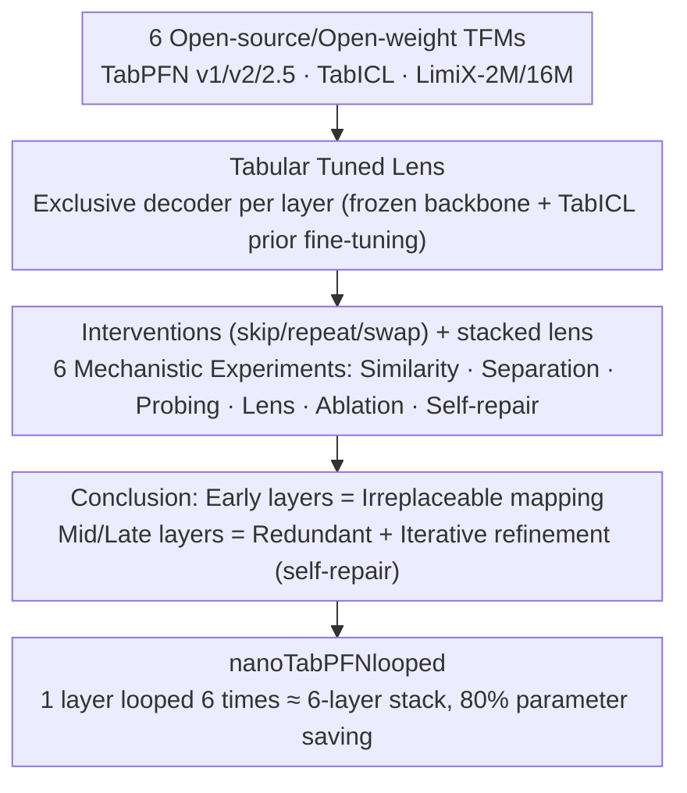

# Is One Layer Enough? Understanding Inference Dynamics in Tabular Foundation Models

**Conference**: ICML 2026  
**arXiv**: [2605.06510](https://arxiv.org/abs/2605.06510)  
**Code**: https://github.com/amirbalef/is_one_layer_enough  
**Area**: Interpretability / Tabular Foundation Models / Model Compression  
**Keywords**: TabPFN, Tabular Foundation Models, Mechanistic Interpretability, Recurrent Transformer, Inter-layer Dynamics

## TL;DR
The authors perform the first large-scale layered mechanistic analysis of six mainstream Tabular Foundation Models (TFMs). They find that middle and late layers primarily perform "iterative refinement" with significant redundancy. Based on this, they design a single-layer recurrent TFM using only 20% of parameters that nearly matches the performance of the original six-layer version.

## Background & Motivation
**Background**: Transformer-based Tabular Foundation Models like TabPFN, TabICL, and LimiX have surpassed traditional GBDT pipelines in small-to-medium scale tabular prediction. However, how they perform "Bayesian inference via in-context learning" remains a black box.

**Limitations of Prior Work**: Directly applying the "logit lens" method from LLMs to TFM representations is fragile (Experimental Figure 1 shows the original decoder fails almost completely in shallow layers). Furthermore, TFMs are encoder-only, non-autoregressive, and row-invariant, differing significantly from LLM architectures. Therefore, whether existing LLM interpretability conclusions (early-layer detokenization, middle-layer abstraction, late-layer sharpening) apply to TFMs remains an open question.

**Key Challenge**: On one hand, TFMs are smaller and cheaper for inference than LLMs, making them ideal for "large-scale mechanistic research." On the other hand, there is a lack of corresponding analysis toolsets, and diverse encoder designs across TFMs mean single-point studies cannot be generalized.

**Goal**: (1) Design a layered analysis protocol adapted for TFMs; (2) Answer "where and how inference is formed" and how it compares to LLMs; (3) Use insights to guide more efficient architecture design.

**Key Insight**: The authors observe that TFM tasks are fixed classification/regression, allowing for training "per-layer decoders" (i.e., "tabular tuned lens") instead of relying on vocabulary projections like LLMs. They also adapt mature intervention experiments from LLM mechanistic research: skip, repeat, and swap.

**Core Idea**: Jointly characterize TFM layer dynamics through six experiments: embedding similarity, class separation gap, probing classifier, tabular logit lens, layer ablation, and self-repair. The conclusion that "middle and late layers primarily engage in iterative refinement" supports a more efficient architecture that replaces multiple layers with a single recurrent layer.

## Method

### Overall Architecture
This work addresses the black-box problem of "how and at which layer inference decisions are formed inside a TFM." The answer is split into two steps: designing an analysis protocol tailored for TFMs and using the findings to guide a more efficient architecture. The analysis protocol covers six open-source/open-weight TFMs (TabPFN v1/v2/2.5, TabICL, LimiX-2M/16M) across six granular mechanistic experiments on PMLBmini (34 tasks) and TabArena (15 binary tasks). The proof-of-concept uses nanoTabPFN to train three variants from scratch using the same TabICL prior: a 6-layer original, a 1-layer version, and a 1-layer version looped six times.

### Key Designs

**1. Tabular Tuned Lens: Mapping an exclusive decoder to each layer to read its "answer potency"**

Directly using the LLM "logit lens" (using the final decoder to read hidden states of all layers) fails in early TFM layers; ROC-AUC in Figure 1 is near 0.5, suggesting "nothing is learned." The issue is misalignment between the decoder and early representations rather than a lack of representation. Since TFMs are encoder-only and row-invariant without a vocabulary detokenizer, the authors follow Belrose's tuned lens approach by pre-training a separate decoder for each layer. By freezing the backbone and training for 200 epochs on TabICL's synthetic prior, they obtain per-layer decoding heads. This establishes "whether early exiting is feasible" as a measurable curve and serves as the foundation for identifying where usable representations form.

**2. Skip / Repeat / Swap Interventions with Stacked Lens: Disentangling "redundancy" and "self-repair"**

To determine what each layer does, the authors use three types of structural ablations: *skip* layer $l$ to check irreplaceability; *repeat* layer $l$ to check for "iterative refinement" (performance gain upon repetition implies refinement); and *swap* adjacent layers to check for sequential alignment. Merely observing the final output drop after deletion confuses "useless layers (redundancy)" with "useful layers compensated by subsequent ones (self-repair)." Consequently, they stack the tuned lens on top of the skip intervention: after skipping layer $l$, they read the lens performance of the next layer. If the curve immediately recovers, it indicates redundancy plus self-repair; if it never recovers (as seen in early layers in Figure 8), the layer is critical and unique.

**3. nanoTabPFNlooped Single-layer Recurrence: Transforming insights into parameter-efficient architecture**

If middle and late layers truly perform iterative refinement, "one layer repeated $N$ times" should theoretically match "$N$ stacked layers." The authors conducted controlled comparisons on a nanoTabPFN implementation (similar to TabPFN v2 but lighter), training three groups: 6-layer stacked, 1-layer independent, and 1-layer looped 6 times. Parameter counts are 3.72M, 0.75M, and 0.75M, respectively, though the looped version's FLOPs match the 6-layer stack. All were trained from scratch with identical settings to ensure differences stem from "loop vs. stack" rather than model scale.

### Loss & Training
The nanoTabPFN series follows standard TabPFN training objectives. The TabICL prior generator was configured with batch=4×10,000 batches, features 2–30, classes up to 10, and length 1024. The AdamW optimizer was used with $\eta=10^{-4}$, cosine warmup for 2000 steps, and weight decay=0. Training times on a single A100 for 1-layer, 6-layer, and looped models were 11.9h, 62.3h, and 68.8h, respectively. Fine-tuning for each per-layer decoder used 200 epochs, batch=8, and $\eta=3\times10^{-5}$.

## Key Experimental Results

### Main Results
Table 1 compares the three nanoTabPFN versions on PMLBmini and TabArena:

| Model | Params | FLOPs | PMLBmini Performance | Gap vs 6-layer |
|------|--------|--------|----------------|-------------|
| nanoTabPFN-1l | 0.75M | 1× | Significantly worst | Large lag |
| nanoTabPFN-6l | 3.72M | 6× | Baseline | — |
| nanoTabPFN-looped | 0.75M | 6× | Close to 6l | Nearly matches |
| TabPFN(2.5) | 10.7M | 24 layers | Upper bound | Still better than looped |

Key finding: Performance gaps primarily arise from "whether 6 refinements were performed," not "whether there are 6 sets of independent parameters."

### Ablation Study
Six mechanistic experiments characterize layered behavior:

| Experiment | Key Finding | Significance |
|------|---------|------|
| Embedding Similarity (cos/CKA) | Large models (TabPFN 2.5, LimiX-16M) form clear "layer blocks." | Representations within blocks undergo small incremental updates. |
| Class Separation Gap | Increases monotonically with depth; label embedding rises later than feature. | Model separates features before forming label predictions. |
| Probing Classifier | Probes from layer $i$ generalize well to $j>i$, but not vice versa. | Later layers preserve earlier features while adding new ones. |
| Tabular Tuned Lens | Most models reach high AUC in early layers. | Inference decisions are actually formed "very early." |
| Layer Ablation (skip) | Deleting layer 1 collapses performance; deleting mid/late layers has minimal impact. | Early layers = specialized mapping; Mid/late layers = redundant. |
| Self-repair | Lens performance rebounds immediately in the layer following a skip. | Presence of "hydra effect" style self-repair. |

### Key Findings
- **Early layers are irreplaceable "mapping layers"**: TabICL and LimiX-2M, which have strong encoders (row-interaction compression/RBF kernel preprocessing), are less sensitive to the first few transformer blocks. Other models collapse if layer 1 is removed. This suggests early layers primarily project raw tokens into a space suitable for residual stream operations.
- **Redundancy and self-repair in mid/late layers**: TabPFN(v2) shows a "jump" in lens performance near layer 5, with significant overlapping computation between adjacent layers—providing the physical basis for a recurrent architecture.
- **Key differences between TFMs and LLMs**: TFMs are far more sensitive to layer swapping than LLMs (especially TabPFN v2). Furthermore, damaging the last layer in TFMs hardly affects output, contrasting with the "indispensable sharpening" seen in LLM final layers. Prediction calibration in TFMs occurs later and more implicitly.
- **Strong encoders are a free lunch**: Models with explicit feature encoding (e.g., row-interaction or RBF kernel) are less depth-sensitive, suggesting a design direction of "wide encoder + shallow looped backbone."

## Highlights & Insights
- "Tabular tuned lens" is the key tool for successfully migrating the LLM logit lens to ICL tabular tasks: original decoder failure isn't due to poor representation, but misalignment. The per-layer decoder reveals the model "knows the answer" much earlier.
- The stacked intervention plus lens design is clever: skip alone conflates "uselessness" with "self-repair," but lens addition separates them. This paradigm is transferable to all ICL models.
- The single-layer looped verification "monetizes" mechanistic research: while studies often stop at observations, this work translates the "refinement" conclusion into an architecture that saves 80% of parameters.
- It reveals fundamental differences between TFMs and LLMs regarding swap sensitivity and final layer importance, providing empirical evidence against blindly applying LLM heuristics to TFMs.

## Limitations & Future Work
- Experiments primarily focus on binary classification; multi-class and regression are only verified in limited scope in the appendix. Transferability to long priors or complex high-cardinality tasks is unknown.
- Tabular tuned lens priors used the TabICL open-source version, which might underestimate early layer quality for models trained on more sophisticated priors like LimiX.
- nanoTabPFNlooped is only a proof-of-concept at small scale; whether it scales to TabPFN(2.5) levels (24 layers, 50k samples) is unverified.
- Evaluation did not use ensembling; conclusions might be diluted in typical TFM "re-sampling ensemble" scenarios.
- Future work: Downstream analysis at the neuron/circuit level; researching how prior design shapes layered dynamics; applying identical tools to LLM-based tabular models (e.g., TabLLM) for cross-model comparisons.

## Related Work & Insights
- **vs. Lad et al. (Remarkable robustness of LLMs)**: While they proposed four-stage LLM inference (detokenize → refinement → ensembling → sharpening), this paper proves TFMs have similar but differently distributed stages, with lower final-layer importance.
- **vs. Belrose et al. (Tuned Lens)**: This work concretizes "tuned lens" via per-layer decoders and tabular prior fine-tuning, bypassing the lack of a vocabulary in TFMs.
- **vs. Looped Transformer (Universal Transformer, Dehghani 2019; Gong 2025)**: Migrates "recurrent refinement" to tabular ICL models, providing mechanistic justification before proposing the architecture.
- **vs. TabPFN Series & LimiX**: This is not an architectural competitor but a complementary interpretation and compression recipe for the entire TFM family.

## Rating
- Novelty: ⭐⭐⭐⭐ — First large-scale layered mechanistic study for TFMs, translating conclusions into concrete architectural improvements.
- Experimental Thoroughness: ⭐⭐⭐⭐⭐ — 6 models × 6 experiments × 2 benchmarks, with appendix coverage of multi-class/regression; the chain of evidence is very complete.
- Writing Quality: ⭐⭐⭐⭐ — Logic from observation to conclusion is clear with distinct "takeaway" blocks, though some charts (e.g., self-repair) require careful reading.
- Value: ⭐⭐⭐⭐ — Provides an analysis template and a "1-layer for 6-layers" compression strategy for the TFM community, with direct implications for industrial deployment.

<!-- RELATED:START -->

## Related Papers

- [\[ICML 2025\] On the Effect of Uncertainty on Layer-wise Inference Dynamics](../../ICML2025/interpretability/on_the_effect_of_uncertainty_on_layer-wise_inference_dynamics.md)
- [\[ICLR 2026\] Understanding Cross-Layer Contributions to Mixture-of-Experts Routing in LLMs](../../ICLR2026/interpretability/understanding_cross-layer_contributions_to_mixture-of-experts_routing_in_llms.md)
- [\[ICLR 2026\] Specialization after Generalization: Towards Understanding Test-Time Training in Foundation Models](../../ICLR2026/interpretability/specialization_after_generalization_towards_understanding_test-time_training_in_.md)
- [\[ICML 2026\] Memorization Dynamics of Fill-in-the-Middle Pretraining](memorization_dynamics_of_fill-in-the-middle_pretraining.md)
- [\[ICML 2026\] OmniSapiens: A Foundation Model for Social Behavior Processing via Heterogeneity-Aware Relative Policy Optimization](omnisapiens_a_foundation_model_for_social_behavior_processing_via_heterogeneity-.md)

<!-- RELATED:END -->
