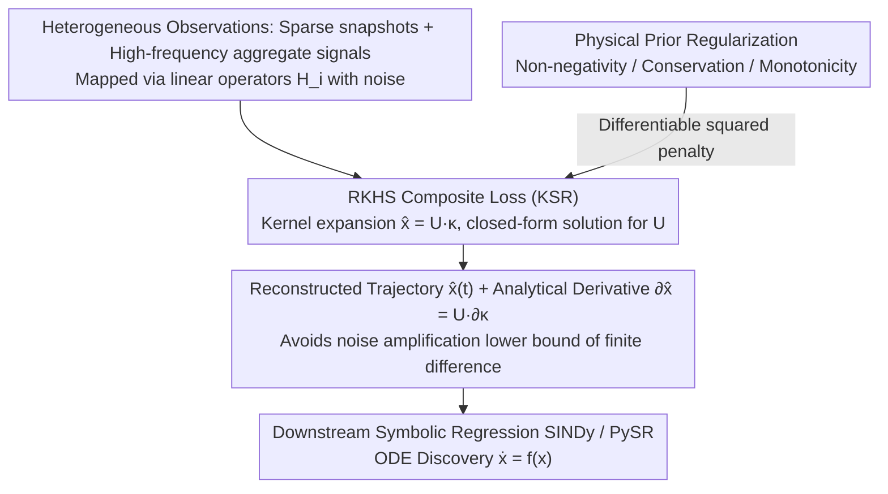

# MAAT: Heterogeneous Partial Observation State Reconstruction Based on Knowledge-Guided Kernel Regression

**Conference**: ICML 2026  
**arXiv**: [2601.22328](https://arxiv.org/abs/2601.22328)  
**Code**: Not released  
**Area**: Scientific Computing / Dynamical System Modeling / Symbolic Regression  
**Keywords**: Kernel State Reconstruction, RKHS, Heterogeneous Observation Operators, Symbolic Regression, Physical Priors

## TL;DR
MAAT reformulates the problem of "recovering a physically consistent latent state trajectory from sparse, heterogeneous, and noisy observations" as a constrained kernel ridge regression problem in Reproducing Kernel Hilbert Space (RKHS). It integrates observation operators, smoothness, and physical priors (e.g., non-negativity, conservation, monotonicity) into a unified objective function. This provides high-quality trajectories with analytical time derivatives for downstream symbolic regression (SINDy / PySR), reducing reconstruction MSE by 1–3 orders of magnitude across 9 synthetic benchmarks and real COVID-19 data.

## Background & Motivation

**Background**: In fields like medicine, ecology, and physics, latent dynamical states $x(t)\in\mathbb{R}^d$ are governed by ODEs $\dot{x}=f(x)$, but full states are rarely observed directly or regularly. Practice usually involves classic smoothing (splines, RBF, Savitzky–Golay), state-space models (Kalman, GP) for sensor fusion, or deep methods (Neural ODE / UDE) to learn latent dynamics.

**Limitations of Prior Work**: Existing methods have significant drawbacks. Classic smoothing ignores observation operators and domain constraints, handling only single-channel regular sampling. GPs provide analytical derivatives but struggle with hard constraints like "mass conservation" or "non-negativity." Kalman filters require prior transition dynamics. Neural ODEs are black boxes whose recovered trajectories are often unsuitable for "mechanism discovery" pipelines like symbolic regression. The most critical issue is derivative estimation: finite difference is sensitive to noise, with a non-vanishing error lower bound $\Omega(\sigma^2/\Delta t^2)$, whereas symbolic regression is extremely sensitive to derivative accuracy.

**Key Challenge**: Measurements are often **heterogeneous**—sparse direct measurements (e.g., gene expression snapshots) and high-frequency aggregate signals (e.g., blood biomarkers) map to the state space through different linear operators $\mathcal{H}_i$ and are accompanied by noise. Simultaneously handling these heterogeneous observations, injecting physical priors, and producing **analytically differentiable** trajectories is a major bottleneck in bridging "measurement to mechanism discovery."

**Goal**: To upgrade state reconstruction from a "numerical preprocessing step" to a "knowledge-guided inference problem in function space," ensuring reconstruction results possess inherent analytical derivatives and can encode mechanistic constraints like conservation and monotonicity.

**Key Insight**: The authors note that the RKHS framework offers three advantages: the Representer Theorem ensures the optimal solution is a finite linear combination of kernels; common kernels (e.g., Gaussian) are $C^{\infty}$ with analytical derivatives; and constraints can be seamlessly injected as regularization terms. This is naturally suited for scientific scenarios with sparse/heterogeneous data requiring derivatives and priors.

**Core Idea**: Construct a composite loss in RKHS incorporating "snapshot fidelity + heterogeneous linear observation fidelity + dynamical priors + norm regularization." By solving for the coefficient matrix $U$ via closed-form kernel operations, one obtains a **physically consistent trajectory with analytical derivatives**, serving as a "clean interface" for symbolic regression.

## Method

### Overall Architecture

MAAT aims to recover a physically consistent latent state trajectory with analytical derivatives from irregular, heterogeneous, and noisy sparse observations. It operates in RKHS: using a Gaussian kernel $\kappa(t,t')$, each state component is expressed as a finite linear combination $\widehat{x}_j(t)=\sum_{\ell=1}^N u_{\ell j}\,\kappa(t,t_\ell)$, where the coefficient matrix $U\in\mathbb{R}^{N\times d}$ is the only learnable parameter. It then formulates a convex loss combining "snapshot fitting + heterogeneous aggregate signal fitting + dynamical prior adherence + smoothness + physical constraints" and solves for $U$ via closed-form or first-order methods. Inputs include observations $\mathcal{D}=\{(t_i,y_i,\mathcal{H}_i)\}$ at irregular timestamps $\{t_i\}_{i=1}^N$ (mapped via linear operators $\mathcal{H}_i$ to the state with Gaussian noise), optional physical constraints $\mathcal{C}$, and dynamical priors $F$. The output is the continuous trajectory $\widehat{x}(t)$ and its analytical time derivative $\partial_t\widehat{x}(t)=U\,\partial_t\kappa(t,\boldsymbol{t})$, which can be directly fed into SINDy / PySR for equation discovery.

### Key Designs

**1. RKHS Composite Loss (KSR): Collapsing Cascaded Pipelines into a Convex Objective**

Traditional "smooth-then-differentiate-then-discover" cascades accumulate errors at each step. MAAT combines these into one convex objective: $\min_U \tfrac{w_s}{N_{\text{obs}}}\|\mathbf{K}^{\mathrm{obs}}U-\mathbf{X}^{\mathrm{obs}}\|_F^2 + \sum_i \tfrac{w_i}{N}\|\mathbf{K}U\mathbf{H}_i^\top-\mathbf{Y}\|_F^2 + \gamma\|\dot{\mathbf{K}}U-F(\mathbf{K}U)\|_F^2 + \lambda\|U\|_F^2$. The first term aligns reconstruction with sparse snapshots $\mathbf{X}^{\mathrm{obs}}$; the second explicitly applies heterogeneous operators $\mathbf{H}_i$ to match high-frequency aggregate signals $\mathbf{Y}$; the third encourages time derivatives $\dot{\mathbf{K}}U$ to adhere to dynamical priors $F$ (disabled if $\gamma=0$); the fourth is RKHS norm regularization. KSR unifies heterogeneous observations, physical priors, and smoothness—previously scattered across GP, state-space models, and PINNs—into a closed-form solvable problem while preserving analytical differentiability. Lemma 1 proves this composite loss is a calibrated surrogate for true $L^2$ reconstruction error.

**2. Analytical Derivative Estimation: Bypassing the Noise Amplification Lower Bound**

Symbolic regression is highly sensitive to derivative accuracy. MAAT exploits the model's linearity in $U$, such that the differentiation operator applies only to the kernel: $\partial_t\widehat{x}(t)=U\,\partial_t\kappa(t,\boldsymbol{t})$. Since $C^{\infty}$ kernels like the Gaussian kernel have closed-form derivatives, the derivative is obtained analytically from the reconstruction without touching the noisy trajectory. Proposition 1 quantifies the advantage: finite difference error is $\mathcal{O}(\Delta t^4)+\Omega(\sigma^2/\Delta t^2)$, where the latter term is a structural noise amplification lower bound—smaller $\Delta t$ exacerbates noise. Conversely, KSR derivative error is $\mathcal{O}(\lambda)+\mathcal{O}(\sigma^2/n)$, following standard bias-variance trade-off that decreases with sample size $n$. This "lack of noise lower bound" makes MAAT inherently superior as a mechanism discovery interface.

**3. Physical Priors as Differentiable Regularization: Suture Domain Knowledge into Convex Optimization**

Classic tools like GP or Kalman struggle with hard constraints like "non-negativity." Deep methods can add constraints but suffer from unstable training. MAAT expresses these as differentiable penalties within the objective. It applies squared penalties to violations—non-negativity as $\sum_t(\max(0,-x_j(t)))^2$, mass conservation as $\sum_t(\sum_j x_j(t)-C)^2$, and monotonicity as penalties for violations of $R'(t)\ge 0$ or $S'(t)\le 0$. These are aggregated as $\mathcal{R}_{\text{phys}}(x,\mathcal{C})$ and added to the KSR loss with weight $\lambda_2$. Constraints are checked on a sampling grid rather than everywhere, maintaining convexity and allowing unreasonable trajectories to be pruned without sacrificing closed-form solvability. This refinement reduces MSE by 10–15% across various noise types (Table 2).

### Loss & Training

The total loss combines five terms: snapshot fidelity $\tfrac{w_s}{N_{\text{obs}}}\|\mathbf{K}^{\mathrm{obs}}U-\mathbf{X}^{\mathrm{obs}}\|_F^2$, heterogeneous observation fidelity $\sum_i \tfrac{w_i}{N}\|\mathbf{K}U\mathbf{H}_i^\top-\mathbf{Y}\|_F^2$, dynamical prior $\gamma\|\dot{\mathbf{K}}U-F(\mathbf{K}U)\|_F^2$, RKHS regularization $\lambda\|U\|_F^2$, and physical priors $\lambda_2\mathcal{R}_{\text{phys}}(x,\mathcal{C})$. If $F$ is linear and $\mathcal{R}_{\text{phys}}$ is quadratic, the problem is closed-form solvable; otherwise, it is solved via first-order convex optimization. The Gaussian kernel is used, with bandwidth and coefficients $\lambda,\gamma,\lambda_2$ determined by grid search on a validation set.

## Key Experimental Results

### Main Results

State reconstruction MSE across nine synthetic dynamical benchmarks using two symbolic regression backends (PySR / SINDy) (Selected from Table 1):

| Dataset | Backend | Prev. SOTA | Best Prev. MSE | MAAT MSE | Gain |
| :--- | :--- | :--- | :--- | :--- | :--- |
| CRC | SINDy | Kalman | $1.1\times 10^{-2}$ | $\mathbf{1.5\times 10^{-3}}$ | ~7× |
| Neutralization | SINDy | Kalman | $2.5\times 10^{-3}$ | $\mathbf{4.3\times 10^{-4}}$ | ~6× |
| SEIR | SINDy | Kalman | $8.4\times 10^{-4}$ | $\mathbf{7.9\times 10^{-5}}$ | ~11× |
| SEIRH | SINDy | GP | $8.6\times 10^{-4}$ | $\mathbf{4.1\times 10^{-5}}$ | ~21× |
| TMDD | SINDy | GP | $8.7\times 10^{-2}$ | $\mathbf{4.8\times 10^{-3}}$ | ~18× |
| Tumor | SINDy | Kalman | $8.8\times 10^{-1}$ | $\mathbf{1.2\times 10^{-1}}$ | ~7× |
| TDI | SINDy | Kalman | $4.7\times 10^{1}$ | $\mathbf{1.8\times 10^{0}}$ | ~26× |
| Viral | SINDy | Kalman | $8.1\times 10^{-4}$ | $\mathbf{1.3\times 10^{-4}}$ | ~6× |

Real-world COVID-19 data (Table 3, SINDy backend, mean ± 95% CI):

| Method | Test MSE | 95% CI |
| :--- | :--- | :--- |
| **MAAT** | $\mathbf{6.33\times 10^{-5}}$ | $\pm 1.07\times 10^{-5}$ |
| RBF | $9.64\times 10^{-4}$ | $\pm 6.51\times 10^{-4}$ |
| Savitzky–Golay | $9.73\times 10^{-4}$ | $\pm 6.47\times 10^{-4}$ |
| TVRegDiff | $9.73\times 10^{-4}$ | $\pm 6.47\times 10^{-4}$ |
| Linear | $9.80\times 10^{-4}$ | $\pm 6.53\times 10^{-4}$ |

MAAT reduces reconstruction error by another order of magnitude on real epidemic data.

### Ablation Study

Physical prior ablation (Table 2, SEIR / SEIRH across 3 noise types):

| Configuration | SEIR (Gauss, PySR) | SEIRH (Gauss, PySR) | Notes |
| :--- | :--- | :--- | :--- |
| Plain | $2.58\times 10^{-5}$ | $1.71\times 10^{-5}$ | KSR + Heterogeneous obs, no physical priors |
| + priors | $\mathbf{2.19\times 10^{-5}}$ | $\mathbf{1.48\times 10^{-5}}$ | Added conservation + non-negativity + monotonicity |
| Plain (Student-t, SINDy) | $7.69\times 10^{-5}$ | $4.12\times 10^{-5}$ | Heavy-tailed noise |
| + priors (Student-t, SINDy) | $\mathbf{7.38\times 10^{-5}}$ | $\mathbf{3.68\times 10^{-5}}$ | Priors still yield 5–10% improvement |

### Key Findings

- **Primary Driver**: Even without dynamical priors $F$, KSR + heterogeneous observation operators outperform all baselines by 1–2 orders of magnitude. Structural priors (conservation, etc.) provide a further 10–20% gain, indicating that modeling heterogeneous observation operators is the dominant factor in performance jumps.
- **Failures of Deep Learning**: Neural ODEs had MSEs 4–10 orders of magnitude higher than MAAT on most benchmarks, even exploding to $10^{10}$ on some datasets, proving that black-box deep methods are unsuitable for scientific low-data/high-noise scenarios.
- **Noise Robustness**: MAAT's MSE remains stable under Student-t and correlated Gaussian noise, while classic smoothing methods (RBF, Cubic) see MSE increases of 5–10x, consistent with the "no noise amplification lower bound" in Proposition 1.
- **Symbolic Regression Quality**: Trajectories reconstructed by MAAT led to discovered equations significantly closer to ground truth across all 9 datasets, confirming that high-quality analytical derivatives are indeed the bottleneck for symbolic regression.

## Highlights & Insights

- **Redefining Reconstruction as Function Space Inference**: Traditionally a numerical preprocessing step, state reconstruction is elevated to an RKHS inference problem that systematically integrates observation operators, physical priors, and smoothness.
- **Diagnostic Power of Proposition 1**: A simple bias-variance analysis reveals why finite difference is fundamentally unsuitable for symbolic regression—the $\Omega(\sigma^2/\Delta t^2)$ noise lower bound is structural. This insight applies to any task requiring derivative estimation from noisy sequences.
- **Unified Modeling of Heterogeneous Operators**: Expressing both aggregate signals $y_i = H_i x(t_i) + \epsilon$ and sparse snapshots via the same kernel-observation product $\mathbf{K}U\mathbf{H}_i^\top$ provides a simple yet powerful framework for multimodal fusion.
- **Duality of Convexity and Analytical Derivatives**: In an era dominated by deep learning, this paper demonstrates how classic mathematical tools paired with modern problem formulations can outperform black-box methods in data-scarce, high-noise scientific scenarios.

## Limitations & Future Work

- **Limitations acknowledged by authors**: The framework currently only supports **linear** observation operators $\mathcal{H}_i$; non-linear sensing models require linearization. Dynamical priors $F$ are assumed to be known or partially known, which is limited for high-dimensional unknown systems.
- **Self-identified limitations**: The kernel is fixed to the Gaussian kernel with bandwidth selected via grid search, which may struggle with multi-scale systems; $O(N^2)$ complexity makes it unsuitable for $N>10^4$ without Nyström approximations; physical priors require manual specification.
- **Future directions**: Generalizing $\mathcal{H}_i$ to non-linear operators via kernel mappings; introducing learnable kernels (DKL / spectral mixture) for scale adaptation; and using LLMs to automatically extract physical constraints from literature.

## Related Work & Insights

- **vs Gaussian Process (Rasmussen & Williams 2005)**: GPs provide derivatives and uncertainty but struggle with hard constraints and don't natively support heterogeneous operators. MAAT generalizes the kernel representation to a constrained heterogeneous loss, outperforming GPs by 1–2 orders of magnitude on compartmental models.
- **vs Kalman Filter (Kalman 1960)**: Kalman is excellent for sensor fusion but requires prior transition dynamics. MAAT allows dynamics to be optional and uses physical constraints as a substitute.
- **vs Neural ODE / UDE (Chen et al. 2018; Rackauckas et al. 2020)**: Deep methods are flexible but collapse under low-data/high-noise regimes. MAAT is convex and closed-form solvable, making it more stable for typical scientific data scales.
- **vs Physics-Informed Kernel Learning (Doumèche et al. 2025)**: PIKL solves forward/hybrid problems (PDE solving). MAAT focuses on the inverse problem of reconstruction; they are complementary.
- **vs Classic Smoothing (Splines, RBF, etc.)**: These ignore operators and constraints, and their derivative estimates collapse under high noise. MAAT's order-of-magnitude improvement on COVID-19 data highlights the value of modeling the observation process and physics.

## Rating
- Novelty: ⭐⭐⭐⭐ Unifies heterogeneous operators, physical priors, and analytical derivatives in an RKHS framework with theoretical support.
- Experimental Thoroughness: ⭐⭐⭐⭐ Extensive coverage across 9 benchmarks, multiple noise types, real-world data, and multiple backends.
- Writing Quality: ⭐⭐⭐⭐ Clear definitions and concise formulas; Method section is dense but well-structured.
- Value: ⭐⭐⭐⭐ Crucial for "measurement-to-discovery" pipelines, providing a high-quality "interface layer" for automated scientific discovery.

<!-- RELATED:START -->

## Related Papers

- [\[ICML 2026\] Breaking the Simplification Bottleneck in Amortized Neural Symbolic Regression](breaking_the_simplification_bottleneck_in_amortized_neural_symbolic_regression.md)
- [\[ICLR 2026\] Partial Soft-Matching Distance for Neural Representational Comparison with Partial Unit Correspondence](../../ICLR2026/interpretability/partial_soft-matching_distance_for_neural_representational_comparison_with_parti.md)
- [\[ICML 2026\] CLARITree: Cholesky and Lookahead Accelerations for Regression with Interpretable Piecewise Linear Trees](claritree_cholesky_and_lookahead_accelerations_for_regression_with_interpretable.md)
- [\[ICML 2026\] Manifold-Aligned Guided Integrated Gradients for Reliable Feature Attribution](manifold-aligned_guided_integrated_gradients_for_reliable_feature_attribution.md)
- [\[NeurIPS 2025\] Conditional Distribution Compression via the Kernel Conditional Mean Embedding](../../NeurIPS2025/interpretability/conditional_distribution_compression_via_the_kernel_conditional_mean_embedding.md)

<!-- RELATED:END -->
