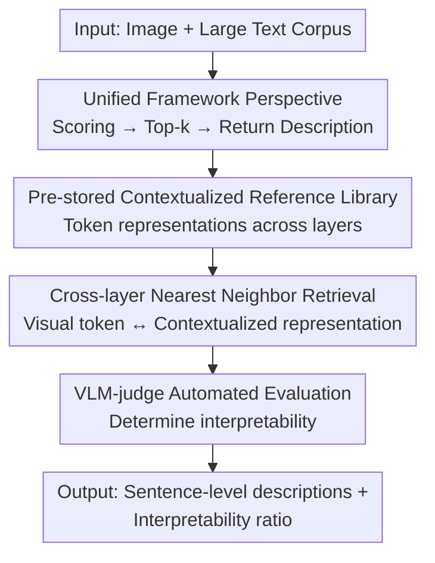

# LatentLens: Revealing Highly Interpretable Visual Tokens in LLMs

**Conference**: ICML 2026  
**arXiv**: [2602.00462](https://arxiv.org/abs/2602.00462)  
**Code**: Available (The paper provides a Demo and a pip package)  
**Area**: Interpretability / Multimodal VLM  
**Keywords**: Visual tokens, Interpretability, VLM, Contextualized representations, Nearest neighbor retrieval

## TL;DR
This paper proposes LatentLens—a training-free interpretability method that uses **contextualized text token representations** from a large corpus as a reference to perform nearest-neighbor retrieval for visual tokens at each layer of a VLM, returning sentence-level descriptions. The study proves that previously common methods like LogitLens/EmbeddingLens significantly underestimate the interpretability of visual tokens (average 68% vs. 24%/32% interpretable) and reveals a "mid-layer leap" phenomenon.

## Background & Motivation
**Background**: Converting an LLM into a VLM can be very simple—one only needs to train a shallow MLP (or even a linear layer) to project image representations from a visual encoder into the frozen LLM's embedding space and concatenate them into the text token sequence. The success of "frozen LLMs being able to handle non-linguistic inputs" leads to a fundamental question: **Why are LLMs so easy to adapt to other modalities?**

**Limitations of Prior Work**: A popular hypothesis is that LLMs are "universal computation engines" and that visual and linguistic representations converge to a shared structure. However, these hypotheses **fail to explain how visual representations are integrated inside the LLM**—during LLM processing, do visual token representations actually correspond to semantically meaningful language? Existing training-free probing methods provide contradictory or even negative answers: EmbeddingLens (comparing against input embedding matrices) and LogitLens (projecting to the output anti-embedding matrix to get vocabulary distributions) both suggest visual tokens are rarely interpretable, while training-based methods (SAEs, supervised probes) are inconsistent. Overall, whether "visual tokens are interpretable" remains unresolved.

**Key Challenge**: After unifying prior methods into a single framework, the authors identified two common flaws: (1) the description set is restricted to the model vocabulary $V$, returning only (sub-word) tokens; (2) latent representations $h^{(\ell)}_i$ from different layers are always compared against the **same set** of reference vectors (input or output embeddings), but the input/output embedding spaces may not be the most natural comparison spaces. The fact that LogitLens works best in later layers near the output and has poor cross-model reliability is a manifestation of this issue.

**Key Insight**: The authors' key insight is that the most natural comparison targets for visual token representations are **not the LLM's input/output embedding matrices, but other contextualized LLM representations**, i.e., "a certain token in the context of a certain sentence." Furthermore, restricting descriptions to a single sub-word is unnecessary; using sentence corpora can provide semantically richer descriptions.

**Core Idea**: Use "intermediate representations of tokens in sentence contexts" to form a reference pool and perform cross-layer nearest neighbor retrieval for visual tokens—viewed through the right "lens," visual tokens are actually highly interpretable.

## Method
LatentLens is a training-free interpretability method that can be applied to any layer of an LLM and returns sentence-level descriptions. The core idea is to shift the task of mapping "latent representations → natural language descriptions" from "comparing static embedding matrices" to "performing nearest neighbor retrieval in a massive pool of contextualized representations."

### Overall Architecture
The method consists of three steps: first, a large corpus is fed into the LLM to **pre-store** the contextualized representations of all tokens across multiple layers as a reference library (a one-time cost); next, the latent representations of visual tokens are extracted from various layers of the VLM; finally, cosine similarity is used to retrieve the top-k nearest neighbors in the reference library, and their corresponding sentences are used as descriptions for those visual tokens. Interpretability is automatically determined by a VLM-judge (GPT-5).

### Key Designs

**1. Unified Perspective: Reducing existing lenses to "Scoring → Top-k → Return Description"**

To address the issue of "prior methods being inconsistent and having unclear flaws," the authors first build a unified framework: given a candidate description set $C$, where each description $d_j$ is associated with a vector $r_j$, mapping the latent representation $h^{(\ell)}_i$ to a description involves three steps—calculating the similarity $s_j = f(h^{(\ell)}_i, r_j)$ for each $r_j$, taking the $\arg\text{top-}k$, and returning the corresponding description. EmbeddingLens and LogitLens are special cases of this framework: both have $C=V$ (vocabulary), with similarity functions being cosine similarity with the embedding matrix $W_{emb}$ and the dot product with the anti-embedding matrix $W_{unemb}$, respectively. The value of this unified perspective is that it **makes the two common flaws obvious**—the description set is trapped in the vocabulary, and all layers share the same reference vectors—thereby precisely identifying directions for improvement and providing a baseline for the design of LatentLens.

**2. Contextualized Reference Library: Replacing static embedding matrices with "tokens in sentence contexts"**

Addressing the pain point that "input/output embeddings are not necessarily the most natural comparison spaces," LatentLens replaces the reference set with contextualized representations. Given a sentence corpus $C$ and an LLM $M$ with $L$ layers, each sentence $d_j$ is encoded by $M$, and the contextualized representation $r^{(\ell)}_{j,t}$ of each token at position $t$ and layer $\ell$ is stored to form the reference library $R$. To analyze a visual token $h^{(\ell')}_i$ at layer $\ell'$, its cosine similarity with all $r^{(\ell)}_{j,t}$ in $R$ is calculated, the top-k are selected, and the corresponding sentences are returned as descriptions. There are two fundamental differences from prior work: descriptions are no longer isolated sub-words but **entire sentences** (e.g., a visual token for "building" might hit *clocks* in "stone tower with gold clocks"), and $\ell$ does not have to equal $\ell'$—the nearest neighbor of a visual token at one layer can come from a text representation at **another layer**, which is the prerequisite for observing the "mid-layer leap" discussed later. Implementation-wise, the corpus uses 2.99 million Visual Genome annotations, storing representations for eight layers $\ell\in\{1,2,4,8,16,24,L\text{-}2,L\text{-}1\}$. Encoding a single backbone takes approximately 2h GPU time with ~26GB storage (float8), and retrieval per image takes ~29ms after loading.

**3. VLM-judge Automated Evaluation: Entrusting subjective "semantic matching" to a verifiable judge**

To address the difficulty of manually determining whether visual token descriptions actually semantically match image patches at scale, the authors use GPT-5 as a judge: it is given an image with a red box marking the target visual token area (plus 8 surrounding visual tokens) and the top-5 descriptions returned by a lens. It determines if the description is interpretable and categorizes it as concrete (directly visible), abstract (conceptually related), or global (appearing elsewhere in the image). **A visual token is considered interpretable as long as at least one of its top-5 descriptions is judged as such.** For fairness, even though LatentLens can provide full sentences, only the words corresponding to the top-5 are fed to the judge (consistent with the other two lenses), which may actually underestimate LatentLens. The authors performed manual validation on 1,020 instances, achieving an agreement with the judge of Cohen's $\kappa=0.68$ (substantial agreement). This design transforms "interpretability" from a fuzzy concept into a reproducible, comparable quantitative metric.

### Loss & Training
LatentLens itself is **training-free**. The VLMs being interpreted were trained following the Molmo recipe: the projector `proj` is a 3-layer MLP; the visual encoder and LLM are frozen; only `proj` is trained using the PixMo-Cap dataset (averaging 167 words and 9 sentences per entry) with cross-entropy loss for 12K steps and an effective batch size of 8.

## Key Experimental Results

### Main Results
Controlled experiments were conducted across 9 combinations of 3 LLMs (OLMo-7B, Qwen2-7B, LLaMA3-8B) × 3 visual encoders (CLIP-ViT-L/14, DINOv2-L, SigLIP), randomly sampling 100 patches from 100 images each, using the VLM-judge to evaluate layer-wise interpretability.

| Method | Average Interpretable Token Ratio | Characteristics |
|------|----------------------|------|
| LogitLens | 24% | Extremely low in early layers, only rising near output (60–80% in late OLMo layers) |
| EmbeddingLens | 32% | Highly model-dependent: 34–62% for OLMo, <20% for Qwen2 |
| **LatentLens (Ours)** | **68%** | Consistently 60–85% across all models and all layers |

The conclusions also held across 6 off-the-shelf VLMs (Molmo-7B-D, Molmo-72B, LLaVA-1.5-7B, LLaVA-NeXT-34B, Qwen2-VL-7B, Qwen2.5-VL-32B)—LatentLens achieved the highest interpretability on all 6 models, with performance improving the closer the setup was to the controlled (OLMo backbone) setting.

| Off-the-shelf VLM | LatentLens Avg Interpretable Ratio |
|----------|--------------------------|
| Molmo-7B-D | 86% |
| Molmo-72B | 78% |
| Qwen2-VL-7B / LLaVA-1.5-7B | 55–62% |
| Qwen2.5-VL-32B / LLaVA-NeXT-34B | 33–35% (Still significantly higher than baselines) |

### Ablation Study

| Configuration | Key Result | Explanation |
|------|---------|------|
| Full LatentLens | 68% avg. interpretable | Sentence corpus + contextualized reference + cross-layer retrieval |
| Linear Projector | No significant change | Interpretability does not rely on the mapping's expressivity |
| Training with shorter captions | No significant change | Conclusions are not tied to specific training settings |
| 1% Corpus Only | Comparable interpretability | Storage reduced from ~26GB to ~250MB |
| DINOv2 (No language supervision) | High interpretability across all lenses | Visual representations are interpretable even without language pre-training |

### Key Findings
- **Using the right lens is key**: The low interpretability reported by LogitLens/EmbeddingLens is an artifact of the method rather than a fact—after switching to contextualized references, the vast majority of visual tokens are interpretable across all layers. Previous work systematically underestimated visual token interpretability.
- **Mid-Layer Leap**: For visual token representations in early layers (even the input layer), the nearest neighbors are not text representations from the same layer, but contextualized text representations from **later/middle layers** (e.g., layers 8 or 16). This suggests that the learned projection targets **semantic rather than lexical-level** representations. Further analysis showed that visual token representations change very little across layers, and there is no evidence that "rogue dimensions" dominate the cosine similarity.
- **Counter-intuitive performance of DINOv2**: Even without any language supervision during pre-training, DINOv2 visual tokens are highly interpretable under all three lenses, further supporting the existence of deep alignment between visual and linguistic representations.
- **Richer sentence-level descriptions**: Qualitatively, LatentLens provides complete sentence descriptions like "stone tower with gold clocks," whereas LogitLens often returns sub-words or next-token predictions.

## Highlights & Insights
- **Unified framework first**: By first reducing EmbeddingLens/LogitLens to a three-step "Scoring → Top-k → Return Description" paradigm and then precisely pointing out two common flaws, this "unify then break through" approach makes the motivation for LatentLens indisputable—a methodological narrative worth emulating.
- **"Wrong reference space" is the core insight**: Switching the comparison target from static embedding matrices to contextualized representations is a simple yet fundamental shift in perspective. it directly pulled the interpretability rate from 24% to 68%, suggesting that "what to use as a reference" is more critical than "what similarity metric to use" when interpreting latent representations.
- **Cross-layer retrieval reveals the mid-layer leap**: The design allowing $\ell\neq\ell'$ unexpectedly unlocked a new phenomenon (early visual tokens aligning with mid-layer text representations), demonstrating that good probing tools can not only measure but also discover mechanisms. This cross-layer comparison idea can be migrated to any scenario analyzing where representations "mature."

## Limitations & Future Work
- **Reliance on VLM-judge**: Interpretability judgments rely on the GPT-5 judge. While $\kappa=0.68$ is substantial agreement, it is not perfect, and judge preferences could systematically affect absolute values. Additionally, the judge was found to be distracted by sentence-level context, forcing the authors to feed only word-level descriptions and failing to fully utilize the information in LatentLens's sentence-level output.
- **Inconsistency with larger model trends**: Larger models like Qwen2.5-VL-32B and LLaVA-NeXT-34B show significantly lower layer-wise interpretability (33–35%) and unstable cross-layer trends. The authors list this as future work, as the explanatory power of the method on very large models remains questionable.
- **One-time cost and storage**: Although 1% of the corpus suffices, each backbone still requires ~2h of GPU encoding and ~13h of wall-clock time for indexing. The reference library must be rebuilt for each different LLM.
- **Future Directions**: Exploring more robust judges (multi-judge voting/human-alignment fine-tuning), fully utilizing sentence-level descriptions (rather than degrading to word-level comparison), and explaining the mechanism behind the decline in interpretability in larger models.

## Related Work & Insights
- **vs LogitLens (nostalgebraist 2020)**: Multiplies latent representations by the anti-embedding matrix to get a vocab distribution; only useful in late layers and lacks cross-model reliability. LatentLens uses contextualized representations as a reference, working for any layer and providing full sentences.
- **vs EmbeddingLens (Mokady 2021 et al.)**: Compares against the input embedding matrix; descriptions are trapped in the vocab and highly model-dependent (Qwen2 <20%). LatentLens uses a sentence corpus and is stable at 60–85% across models.
- **vs Tuned Lens (Belrose 2023)**: Learns affine probes for each layer on top of LogitLens decoding. Experiments in this paper show it **does not improve** visual token interpretability, suggesting the problem lies in the "reference space" itself rather than the decoding transform.
- **vs SAE / Supervised Probes (Cunningham 2023 / Fu 2025)**: These are training-based methods with inconsistent conclusions. LatentLens follows a training-free path by directly utilizing the LLM's representation space, making it easier to deploy and more consistent in its findings.

## Rating
- Novelty: ⭐⭐⭐⭐⭐ "Contextualized representations as reference + cross-layer retrieval" is a simple but fundamental shift that also uncovered the mid-layer leap.
- Experimental Thoroughness: ⭐⭐⭐⭐⭐ Covered 9 controlled combinations + 6 off-the-shelf VLMs + multiple ablations (linear projection/short captions/1% corpus) + human validation.
- Writing Quality: ⭐⭐⭐⭐⭐ The narrative is clean and persuasive, building from a unified framework to a breakthrough with well-linked motivations.
- Value: ⭐⭐⭐⭐⭐ Corrects the field's misjudgment that "visual tokens are uninterpretable," provides a reusable tool/pip package, and has a direct impact on VLM interpretability research.

<!-- RELATED:START -->

## Related Papers

- [\[ICML 2026\] Position: Stop Anthropomorphizing Intermediate Tokens as Reasoning/Thinking Traces!](position_stop_anthropomorphizing_intermediate_tokens_as_reasoningthinking_traces.md)
- [\[NeurIPS 2025\] TangledFeatures: Robust Feature Selection in Highly Correlated Spaces](../../NeurIPS2025/interpretability/tangledfeatures_robust_feature_selection_in_highly_correlated_spaces.md)
- [\[ICML 2026\] Circuit Fingerprints: How Answer Tokens Encode Their Geometrical Path](circuit_fingerprints_how_answer_tokens_encode_their_geometrical_path.md)
- [\[CVPR 2026\] Where Culture Fades: Revealing the Cultural Gap in Text-to-Image Generation](../../CVPR2026/interpretability/where_culture_fades_revealing_the_cultural_gap_in_text-to-image_generation.md)
- [\[ACL 2026\] IDEA: An Interpretable and Editable Decision-Making Framework for LLMs via Verbal-to-Numeric Calibration](../../ACL2026/interpretability/idea_an_interpretable_and_editable_decision-making_framework_for_llms_via_verbal.md)

<!-- RELATED:END -->
