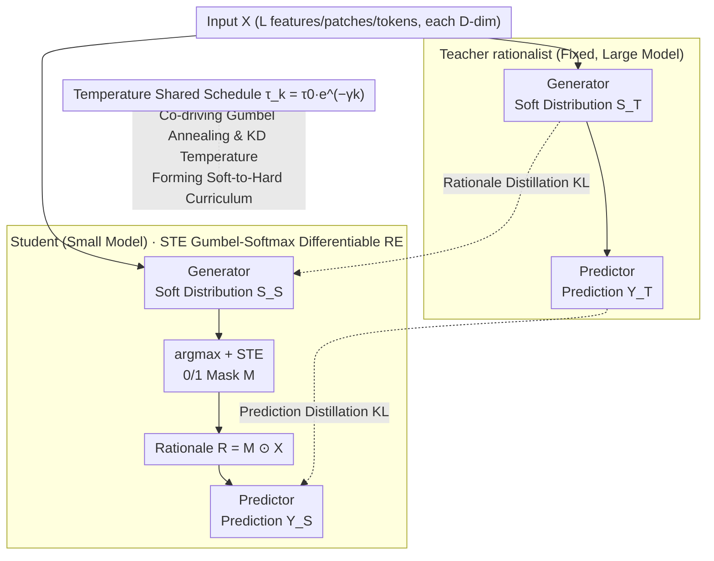

# Learn from A Rationalist: Distilling Intermediate Interpretable Rationales

**Conference**: ICML 2026  
**arXiv**: [2601.22531](https://arxiv.org/abs/2601.22531)  
**Code**: https://github.com/JiayiDai/REKD (Available)  
**Area**: Explainability / Knowledge Distillation / Rationale Extraction  
**Keywords**: Rationale Extraction, Knowledge Distillation, Gumbel-Softmax, Temperature Annealing, Curriculum Learning

## TL;DR
This paper proposes REKD, which introduces knowledge distillation into the "select-then-predict" rationale extraction framework. It enables a small student model to simultaneously mimic the teacher's feature selection distribution and the final prediction distribution. By coupling the distillation temperature with the Gumbel-Softmax annealing schedule, it implicitly forms a "soft-to-hard selection" curriculum, improving the RE accuracy of ViT-Tiny on CIFAR-10 from 0.797 up to 0.936.

## Background & Motivation

**Background**: There are two mainstream routes in Explainable AI. One consists of post-hoc methods like LIME, SHAP, Integrated Gradients, and Grad-CAM, which are easy to integrate but often lack "faithfulness"—the highlighted features may not be the ones the model actually used for decision-making. The other is Rationale Extraction (RE) proposed by Lei et al. (2016): a generator first selects a small subset of features as the rationale, and a predictor makes predictions solely based on this subset, structurally ensuring that "what is used is what is explained."

**Limitations of Prior Work**: RE training relies only on remote supervision from the final task. The generator depends on feedback from the predictor to select features, while the predictor can only make predictions based on features selected by the generator—a classic "chicken-and-egg" problem. This dilemma is significantly magnified when the underlying network capacity is small (e.g., BERT-Mini, ViT-Tiny). In the authors' experiments, switching ViT-Tiny from pure classification (CLS, 0.968) to 15% rationale RE resulted in a drop to 0.797 (−0.171), whereas ViT-Base dropped by only 0.020.

**Key Challenge**: There exists a bidirectional coupled search struggle between the generator and the predictor. Small models cannot withstand high-variance gradients nor successfully search for sparse feature subsets that the predictor can use effectively. Simply increasing data or training time does not help small models; they fail to explore effectively.

**Goal**: To enable small student RE models to achieve predictive accuracy close to large teacher RE models without compromising the hard constraint of "faithful interpretability."

**Key Insight**: The authors draw an analogy to learning physics after Newton—once verifiable and interpretable intermediate representations exist ("mass and distance are the key variables"), ordinary people can achieve high accuracy without reinventing the laws. The feature selection layer output by the generator in RE is an **architecture-agnostic** universal interface. As long as the teacher and student face the same feature space, the information of "which features are important" can be distilled from the large model to the small model, bypassing the difficulty of architectural alignment.

**Core Idea**: Add a distillation branch to the RE framework, allowing the student to simultaneously mimic the teacher's Gumbel-Softmax feature selection distribution and prediction distribution. Furthermore, share the temperature of this distillation branch with the Gumbel-Softmax annealing temperature, naturally creating a "broad-to-refined" curriculum during the training process.

## Method

### Overall Architecture
REKD aims to resolve the struggle of small models in finding good feature subsets within the "select-then-predict" rationale extraction framework. The approach attaches a distillation branch to the original RE framework, letting the student mimic both the teacher's feature selection and final prediction. The input $\mathbf{X} \in \mathbb{R}^{L \times D}$ ($L$ features/patches/tokens, each $D$-dimensional) passes through the teacher and student generator-predictor pipelines respectively. Each outputs a Gumbel-Softmax soft distribution $\mathbf{S}$, its STE-discretized binary mask $\mathbf{M}$, and the category logits obtained by the predictor from the rationale $\mathbf{R} = \mathbf{M} \odot \mathbf{X}$. On the student side, the original task loss $\mathcal{L}_{\text{RE}}$ and the distillation loss $\mathcal{L}_{\text{KD}}$ are mixed with weight $\alpha$. A key stroke is making the distillation temperature share the same exponential curve as the Gumbel-Softmax annealing, enabling the training to naturally follow a "soft-to-hard" curriculum.

### Key Designs

**1. Straight-Through Gumbel-Softmax Differentiable RE: Turning "Selection" into Differentiable Discrete Decisions**

The pain point of RE is that "to select the $l$-th feature or not" is essentially a discrete event. The original Lei et al. (2016) version could only use high-variance REINFORCE to estimate gradients, which small models cannot handle. This work lets the generator output two-dimensional logits for "select/not select" at each feature position, samples a soft distribution via $S_{l,i} = \exp((Z_{l,i} + G_{l,i})/\tau) / \sum_j \exp((Z_{l,j}+G_{l,j})/\tau)$, and then uses $M_l = \arg\max_i S_{l,i}$ to discretize it into a 0/1 mask for the predictor. During backpropagation, the gradient is passed as a soft distribution gradient following the STE convention $\partial \mathbf{M}/\partial \mathbf{S} \approx 1$. The sparsity is pulled towards the target $p_{\text{target}}$ (15% for CIFAR, 10% for IMDB) using a rectifier-style squared loss $\mathcal{L}_{\text{select}} = (\sum_l M_l - L \cdot p_{\text{target}})^2$. This complexity is necessary because the "faithfulness" of RE requires the predictor to only see truly selected features during the forward pass (no discretization would lead to information leakage), while gradients must pass through this discretization to train the generator—STE + Gumbel-Softmax is the cleanest differentiable solution that satisfies both constraints.

**2. Dual-Path Distillation of Generator and Predictor: Learning both "Which Features are Important" and "How to Use Features"**

Distilling only the final prediction is equivalent to letting the student mimic the teacher as a black box, losing the interpretable intermediate supervision of "which features are important." Distilling only the rationale loses the downstream signal of "how these features should be used." Thus, this work runs both paths in parallel. Generator distillation calculates the KL divergence between the teacher's and student's Gumbel-Softmax distributions at each feature position, $\mathcal{L}_{\text{KD}}^{\text{R}} = \sum_l D_{\text{KL}}(\mathbf{S}^{(T)}_{\tau,l} \,\|\, \mathbf{S}^{(S)}_{\tau,l})$; predictor distillation follows classic Hinton-KD, taking the KL of temperature-scaled soft labels, $\mathcal{L}_{\text{KD}}^{\text{Y}} = D_{\text{KL}}(\hat{\mathbf{Y}}^{(T)}_\tau \,\|\, \hat{\mathbf{Y}}^{(S)}_\tau)$. Combining the two gives $\mathcal{L}_{\text{KD}} = \lambda_R \mathcal{L}_{\text{KD}}^{\text{R}} + \tau^2 \mathcal{L}_{\text{KD}}^{\text{Y}}$, where $\tau^2$ offsets the gradient attenuation caused by logit scaling, while the generator side does not multiply by it as Gumbel-Softmax handles the $\tau \to 0$ scale internally. This approach fully transfers the most effective "identify key variables first, then demonstrate how to use them" strategy of human learning to the student. Since the selection layer is a unified 2D distribution interface, distillation reduces to the KL of two equal-length binomial distributions, naturally compatible with different hidden dimensions and eliminating the need for projection modules like FitNet.

**3. Temperature Sharing Schedule: Turning "Inevitable" Annealing into Implicit Curriculum**

Gumbel-Softmax inherently requires $\tau$ to anneal from large to small—high $\tau$ provides low-variance gradients for exploration, while low $\tau$ is needed to approach true discrete sampling. This paper simply ties the KD temperature directly to this same $\tau_k = \tau_0 e^{-\gamma k}$ (annealing from $\tau_0=5$ to $\tau_K=0.1$). Consequently, in the early stages of training where $\tau$ is large and the teacher's distribution is flat, the student learns coarse-grained knowledge like "which general regions are important and relative category preferences," facilitating broad exploration. In later stages as $\tau$ drops to 0.1 and the distribution becomes sharp, the student is forced to match the teacher's high-confidence hard selections and high-confidence category predictions, mandating convergence to precise decisions. This differs from the manually designed soft-to-hard schedules in annealing KD (Jafari et al., 2021) intended to bridge the capacity gap: in REKD, annealing is a structural constraint necessary for Gumbel-Softmax, making the resulting curriculum effect yield zero additional design cost.

### Loss & Training
The final objective is $\mathcal{L}_{\text{REKD}} = \alpha(\mathcal{L}_{\text{pred}} + \lambda_{\text{select}}\mathcal{L}_{\text{select}}) + (1-\alpha)(\lambda_R \mathcal{L}_{\text{KD}}^{\text{R}} + \tau^2 \mathcal{L}_{\text{KD}}^{\text{Y}})$. Training lasts 35 epochs (20 epochs for pure classification), $lr=1e-5$, $bs=32$, $\tau_0 = 5$, $\tau_K = 0.1$, with $\tau$ updated every 100 steps; $\lambda_R = 0.5$; $p_{\text{target}} = 15\%$ on CIFAR and 10% on IMDB. Results are averaged over 10 runs for each seed. The teacher is fixed as an RE model trained from one seed, and the student is repeated 10 times under that teacher.

## Key Experimental Results

### Main Results

| Dataset | Student Model | CLS | RE | REKD | RE→REKD Gain |
| :--- | :--- | :--- | :--- | :--- | :--- |
| CIFAR 10 | ViT-Small | .981 | .889 | **.968** | +.079 |
| CIFAR 10 | ViT-Tiny | .968 | .797 | **.936** | +.139 |
| CIFAR 100 | ViT-Small | .944 | .779 | **.845** | +.066 |
| CIFAR 100 | ViT-Tiny | .903 | .645 | **.777** | +.132 |
| IMDB | BERT-Small | .889 | .881 | **.906** | +.025 |
| IMDB | BERT-Mini | .877 | .863 | **.892** | +.029 |

The ViT-Base teacher achieved 0.964 accuracy on CIFAR-10; the ViT-Small student via REKD reached 0.968, **slightly exceeding the teacher's average**.

### Ablation Study (Three comparison groups in Appendix C)

| Configuration | Meaning | Conclusion |
| :--- | :--- | :--- |
| Full REKD | $\alpha \in (0,1)$, Dual Distillation (R + Y) | Full model, best overall |
| Pure KD (No RE, $\alpha=0$) | Equivalent to two-stage supervised distillation | Accuracy drops, but still better than pure RE → KD signal itself is useful |
| Only Predictor KD | Removed generator distillation | Worse than Full → Rationale distillation is indispensable |
| Only Generator KD | Removed predictor distillation | Same as above → The two paths are complementary |

### Key Findings
- **Confirmation of Small Model "Chicken-and-Egg" Dilemma**: The drop from CLS to RE scales monotonically with model capacity (ViT-Base drops 0.020 vs. ViT-Tiny drops 0.171). REKD's recovery is correspondingly greatest for small models (Tiny gain +0.139 > Small +0.079), perfectly aligning with the authors' hypothesis.
- **Student Surpassing Teacher**: On CIFAR-10/100, the average REKD performance of the ViT-Small student slightly exceeded that of the ViT-Base teacher's RE. The authors attribute this to REKD acting as a regularizer with the "teacher as a strong prior," reducing the student's variance (std across 10 seeds from .019 → .006).
- **REKD > Student's CLS**: BERT-Mini@REKD (0.892) outperformed BERT-Mini@CLS (0.877), implying that the "information-dense" feature subsets extracted through sparse rationale + teacher distillation are more beneficial for classification than letting the student process the entire input in a black-box manner—a counter-intuitive "less is more" phenomenon.

## Highlights & Insights
- **The feature selection layer as an "architecture-agnostic interface" is the most elegant part of the methodology**: Traditional feature-based KD (FitNet, attention transfer) requires designing projection/collapse modules for hidden dimension alignment. RE compresses "important vs. unimportant" into a 0/1 2D softmax completely decoupled from architecture, reducing distillation to the KL of two equal-length binomial distributions. This trick is extremely clean and can be applied to any task learning discrete structures via Gumbel-Softmax (e.g., relationship graphs in NRI, sparse MoE routing).
- **Turning "required actions" into a "curriculum" is the most graceful byproduct**: Gumbel-Softmax already mandates $\tau$ annealing. The authors simply let the distillation follow the same temperature curve without extra cost, essentially gaining a soft-to-hard curriculum for free. This approach of "using structural constraints as resources" is characteristic of high-quality research.
- **The critique of XAI evaluation deserves a separate look**: In Section 3.4, the authors openly oppose the mainstream "plausibility" evaluation paradigm that rationales should align with human annotations. Using the "hospital name predicting cancer" example, they argue alignment is a double-edged sword and advocate using "predictive accuracy under a given sparsity constraint" as a more objective metric. This argument alone is substantive enough for a position paper.

## Limitations & Future Work
- Distillation is currently **only validated within the same architecture family** (ViT→ViT, BERT→BERT). Cross-architecture distillation (e.g., ViT→ResNet, BERT→Mamba) requires addressing inconsistencies in underlying tokenization/patching; the authors mention this—it remains the "final mile" for the "architecture-agnostic" claim.
- **Risk of a "covert communication channel"**: Cooperative RE has been criticized because the generator and predictor might learn non-semantic steganographic signals (Wäldchen et al., 2024). The authors argue REKD acts as a regularizer to suppress this, but they do not provide specific experimental evidence in the paper, listing it only under Limitations for future stress testing.
- **Strong Teacher Quality Assumption**: All experiments assume the teacher RE model is already trained and sufficiently strong. There is no discussion of the decay curve when the "teacher itself is a small model" or when the "teacher rationale itself is biased"; the reward curve of REKD when the teacher-student capacity gap is near zero remains unknown.
- **Narrow Task Scope**: Validated only on IMDB (binary classification) and CIFAR (coarse category classification). Scenarios like the ERASER benchmark, medical imaging, or long-document QA—where rationale extraction is more needed—are not covered, leaving the risk of extrapolation to be tested.

## Related Work & Insights
- **vs. Lei et al. (2016) Original RE**: The original used REINFORCE for selection layer gradients, leading to high variance and training difficulty. Ours uses STE + Gumbel-Softmax as a modern standard, with the true novelty being the addition of KD to alleviate the small model dilemma.
- **vs. Jain et al. (2020) Two-Stage RE**: Jain splits RE into "getting pseudo-rationales via heuristics (e.g., BERT attention top-k) → independently training generator/predictor." This is equivalent to a special case of REKD when $\alpha = 0$, but REKD allows the student to retain autonomous exploration by keeping $\mathcal{L}_{\text{RE}}$ and is more robust by tying distillation temperature to sampling temperature.
- **vs. Hinton et al. (2015) Classic KD**: Classic KD only distills the final prediction distribution. REKD extends this to intermediate structures (feature selection) while reusing empirical practices like $\tau^2$ scaling and temperature annealing.
- **vs. Jafari et al. (2021) Annealing KD**: Annealing KD designs temperature annealing as a heuristic curriculum to bridge the capacity gap. In REKD, annealing is a structural consequence of the Gumbel-Softmax requirement, making the curriculum a byproduct and the approach more efficient.
- **Transferable Insight**: Any task using Gumbel-Softmax to learn discrete latent structures (NRI relationship graphs, sparse routing, learnable prompt lengths) can adopt the "dual-distillation + shared temperature" template to gain curriculum learning benefits with almost zero design cost.

## Rating
- Novelty: ⭐⭐⭐⭐ First to explore the RE × KD intersection thoroughly; the "shared temperature for implicit curriculum" is a true insight. However, both KD and RE are mature components, so the novelty at the combination level is more about "perspective" than "mechanism."
- Experimental Thoroughness: ⭐⭐⭐⭐ Cross-modal (Vision + NLP), cross-family (ViT + BERT), cross-capacity (Base/Small/Tiny), 10-seed average, and 3 sets of ablations addressing key doubts like "is it KD or RE working." The weakness lies in not covering classic RE benchmarks like ERASER.
- Writing Quality: ⭐⭐⭐⭐⭐ The "Newton's law of gravity" analogy clearly explains the RE "chicken-and-egg" dilemma. Section 3.4's critique of XAI plausibility is very insightful, and the formulas and symbols are well-organized.
- Value: ⭐⭐⭐⭐ Provides a low-cost, deployable solution for practitioners wanting interpretable RE models on edge devices. For the academic community, it provides a clean universal template for "KD on discrete structures via Gumbel-Softmax," likely to be reused in future work.

<!-- RELATED:START -->

## Related Papers

- [\[CVPR 2026\] Pixel2Phys: Distilling Governing Laws from Visual Dynamics](../../CVPR2026/interpretability/pixel2phys_distilling_governing_laws_from_visual_dynamics.md)
- [\[ACL 2026\] A Systematic Comparison between Extractive Self-Explanations and Human Rationales in Text Classification](../../ACL2026/interpretability/a_systematic_comparison_between_extractive_self-explanations_and_human_rationale.md)
- [\[ICML 2026\] Prototype Transformer: Towards Language Model Architectures Interpretable by Design](prototype_transformer_towards_language_model_architectures_interpretable_by_desi.md)
- [\[ICML 2026\] Interpretable Self-Supervised Learning via Representer Landmarks and Nyström Approximation](interpretable_self-supervised_learning_via_representer_landmarks_and_nyström_app.md)
- [\[NeurIPS 2025\] How Do Transformers Learn Implicit Reasoning?](../../NeurIPS2025/interpretability/how_do_transformers_learn_implicit_reasoning.md)

<!-- RELATED:END -->
