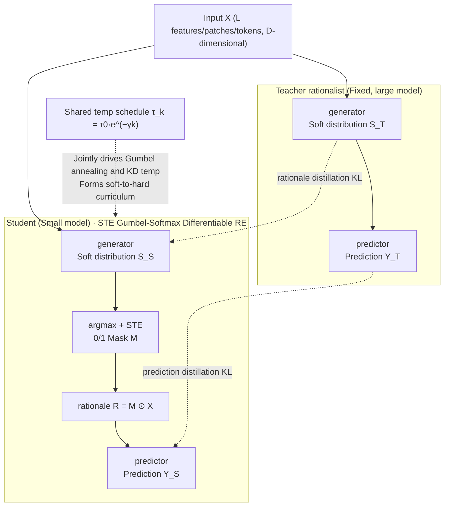

# Learn from A Rationalist: Distilling Intermediate Interpretable Rationales

**Conference**: ICML 2026  
**arXiv**: [2601.22531](https://arxiv.org/abs/2601.22531)  
**Code**: https://github.com/JiayiDai/REKD (Available)  
**Area**: Interpretability / Knowledge Distillation / Rationale Extraction  
**Keywords**: Rationale Extraction, Knowledge Distillation, Gumbel-Softmax, Temperature Annealing, Curriculum Learning

## TL;DR
This paper proposes REKD, which introduces knowledge distillation into the "select-predict" rationale extraction framework. It enables a small student model to simultaneously mimic a teacher's feature selection distribution and final prediction distribution. By tying the distillation temperature to the Gumbel-Softmax annealing schedule, an implicit "soft-to-hard selection" curriculum is formed, improving the RE accuracy of ViT-Tiny on CIFAR-10 from 0.797 to 0.936.

## Background & Motivation

**Background**: There are two main paths in Explainable AI (XAI). One consists of post-hoc methods like LIME, SHAP, Integrated Gradients, and Grad-CAM, which are easy to integrate but often lack "faithfulness"—the highlighted features may not be the ones the model actually used for decision-making. The other is rationale extraction (RE), proposed by Lei et al. (2016), where a generator first selects a small subset of features as the rationale, and a predictor makes predictions based only on those features. This structure ensures faithfulness by design: "what is used is what explains."

**Limitations of Prior Work**: RE training relies solely on remote supervision from the final task. The generator depends on feedback from the predictor to select features, while the predictor can only use features selected by the generator—a classic "chicken-and-egg" problem. This dilemma is significantly magnified when the underlying network capacity is small (e.g., BERT-Mini, ViT-Tiny). In the authors' experiments, switching ViT-Tiny from pure classification (CLS, 0.968) to 15% rationale RE caused the accuracy to drop to 0.797 (−0.171), whereas ViT-Base only dropped by 0.020.

**Key Challenge**: A bidirectional coupling search problem exists between the generator and the predictor. Small models cannot withstand high-variance gradients or successfully search for sparse feature subsets that allow the predictor to perform well. Simply increasing data or training time is ineffective for small models—they fail to explore the space effectively.

**Goal**: To enable small student RE models to achieve predictive accuracy close to large teacher RE models without abandoning the hard constraint of "faithful interpretability."

**Key Insight**: The authors draw an analogy to learning physics after Newton—once verifiable and interpretable intermediate representations exist ("mass and distance are the key variables"), an ordinary person can make accurate predictions without reinventing the laws. The feature selection layer output by the generator in RE is a **neuro-architecture-agnostic** universal interface. As long as the feature spaces of the teacher and student are consistent, the information about "which features are important" can be distilled from the large model to the small model, bypassing the difficulties of architectural alignment.

**Core Idea**: Add a distillation branch to the RE framework to let the student simultaneously mimic the teacher's Gumbel-Softmax feature selection distribution and prediction distribution. Then, share the temperature of this distillation branch with the Gumbel-Softmax annealing temperature, naturally forming a "broad-to-refined" curriculum throughout the training process.

## Method

### Overall Architecture
REKD addresses the difficulty small models face in discovering good feature subsets within the "select-predict" rationale extraction framework. It attaches a distillation branch to the original RE framework, allowing the small student to mimic both the feature selection and final prediction of the large teacher. The input $\mathbf{X} \in \mathbb{R}^{L \times D}$ (L features/patches/tokens, each D-dimensional) passes through separate generator-predictor pipelines for the teacher and student. Each produces a Gumbel-Softmax soft distribution $\mathbf{S}$, a binary mask $\mathbf{M}$ discretized via STE, and class logits obtained from the predictor using the rationale $\mathbf{R} = \mathbf{M} \odot \mathbf{X}$. On the student side, the original task loss $\mathcal{L}_{\text{RE}}$ and distillation loss $\mathcal{L}_{\text{KD}}$ are mixed with a weight $\alpha$. A key feature is sharing the distillation temperature and Gumbel-Softmax annealing temperature via the same exponential curve, naturally creating a "soft-to-hard" curriculum.

### Key Designs

**1. Straight-Through Gumbel-Softmax Differentiable RE: Converting "Selection" into Differentiable Discrete Decisions**

The pain point of RE lies in the fact that selecting or not selecting the $l$-th feature is inherently a discrete event. The original Lei et al. (2016) version used high-variance REINFORCE for gradient estimation, which small models cannot handle. This work makes the generator output 2D logits for "selected/not selected" at each feature position. A soft distribution is sampled via $S_{l,i} = \exp((Z_{l,i} + G_{l,i})/\tau) / \sum_j \exp((Z_{l,j}+G_{l,j})/\tau)$, which is then discretized into a 0/1 mask $M_l = \arg\max_i S_{l,i}$ to feed the predictor. During backpropagation, the gradient is passed through the soft distribution following the STE convention $\partial \mathbf{M}/\partial \mathbf{S} \approx 1$. The sparsity is constrained near a target $p_{\text{target}}$ (15% for CIFAR, 10% for IMDB) using a rectifier-style squared loss $\mathcal{L}_{\text{select}} = (\sum_l M_l - L \cdot p_{\text{target}})^2$. This complexity is necessary because faithfulness requires the predictor to only see truly selected features during the forward pass (to avoid information leakage), while gradients must pass through discretization for the generator to be trainable. STE + Gumbel-Softmax is the cleanest differentiable solution satisfying both constraints.

**2. Dual Generator and Predictor Distillation: Learning "What is Important" and "How to Use It"**

Distilling only the final prediction results in the student blindly mimicking the teacher, losing the interpretable intermediate supervision of "which features are important." Distilling only the rationale loses the downstream signal of "how these features should be used." Thus, this work uses two parallel paths. For generator distillation, the KL divergence between the teacher and student Gumbel-Softmax distributions is calculated at each feature position: $\mathcal{L}_{\text{KD}}^{\text{R}} = \sum_l D_{\text{KL}}(\mathbf{S}^{(T)}_{\tau,l} \,\|\, \mathbf{S}^{(S)}_{\tau,l})$. For predictor distillation, classic Hinton-KD is used on the temperature-scaled softmax: $\mathcal{L}_{\text{KD}}^{\text{Y}} = D_{\text{KL}}(\hat{\mathbf{Y}}^{(T)}_\tau \,\|\, \hat{\mathbf{Y}}^{(S)}_\tau)$. Combining these gives $\mathcal{L}_{\text{KD}} = \lambda_R \mathcal{L}_{\text{KD}}^{\text{R}} + \tau^2 \mathcal{L}_{\text{KD}}^{\text{Y}}$, where $\tau^2$ compensates for gradient decay from logit scaling. This mimics the most effective human learning strategy: "pointing out key variables, then demonstrating how to use them." Since the selection layer is a unified 2D distribution interface, distillation reduces to the KL divergence of two binomial distributions of equal length, naturally compatible with different hidden dimensions and bypassing projection modules like those in FitNet.

**3. Shared Temperature Schedule: Turning "Free" Annealing into an Implicit Curriculum**

Gumbel-Softmax inherently requires $\tau$ to decrease—a high $\tau$ provides low-variance gradients for exploration, while a low $\tau$ approaches true discrete sampling. This paper ties the KD temperature directly to this schedule $\tau_k = \tau_0 e^{-\gamma k}$ (from $\tau_0=5$ to $\tau_K=0.1$). In early training, when $\tau$ is large and the teacher's distribution is flat, the student learns coarse-grained knowledge like "roughly which regions are important." Later, as $\tau$ drops to 0.1 and the distribution sharpens, the student is forced to match the teacher's high-confidence hard selections and class predictions. Unlike manual soft-to-hard schedules designed to bridge the capacity gap (e.g., Jafari et al., 2021), the annealing in REKD is a structural requirement of Gumbel-Softmax, making the curriculum effect an elegant byproduct with zero extra design cost.

### Loss & Training
The final objective is $\mathcal{L}_{\text{REKD}} = \alpha(\mathcal{L}_{\text{pred}} + \lambda_{\text{select}}\mathcal{L}_{\text{select}}) + (1-\alpha)(\lambda_R \mathcal{L}_{\text{KD}}^{\text{R}} + \tau^2 \mathcal{L}_{\text{KD}}^{\text{Y}})$. Training: 35 epochs (20 for pure classification), lr=1e-5, bs=32, $\tau_0 = 5$, $\tau_K = 0.1$, updating $\tau$ every 100 steps; $\lambda_R = 0.5$; $p_{\text{target}}$ is 15% on CIFAR and 10% on IMDB. Mean of 10 runs per seed. The teacher is a fixed RE model, and the student is trained 10 times under that teacher.

## Key Experimental Results

### Main Results

| Dataset | Student Model | CLS | RE | REKD | RE→REKD Gain |
|--------|----------|-----|-----|------|--------------|
| CIFAR 10 | ViT-Small | .981 | .889 | **.968** | +.079 |
| CIFAR 10 | ViT-Tiny | .968 | .797 | **.936** | +.139 |
| CIFAR 100 | ViT-Small | .944 | .779 | **.845** | +.066 |
| CIFAR 100 | ViT-Tiny | .903 | .645 | **.777** | +.132 |
| IMDB | BERT-Small | .889 | .881 | **.906** | +.025 |
| IMDB | BERT-Mini | .877 | .863 | **.892** | +.029 |

The ViT-Base teacher achieved 0.964 on CIFAR-10; the ViT-Small student reached 0.968 via REKD, **slightly exceeding the teacher's average**.

### Ablation Study (Three Control Groups)

| Configuration | Meaning | Conclusion |
|------|------|------|
| Full REKD | $\alpha \in (0,1)$, dual R + Y distillation | Full model, optimal across all metrics |
| Pure KD (no RE, $\alpha=0$) | Equivalent to two-stage supervised distillation | Accuracy drops, but still better than pure RE → KD signal itself is useful |
| Predictor KD Only | Removes generator distillation | Worse than Full → Rationale distillation is indispensable |
| Generator KD Only | Removes predictor distillation | Same as above → Both paths are complementary |

### Key Findings
- **Small model "Chicken-and-Egg" dilemma confirmed**: The drop from CLS to RE scales inversely with model capacity (ViT-Base drops 0.020 vs. ViT-Tiny drops 0.171). REKD recovery is correspondingly largest for the smallest models (Tiny gain +0.139 > Small +0.079), validating the initial hypothesis.
- **Student surpassing teacher**: On CIFAR-10/100, the ViT-Small student's average REKD performance slightly exceeded the ViT-Base teacher's RE performance. The authors attribute this to REKD acting as a strong prior regularization, reducing student variance (std from .019 → .006 across 10 seeds).
- **REKD > Student CLS**: BERT-Mini@REKD (0.892) outperformed BERT-Mini@CLS (0.877), suggesting that "information-dense" features extracted through sparse rationales and teacher distillation are more conducive to classification than allowing the student to view the entire input as a black box—a counter-intuitive "less is more" phenomenon.

## Highlights & Insights
- **The feature selection layer as an "architecture-agnostic interface" is the most elegant methodological aspect**: Traditional feature-based KD (FitNet, attention transfer) requires designing projection or collapse modules for dimension alignment. RE compresses "important vs. unimportant" into an architecture-decoupled 2D softmax. Distillation becomes a simple KL between two binomial distributions of equal length, requiring almost no tuning. This trick can be directly applied to any task learning discrete structures with Gumbel-Softmax (e.g., NRI relation graphs, sparse MoE routing).
- **Turning a "requirement" into a "curriculum" is a graceful byproduct**: Since Gumbel-Softmax necessitates temperature annealing, the authors simply aligned the KD temperature with this curve. This achieved a soft-to-hard curriculum effect for free. This strategy of using inherent constraints as resources is a hallmark of high-quality research.
- **Criticism of XAI evaluation**: In Section 3.4, the authors challenge the dominant "plausibility" paradigm (aligning rationales with human annotations). Using the example "hospital name predicting cancer," they argue that alignment is a double-edged sword and advocate for "predictive accuracy under a given sparsity constraint" as a more objective metric. This argument alone is substantive enough for a position paper.

## Limitations & Future Work
- **Architectural validation**: Distillation is currently verified within the same architecture families (ViT→ViT, BERT→BERT). Cross-architecture application (e.g., ViT→ResNet) requires resolving inconsistencies in tokenization/patching—the final step in proving the "architecture-agnostic" claim.
- **Risk of "covert communication channels"**: Cooperative RE is often criticized because the generator and predictor might learn non-semantic steganographic signals (Wäldchen et al., 2024). The authors argue REKD's regularization suppresses this, but no specific experimental evidence is provided; it remains a limitation for future stress testing.
- **Strong teacher quality assumption**: All experiments assume a well-trained, strong teacher RE model. The degradation when the teacher is a small model or has biased rationales is not discussed, and the returns of REKD when the capacity gap is near zero remain unknown.
- **Task scope**: Verified only on IMDB (binary) and CIFAR (coarse classification). Realistic scenarios where rationale extraction is critical, such as the ERASER benchmark, medical imaging, or long-document QA, are not yet covered.

## Related Work & Insights
- **vs. Lei et al. (2016) Original RE**: The original used REINFORCE for selection layer gradients, which has high variance; this work uses the now-standard STE + Gumbel-Softmax and introduces KD to mitigate small-model difficulties.
- **vs. Jain et al. (2020) Two-stage RE**: Jain splits RE into "obtaining pseudo-rationales via heuristics (e.g., BERT attention) → independent training." This is equivalent to a special case of REKD at $\alpha = 0$, but REKD's retention of $\mathcal{L}_{\text{RE}}$ allows autonomous exploration, and its temperature-tied curriculum makes it more robust.
- **vs. Hinton et al. (2015) Classic KD**: Classic KD distills only the final prediction; REKD extends this to intermediate structures and reuses $\tau^2$ scaling and annealing.
- **vs. Jafari et al. (2021) Annealing KD**: While Annealing KD uses temperature as a heuristic to bridge capacity gaps, REKD's annealing is a structural consequence of the Gumbel-Softmax requirement, making the curriculum a simplified byproduct.
- **Transferable insight**: Any task using Gumbel-Softmax for discrete latent structures can adopt the "dual-path distillation + shared temperature" template to gain curriculum learning benefits with zero design cost.

## Rating
- Novelty: ⭐⭐⭐⭐ First to explore RE × KD thoroughly; "shared temperature for implicit curriculum" is a genuine insight, though the components themselves are mature.
- Experimental Thoroughness: ⭐⭐⭐⭐ Cross-modal (vision + NLP), cross-architecture (ViT + BERT), and cross-capacity (Base/Small/Tiny) with 10-seed averages and key ablations, though ERASER-style benchmarks are missing.
- Writing Quality: ⭐⭐⭐⭐⭐ The "Newton's laws" analogy is clear, the "chicken-and-egg" problem is well-articulated, and the critique of XAI plausibility is insightful. Clean formulas and notation.
- Value: ⭐⭐⭐⭐ Provides a practical, low-cost solution for deploying interpretable RE models on edge devices and a clean template for KD on Gumbel-Softmax discrete structures.

<!-- RELATED:START -->

## Related Papers

- [\[ICML 2026\] Position: Stop Anthropomorphizing Intermediate Tokens as Reasoning/Thinking Traces!](position_stop_anthropomorphizing_intermediate_tokens_as_reasoningthinking_traces.md)
- [\[CVPR 2026\] Pixel2Phys: Distilling Governing Laws from Visual Dynamics](../../CVPR2026/interpretability/pixel2phys_distilling_governing_laws_from_visual_dynamics.md)
- [\[ICLR 2026\] I Predict Therefore I Am: Is Next Token Prediction Enough to Learn Human-Interpretable Concepts from Data?](../../ICLR2026/interpretability/i_predict_therefore_i_am_is_next_token_prediction_enough_to_learn_human-interpre.md)
- [\[ACL 2026\] A Systematic Comparison between Extractive Self-Explanations and Human Rationales in Text Classification](../../ACL2026/interpretability/a_systematic_comparison_between_extractive_self-explanations_and_human_rationale.md)
- [\[ICML 2026\] LatentLens: Revealing Highly Interpretable Visual Tokens in LLMs](latentlens_revealing_highly_interpretable_visual_tokens_in_llms.md)

<!-- RELATED:END -->
