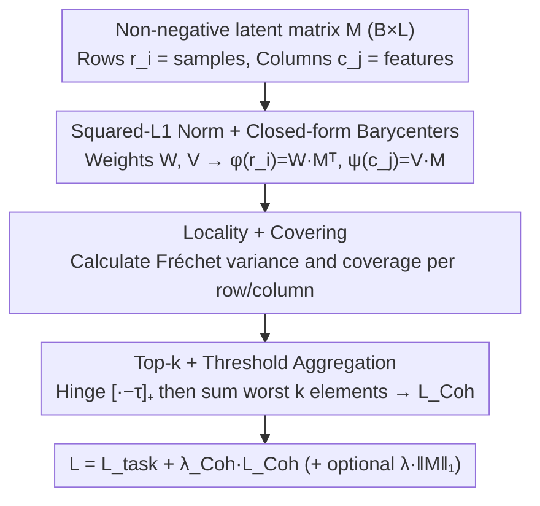

# Learning Coherent Representations: A Topological Approach to Interpretability

**Conference**: ICML 2026  
**arXiv**: [2606.02841](https://arxiv.org/abs/2606.02841)  
**Code**: TBD  
**Area**: Interpretability / Topological Data Analysis / Representation Learning  
**Keywords**: coherence, Vietoris-Rips, Fréchet variance, barycentric map, sparse autoencoder alternative

## TL;DR
This paper proposes **coherence**, a geometric property inspired by neural coding in the brain, which requires the rows and columns of the sample-feature matrix to topologically interleave under Vietoris-Rips filtration. By introducing a differentiable `Coh` loss, the method yields topologically aligned and semantically readable features on autoencoders and BERT token embeddings, significantly outperforming L1 sparsity.

## Background & Motivation

**Background**: The mainstream approach to interpretability is sparsification—using $L^1$ or similar regularizations in sparse coding and sparse auto-encoders (Bricken 2023, Cunningham 2024) to ensure each feature activates only on a few samples, thereby mitigating polysemanticity. Another direction is the mechanistic route, treating latent dimensions as individual "concepts."

**Limitations of Prior Work**: Sparsity only constrains "how many samples activate," not "which samples activate." A sparse feature could potentially fire on several unrelated, spatially scattered regions of the data manifold. Such a feature might have low activation counts but lacks interpretable geometric meaning. This issue is exacerbated in unsupervised settings where no classification labels exist to group similar samples, leading to a lacked of readable geometric structure in the feature space.

**Key Challenge**: The essence of interpretability is not "activation sparsity" but "activation region connectivity." The reason brain grid cells or head direction cells allow us to directly read off an animal’s position or orientation is that each neuron's activation zone is a **continuous arc or connected component** in the state space. This is a property of locality, not rarity. Current deep learning regularizations lack any mechanism to guarantee such connectivity.

**Goal**: (1) Provide a geometric definition for "interpretable features"; (2) transform this definition into a differentiable loss function applicable to any network with non-negative activations; (3) validate the approach in both autoencoder (known topology) and BERT token embedding (unknown ground-truth topology) settings.

**Key Insight**: Treat the latent matrix $M\in\mathbb{R}_+^{m\times n}$ simultaneously as two sets of weighted point clouds: "samples $\to$ features" and "features $\to$ samples." Leveraging a geometric analogy of **Dowker duality**, if two spaces approximately cover each other via "barycentric maps" with low variance, their Vietoris-Rips filtrations must interleave, making them topological mirrors of each other.

**Core Idea**: Use the "round-trip error" of Fréchet variance and barycentric maps as a differentiable loss to constrain the sample and feature spaces to be topologically equivalent point clouds. Consequently, feature interpretability becomes the inheritance of the sample space's geometry by the feature space.

## Method

### Overall Architecture

The mechanism addresses how to formulate interpretability as a differentiable geometric objective. The approach extracts latents from a batch of any network with non-negative activations (e.g., autoencoder bottleneck or BERT token embedding with Softplus), resulting in a non-negative matrix $M\in\mathbb{R}_+^{B\times L}$. Rows $r_i$ represent samples and columns $c_j$ represent features. Barycentric mapping is performed between the "row-view point cloud" and "column-view point cloud" to quantify whether the two clouds are topological mirrors. This discrepancy is added as a `Coh` regularization term to the original task loss.

In practice, squared-$L^1$ is used to normalize each row/column into probability weights $w^{(i)}, v^{(j)}$. Closed-form barycentric maps are then computed: $\phi(r_i)=w^{(i)}M^T$ (projecting samples to the column space) and $\psi(c_j)=v^{(j)}M$ (projecting features to the row space). For every row and column, two metrics—Fréchet variance (locality) and covering—are calculated. The components exceeding a threshold are aggregated via a top-$k$ sum to form $\mathcal{L}_{\text{Coh}}$. Finally, the total loss is $\mathcal{L}=\mathcal{L}_{\text{task}}+\lambda_{\text{Coh}}\mathcal{L}_{\text{Coh}}$ (typically $\lambda_{\text{Coh}}=10^{-3}$). Theoretically, when $M$ is $\epsilon$-coherent and $\phi, \psi$ are 1-Lipschitz, an $\epsilon^{1/2}$-interleaving exists, ensuring the Vietoris-Rips filtrations and persistence diagrams of samples and features are close under bottleneck distance.

The following diagram illustrates the computation flow of the `Coh` loss in Algorithm 1, where the three processing nodes correspond to the key designs below:

### Key Designs

**1. Coherence = Locality + Covering: Compressing "Topological Alignment" into Two Scalars**

The pain point of interpretability is the inability to directly quantify whether the feature space inherits the sample space's geometry. This paper characterizes it using a pair of dual scalars. For each row, Fréchet variance $\text{Var}_\mathcal{R}(r_i)=\sum_j w^{(i)}_j\|\phi(r_i)-c_j\|_2^2$ (locality) measures whether the columns selected by sample $r_i$ are clustered in the column space. Covering $\text{Cov}_\mathcal{R}(r_i)=\sum_j w^{(i)}_j\|r_i-\psi(c_j)\|_2^2$ measures if a column's barycenter $\psi(c_j)$ exists close enough to $r_i$. Symmetrically defined for columns, $\epsilon$-coherence requires these four quantities for all rows and columns to be $\le\epsilon$. Both are essential: suppressing only locality leads to degenerate solutions where features are compact but fail to cover the sample manifold; suppressing only covering leads to cases where every sample is described by a feature, yet the features themselves are scattered. Together, they achieve $\epsilon^{1/2}$-interleaving (Theorem 3.12), a geometric guarantee that sparsity alone cannot provide.

**2. Squared-L1 Normalization + Closed-form Barycenters: Making "Soft-to-Hard Projections" Differentiable and Bounded**

The definition of interleaving requires mapping samples to actual existing columns, while training requires differentiable soft mappings. The paper resolves this contradiction by using the Euclidean norm paired with squared-$L^1$ normalization $W_{ij}=M_{ij}^2/\sum_k M_{ik}^2$. This causes the weighted barycenter $\arg\min_\mu\sum_j w^{(i)}_j\|\mu-c_j\|_2^2$ to collapse into the closed-form $\phi(r_i)=w^{(i)}M^T$, allowing backpropagation without iterative optimization. Crucially, the discrepancy between the soft barycenter and the "snapping map" (projecting to the nearest actual column) is directly bounded by locality (Prop 3.9: $\|\phi(r_i)-\Phi(r_i)\|_2\le\epsilon^{1/2}$). Thus, training with soft losses inherits topological guarantees of the hard projection, off by only $\epsilon^{1/2}$.

**3. Top-k + Threshold Aggregation + Scaled Normalization: Stabilizing Per-element Geometric Loss**

In a non-square $B\times L$ matrix, the scales of row and column point clouds can differ by orders of magnitude. A simple sum would allow one side to dominate. The paper first normalizes variance and covering using the mean distance of all row/column pairs $\bar d_R, \bar d_C$ to make them dimensionless. A hinge function $[\cdot-\tau]_+$ is applied to avoid penalizing rows/columns that already meet the threshold $\tau$. Finally, only the worst top-$k_R, k_C$ elements are summed: $\mathcal{L}_{\text{Coh}}=\text{TopK}(\text{Var-related})+\text{TopK}(\text{Cov-related})$. This step is empirically critical for stability, focusing optimization resources on the least coherent rows/columns and preventing gradient dilution once most rows are well-behaved.

### Loss & Training
The objective is task loss + $\lambda_{\text{Coh}}\mathcal{L}_{\text{Coh}}$, with an optional $\lambda_{L^1}\|M\|_1$ to bias towards sparse coherent solutions among multiple optima. For MNIST autoencoders, $\lambda_{\text{Coh}}=\lambda_{L^1}=10^{-3}$; for the toy double-circle, a smaller $\lambda_{\text{Coh}}=10^{-5}$ is used. In the BERT setup, token embeddings are projected to non-negative values using Softplus ($\beta=20$) before applying `Coh`, with the primary task remaining 15% masking MLM. The 1-Lipschitz assumption is checked via post-hoc sampling rather than enforced (observed violation rate <0.2% for $\psi$ and ~3-4% for $\phi$, with an average expansion coefficient $\approx 1.05$).

## Key Experimental Results

### Main Results

**Toy Double-Circle Data** ($\mathbb{R}^{512}$ with two disjoint circles, 20k samples) — Single seed results:

| Model | MSE | %Tuned (MRL>0.5) | %Pure (compscore>0.5) | Locality / Cov |
|------|-----|------------------|-----------------------|----------------|
| Vanilla | 9.96e-5 | 43.0% | 0.0% | 0.53 / 0.44 |
| L1 | 9.95e-5 | 52.0% | 0.0% | 4.62 / 4.58 |
| **Coh** | **9.94e-5** | **100.0%** | **90.2%** | **0.14 / 0.14** |

**BERT Token Embedding** (256-dim, 2 transformer blocks, WikiText-2, average of 5 seeds):

| Metric | Coh | Softplus baseline |
|------|-----|-------------------|
| Mean Overlap with Vanilla geometry | 0.45±0.01 | 0.22±0.00 |
| Number of features with Overlap > 0.5 / 256 | 77.4±3.3 | 1.0±0.6 |
| Interpretable features via Claude scoring / 256 | **87.6±10.4** | **0.0±0.0** |

### Ablation Study

| Configuration | %Tuned | Locality | Description |
|------|--------|----------|------|
| Coh full | 100% | 0.14 | Locality + covering dual constraints |
| L1 Sparsity only | 52-63% | 3.67-4.62 | Sparsity does not induce geometric clustering |
| Vanilla (No reg) | 43% | 0.53 | Random topology |
| Coh + L1 (double digits) | Intra-class stable | 0.15 | L1 pushes Coh toward the sparsest coherent solution |
| Softplus only (BERT) | 1/256 ≈ 0% | — | Non-negativity alone is insufficient |

### Key Findings

- **Loc and Cov are extremely stable across seeds** (std near 0), indicating the `Coh` loss reliably achieves geometric goals. The high variance in MRL/Purity isn't a failure but a reflection that coherence permits both "separate classes" and "merged classes" as valid solutions.
- **Sparsity vs. Coherence**: L1's locality on the toy data spikes to 4.62 (worse than vanilla), proving that sparsification can actually destroy geometric clustering. Coh reduces locality to 0.14, an order of magnitude improvement.
- **BERT Results**: Softplus-only yields virtually zero interpretable features, while Coh recovers 87.6/256. Non-negativity is a necessary condition, but coherence is the sufficient ingredient. Claude-labeled features span human-readable categories (years, relatives, locations, units, adverbs), showing the loss does not rely on specific data priors.
- **Soft 1-Lipschitz Assumption**: Empirical tests show an average expansion of $\approx 1.05$ and low violation rates. The results still align with the geometric guarantees of Theorem 3.12, suggesting that deviations from this ideal assumption are not fatal for practical utility.

## Highlights & Insights
- **Reframing interpretability**: This work transforms "interpretable features" from a linguistic/semantic problem into a **geometric/topological problem**: interpretability $\equiv$ interleaving of sample and feature point clouds. This provides a differentiable proxy that requires neither human evaluation nor labels.
- **Geometric Dowker Duality**: The adaptation of the original Dowker theorem (homotopy of row/column spaces) into $\epsilon^{1/2}$-interleaving in metric spaces is clever. Mapping the theory directly to the dual conditions of Fréchet variance and covering creates a very clean loss formulation.
- **Squared-L1 for Closed-form Barycenters**: This technical trick is highly valuable for any differentiable attention or aggregation mechanism needing "soft-to-hard projections," as it avoids EM-style inner loops.
- **Top-k + Threshold Aggregation**: This engineering trick for per-element geometric losses is applicable to almost any instance-wise regularization, performing significantly better than simple summation or averaging.

## Limitations & Future Work
- The 1-Lipschitz assumption is checked post-hoc rather than enforced; the theoretical bounds might not strictly hold in ~5% of cases. Adding spectral norm penalties to $\phi, \psi$ is a direct path for improvement.
- Experiments were limited to autoencoder bottlenecks and token embeddings. Performance in deeper layers, ResNet/Transformer intermediate layers, or supervised classification remains unverified. (Authors treat supervised settings as future work, as cross-entropy already flattens intra-class structures, leaving little for coherence to do).
- Squared Euclidean distance might degenerate in high-dimensional latents (distance concentration). The authors acknowledge this as a trade-off for using Euclidean geometry; whether it remains well-behaved for $L\ge 1024$ without further ablation is unknown.
- Ambiguity of solutions: Multiple coherent solutions may exist for the same task (e.g., separate vs. merged clusters). Independent disentanglement mechanisms are still needed to select between them.
- Computational overhead: Constructing pairwise distances and barycentric matrices takes $O(B^2+L^2+BL\cdot\max(B,L))$ per batch. Scaling to large LMs will require sampling or chunking strategies.

## Related Work & Insights
- **vs. Sparse AE / Dictionary Learning (Bricken 2023, Cunningham 2024)**: While they focus on *how many* features activate (sparsity), this work focuses on *which* features activate (geometric connectivity). Toy experiments showing L1 locality at 4.62 vs. Coh at 0.14 debunk the assumption that "sparsity $\Rightarrow$ interpretability." The two are orthogonal and can be combined.
- **vs. Topological Autoencoder (Moor 2020) / Connectivity-preserving (Hofer 2019)**: These methods preserve consistent topology from input to latent, requiring differentiable persistence. This paper does not preserve input topology but ensures latent "row-views" and "column-views" are mirrors, operating at the simplicial filtration level without picking specific homology degrees.
- **vs. Similarity-preserving Networks (Sengupta 2018)**: These rely on non-negative similarity preservation for localized receptive fields but are unidirectional (input $\to$ feature). This work's bidirectional requirement (features must also cover samples) is what yields the stronger conclusion of meaningful feature-space geometry.
- **vs. Neuroscience (Hafting 2005, Gardner 2022)**: The core inspiration comes from grid/head-direction cells. Formalizing "neuronal activation zones as connected components" into locality and "every state having a response" into covering suggests that more complex biological codes (e.g., place cell multi-fields) could be abstracted into new geometric regularizations.

## Rating
- Novelty: ⭐⭐⭐⭐⭐ First to redefine feature-space interpretability as a sample-feature topological interleaving problem with a strictly differentiable loss.
- Experimental Thoroughness: ⭐⭐⭐⭐ Covered toy, rotated MNIST, and BERT; used Claude scoring and topological metrics, but lacked validation on larger scales like GPT-2/Pythia.
- Writing Quality: ⭐⭐⭐⭐⭐ Seamlessly links theory, algorithm, and experiments; figures clearly illustrate the "feature space geometry" thesis.
- Value: ⭐⭐⭐⭐ Provides a new regularization paradigm for mechanistic interpretability that is fully complementary to sparsity and can be integrated into existing SAE pipelines.

<!-- RELATED:START -->

## Related Papers

- [\[ICML 2026\] MUSE: Resolving Manifold Misalignment in Visual Tokenization via Topological Orthogonality](muse_resolving_manifold_misalignment_in_visual_tokenization_via_topological_orth.md)
- [\[ICML 2026\] IdEst: Assessing Self-Supervised Learning Representations via Intrinsic Dimension](idest_assessing_self-supervised_learning_representations_via_intrinsic_dimension.md)
- [\[CVPR 2026\] Learning complete and explainable visual representations from itemized text supervision](../../CVPR2026/interpretability/learning_complete_and_explainable_visual_representations_from_itemized_text_supe.md)
- [\[NeurIPS 2025\] Representation Consistency for Accurate and Coherent LLM Answer Aggregation](../../NeurIPS2025/interpretability/representation_consistency_for_accurate_and_coherent_llm_answer_aggregation.md)
- [\[ACL 2026\] A Structured Clustering Approach for Inducing Media Narratives](../../ACL2026/interpretability/a_structured_clustering_approach_for_inducing_media_narratives.md)

<!-- RELATED:END -->
