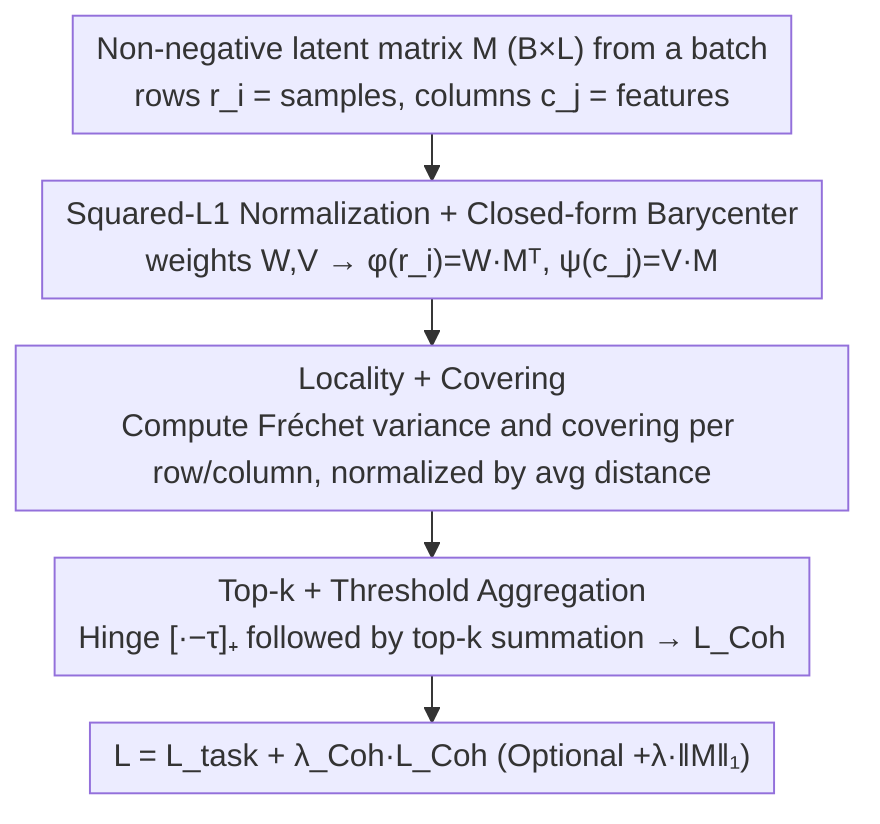

# Learning Coherent Representations: A Topological Approach to Interpretability

**Conference**: ICML 2026  
**arXiv**: [2606.02841](https://arxiv.org/abs/2606.02841)  
**Code**: To be confirmed  
**Area**: Interpretability / Topological Data Analysis / Representation Learning  
**Keywords**: coherence, Vietoris-Rips, Fréchet variance, barycentric map, SAE alternative

## TL;DR
This paper introduces **coherence**, a geometric property inspired by neural coding that requires rows and columns of the sample-feature matrix to be topologically interleaved under Vietoris-Rips filtration. By providing a differentiable `Coh` loss, the method achieves topologically aligned and semantically readable features on autoencoders and BERT token embeddings, significantly outperforming $L^1$ sparsity.

## Background & Motivation

**Background**: The mainstream approach to interpretability focuses on sparsification—using sparse coding and sparse autoencoders (Bricken 2023, Cunningham 2024) with $L^1$ regularization to ensure each feature activates on only a few samples, thereby mitigating polysemanticity. Another direction is the mechanistic approach, which treats latent dimensions as individual "concepts."

**Limitations of Prior Work**: Sparsity only constrains "how many" samples activate, but not "which" samples. A sparse feature could potentially activate in several disconnected, scattered regions on the data manifold; thus, it might have low activation counts but lacks interpretable geometric meaning. This issue is exacerbated in unsupervised settings where the absence of labels fails to pull similar samples together, resulting in a feature space with almost no readable geometric structure.

**Key Challenge**: The essence of interpretability is not "activation sparsity" but "activation region connectivity." Brain cells like grid cells or head direction cells allow us to read off an animal's position or orientation because each neuron's activation region is a **continuous arc or connected component** in the state space—this is locality, not rarity. Existing deep learning regularizations lack mechanisms to guarantee such connectivity.

**Goal**: (1) Provide a geometric definition for "interpretable features"; (2) Transform this definition into a differentiable loss applicable to any network with non-negative activations; (3) Validate the approach in both autoencoder (known topology) and BERT token embedding (no ground-truth topology) settings.

**Key Insight**: Treat the latent matrix $M \in \mathbb{R}_+^{m \times n}$ simultaneously as two sets of weighted point clouds: "samples $\to$ features" and "features $\to$ samples." Leveraging a geometric analogy of **Dowker duality**, if two spaces are approximately covered by each other's "barycentric maps" with low variance, their Vietoris-Rips filtrations must interleave, making them topological mirrors.

**Core Idea**: Use Fréchet variance and the "round-trip error" of barycentric maps as a differentiable loss to constrain sample and feature spaces to be topologically equivalent point clouds. Consequently, feature interpretability becomes "feature space inheriting the geometry of the sample space."

## Method

### Overall Architecture

The method addresses how to formulate interpretability as a differentiable geometric objective. It extracts latents from a batch of any network with non-negative activations (e.g., an autoencoder bottleneck or BERT token embeddings with Softplus), resulting in a non-negative matrix $M \in \mathbb{R}_+^{B \times L}$. Rows $r_i$ represent samples and columns $c_j$ represent features. Using "row-view point clouds" and "column-view point clouds" to perform mutual barycentric mapping, the method quantifies whether the two clouds are topological mirrors, adding this deviation as a `Coh` regularization term to the task loss.

In implementation, squared-$L^1$ is first used to normalize rows/columns into probability weights $w^{(i)}, v^{(j)}$, allowing closed-form barycentric maps $\phi(r_i)=w^{(i)}M^T$ (mapping samples to the column space) and $\psi(c_j)=v^{(j)}M$ (mapping features to the row space). For each row and column, both Fréchet variance (locality) and covering are calculated. The components exceeding a threshold are aggregated via top-$k$ summation to form $\mathcal{L}_{\text{Coh}}$. Finally, the total loss is $\mathcal{L}=\mathcal{L}_{\text{task}}+\lambda_{\text{Coh}}\mathcal{L}_{\text{Coh}}$ (typically $\lambda_{\text{Coh}}=10^{-3}$). Theoretically, when $M$ is $\epsilon$-coherent and $\phi, \psi$ are 1-Lipschitz, an $\epsilon^{1/2}$-interleaving exists, causing the Vietoris-Rips filtrations and persistence diagrams of samples and features to be close under bottleneck distance.

The diagram below illustrates the computation flow of the `Coh` loss in Algorithm 1, corresponding to the three key designs:

### Key Designs

**1. Coherence = Locality + Covering: Compressing "Topological Alignment" into Two Scalars**

The difficulty in interpretability lies in quantifying whether the "feature space inherits the geometry of the sample space." This paper uses a pair of dual scalars to characterize it. For each row, locality is defined by Fréchet variance $\text{Var}_\mathcal{R}(r_i)=\sum_j w^{(i)}_j\|\phi(r_i)-c_j\|_2^2$, measuring if features selected by sample $r_i$ are clustered in the feature space. Covering is defined as $\text{Cov}_\mathcal{R}(r_i)=\sum_j w^{(i)}_j\|r_i-\psi(c_j)\|_2^2$, measuring if a feature barycenter $\psi(c_j)$ exists close to $r_i$. Symmetrical terms are defined for columns. An $\epsilon$-coherent matrix requires both terms to be $\le \epsilon$ for all rows/columns. Both are necessary: suppressing only locality leads to degenerate solutions where features are compact but don't cover the manifold; suppressing only covering leads to scattered features. Together, they achieve $\epsilon^{1/2}$-interleaving (Theorem 3.12), a geometric guarantee that sparsity alone cannot provide.

**2. Squared-L1 Normalization + Closed-form Barycenter: Making "Soft-to-Hard Projection" Differentiable and Bounded**

Interleaving requires mapping samples to actual columns, while training requires differentiable soft mappings. This paper uses the Euclidean norm paired with squared-$L^1$ normalization $W_{ij}=M_{ij}^2/\sum_k M_{ik}^2$, which reduces the weighted barycenter $\arg\min_\mu\sum_j w^{(i)}_j\|\mu-c_j\|_2^2$ to a closed-form $\phi(r_i)=w^{(i)}M^T$, enabling backpropagation without iterative optimization. Crucially, the error between the soft barycenter and the "snapping map" (projection to the nearest literal column) is bounded by locality (Prop 3.9: $\|\phi(r_i)-\Phi(r_i)\|_2 \le \epsilon^{1/2}$). Thus, training with soft loss provides topological guarantees for hard projections.

**3. Top-k + Threshold Aggregation + Paired Scale Normalization: Stabilizing Per-element Geometric Loss**

In non-square $B \times L$ matrices, distances in row and column point clouds can differ by orders of magnitude. The paper normalizes variance and covering by average pairwise distances $\bar d_R, \bar d_C$ to make them dimensionless. A hinge loss $[\cdot-\tau]_+$ avoids penalizing already compliant rows/columns, and only the top-$k_R, k_C$ worst violations are summed: $\mathcal{L}_{\text{Coh}}=\text{TopK}(\text{Var-related})+\text{TopK}(\text{Cov-related})$. This ensures optimization focuses on the least coherent elements, preventing gradient dilution when most elements are already well-behaved.

### Loss & Training
The objective is Task Loss + $\lambda_{\text{Coh}}\mathcal{L}_{\text{Coh}}$, with optional $\lambda_{L^1}\|M\|_1$ to favor sparse coherent solutions. For the MNIST autoencoder, $\lambda_{\text{Coh}}=\lambda_{L^1}=10^{-3}$; for the toy double-circle, a smaller $\lambda_{\text{Coh}}=10^{-5}$ is used. In the BERT setting, token embeddings are mapped to non-negative values via Softplus($\beta=20$) before applying `Coh`, with MLM as the main task. The 1-Lipschitz assumption is checked post-hoc rather than enforced (observed violation rates: $\psi < 0.2\%$, $\phi \approx 3$-$4\%$, average expansion $\approx 1.05$).

## Key Experimental Results

### Main Results

**Toy Double-Circle Data** ($\mathbb{R}^{512}$ with two disjoint circles, 20k samples) — Single seed results:

| Model | MSE | %Tuned (MRL > 0.5) | %Pure (compscore > 0.5) | Locality / Cov |
| :--- | :--- | :--- | :--- | :--- |
| Vanilla | 9.96e-5 | 43.0% | 0.0% | 0.53 / 0.44 |
| L1 | 9.95e-5 | 52.0% | 0.0% | 4.62 / 4.58 |
| **Coh** | **9.94e-5** | **100.0%** | **90.2%** | **0.14 / 0.14** |

**BERT token embedding** (256-dim, 2 transformer blocks, WikiText-2, 5-seed average):

| Metric | Coh | Softplus baseline |
| :--- | :--- | :--- |
| Mean Overlap with Vanilla geometry | 0.45 ± 0.01 | 0.22 ± 0.00 |
| Features with Overlap > 0.5 / 256 | 77.4 ± 3.3 | 1.0 ± 0.6 |
| Claude scoring (Interpretable) / 256 | **87.6 ± 10.4** | **0.0 ± 0.0** |

### Ablation Study

| Configuration | %Tuned | Locality | Description |
| :--- | :--- | :--- | :--- |
| Coh (Full) | 100% | 0.14 | Joint locality + covering constraints |
| L1 Sparsity only | 52-63% | 3.67-4.62 | Sparsity fails to yield geometric clustering |
| Vanilla (No Reg) | 43% | 0.53 | Topological randomness |
| Coh + L1 (Double digits) | Intra-class stability | 0.15 | L1 pushes Coh toward sparsest coherent solutions |
| Softplus only (BERT) | 1/256 ≈ 0% | — | Non-negativity is insufficient |

### Key Findings

- **Stability of Loc and Cov**: Standard deviation across seeds is near zero, indicating `Coh` loss reliably hits geometric targets. High variance in MRL/Purity reflects that coherence allows different valid solutions (e.g., classes split vs. merged).
- **Sparsity vs. Coherence**: $L^1$ locality on toy data spiked to 4.62 (worse than vanilla), proving that sparsification can actively destroy geometric clustering. Coh reduces locality to 0.14.
- **BERT Results**: Softplus-only models yield almost zero interpretable features, whereas Coh achieves 87.6/256. Non-negativity is a necessary condition, but coherence is the sufficient ingredient. Claude identified features spanning "years, relatives, locations, units, adverbs" without specific data priors.
- **1-Lipschitz robustness**: Though checked post-hoc, average expansion was $\approx 1.05$ with single-digit violation rates. Experimental results still align with Theorem 3.12, suggesting practical conclusions are robust to minor deviations from ideal assumptions.

## Highlights & Insights
- Reframes "interpretable features" from a linguistic/semantic problem into a **geometric/topological problem**: interpretability $\equiv$ sample and feature point clouds interleaving. This provides a differentiable proxy requiring no human labels.
- **Geometrization of Dowker Duality**: Adapts the combinatorial theorem (homotopy equivalence) to metric space $\epsilon^{1/2}$-interleaving. The dual relationship between Fréchet variance and covering maps directly to the interleaving conditions.
- **Squared-$L^1$ for Closed-form Barycenters**: A valuable technique for any differentiable attention/aggregation task requiring soft-to-hard projections while avoiding EM-style loops.
- **Top-$k$ + Threshold Aggregation**: A robust engineering trick for per-element geometric losses, far superior to simple averaging for instance-wise regularization.

## Limitations & Future Work
- The 1-Lipschitz assumption is not strictly enforced; adding spectral norm penalties to $\phi, \psi$ is a potential improvement.
- Experiments were limited to autoencoder bottlenecks and token embeddings. Effects on deeper Transformer layers, ResNet skip connections, or supervised classification are yet to be validated (supervised settings may be less effective as cross-entropy already collapses intra-class structures).
- Squared Euclidean distance may degenerate in high dimensions (distance concentration); behavior for $L \ge 1024$ was not ablated.
- **Multivalent solutions**: Multiple coherent solutions exist for a task. While $L^1$ help select sparse coherent ones, there is no native disentanglement mechanism.
- **Computational Overhead**: Pairwise distance and barycentric matrix construction per batch is $O(B^2+L^2+BL \cdot \max(B,L))$, requiring sampling or block strategies for large LMs.

## Related Work & Insights
- **vs. Sparse AE (Bricken 2023)**: SAE focuses on "how many" (sparsity), while Coh focuses on "which" (geometric connectivity). Toy experiments confirm these are orthogonal and can be used conjunctively.
- **vs. Topological Autoencoder (Moor 2020)**: Those maintain consistency between input and latent topologies via persistence. Coh does not require input topology but makes the "row-view" and "column-view" mirror each other, working on filtration levels without choosing homology degrees.
- **vs. Similarity-preserving Networks (Sengupta 2018)**: They rely on non-negative similarity preservation for localized receptive fields (one-way). Coh requires two-way coverage (features must cover samples), leading to a stronger conclusion that the feature space itself is geometrically meaningful.
- **Neural Science Inspiration**: Rooted in grid/head-direction cell theory—formalizing "neuron activation regions as connected blocks" into locality and "every state eliciting a response" into covering.

## Rating
- Novelty: ⭐⭐⭐⭐⭐ Redefines feature interpretability as a topological interleaving problem with a strictly differentiable loss.
- Experimental Thoroughness: ⭐⭐⭐⭐ Solid results on Toy, MNIST, and BERT; Claude evaluation + topological metrics, though lacks validation on GPT-2/Pythia scale models.
- Writing Quality: ⭐⭐⭐⭐⭐ Clear progression from theory to algorithm to experiments; figures effectively illustrate the core "geometric feature space" thesis.
- Value: ⭐⭐⭐⭐ Provides a new regularization paradigm for mechanistic interpretability that is fully complementary to existing sparsity techniques.

<!-- RELATED:START -->

<!-- RELATED:END -->

## Related Papers

- [\[ICML 2026\] MUSE: Resolving Manifold Misalignment in Visual Tokenization via Topological Orthogonality](muse_resolving_manifold_misalignment_in_visual_tokenization_via_topological_orth.md)
- [\[ICML 2026\] IdEst: Assessing Self-Supervised Learning Representations via Intrinsic Dimension](idest_assessing_self-supervised_learning_representations_via_intrinsic_dimension.md)
- [\[NeurIPS 2025\] Representation Consistency for Accurate and Coherent LLM Answer Aggregation](../../NeurIPS2025/interpretability/representation_consistency_for_accurate_and_coherent_llm_answer_aggregation.md)
- [\[ICML 2026\] Interpretability Can Be Actionable](interpretability_can_be_actionable.md)
- [\[ACL 2026\] A Structured Clustering Approach for Inducing Media Narratives](../../ACL2026/interpretability/a_structured_clustering_approach_for_inducing_media_narratives.md)

<!-- RELATED:END -->
