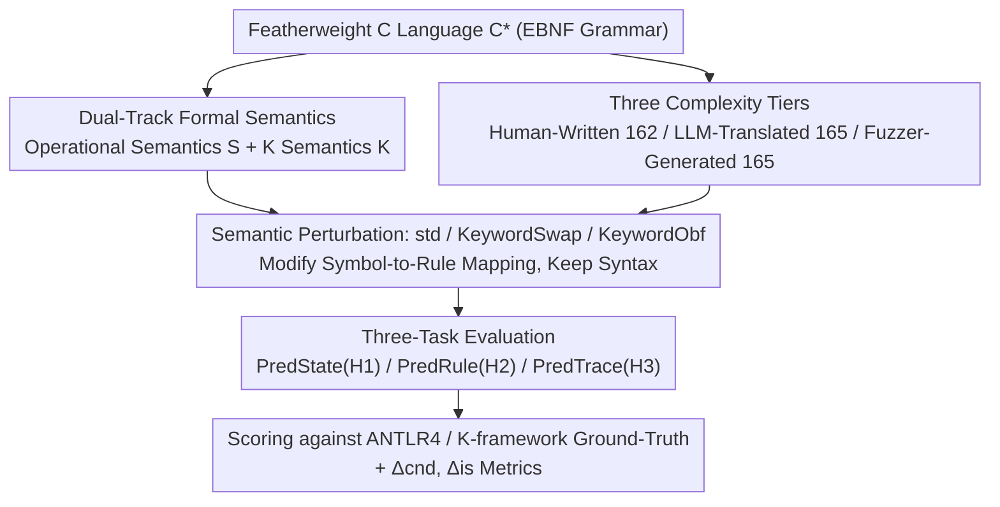

# LLMs Lean on Priors, Not Programming Language Semantics

**Conference**: ICML 2026  
**arXiv**: [2510.03415](https://arxiv.org/abs/2510.03415)  
**Code**: https://EngineeringSoftware.github.io/PLSemanticsBench (Available)  
**Area**: Interpretability / LLM Code Reasoning / Formal Semantic Evaluation  
**Keywords**: Formal Semantics, Program Execution, Rule Conditioning, Semantic Perturbation, Code Understanding

## TL;DR
The authors construct PLSemanticsBench—pairing a featherweight C language $\text{C}^{\star}$ with two formal systems: small-step operational semantics $\mathbb{S}$ and K semantics $\mathbb{K}$. By systematically perturbing semantics through KeywordSwap (swapping operators like `+`/`-`) and KeywordObf (replacing them with rare Caucasian-Albanian symbols), the study evaluates 11 frontier LLMs. Findings show that while models achieve up to 90% accuracy in final state prediction under standard semantics, accuracy drops by 40–60 percentage points under semantic perturbation. Long-range rule maintenance accuracy peaks at only 35%, suggesting that contemporary LLMs rely primarily on pre-trained lexical priors rather than explicit formal rule reasoning.

## Background & Motivation
**Background**: Mainstream code capability evaluations for LLMs follow two paths: end-to-end benchmarks for output prediction, program repair, or code generation (HumanEval, MBPP, CodeContests), and "step-by-step execution" imitation via chain-of-thought. Both assume the models encounter languages seen during pre-training, where symbol meanings align with conventional expectations.

**Limitations of Prior Work**: Existing settings fail to distinguish between two distinct capabilities: (a) the model actually performing formal reasoning based on provided rules; and (b) the model mapping familiar symbols (`+`, `while`, `if`) to statistical associations learned during pre-training to guess a plausible answer. When (b) dominates, high scores do not imply the model understands formal semantics.

**Key Challenge**: To decouple "semantic conditioning" from "syntactic familiarity," it is necessary to systematically rewrite semantics while preserving the syntactic surface. This is a natural capability of formal semantics (Structured Operational Semantics, K Semantics), where rules are symbolic and uniform in atomicity, allowing for the direct replacement of rules like `E-Add` for `+` without altering the syntax tree. However, existing LLM code evaluations have not introduced this tool.

**Goal**: (1) Design a benchmark capable of mechanical semantic perturbation; (2) Decompose "rule-based reasoning" into four individually measurable capabilities: global composition (H1), rule selection without state changes (H2), long-range maintenance (H3), and adherence to provided rules under new semantics (H4); (3) Quantify the performance of frontier LLMs across these four capabilities.

**Key Insight**: Choose C instead of Python to avoid coupling "block structure recovery" with "semantic reasoning" due to indentation-sensitive syntax. Use a featherweight grammar to remove noise like pointers and structs. Apply the same programs to both $\mathbb{S}$ (fine-grained, one rule per atomic calculation) and $\mathbb{K}$ (coarse-grained, rewriting semantics) to control rule granularity.

**Core Idea**: Use "mechanical semantic substitution" as a probe. The same syntax tree should yield three different execution results under std/swap/obf settings. If a model truly reasons based on provided rules, it should switch its answers accordingly; otherwise, it is relying on pre-training priors.

## Method

### Overall Architecture
PLSemanticsBench aims to decouple LLM rule reasoning from pre-training lexical priors. This is achieved by equipping a featherweight C language $\text{C}^{\star}$ with complete formal semantic rules and mechanically rewriting these rules to observe model response shifts. The pipeline consists of four steps: defining $\text{C}^{\star}$ syntax with EBNF and providing complete rule texts for both small-step operational semantics $\mathbb{S}$ and K semantics $\mathbb{K}$; generating programs across three complexity tiers—162 Human-Written snippets from LeetCode/HumanEval/MBPP/CodeContests, 165 LLM-Translated snippets via Qwen2.5-Inst 32B, and 165 Fuzzer-Generated snippets via a grammar-based fuzzer (cyclomatic complexity from 3 to 100, trace length from 20 to 190); applying mechanical semantic substitutions (std/swap/obf); and finally feeding "program + rule text" to models for three task categories, scoring against ground-truth from ANTLR4 / K-framework.

### Key Designs

**1. Dual-Track Formal Semantics: Contrasting $\mathbb{S}$ and $\mathbb{K}$ Granularities**

To distinguish between "model confusion over fine-grained rules" and "model inability to execute," identical programs are run under two rule granularities. $\mathbb{S}$ uses Gentzen-style inference rules, where every atomic computation is a transition—e.g., `E-Add` only handles $\langle v_1+v_2,\sigma\rangle \to_E v_3$, while left-operand reduction is managed by `E-AddLeftStep`. $\mathbb{K}$ uses a rewriting style, merging multiple steps into coarse rules. In both systems, program execution is formalized as $\llbracket s\rrbracket_\Psi(\sigma_0) = (\sigma_n, \bigoplus_{i,j}[(\sigma_i, r_{i,j})])$, recording both state sequences $\sigma_i$ and rule name sequences $r_{i,j}$ as ground-truth. This design revealed in notation pilot tests that models confuse "step vs compute" rules more severely in $\mathbb{S}$ (confusion centered on Arithmetic Expression rules 7–23), whereas $\mathbb{K}$ features less confusion due to fewer rules. This allows downstream failures to be attributed to "granularity discrimination" or "global reasoning" rather than notation incomprehension.

**2. KeywordSwap / KeywordObf: Dual-Axis Semantic Perturbation for Prior Conflict**

This is the core probe for decoupling "semantic conditioning" from "syntactic familiarity." KeywordSwap preserves the syntactic surface but swaps pairs of operators within the same family (`+`↔`-`, `*`↔`/`, `<`↔`>`, `&&`↔`||`). Consequently, `x+y` in the source code should follow subtraction rules under swap semantics, directly conflicting with pre-training priors. KeywordObf replaces symbols like `=`, `+`, `-`, `if-else`, and `while` with rare characters from the Caucasian-Albanian alphabet, making `x ⷠ y` equivalent to `x + y` to completely strip syntactic priors. Both perturbations only alter "symbol-to-rule mappings" while preserving inference rule structures. The dual-axis approach identifies whether priors can be overridden (swap) and whether models can follow rules in the absence of priors (obf). If the drop in swap is significantly larger than in obf, the model is "hijacked" by familiar symbols.

**3. PredState / PredRule / PredTrace: Anchoring H1–H3 Capabilities**

"Rule-based reasoning" is decomposed into three sub-capabilities. PredState requests the final variable table $\llbracket\mathcal{P}\rrbracket_\Psi^\sigma(\sigma_0)$ to examine global composition (H1). PredRule provides an expression-step window where the state remains unchanged and asks the model to select the corresponding rule from five candidates; distractors are sampled hierarchically (family→construct→semantic role) to block lexical shortcuts (H2). PredTrace requires step-by-step output of the entire $(\sigma_i, r_{i,j})$ sequence to examine long-range consistency (H3). This decomposition is critical: testing only the final state conflates rule usage with intuition, while PredRule eliminates the shortcut of back-deriving rules from final values, and PredTrace magnifies cumulative deviations between priors and actual rules over long trajectories. Two metrics quantify this: $\Delta_{\text{cnd}} = \mathrm{Acc}_{\text{std}}^{\square} - \mathrm{Acc}_{\text{na}}$ measures gain from providing rules, and $\Delta_{\text{is}} = \mathrm{Acc}_{\square'}^{\square} - \mathrm{Acc}_{\text{std}}^{\square}$ measures the drop due to perturbation.

### Training Strategy
No training is performed. The study uses zero-shot / one-shot prompting. Non-reasoning models (except GPT-4o-mini) are set to temperature 0; reasoning models and GPT-4o-mini are averaged over 3 runs. CoT is treated as an explicitly prompted variant rather than a new method.

## Key Experimental Results

### Main Results: PredState on Human-Written Dataset ($\mathbb{S}$ Formalization)

| Model | $\text{Acc}_{\text{na}}$ | $\text{Acc}_{\text{std}}$ ($\Delta_{\text{cnd}}$) | $\text{Acc}_{\text{swap}}$ ($\Delta_{\text{is}}$) | $\text{Acc}_{\text{obf}}$ ($\Delta_{\text{is}}$) |
|------|------|------|------|------|
| Qwen2.5-Inst 14B | 33 | 28 (-5) | 6 (-22) | 8 (-20) |
| Llama-3.3 70B | 32 | 25 (-7) | 5 (-20) | 12 (-13) |
| GPT-4o-mini-CoT | 68 | 65 (-3) | 3 (-62) | 27 (-38) |
| DS-Qwen 32B | 84 | 95 (+11) | 3 (-92) | 77 (-18) |
| DS-Llama 70B | 80 | 89 (+9) | 2 (-87) | 59 (-30) |
| QwQ 32B | 93 | 98 (+5) | 7 (-91) | 86 (-12) |
| o3-mini | 94 | 100 (+6) | 63 (-37) | 95 (-5) |
| GPT-5-mini | 100 | 100 (0) | 79 (-21) | 99 (-1) |
| Gemini-2.5-pro | 93 | 99 (+6) | 98 (-1) | 100 (+1) |

### Complexity / Long-range Ablation (PredState on Fuzzer-Generated, $\mathbb{S}$ formalization)

| Model | Human-Written std | Fuzzer std | Human swap | Fuzzer swap |
|------|------|------|------|------|
| QwQ 32B | 98 | ~82 | 7 | 4 |
| GPT-5-mini | 100 | 95 | 79 | 65 |
| Gemini-2.5-pro | 99 | (Stable) | 98 | (Stable) |
| Most Reasoning Models | 80–100 | Drop >40 | Collapsed | Collapsed |

### Key Findings
- **CoT aids execution, not priors**: Non-reasoning models with CoT improve by nearly 50 points under std, but gains vanish under swap, and drop to ~40 points under obf. This suggests CoT helps with "unrolling execution" but not with internalizing new rules.
- **Asymmetry of swap >> obf**: Almost all models show a significantly larger drop in swap than obf (e.g., DS-Qwen 32B drops 92 points in $\mathbb{S}$ swap vs. 18 in obf). This confirms "familiar symbols are traps"—models actually follow provided rules more faithfully when symbols are unfamiliar.
- **Gemini-2.5-pro as an exception**: It maintains $\ge 98\%$ under swap, being the only model among 11 to demonstrate the ability to override priors with rules. Other frontier models (including GPT-5-mini and o3-mini) are to varying degrees hijacked by priors.
- **Near-zero long-range consistency**: In the PredTrace task, only a few models scored above zero, with the best reaching only 35%. This implies that even if single steps are correct, cumulative deviations on long traces lead to rapid collapse.
- **Two categories of structural bottlenecks**: Multivariate regression shows that control-flow depth is the primary stressor for Human-Written programs, while data flow and program volume (Halstead Volume, trace length) dominate failures for LLM-Translated / Fuzzer-Generated code.

## Highlights & Insights
- **Ingenious use of formal semantics as a probe**: Traditional perturbations (variable renaming, adding comments) only affect surface features. KeywordSwap preserves syntax while swapping semantics to directly clash with pre-training priors—a "controlled stress test" unique to formal semantics. This methodology is transferable to any field requiring "rule-following vs pattern-matching" tests, such as mathematical axiom systems or new compliance policies.
- **Solid conclusions via $\Delta_{\text{cnd}}$ and $\Delta_{\text{is}}$**: Absolute accuracy can be obscured by baseline model capability. Requiring both deltas to be positive/negative to qualify "true conditioning" provides a robust metric framework for "rule-following" benchmarks.
- **The swap >> obf asymmetry is counter-intuitive**: One might expect unfamiliar symbols to be harder. However, this study proves that "familiar symbols + counter-intuitive meanings" is more lethal. This suggests that in LLM evaluation, noise does not always equate to difficulty; anomalous semantics expose capability ceilings more effectively than unfamiliar symbols.
- **K vs S comparison insights**: $\mathbb{K}$ (coarse-grained rules) is more stable for notation understanding, but provides lower information density for fine-grained tasks like PredRule. When teaching tools to models, rule granularity must match task granularity.

## Limitations & Future Work
- **Scope**: The study is limited to featherweight C, excluding pointers, structs, and concurrency. It only tests $\mathbb{S}$ and $\mathbb{K}$ formalisms, omitting denotational or axiomatic systems. No large-scale search for CoT prompt templates was conducted.
- **Potential Underestimation**: All models use zero/one-shot prompting without few-shot examples or fine-tuning on rules. Providing even a few ICL examples for KeywordSwap might significantly change results, implying that "LLMs don't understand rules" should be read as "LLMs don't automatically prioritize rules in prompt-only settings."
- **Future Directions**: (1) Fine-tuning models on rules to see if priors can be stably overridden; (2) Incorporating RL with "rule consistency rewards" for long-range PredTrace tasks; (3) Extending the benchmark to custom DSLs (e.g., SQL variants, Solidity upgrades) to test rule-switching in compliance scenarios.
- **Benchmark Bias**: Fuzzer-generated programs, though structurally controlled, may fall far outside the natural code distribution, meaning swap failures on Fuzzer data might reflect OOD robustness issues rather than just rule-following failures.

## Related Work & Insights
- **vs CRUXEval / LiveCodeBench**: Those benchmarks test output prediction on standard Python/C++. This work tests the ability to follow *new* rules after semantic modification, decomposing "code understanding" into orthogonal dimensions.
- **vs Counterfactual Reasoning Benchmarks (Wu et al. 2023, etc.)**: Counterfactuals are mostly in natural language with coarse, non-mechanical perturbations. This work uses formal semantics for precise symbolic replacement, with ground-truth automatically verifiable by the K-framework.
- **vs Operator Overloading Studies**: This work elevates operator overloading from a language feature to an evaluation tool, supported by a systematic multi-complexity dataset, making the methodology more generalizable.

## Rating
- **Novelty**: ⭐⭐⭐⭐⭐ The design using formal semantics as an LLM reasoning probe is unique; KeywordSwap/Obf contrast is clever.
- **Experimental Thoroughness**: ⭐⭐⭐⭐⭐ 11 models × 2 formalisms × 3 perturbations × 3 datasets × 3 tasks, with multivariate regression for attribution.
- **Writing Quality**: ⭐⭐⭐⭐ Densely packed with formal notation, but primer and hypothesis numbering are clear; comprehensive appendices.
- **Value**: ⭐⭐⭐⭐⭐ Provides a mechanically verifiable template for answering "Can LLMs truly reason?" PLSemanticsBench is likely to become a benchmark for rule-following capabilities.

<!-- RELATED:START -->

## Related Papers

- [\[ICML 2026\] Adaptive Querying with AI Persona Priors](adaptive_querying_with_ai_persona_priors.md)
- [\[ICML 2026\] Expand Neurons, Not Parameters](expand_neurons_not_parameters.md)
- [\[ACL 2026\] Interpretable Coreference Resolution Evaluation Using Explicit Semantics](../../ACL2026/interpretability/interpretable_coreference_resolution_evaluation_using_explicit_semantics.md)
- [\[ACL 2026\] Linear Probes Detect Task Format, Not Reasoning Mode in Language Model Hidden States](../../ACL2026/interpretability/linear_probes_detect_task_format_not_reasoning_mode_in_language_model_hidden_sta.md)
- [\[ICML 2026\] Position: Zeroth-Order Optimization in Deep Learning Is Underexplored, Not Underpowered](position_zeroth-order_optimization_in_deep_learning_is_underexplored_not_underpo.md)

<!-- RELATED:END -->
