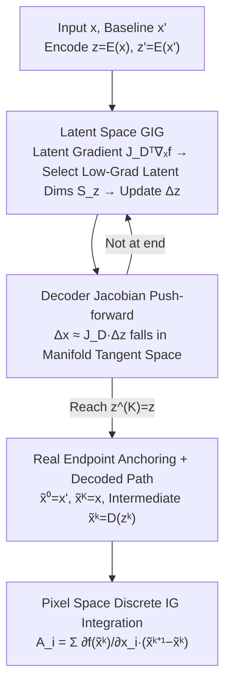

# Manifold-Aligned Guided Integrated Gradients for Reliable Feature Attribution

**Conference**: ICML 2026  
**arXiv**: [2605.02167](https://arxiv.org/abs/2605.02167)  
**Code**: https://github.com/leekwoon/ma-gig (Yes)  
**Area**: Interpretability / Feature Attribution / Integrated Gradients  
**Keywords**: integrated gradients, guided IG, data manifold, VAE, path methods

## TL;DR
This paper proposes MA-GIG: moving the "feature selection based on low gradient magnitude" strategy of Guided IG from pixel space to the latent space of a pre-trained VAE. By utilizing the decoder Jacobian to map axis-aligned updates in the latent space to updates in the tangent space of the data manifold, the method avoids high-gradient noise regions while ensuring the integration path remains close to the true data manifold, resulting in more reliable attributions.

## Background & Motivation

**Background**: Integrated Gradients (IG) has become the standard for path attribution due to axiomatic guarantees such as completeness and sensitivity, integrating gradients along a straight line from a baseline to the input. Subsequent works have either changed the baseline (e.g., Sturmfels et al.) or modified the path—Guided IG (GIG) updates by selecting features with low gradient magnitudes to avoid noisy regions, while EIG/MIG place the path within a VAE latent space to remain close to the manifold.

**Limitations of Prior Work**: (1) The straight-line path of IG may pass through high-variance regions where gradients oscillate violently, accumulating spurious gradients into the attribution. (2) Although GIG reduces noise, it still operates in pixel space, meaning intermediate samples drift away from the natural image manifold where gradient behavior is undefined. (3) EIG/MIG reduce manifold deviation by using VAE paths but completely ignore the geometry of the classifier's logit surface, potentially passing through high-curvature noisy regions. All three approaches address either "manifold alignment" or "gradient noise," but not both.

**Key Challenge**: Reliable attribution requires **simultaneously** (i) keeping intermediate samples close to the manifold (in-distribution) and (ii) ensuring the path avoids high-variance logit regions. Performing (ii) in pixel space inevitably violates (i) because axis-aligned sparse pixel updates are unlikely to fall within the tangent space of the data manifold. Conversely, simply traversing the latent space loses information about the logit surface geometry.

**Goal**: (1) Formalize that the "off-manifold drift of GIG" is structural rather than accidental; (2) transfer the low-gradient selection strategy of GIG to the latent space, allowing "sparse axis-aligned" updates to naturally become "relevant updates within the manifold tangent space" through the decoder; (3) quantitatively compare against traditional attribution methods across multiple classifiers and datasets.

**Key Insight**: The authors observe that assuming an ideal VAE satisfies perfect autoencoding ($D(E(x)) = x$ on the manifold, and the decoder is a smooth immersion), the column span of the decoder Jacobian $J_D(z)$ exactly spans $T_{D(z)}\mathcal{M}$. Therefore, the push-forward of **any direction in the latent space** via the Jacobian falls within the tangent space.

**Core Idea**: Migrate the greedy low-gradient updates of GIG from pixel space to the VAE latent space. This allows axis-aligned updates to automatically transform into tangential updates via the decoder Jacobian—the same denoising mechanism is used, but manifold alignment is provided "for free" by the geometric properties of the decoder.

## Method

### Overall Architecture
MA-GIG resolves the conflict between "keeping the path on the manifold" and "avoiding gradient noise" by performing the entire Guided IG process in the latent space of a pre-trained VAE. The input $x$ and baseline $x'$ are encoded as $z = E(x)$ and $z' = E(x')$. Starting from $z'$, the path advances toward $z$ step-by-step: at each step, latent dimensions with low gradient magnitudes are selected for updates in the latent space. The decoder Jacobian then automatically pushes these axis-aligned latent updates into the tangent space of the data manifold. Finally, latent points along the path are decoded back to pixels, and discrete IG integration is performed using the differences and gradients between adjacent decoded pixel points to obtain pixel-level attributions.

### Key Designs

**1. Formalizing "Pixel-Space Guidance Inevitably Drifts Off-Manifold": Upgrading Intuition to Geometric Impossibility**

When GIG performs greedy updates in pixel space, intermediate images appear increasingly unnatural. Previously an empirical observation, this paper provides Proposition 3.1 to make it a rigorous conclusion: the update $\Delta x^{(k)}$ in GIG's $k$-th step is an **axis-aligned sparse vector**. Decomposing it into tangential and normal components $\Delta x^{(k)} = \Delta x^{(k)}_\| + \Delta x^{(k)}_\perp$, the orthogonal component $\Delta x^{(k)}_\perp$ represents the off-manifold drift. When the manifold reach is $\tau$, and $\|\Delta x^{(k)}_\perp\| > \frac{1}{\tau}\|\Delta x^{(k)}\|^2$ while $\|\Delta x^{(k)}\| \leq \tau/2$, then $x^{(k+1)}\notin \mathcal{M}$ strictly holds. The crux is a magnitude mismatch: the orthogonal component of an axis-aligned displacement is **first-order** $\mathcal{O}(\|\Delta x\|)$, while the manifold's curvature tolerance is only **second-order** $\mathcal{O}(\|\Delta x\|^2)$. As the step size decreases, the first-order term dominates, almost guaranteeing a drift off the manifold. This proposition proves the issue isn't hyperparameter tuning but a structural constraint—the inherent misalignment between pixel axes and the natural image tangent space—providing a strong motivation to change coordinate bases.

**2. Latent GIG: Identical Greedy Strategy with Automatic Manifold Alignment via Coordinate Change**

Since pixel axes are unsuitable, the same low-gradient selection strategy is moved directly to the latent space $\mathcal{Z}$. The latent gradient is given by the chain rule and decoder Jacobian: $\nabla_z f(D(z^{(k)})) = J_D(z^{(k)})^\top \nabla_x f(D(z^{(k)}))$. A low-gradient subset $S_z^{(k)} = \{j: |\partial f / \partial z_j| \leq \tau_z^{(k)}\}$ is selected in $\mathcal{Z}$, and only these latent dimensions are updated: $\Delta z^{(k)} = \sum_{j \in S_z^{(k)}} \delta_j u_j$ (where $u_j$ is the standard basis of $\mathcal{Z}$). The elegance lies in the fact that while $\Delta z^{(k)}$ is axis-aligned and sparse in $\mathcal{Z}$, its push-forward to pixel space $\Delta x^{(k)} \approx J_D(z^{(k)}) \Delta z^{(k)} = \delta_j \cdot \partial D / \partial z_j$ is exactly the **$j$-th column of the Jacobian**—a tangent vector of the decoder at that point. Under Assumption 3.2 (Perfect Autoencoder), $\mathrm{Im}(J_D(z)) = T_{D(z)}\mathcal{M}$. Thus, any latent space direction pushed through the Jacobian lands in the tangent space. By switching the basis from $\{e_i\}$ to $\{\partial D / \partial z_j\}$, manifold alignment becomes a free byproduct of the decoder's geometry.

**3. Real Endpoint Anchoring + Decoded Path Integration: Returning to Pixel Space while Preserving Completeness**

The path generated in latent space cannot be used directly for attribution because users need to know which **pixels** are important. Therefore, the path must be mapped back to pixel space for integration. The baseline is initialized as $z^{(0)} = z' = E(x')$ and the endpoint $z^{(K)} = z$ is anchored to the true $z$. The pixel endpoints are strictly forced as $\tilde x^{(0)} = x'$ and $\tilde x^{(K)} = x$, while intermediate points are decoded as $\tilde x^{(k)} = D(z^{(k)})$. The final attribution follows a discrete IG formulation: $\mathcal{A}_i = \sum_{k=0}^{K-1}\frac{\partial f(\tilde x^{(k)})}{\partial x_i}(\tilde x^{(k+1)}_i - \tilde x^{(k)}_i)$. Forcing the endpoints to be the real $x', x$ instead of $D(z'), D(z)$ bypasses the completeness gap caused by imperfect VAE reconstruction errors.

### Loss & Training
MA-GIG is a **purely inference-time** algorithm and introduces no new training losses. It only requires a pre-trained VAE (the paper uses the MAR backbone and evaluates Stable Diffusion's VAE in the appendix). Primary hyperparameters include the number of steps $K$, selection ratio $q$ (similar to GIG's fraction), and step size $\eta$.

## Key Experimental Results

### Main Results
Evaluated on ImageNet, Oxford-IIIT Pet, and Oxford 102 Flower with ResNet18, VGG16, and InceptionV1. Metrics: DiffID (↑), Insertion AUC (↑), Deletion AUC (↓). Representative results on Oxford-IIIT Pet:

| Method | ResNet18 DiffID | ResNet18 Ins | ResNet18 Del | VGG16 DiffID | InceptionV1 DiffID |
|---|---|---|---|---|---|
| G×I | 0.2384 | 0.4378 | 0.1994 | 0.4060 | 0.2255 |
| IG | 0.3790 | 0.5186 | 0.1396 | 0.5255 | 0.3438 |
| IG² | 0.3823 | 0.5264 | 0.1441 | 0.6075 | 0.4273 |
| AGI | 0.2787 | 0.4453 | 0.1667 | 0.4471 | 0.3381 |
| EIG | 0.3595 | 0.4964 | 0.1369 | 0.4949 | 0.3306 |
| MIG | 0.3486 | 0.4889 | 0.1402 | 0.4850 | 0.3180 |
| **MA-GIG** | **Best/2nd** | **Best/2nd** | **Best/2nd** | **Best/2nd** | **Best/2nd** |

(Table 1 shows MA-GIG achieves best/2nd best across all 9 backbone-dataset combinations for DiffID and Insertion, and leads in Deletion.)

### Ablation Study

| Configuration | Performance | Description |
|---|---|---|
| MA-GIG (MAR VAE) | Best | Main result backbone |
| Switching to other VAE backbones | Still leading | Robustness to generative priors verified |
| Different $q, \eta, K$ ranges | Stable | Low sensitivity to hyperparameters |
| Degraded to pixel-space GIG | Significant gap | Verifies core role of manifold alignment |
| EIG (No greedy selection) | Inferior | Verifies necessity of logit-aware selection |
| MIG (No greedy selection) | Inferior | Same as above |

### Key Findings
- **Manifold Alignment + Gradient Noise Suppression must be done simultaneously**: EIG/MIG (alignment only) and GIG (noise suppression only) both lag behind MA-GIG, proving these two factors are **complementary** rather than interchangeable.
- **Quality increases with generative prior quality but isn't highly sensitive**: Leading performance is maintained across different VAEs, suggesting that even imperfect VAEs provide useful tangent space approximations.
- **Qualitative Visualization**: MA-GIG attribution maps are clearly more concentrated on foreground class-relevant regions with significantly reduced background noise.
- **Completeness is effectively maintained**: Using real endpoints $x', x$ ensures that IG completeness remains numerically sound even under imperfect VAE reconstruction.

## Highlights & Insights
- **Proposition 3.1 is an elegant geometric statement**: It upgrades the intuitive observation "GIG samples look unnatural" into a rigorous impossibility: "axis-aligned sparse updates + manifold reach geometry → inevitable manifold drift."
- **Minimalist adaptation of the GIG strategy to $\mathcal{Z}$**: The algorithmic framework corresponds almost one-to-one with GIG. It proves that using the "same algorithm + correct coordinate system" can solve manifold issues—a concept transferable to any iterative perturbation method.
- **Decoder Jacobian columns as a natural tangent basis**: This observation is used as a first-class tool and serves as a highly reusable primitive for future work.
- **Engineering detail of endpoint anchoring**: Forcing $\tilde x^{(0)} = x', \tilde x^{(K)} = x$ instead of using decoded endpoints prevents imperfect VAEs from breaking completeness, a practical trick worth replicating.

## Limitations & Future Work
- The rigorous geometric guarantee depends on the **Perfect Autoencoder Assumption**; actual VAEs have reconstruction errors and topological defects.
- **Dependency on pre-trained VAEs**: Deployment costs are higher than IG/GIG, and the VAE must match the classifier's training domain. Application to OOD scenarios or domains without good VAEs (e.g., medical, radar) is limited.
- Computational overhead is significantly higher than IG: each step requires $\nabla_x f$, Jacobian-vector products, and decoding, which may be a bottleneck for high-resolution images.
- Evaluated only on image classification; generalization to non-image modalities (text, tabular, audio) where VAEs may not satisfy smooth immersion properties is uncertain.

## Related Work & Insights
- **vs IG**: IG takes a straight path through high-variance regions; Ours uses a VAE-aligned path to bypass noise.
- **vs GIG**: GIG suppresses noise in pixel space but drifts off-manifold; MA-GIG moves the strategy to the latent space to solve the drift for free.
- **vs EIG / MIG**: These methods use linear interpolation or geodesics in latent space, which are manifold-aligned but ignore logit geometry. MA-GIG combines logit-aware greedy selection with manifold alignment.
- **vs AGI**: AGI starts from adversarial examples and integrates along steepest ascent, leading to severe extrapolation; MA-GIG uses low-gradient paths for stability.
- **Insight**: Rewriting any iterative perturbation algorithm that "doesn't work in pixel space" into its "VAE latent space" equivalent might be a general "free lunch"—this paper provides a clear geometric template for doing so.

## Rating
- Novelty: ⭐⭐⭐⭐ First IG variant to simultaneously address manifold alignment and logit noise; geometric arguments are concise and powerful.
- Experimental Thoroughness: ⭐⭐⭐⭐ 3 datasets × 3 classifiers + multiple VAE backbones + qualitative/quantitative balance.
- Writing Quality: ⭐⭐⭐⭐⭐ Logical flow from geometric motivation to assumption, algorithm, proof, and experiments is seamless.
- Value: ⭐⭐⭐⭐ A practical improvement for the interpretability community; the idea of using coordinate changes to satisfy constraints automatically has broad potential.

<!-- RELATED:START -->

## Related Papers

- [\[AAAI 2026\] Distribution-Based Feature Attribution for Explaining the Predictions of Any Classifier](../../AAAI2026/interpretability/distribution-based_feature_attribution_for_explaining_the_predictions_of_any_cla.md)
- [\[ICML 2026\] MUSE: Resolving Manifold Misalignment in Visual Tokenization via Topological Orthogonality](muse_resolving_manifold_misalignment_in_visual_tokenization_via_topological_orth.md)
- [\[CVPR 2026\] H-Sets: Hessian-Guided Discovery of Set-Level Feature Interactions in Image Classifiers](../../CVPR2026/interpretability/h-sets_hessian-guided_discovery_of_set-level_feature_interactions_in_image_class.md)
- [\[ACL 2025\] Normalized AOPC: Fixing Misleading Faithfulness Metrics for Feature Attribution Explainability](../../ACL2025/interpretability/normalized_aopc_faithfulness_metrics.md)
- [\[ICML 2026\] On the Relationship Between Activation Outliers and Feature Death in Sparse Autoencoders](on_the_relationship_between_activation_outliers_and_feature_death_in_sparse_auto.md)

<!-- RELATED:END -->
