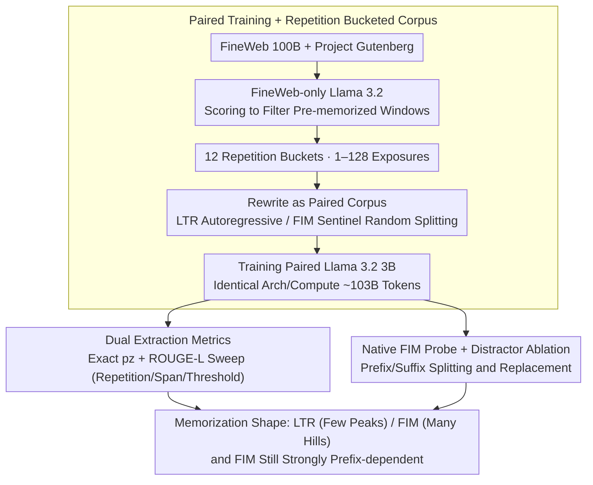

# Memorization Dynamics of Fill-in-the-Middle Pretraining

**Conference**: ICML 2026  
**arXiv**: [2605.22981](https://arxiv.org/abs/2605.22981)  
**Code**: https://github.com/tobiasvonarx/memorization-study-fim  
**Area**: Interpretability / LLM Pretraining / Memorization & Privacy  
**Keywords**: Fill-in-the-Middle, verbatim memorization, pretraining objectives, prefix-suffix probe, Llama 3.2

## TL;DR
The authors trained a pair of Llama 3.2 3B models (one using standard LTR and one using FIM) with identical architectures, data, and compute. By systematically comparing verbatim memorization behavior on repeated Gutenberg corpora, they find that FIM spreads probability mass across more "partial reconstructions" (showing stronger short-span/overlap recall that grows approximately linearly with repetitions), whereas LTR excels at long-span, high-confidence continuations. Furthermore, FIM memorization remains heavily dependent on the prefix, with the suffix serving only as a secondary signal.

## Background & Motivation

**Background**: It is a known issue that large models reproduce training data verbatim. From early canary exposure scores to subsequent real-world extraction attacks by Carlini et al., the community has quantified "memorization" across various dimensions: exact extraction, probabilistic extraction, book-level extraction, and membership inference. Fill-in-the-Middle (FIM), a pretraining objective that moves the target span after the prefix-suffix separated by sentinels, has been widely adopted by models like DeepSeek-v3, InCoder, StarCoder, and Code Llama to equip causal LMs with infilling capabilities.

**Limitations of Prior Work**: Previous research on FIM has almost exclusively focused on "infilling utility"—whether it can complete code or sentences—but no systematic quantification exists on how FIM alters memorization behavior. Intuitively, FIM sees bidirectional context and "should" be easier to remember; however, because the same text is partitioned into different prefix/middle/suffix splits during FIM training, this might weaken the memorization of any single long continuation. No controlled experiments have answered how these two forces compete.

**Key Challenge**: Evaluating "memorization" depends on many confounding factors—model scale, tokenization, prompt position, prior predictability, and near-duplicates all affect extraction rates. To decouple the differences caused by the "FIM objective itself" from "differences in model quality / data distribution," rigorous paired training is required.

**Goal**: The paper addresses three specific sub-questions: (i) What is the shape of FIM's impact on verbatim extraction across different target span lengths, extraction thresholds, and repetition counts? (ii) Under native FIM prompts, what are the respective contributions of the prefix context, suffix context, and sentinel tokens to memorization? (iii) Is the observed difference caused by the extraction geometry (probe format) or differences in model capability?

**Key Insight**: Construct a pair of Llama 3.2 3B models with identical architectures, data sources, and token counts, trained on the same FineWeb + Gutenberg data. Partition the Gutenberg data into 12 buckets with repetitions ranging from 1 to 128, and use a FineWeb-only model to filter out "pre-memorized" windows, ensuring repetition count is the sole variable.

**Core Idea**: Quantitatively decouple the differences in memorization mechanisms between FIM and LTR through controlled paired training, dual extraction metrics (exact $p_z$ extraction + ROUGE-L overlap), and native FIM prefix/suffix distractor probes.

## Method

### Overall Architecture
This work does not aim to "build a new model" but rather to answer "how the FIM pretraining objective changes verbatim memorization." Thus, the method is essentially a comparative experimental design that locks down all confounding factors. The pipeline consists of three stages: first, preparing paired LTR/FIM corpora from the same data source and bucketing the Gutenberg portion by repetition; second, using prefix-only probes to scan the verbatim extraction curves of both models across different repetitions, span lengths, and thresholds; finally, switching to bidirectional prompts (prefix + sentinel + suffix) actually used by FIM to quantitatively decompose the memorization contributions of the prefix and suffix via budget splitting and distractor replacement. Both models were also benchmarked on 8 downstream tasks via the LM Evaluation Harness to ensure nearly identical performance, thereby ruling out the alternative hypothesis that "differences stem from model capability."

### Key Designs

**1. Paired Training + Repetition Bucketed Corpus: Making "Pretraining Objective" the Sole Variable**

**Design Motivation**: Memorization evaluation is naturally contaminated by factors like model scale, tokenizers, prior predictability, and near-duplicates. To isolate differences caused by the FIM objective, the only solution is rigorous paired training. The authors used FineWeb 100B as the bulk corpus and Project Gutenberg as the controlled memorization corpus. They first trained a Llama 3.2 model on FineWeb only to score 4096-token windows in Gutenberg, filtering out outliers, duplicates, and windows already "memorized during the FineWeb phase." The remaining excerpts were then balanced by prior perplexity and distributed into 12 buckets with exposure counts $\{1, 2, \dots, 128\}$, making repetition count the only independent variable. The LTR corpus maintained the original autoregressive order, while the FIM corpus rewrote samples into sentinel-delimited prefix–suffix–middle segments (50% FIM for FineWeb, 100% FIM for Gutenberg). A crucial engineering detail is that multiple repetitions of the same excerpt in the FIM corpus used different random split points. Thus, "repetition" refers to document-level exposure rather than exposure to a fixed middle span—this is precisely what dilutes FIM's memorization quality.

**2. Dual Extraction Metrics (exact $p_z$ + ROUGE-L): Measuring the "Memorization Shape" with Two Rulers**

**Function**: Relying on a single span length or probe format misses key differences. This methodological lesson is emphasized throughout the paper, so two complementary rulers are used. With a fixed prefix of 100 tokens and a target span $M=32$, the first ruler follows Cooper et al. (2026) with the exact extraction probability $p_z = \prod_{i=1}^{M} q_i$, where $q_i$ is the probability of the $i$-th target token after top-$k=40$ renormalization ($T=1$); $p_z \geq 0.1\%$ is considered extractable. The second ruler involves autoregressively generating 32 tokens from the prefix and calculating ROUGE-L against the original; $\geq 0.5$ is considered high overlap recall. The authors also performed threshold scans at repetition=128 and target length scans for $M \in \{20, 30, 40, 50\}$. Together, these show the different "shapes" of memorization: a single strict threshold is dominated by LTR’s heavy tail, while a single short span misses FIM’s partial reconstructions. Consequently, FIM accumulates more mass in the medium $p_z$ range and slightly leads in ROUGE-L and top-$k$ support, while LTR extracts more windows at the $0.1\%$ threshold and long spans due to its heavier right tail. In short, LTR consists of a few "high peaks," while FIM consists of many "small hills."

**3. Native FIM probe + prefix/suffix distractor ablation: Turning "Prefix Dependency" into a Falsifiable Control**

**Novelty**: FIM appears "bidirectional," but the autoregressive nature of causal LMs suggests the prefix might still be the memorization anchor. The authors decomposed the contributions of the prefix, suffix, and sentinel under the actual bidirectional prompt format used by FIM. First, with a fixed 100-token total budget, they scanned the prefix/suffix split ratio for target windows, recording top-$k$ support, perplexity, and extraction rates. Moving from pure suffix to pure prefix, perplexity dropped monotonically from 60.23 to 27.93, while top-$k$ support rose from 77.60% to 85.52%. The "harder" distractor experiment involved keeping the target constant while replacing the prefix, suffix, or both with unrelated text of the same length from other Gutenberg excerpts. Replacing the prefix caused memorization to nearly vanish; replacing the suffix caused only a small drop; and replacing both led to a total collapse. This rules out the pseudo-correlation that support gains come from prompt length or sentinel structure. Attention analysis (Table 1) further corroborates this: in prefix-only probes, FIM allocates higher attention to the prefix (0.646 vs. LTR's 0.604) and looks back less at generated target tokens, explaining why it does not stack quality into long continuations like LTR.

### Loss & Training
Both models were implemented using Megatron-LM for Llama 3.2 3B: 28 layers, hidden 3072, 24 attention heads, 8 KV heads, FFN 8192, vocab 128256, RoPE base 500000, bfloat16, no dropout; packed THD sequences, sequence length 16384, micro-batch 1, global batch 2048, run on 64 GH200 GPUs at 33.5M tokens per step. LTR ran for 3057 steps (~102.58B tokens) and FIM for 3064 steps (~102.81B tokens), ensuring strictly aligned compute.

## Key Experimental Results

### Main Results

| Metric | Repetition Range | FIM | LTR | Meaning |
|------|---------|-----|-----|------|
| Exact Extraction Windows ($p_z \geq 0.1\%$, $M=32$) | 1–128 All Buckets | 2,230 | 3,279 | LTR extracts more under strict thresholds |
| Average ROUGE-L | Same as above | 0.198 | 0.190 | FIM has slightly higher overlap recall |
| Average top-$k$ support ($k=40$) | Same as above | 87.09% | 86.18% | FIM spreads more quality into top-$k$ |
| Prefix-only probe extraction rate | Repetition=128 | Higher than LTR | Lower than FIM | FIM overtakes LTR at high repetitions |
| Long span ($M=50$) extraction | High repetition | Lower than LTR | Higher than LTR | LTR's heavy tail wins on long spans |

### Ablation Study (Native FIM Probe)

| Configuration | top-$k$ Support | Description |
|------|---------------|------|
| Pure prefix 100 tokens (Native FIM) | 85.52% | Upper bound anchor |
| Pure suffix 100 tokens | 77.60% | Significant drop, target perplexity 60.23 |
| True prefix + True suffix (Full prompt) | Highest overall | Upper bound reference for distractor experiment |
| True prefix + distractor suffix | Slight drop | Suffix interference has limited impact |
| Distractor prefix + True suffix | Large drop | Prefix is the anchor for memorization |
| Both distractors | Collapse | Rules out "prompt length/sentinel structure" hypothesis |
| FIM Attention (prefix-only probe) | prefix 0.646 / prev-target 0.354 | FIM relies more on prefix |
| LTR Attention (prefix-only probe) | prefix 0.604 / prev-target 0.396 | LTR looks more at generated tokens |

### Key Findings
- FIM and LTR do not differ in "which is easier to remember" but rather in their "memorization shapes": LTR clusters probability mass into a few high peaks (heavy-tail, long-span friendly), while FIM spreads mass into many small hills (partial-reconstruction friendly, grows approximately linearly with repetitions).
- For $M=32$ and a $0.1\%$ threshold, FIM extraction overtakes LTR at high repetitions; however, as the target span increases, FIM requires more repetitions to overtake—long spans are LTR's home ground.
- Native FIM prompts appear bidirectional but are actually heavily prefix-anchored: replacing the prefix nearly erases memorization, while replacing the suffix causes only a minor penalty. This suggests FIM training does not truly help the model "remember bidirectionally."
- Performance on 8 LM Evaluation Harness tasks was nearly identical for FIM and LTR (see §B.1), ruling out the hypothesis that extraction differences arise from model capability.

## Highlights & Insights
- By performing a systematic scan across "dual metrics + multiple span lengths + multiple repetition buckets," the paper provides a contrast of "memorization distribution shapes" rather than just single scores.
- Using prefix/suffix distractor experiments to turn FIM’s "prefix dependency" into a falsifiable control is more convincing than simply reporting attention distributions.
- Controlled repetition bucketing combined with pre-filtering using a FineWeb-only model provides a very clean engineering paradigm for memorization audits.
- The difference in attention allocation (FIM looks at the prefix more) explains why it does not stack quality into long continuations like LTR—a small discovery at the mechanistic level.

## Limitations & Future Work
- The model scale is capped at 3B (with 1B for ablation), making it difficult to extrapolate to frontier scales where the relationship between capacity and FIM/LTR memorization might change.
- Repetitions of 1–128 cover practical ranges but do not allow for trend extrapolation in extreme cases.
- A conceptual limitation is "attribution": when FIM uses random splitting, the probe span does not necessarily correspond to a specific middle seen during training, making it hard to trace results back to specific exposure instances.
- Observation: Probes are based on linguistic text (Gutenberg) and do not cover code, which is FIM's primary industrial use case. Memorization dynamics for code might differ significantly.
- Future work could introduce positional sensitivity scans and span-to-training mapping to verify if these patterns hold for longer extraction windows.

## Related Work & Insights
- **vs. Carlini et al. 2023 (Quantifying Memorization)**: While that paper established a scaling law for LTR memorization (logarithmic growth with capacity/repetition), this paper extends the control to the FIM objective, finding that the FIM curve grows nearly linearly rather than saturating logarithmically.
- **vs. Cooper et al. 2026 (Book-level Extraction)**: This paper adopts the $p_z$ metric but uses $M=32$ to allow for ROUGE-L comparison on the same windows, elevating the analysis from "how many books are extracted" to "shape differences between FIM/LTR."
- **vs. Huang et al. 2024 (Demystifying Verbatim Memorization)**: Corroborates that significant repetition is needed for memorization and extends this from LTR to FIM, finding that FIM starts slower but grows more steadily.
- **vs. Bavarian et al. 2022 (Original FIM paper)**: The original work proved FIM does not significantly hurt downstream capabilities. This paper shifts the perspective to "safety/privacy audit," revealing that FIM changes memorization geometry rather than total memorization volume.

## Rating
- Novelty: ⭐⭐⭐⭐ First systematic quantification of FIM vs. LTR memorization differences; the paired training and dual-metric design are clean.
- Experimental Thoroughness: ⭐⭐⭐⭐ Paired 3B training + repetition buckets + dual probes + distractor ablation + 1B/downstream task ablation is nearly the limit of what can be done.
- Writing Quality: ⭐⭐⭐⭐ Clear structure; the progression from "prefix-only → native FIM → distractor" is natural, and methodological lessons are directly addressed.
- Value: ⭐⭐⭐⭐ Directly relevant to pretraining objective selection and memorization audits; specifically, the "prefix-anchored" finding will impact privacy assessment of infilling models.

<!-- RELATED:START -->

## Related Papers

- [\[ICLR 2026\] Grokking in LLM Pretraining? Monitor Memorization-to-Generalization without Test](../../ICLR2026/interpretability/grokking_in_llm_pretraining_monitor_memorization-to-generalization_without_test.md)
- [\[ICML 2026\] Is One Layer Enough? Understanding Inference Dynamics in Tabular Foundation Models](is_one_layer_enough_understanding_inference_dynamics_in_tabular_foundation_model.md)
- [\[ICML 2026\] Tracing the Dynamics of Refusal: Exploiting Latent Refusal Trajectories for Robust Jailbreak Detection](tracing_the_dynamics_of_refusal_exploiting_latent_refusal_trajectories_for_robus.md)
- [\[ICML 2026\] Dissecting Multimodal In-Context Learning: Modality Asymmetries and Circuit Dynamics in modern Transformers](dissecting_multimodal_in-context_learning_modality_asymmetries_and_circuit_dynam.md)
- [\[ACL 2026\] Crosscoding Through Time: Tracking Emergence & Consolidation Of Linguistic Representations Throughout LLM Pretraining](../../ACL2026/interpretability/crosscoding_through_time_tracking_emergence_consolidation_of_linguistic_represen.md)

<!-- RELATED:END -->
