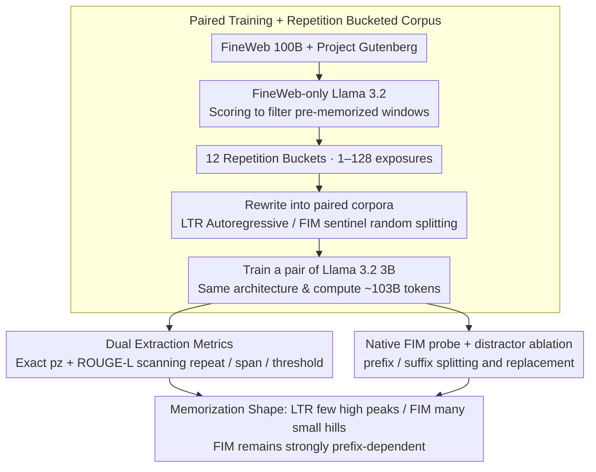

# Memorization Dynamics of Fill-in-the-Middle Pretraining

**Conference**: ICML 2026  
**arXiv**: [2605.22981](https://arxiv.org/abs/2605.22981)  
**Code**: https://github.com/tobiasvonarx/memorization-study-fim  
**Area**: Interpretability / LLM Pretraining / Memorization & Privacy  
**Keywords**: Fill-in-the-Middle, verbatim memorization, pretraining objectives, prefix-suffix probe, Llama 3.2

## TL;DR
The authors trained a pair of Llama 3.2 3B models using the same architecture, data, and compute (one standard LTR, one FIM). By systematically comparing verbatim memorization behavior on repeated Gutenberg corpora, they found that FIM distributes probability mass across more "partial reconstructions" (showing stronger short-span/overlapping recall that grows nearly linearly with repetitions), whereas LTR excels at high-confidence long-span continuations. FIM memorization remains heavily dependent on the prefix, with the suffix serving only as an auxiliary signal.

## Background & Motivation

**Background**: Large models' ability to reproduce training data verbatim is a well-known issue. From early canary exposure scores to subsequent real extraction attacks by Carlini et al., the community has quantified "memorization" through various dimensions—exact extraction, probabilistic extraction, book-level extraction, and membership inference. Fill-in-the-Middle (FIM), a pretraining objective that moves the target span behind a prefix-suffix pair separated by sentinels, has been widely adopted by DeepSeek-v3, InCoder, StarCoder, and Code Llama to equip causal LMs with infilling capabilities.

**Limitations of Prior Work**: Previous research on FIM has focused almost exclusively on "infilling utility"—whether it can complete code or sentences—but has not systematically quantified how FIM alters memorization behavior. Intuitively, FIM sees bidirectional context and "should" be easier to memorize; however, the same text segment appears with different prefix/middle/suffix splits during FIM training, which might weaken the memorization of any single long continuation. No controlled experiments have answered how these two forces compete.

**Key Challenge**: Evaluating "memorization" involves many confounding factors—model scale, tokenization, prompt position, prior predictability, and near-duplicates all affect extraction rates. To isolate the differences caused by the FIM objective itself from differences in model quality or data distribution, rigorous paired training is required.

**Goal**: Split into three specific sub-questions: (i) What is the shape of FIM's impact on verbatim extraction across different span lengths, extraction thresholds, and repetition counts? (ii) Under native FIM prompts, how much do the prefix context, suffix context, and sentinel tokens contribute to memorization? (iii) Are the observed differences due to extraction geometry (probe format) or differences in model capability?

**Key Insight**: Construct a pair of Llama 3.2 3B models with identical architectures, data sources, and token counts. Train them on the same FineWeb + Gutenberg data, partitioning Gutenberg into 12 buckets with 1–128 repetitions. Use a FineWeb-only model to filter out "pre-memorized" windows, making repetition counts the sole independent variable.

**Core Idea**: Quantitatively decouple the differences in memorization mechanisms between FIM and LTR through controlled paired training, dual extraction metrics (exact $p_z$ extraction + ROUGE-L overlap), and native FIM prefix/suffix distractor probes.

## Method

### Overall Architecture
This work does not propose a new model but rather investigates how the FIM pretraining objective changes verbatim memorization. The method is essentially a comparative experimental design where confounding factors are locked down. The pipeline consists of three segments: first, creating paired LTR/FIM corpora from identical sources and bucketing the Gutenberg portion by repetition; second, scanning verbatim extraction curves across various repetitions, span lengths, and thresholds using prefix-only probes; finally, switching to the bidirectional prompt (prefix + sentinel + suffix) actually used by FIM to quantitatively decompose prefix and suffix contributions via budget splitting and distractor replacement. Both models were also benchmarked on 8 downstream tasks via the LM Evaluation Harness, showing nearly identical performance to rule out the alternative hypothesis that "differences stem from model capability."

### Key Designs

**1. Paired Training + Repetition Bucketed Corpus: Isolating "Pretraining Objective" as the Sole Variable**

Memorization evaluation is naturally contaminated by factors like model scale, tokenizer, prior predictability, and near-duplicates. To isolate the effects of FIM, the authors performed rigorous paired training. Using FineWeb 100B as bulk data and Project Gutenberg as controlled memorization data, they first trained a FineWeb-only Llama 3.2 to score 4096-token windows in Gutenberg. They filtered out outliers, duplicates, and windows already memorized during the FineWeb phase, then distributed the remaining excerpts into 12 buckets with exposure counts $\{1, 2, \dots, 128\}$ (2810 entries per bucket), balanced by prior perplexity. LTR corpora followed standard autoregressive order, while FIM corpora used sentinel-separated prefix–suffix–middle segments (50% FIM for FineWeb, 100% FIM for Gutenberg). A crucial engineering detail is that the same excerpt used different random split points across multiple repetitions in FIM, meaning "repetition" refers to document-level exposure rather than fixed middle-span exposure—which dilutes FIM's memorization quality.

**2. Dual Extraction Metrics (exact $p_z$ + ROUGE-L): Measuring the "Memorization Shape"**

Relying on a single span length or probe format misses key differences. With a fixed prefix of 100 tokens and target span $M=32$, the first metric is the exact extraction probability $p_z = \prod_{i=1}^{M} q_i$, where $q_i$ is the probability of the $i$-th target token after top-$k=40$ renormalization ($T=1$); $p_z \geq 0.1\%$ is considered extractable. The second metric uses the prefix for autoregressive generation of 32 tokens, calculating ROUGE-L against the original; $\geq 0.5$ is considered high overlap recall. Only together do these metrics reveal the different memorization "shapes": a single strict threshold favors LTR's heavy tail, while a single short span misses FIM's partial reconstructions. Consequently, FIM accumulates more mass in mid-range $p_z$ and wins on ROUGE-L/top-$k$ support, whereas LTR extracts more windows at the $0.1\%$ threshold and long spans due to its heavier right tail. In short: LTR produces a few "high peaks," while FIM targets many "small hills."

**3. Native FIM Probe + Prefix/Suffix Distractor Ablation: Quantifying "Prefix Anchoring"**

Although FIM appears "bidirectional," the autoregressive nature of causal LMs suggests the prefix remains the memorization anchor. Under native FIM prompt conditions (prefix + sentinel + suffix), the contributions of prefix, suffix, and sentinel were isolated. With a 100-token total budget, scanning the prefix/suffix split ratio showed that target perplexity dropped monotonically from 60.23 (pure suffix) to 27.93 (pure prefix), while top-$k$ support rose from 77.60% to 85.52%. Distractor experiments—keeping the target but replacing the prefix, suffix, or both with unrelated text—showed that replacing the prefix caused memorization to vanish, while replacing the suffix caused only a minor decline. This ruled out pseudo-correlations like "support increases due to prompt length or sentinel structure." Attention analysis (Table 1) further corroborated this: FIM allocated more attention to the prefix (0.646 vs. LTR 0.604) and looked back less at generated target tokens, explaining why it does not stack quality into long continuations like LTR.

### Loss & Training
Both models were implemented in Megatron-LM as Llama 3.2 3B: 28 layers, hidden 3072, 24 attention heads, 8 KV heads, FFN 8192, vocab 128256, RoPE base 500000, bfloat16, no dropout. They used packed THD sequences, sequence length 16384, micro-batch 1, global batch 2048, running on 64 GH200 GPUs at 33.5M tokens per step. LTR ran for 3057 steps (~102.58B tokens) and FIM for 3064 steps (~102.81B tokens), strictly aligning compute.

## Key Experimental Results

### Main Results

| Metric | Repetition Range | FIM | LTR | Meaning |
|------|---------|-----|-----|------|
| Exact Extraction Windows ($p_z \geq 0.1\%$, $M=32$) | 1–128 Aggregate | 2,230 | 3,279 | LTR extracts more under strict thresholds |
| Average ROUGE-L | 1–128 Aggregate | 0.198 | 0.190 | FIM overlap recall is slightly higher |
| Average top-$k$ Support ($k=40$) | 1–128 Aggregate | 87.09% | 86.18% | FIM distributes more mass into top-$k$ |
| Prefix-only Probe Extraction Rate | Repetition=128 | Higher | Lower | FIM overtakes LTR at high repetition |
| Long Span ($M=50$) Extraction | High Repetition | Lower | Higher | LTR's heavy tail wins on long spans |

### Ablation Study

| Configuration | top-$k$ Support | Description |
|------|---------------|------|
| Pure Prefix 100 tokens (Native FIM) | 85.52% | Upper anchor point |
| Pure Suffix 100 tokens | 77.60% | Significant drop; perplexity 60.23 |
| True Prefix + True Suffix (Full Prompt) | Highest | Benchmark for distractor tests |
| True Prefix + Distractor Suffix | Slight drop | Limited impact of suffix interference |
| Distractor Prefix + True Suffix | Large drop | Prefix is the primary memorization anchor |
| Both Distractors | Collapse | Rules out "prompt length/sentinel structure" hypothesis |
| FIM Attention (Prefix-only Probe) | Pref 0.646 / Prev-T 0.354 | FIM relies more on prefix |
| LTR Attention (Prefix-only Probe) | Pref 0.604 / Prev-T 0.396 | LTR looks more at generated tokens |

### Key Findings
- FIM and LTR differ in "memorization shape" rather than "memorization amount": LTR clusters probability mass into sparse high peaks (heavy-tailed, long-span friendly), while FIM spreads it across many small hills (partial-reconstruction friendly, growing approximately linearly with repetition).
- At $M=32$ and a $0.1\%$ threshold, FIM extraction overtakes LTR at high repetitions; however, as the target span increases, FIM requires significantly more repetitions to overtake LTR.
- Native FIM prompts, while appearing bidirectional, are heavily prefix-anchored: replacing the prefix nearly erases memorization, while replacing the suffix causes only minor degradation. This implies FIM training does not truly enable "bidirectional memorization."
- Performance on 8 LM Evaluation Harness tasks was nearly identical (see §B.1), ruling out "model capability" as the cause for extraction differences.

## Highlights & Insights
- Systematic scanning using "dual metrics + multi-span length + multi-repetition buckets" provides a comparison of the "memorization distribution shape" of FIM/LTR, offering 2D insights that single-point metrics lack.
- The prefix/suffix distractor experiments provide falsifiable evidence for "prefix anchoring," which is more convincing than simple attention map reporting.
- The combination of controlled repetition bucketing and filtering via FineWeb-only models provides a clean engineering paradigm for future memorization audits.
- Differences in attention allocation (FIM attending more to the prefix) mechanistically explain why FIM does not stack quality into long continuations like LTR.

## Limitations & Future Work
- Model scale is capped at 3B (with 1B ablations), making it difficult to extrapolate to frontier scales where FIM/LTR relative positioning might shift as capacity increases.
- Repetitions are capped at 128, preventing trend extrapolation for extreme edge cases.
- A conceptual limit: when FIM uses random splitting, the probe span may not correspond to an exact middle span seen during training, making it impossible to trace results back to specific exposure instances.
- The study focuses on Gutenberg (natural language), whereas FIM's primary industrial use is code completion; memorization dynamics in code may differ significantly.
- Future work could include positional fragility scanning and span-to-training mapping to verify if these patterns hold for longer extraction windows.

## Related Work & Insights
- **vs. Carlini et al. 2023 (Quantifying Memorization)**: This paper adds to the scaling law story (logarithmic growth with repetition under LTR) by finding that FIM's curve is nearly linear rather than logarithmic.
- **vs. Cooper et al. 2026 (Book-level Extraction)**: This work adopts the $p_z$ metric but uses $M=32$ to align ROUGE-L and exact extraction, shifting from "how many books" to "distribution shapes."
- **vs. Huang et al. 2024 (Demystifying Verbatim Memorization)**: Confirms that significant repetition is needed for memorization and extends this from LTR to FIM, finding that FIM starts slower but grows more steadily.
- **vs. Bavarian et al. 2022 (Original FIM)**: While the original paper shows FIM does not hurt capabilities, this paper reveals that FIM changes the "geometry" of memorization rather than the total volume, affecting safety/privacy audits.

## Rating
- Novelty: ⭐⭐⭐⭐ First systematic quantification of FIM vs. LTR memorization; clean paired design.
- Experimental Thoroughness: ⭐⭐⭐⭐ Paired 3B training + repetition buckets + dual probes + distractor ablation + 1B/downstream benchmarks.
- Writing Quality: ⭐⭐⭐⭐ Clear structure; logical progression from prefix-only to native FIM to distractors.
- Value: ⭐⭐⭐⭐ Significant for pretraining choice and privacy audits, particularly the "prefix anchoring" finding.

<!-- RELATED:START -->

## Related Papers

- [\[ICLR 2026\] Grokking in LLM Pretraining? Monitor Memorization-to-Generalization without Test](../../ICLR2026/interpretability/grokking_in_llm_pretraining_monitor_memorization-to-generalization_without_test.md)
- [\[ICML 2026\] Is One Layer Enough? Understanding Inference Dynamics in Tabular Foundation Models](is_one_layer_enough_understanding_inference_dynamics_in_tabular_foundation_model.md)
- [\[ICML 2026\] Tracing the Dynamics of Refusal: Exploiting Latent Refusal Trajectories for Robust Jailbreak Detection](tracing_the_dynamics_of_refusal_exploiting_latent_refusal_trajectories_for_robus.md)
- [\[ICML 2026\] Dissecting Multimodal In-Context Learning: Modality Asymmetries and Circuit Dynamics in modern Transformers](dissecting_multimodal_in-context_learning_modality_asymmetries_and_circuit_dynam.md)
- [\[CVPR 2026\] Pixel2Phys: Distilling Governing Laws from Visual Dynamics](../../CVPR2026/interpretability/pixel2phys_distilling_governing_laws_from_visual_dynamics.md)

<!-- RELATED:END -->
