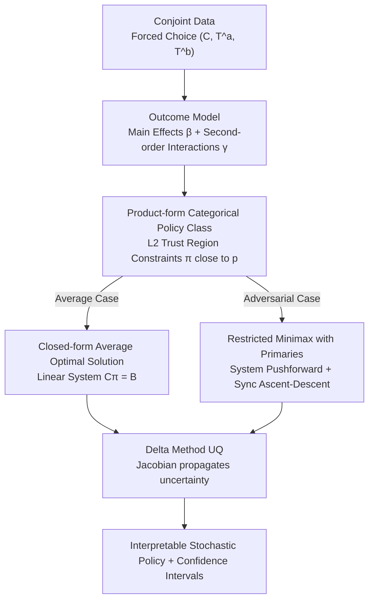

# MiniMax Learning of Interpretable Factored Stochastic Policies from Conjoint Data, with Uncertainty Quantification

**Conference**: ICML 2026  
**arXiv**: [2504.19043](https://arxiv.org/abs/2504.19043)  
**Code**: To be confirmed  
**Area**: Interpretability / Offline Policy Learning / Conjoint Analysis / Minimax Games  
**Keywords**: conjoint analysis, factored stochastic policy, minimax, Delta method, AMCE

## TL;DR
This paper reframes traditional conjoint analysis from "estimating AMCE marginal effects" as "learning interpretable product-form Categorical stochastic policies over an exponential factor action space." It provides a closed-form solution with $L_2$ trust regions under a second-order interaction model, a differentiable general solution, and a two-player minimax expansion incorporating primary election systems. Using the Delta method, it propagates outcome model uncertainty to policy probabilities and values, successfully aligning the adversarial equilibrium's "vote share" with historical ranges in the 2016 US presidential conjoint experiment for the first time.

## Background & Motivation

**Background**: Conjoint analysis is a primary tool in social sciences for studying "multi-attribute preferences." Respondents are typically presented with two multi-attribute profiles (e.g., candidate characteristics, product features) and forced to choose one. The analytical standard is the AMCE (Average Marginal Component Effect), which aggregates marginal effects by fixing one attribute and averaging others over a specific distribution.

**Limitations of Prior Work**: AMCE assumes that other attributes are drawn independently (usually uniformly). However, real candidate pools are neither uniform nor selected in a "strategic vacuum"—Democratic and Republican profiles are the result of mutual strategic play. This causes AMCE's "optimal attribute combinations" to frequently contradict historical election outcomes. Furthermore, AMCE only measures "single-attribute effects" and fails to address the actual decision problem: "What kind of candidate should be deployed?"

**Key Challenge**: The decision object is a joint distribution across $D$ attributes, where the action space $|\mathcal{T}|=\prod_d L_d$ explodes exponentially. Given that the sample size $n$ is far smaller than $|\mathcal{T}|$, **learning policies per-profile** is neither feasible nor interpretable. One must currently sacrifice either expressiveness (marginal effects only), interpretability (black-box neural networks), or strategic realism (ignoring opponents).

**Goal**: (1) Reformulate the estimation problem as an offline policy optimization problem; (2) Identify a policy class that spans exponential action spaces while remaining interpretable to political scientists; (3) Model "opponents" as strategic agents rather than static distributions; (4) Provide confidence intervals to satisfy academic publication standards.

**Key Insight**: The authors observe that randomization in conjoint experiments naturally provides a logging policy, allowing for the application of an offline contextual bandit framework. They further note that "product-of-Categoricals" distributions serve as a natural restricted family under mean-field variational approximation of Gibbs optimal policies, while allowing researchers to read "how much weight the model assigns to an issue" attribute by attribute.

**Core Idea**: The AMCE is replaced with a family of "product-form Categorical stochastic policies." Optimal solutions are derived under linear probability approximations, and the Delta method is used to propagate uncertainty from regression parameters to policies and values. This is further extended to a restricted minimax objective incorporating primary election systems, solved via synchronous ascent–descent.

## Method

### Overall Architecture
This paper addresses the offline decision problem of "candidate profile selection." The input consists of conjoint data with forced-choice labels $(C_i, \mathbf{T}_i^a, \mathbf{T}_i^b)_{i=1}^n$, and the output is an interpretable stochastic intervention policy with confidence intervals. The method is split into two steps: first, fitting an outcome model with second-order interactions where the logit is expressed as differences in main effects $\beta_{dl}$ and interaction effects $\gamma_{dl,d'l'}$; second, solving for the optimal policy within the product-form Categorical class $\Pr_{\bm{\pi}^c}(\mathbf{T}^c=\mathbf{t})=\prod_d \pi^c_{d,t_d}$, subject to an $L_2$ trust region constraint $\|\bm{\pi}^c-\mathbf{p}\|_2^2 \le \epsilon_n$. Finally, the Delta method propagates the variance-covariance matrix $\hat{\Sigma}$ of the outcome model through the Jacobian $\mathbf{J}=\nabla_{\hat\beta,\hat\gamma}\{\hat Q,\hat{\bm\pi}^*\}$ to the standard errors of policy probabilities and values.

### Key Designs

**1. Product-form Categorical Policy Class + L2 Trust Region: Replacing Fragile "Optimal Profiles" with Interpretable Distributions**

The action space $|\mathcal{T}|=\prod_d L_d$ explodes exponentially, making per-profile policies impossible to estimate or interpret. The "optimal single profile" $\bm\pi^*(\mathbf{t})=\mathbb{I}(\mathbf{t}=\mathbf{t}^*)$ is often statistically unstable in high dimensions. Consequently, the policy is restricted to a product distribution $\Pr_{\bm\pi}(\mathbf{t})=\prod_d \pi_{d,t_d}$, optimizing $\max_{\bm\pi} Q(\bm\pi)-\lambda_n\|\bm\pi-\mathbf{p}\|_2^2$, where $\mathbf{p}$ is the experimental randomization distribution. This restriction is supported by variational theory: the authors prove that while the unconstrained optimal solution is Gibbsian $\sigma^\star(\mathbf{t})\propto p(\mathbf{t})\exp\{u(\mathbf{t})/\lambda\}$, restricting it to a product family is equivalent to a classical mean-field variational approximation (Wainwright & Jordan, 2008). This ensures attributes are readable separately (e.g., "0.7 probability for outsider"), satisfies interpretability requirements, and stabilizes the off-policy variance.

**2. Closed-form Average Case Optimal Solution + Delta Method UQ: Propagating Regression Uncertainty to Policy Standard Errors**

Political science requires confidence intervals. In a second-order interaction linear probability approximation, setting the gradient of the objective with respect to $\pi_{dl}$ to zero yields a linear system $\mathbf{C}\bm{\pi}^{a*}=\mathbf{B}$ (Proposition 3.1). Since $\bm{\pi}^{a*}=\mathbf{C}^{-1}\mathbf{B}$ is a differentiable function of $(\hat\beta, \hat\gamma)$, UQ is computed via $\text{Var-Cov}(\hat Q, \hat{\bm\pi}^{a*})=\mathbf{J}\hat\Sigma\mathbf{J}'$. For general GLMs/BNNs requiring iterative solvers, the authors support both unrolling $S$ steps for automatic differentiation and using implicit differentiation $\partial\bm\alpha^*/\partial\theta=-H^{-1}\nabla_\theta F$ at the convergence point, avoiding long backpropagation paths.

**3. Minimax Extension with Primary Systems: Upgrading Opponents to Strategic Agents**

AMCE assumes the opponent is a fixed distribution, but real parties co-evolve strategically. This work defines a zero-sum payoff $Q(\bm\pi^A, \bm\pi^B)$ and incorporates institutional parameters $\beth$ (e.g., primary set $\mathcal{I}$, election set $\mathcal{E}$) through a "nomination distribution pushforward" $\bar{\bm\pi}^A(\bm\pi^A, \bm\pi^{A'}, \beth)$. Algorithm 1 performs synchronous ascent–descent on logit parameters $\bm\alpha^A, \bm\alpha^B$: $\bm\alpha^{A,(s)}\leftarrow\bm\alpha^{A,(s-1)}+\gamma\nabla_{\bm\alpha^A}\Phi$. This embeds institutional rules directly into the optimization objective. The authors also define a **Strategy Divergence Factor** $\mathcal{D}_\varepsilon(\mathbf{t})=|\log\frac{\Pr_{\bm\pi^A}(\mathbf{t})+\varepsilon}{\Pr_{\bm\pi^B}(\mathbf{t})+\varepsilon}|$ to quantify how much a real candidate deviates from the party's optimal strategy.

### Loss & Training
The average case optimizes $O(\bm\pi)=Q(\bm\pi)-\lambda\|\mathbf{p}-\bm\pi\|^2$ via closed-form or projected gradient. The adversarial case optimizes $\Phi(\pi^A,\pi^B)=Q_{\text{inst}}-\lambda R(\pi^A\|\mathbf{p})+\lambda R(\pi^B\|\mathbf{p})$ using logit reparameterization and synchronous ascent–descent over $S$ steps. Standard errors are clustered at the respondent level during the inference phase.

## Key Experimental Results

### Main Results
Experiments involve synthetic data ($n \in \{500, \dots, 10000\}$, $K \in \{5, 10, 20\}$) and the 2016 US Presidential conjoint experiment (Ono & Burden 2019).

| Scenario | Sample / Dim | Metric | Ours (Closed + Delta) | AMCE Baseline | Note |
|------|------------|------|---------------------|-----------|------|
| Avg Synthetic ($R^2{=}0.7$) | $n{=}3500, K{=}10$ | RMSE($\hat{\bm\pi}^*$) | Rapidly decreasing / Minimal bias | — | Fig 3–4 |
| Avg Synthetic | Same | Expected win rate $Q$ | Significantly higher than AMCE argmax | Baseline | Fig 4 |
| Avg Synthetic | Same | 95% CI Coverage | Close to 0.95 | — | §B.4 |
| Adv Synthetic | $n{=}10000$ | RMSE($\hat{\bm\pi}^R$) | Primarily determined by $n$ | — | Fig 1 |
| 2016 US Presidential | Neural Model | Avg Optimal Vote Share | **Outside historical 1976–2020 range** | — | Fig 2 |
| 2016 US Presidential | Neural Model | Adv Equilibrium Vote Share| **Within historical range, close to 2016** | — | Fig 2: Key selling point |

### Ablation Study

| Configuration | Key Observation |
|------------|---------|
| GLM vs Bayesian Transformer | GLM is most efficient/calibrated when linear; Transformer has better RMSE but lower CI coverage. |
| Avg (Static Opponent) vs Adv Minimax | Average strategies yield unrealistic vote shares; adversarial strategies align with history. |
| Closed-form vs Implicit Diff | Solutions match; implicit differentiation is faster for large models but $H$ can be ill-conditioned. |

### Key Findings
- **Historical Alignment**: Average optimal profiles suggest vote shares outside historical bounds (unrealistic), whereas the adversarial restricted-equilibrium falls within the 1976–2020 range and matches 2016 results. This provides a **falsifiable** criterion for model validity.
- **AMCE Limitations**: In cases where main effects are positive but interactions are negative (e.g., outsider and moderate as substitutes), AMCE's marginal approach picks sub-optimal combinations, while this method correctly spreads probability mass across compatible attributes.
- **Sample Sensitivity**: In adversarial settings, RMSE is more sensitive to $n$ than to the opponent mix $p_R$, suggesting utility estimation is the primary bottleneck.

## Highlights & Insights
- **Translation of Social Science Standard to Policy Learning**: Reframing AMCE as a factored stochastic policy allows the use of offline contextual bandit and multi-agent RL tools (Delta method, implicit differentiation).
- **Variational Justification**: Identifying that "Product-form Categorical = Mean-field Variational Approximation" provides a theoretical foundation for interpretability-driven policy constraints.
- **Closed-form UQ**: The ability to propagate uncertainty via a single linear system makes this "two-step" UQ approach applicable to any problem fitting outcome models before optimization.
- **Strategic Pushforward**: Embedding institutional rules (primaries, turnouts) as operators directly in the optimization objective avoids ad-hoc post-processing.

## Limitations & Future Work
- **Two-step Risk**: The method relies on the outcome model being correctly specified; first-step errors propagate to policy and CI.
- **Approximation Gap**: Product-form policies may not reach the global unconstrained optimum; the "interpretability vs optimality" gap is not fully quantified for complex interactions.
- **Institutional Priors**: Institutional parameters $\beth$ must be known a priori; incorrect institutional assumptions will bias the minimax equilibrium.

## Related Work & Insights
- **vs AMCE**: Moves beyond the "marginal effect" bottleneck and the "uniformity assumption," addressing strategic co-evolution.
- **vs Policy Learning**: Extends deterministic treatment rules (Athey & Wager) to stochastic policies on factored, high-dimensional action spaces.
- **vs Markov Games**: Adapts minimax games to setting where payoffs are estimated from offline randomized data with restricted policy classes.

## Rating
- Novelty: ⭐⭐⭐⭐⭐ (Reframes conjoint analysis as strategic policy learning).
- Experimental Thoroughness: ⭐⭐⭐⭐ (Synthetic grids + historical real-world validation).
- Writing Quality: ⭐⭐⭐⭐ (Rigorous, high barrier to entry for cross-disciplinary readers).
- Value: ⭐⭐⭐⭐⭐ (Potentially a new standard for conjoint analysis).

<!-- RELATED:START -->

## Related Papers

- [\[CVPR 2026\] HierUQ: Hierarchical Uncertainty Quantification with Adaptive Granularity Reconciliation for Degraded Image Classification](../../CVPR2026/interpretability/hieruq_hierarchical_uncertainty_quantification_with_adaptive_granularity_reconci.md)
- [\[ICML 2026\] Interpretable Self-Supervised Learning via Representer Landmarks and Nyström Approximation](interpretable_self-supervised_learning_via_representer_landmarks_and_nyström_app.md)
- [\[ICML 2026\] Courtroom Analogy: New Perspective on Uncertainty-Aware Classification](courtroom_analogy_new_perspective_on_uncertainty-aware_classification.md)
- [\[ICML 2026\] Position: Let's Develop Data Probes to Fundamentally Understand How Data Affects LLM Performance](position_lets_develop_data_probes_to_fundamentally_understand_how_data_affects_l.md)
- [\[ICLR 2026\] Behavior Learning (BL): Learning Hierarchical Optimization Structures from Data](../../ICLR2026/interpretability/behavior_learning_bl_learning_hierarchical_optimization_structures_from_data.md)

<!-- RELATED:END -->
