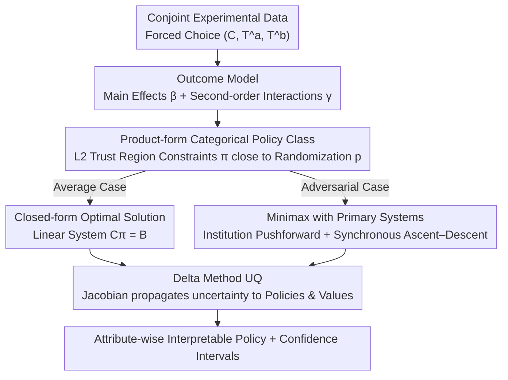

# MiniMax Learning of Interpretable Factored Stochastic Policies from Conjoint Data, with Uncertainty Quantification

**Conference**: ICML 2026  
**arXiv**: [2504.19043](https://arxiv.org/abs/2504.19043)  
**Code**: To be confirmed  
**Area**: Interpretability / Offline Policy Learning / Conjoint Analysis / Minimax Games  
**Keywords**: conjoint analysis, factored stochastic policy, minimax, Delta method, AMCE

## TL;DR
This paper reformulates traditional conjoint analysis—moving from "estimating AMCE marginal effects" to "learning interpretable product-form Categorical stochastic policies over an exponential factor action space." It provides a closed-form solution with $L_2$ trust regions under a second-order interaction model, a differentiable general solution, and a two-player minimax extension incorporating primary election systems. By propagating uncertainty from the outcome model to policy probabilities and values via the Delta method, it successfully brings adversarial equilibrium "vote shares" back to historical ranges for the first time in the 2016 US Presidential conjoint data.

## Background & Motivation

**Background**: Conjoint analysis is a flagship tool in the social sciences for studying "multi-attribute preferences." The typical procedure involves randomly presenting respondents with two multi-attribute candidate profiles (e.g., candidate traits, product features) and requiring a forced choice. Analysis usually summarizes the marginal effects of each attribute as AMCE (Average Marginal Component Effect): fixing one attribute's value and averaging over other attributes according to some distribution. AMCE has become the de facto standard in journals like *Political Analysis*.

**Limitations of Prior Work**: AMCE assumes that other attributes are drawn independently according to a fixed distribution (usually uniform). However, real-world candidate pools are neither uniform nor selected "in a strategic vacuum"—Democratic and Republican candidate profiles emerge through mutual strategic maneuvering. Consequently, the "optimal attribute combinations" suggested by AMCE often mismatch historical election results. Furthermore, AMCE only addresses "single-attribute effects" rather than the actual decision-making question: "What kind of candidate should be fielded?"

**Key Challenge**: The decision object is a joint distribution over $D$ attributes, where the action space size $|\mathcal{T}|=\prod_d L_d$ explodes exponentially with the number of attributes. With sample sizes $n$ far smaller than $|\mathcal{T}|$, **profile-by-profile policy learning** is neither feasible nor interpretable. One must sacrifice either expressivity (looking only at marginals), interpretability (black-box neural networks), or strategic realism (ignoring opponents).

**Goal**: (1) Reformulate the estimation problem as an offline policy optimization problem; (2) Identify a policy class that scales across exponential action spaces while remaining interpretable for political scientists; (3) Model the "opponent" as a strategic agent undergoing simultaneous optimization rather than a static distribution; (4) Provide confidence intervals to make findings suitable for academic publication.

**Key Insight**: The authors note that the random assignment in conjoint experiments naturally provides a logging policy, allowing the use of an offline contextual bandit framework. They observe that "product-of-Categoricals" distributions are both the natural restricted family for Gibbs optimal policies under mean-field variational approximations and highly interpretable, as one can read off "how much weight the model assigns to economic issues" for each attribute.

**Core Idea**: Replace AMCE with a family of "product-form Categorical stochastic policies." Derive closed-form optimal solutions under a linear probability approximation and use the Delta method to propagate the uncertainty of regression parameters to policies and values. Furthermore, model both sides as strategic agents and define a restricted minimax objective containing primary election mechanisms, solving for a restricted steady state via synchronous ascent–descent.

## Method

### Overall Architecture
The paper addresses the offline decision problem of "what kind of candidate to field." The input consists of conjoint data $(C_i, \mathbf{T}_i^a, \mathbf{T}_i^b)_{i=1}^n$ with forced-choice labels ($\mathbf{T}^c \in \mathcal{T}=\{1,\dots,L\}^D$ are $D$-dimensional profiles; $C_i\in\{0,1\}$ indicates if the respondent chose $a$), and the output is a stochastic intervention policy—interpretable per attribute—along with its confidence intervals. The method is split into two sequential steps: first, fitting an outcome model with second-order interactions, expressing the logit as the difference between main effects $\beta_{dl}$ and interaction effects $\gamma_{dl,d'l'}$, i.e., $\eta_i=\sum \beta_{dl}(I_i^a-I_i^b)+\sum \gamma(\cdot)$. Second, optimizing the policy over the product-of-Categoricals class $\Pr_{\bm{\pi}^c}(\mathbf{T}^c=\mathbf{t})=\prod_d \pi^c_{d,t_d}$, subject to an $L_2$ trust region constraint $\|\bm{\pi}^c-\mathbf{p}\|_2^2 \le \epsilon_n$. The average case provides a closed-form solution, while the adversarial case uses synchronous ascent–descent with logit reparameterization. Finally, the Delta method propagates the variance-covariance matrix $\hat{\Sigma}$ of the outcome model through the Jacobian $\mathbf{J}=\nabla_{\hat\beta,\hat\gamma}\{\hat Q,\hat{\bm\pi}^*\}$ to the standard errors of policy probabilities and values.

### Key Designs

**1. Product-form Categorical Restricted Policy Class + L2 Trust Region: Replacing fragile "optimal profiles" with readable stochastic distributions**

The action space $|\mathcal{T}|=\prod_d L_d$ explodes with the number of attributes, making profile-by-profile policies neither estimable nor interpretable. An "optimal single profile" $\bm\pi^*(\mathbf{t})=\mathbb{I}(\mathbf{t}=\mathbf{t}^*)$ lacks sufficient sample size in high dimensions to identify a unique winner. This paper restricts the policy to a product distribution $\Pr_{\bm\pi}(\mathbf{t})=\prod_d \pi_{d,t_d}$, optimizing $\max_{\bm\pi} Q(\bm\pi)-\lambda_n\|\bm\pi-\mathbf{p}\|_2^2$, where the value $Q(\bm\pi)=\sum_{\mathbf{t}}\mathbb{E}[Y_i(\mathbf{t})]\Pr_{\bm\pi}(\mathbf{t})$ and $\mathbf{p}$ is the experimental randomization distribution (the natural logging policy). This engineering constraint is supported by variational theory: the authors prove that when the regularization is KL, the optimal solution on the full simplex is the Gibbs form $\sigma^\star(\mathbf{t})\propto p(\mathbf{t})\exp\{u(\mathbf{t})/\lambda\}$, and restricting this to the product family is exactly equivalent to applying a classic mean-field variational approximation (Wainwright & Jordan, 2008). This choice offers triple benefits: the product form makes policies interpretable attribute-by-attribute (e.g., "the model gives 0.7 weight to outsiders"); the $L_2/KL$ trust region dampens off-policy estimation variance and stabilizes optimization; and the stochastic policy spreads probability mass across "a set of well-performing profiles," which is more robust than selecting a single optimal profile.

**2. Closed-form Average Case Optimal Solution + Delta Method UQ: Making the optimal policy a differentiable linear system**

Political and economic research requires reporting confidence intervals, yet policy learning in the style of Athey & Wager rarely provides standard errors for stochastic policies. This paper's advantage lies in its "analytical friendliness." Under a linear probability approximation with second-order interactions, taking partial derivatives of the objective with respect to each $\pi_{dl}$ and setting them to zero yields a linear system $\mathbf{C}\bm{\pi}^{a*}=\mathbf{B}$, where $B_{r(dl),1}=-\bar\beta_{dl}-4\lambda_n p_{dl}-2\lambda_n\sum_{l'\ne l}p_{dl'}$, $C_{r(dl),r(dl)}=-4\lambda_n$, and $C_{r(dl),r(d'l')}=\bar\gamma_{dl,d'l'}$ (Proposition 3.1). When $\lambda_n$ is large enough to ensure a negative definite Hessian and the solution falls within the simplex, it is the unique global optimum. Since $\bm{\pi}^{a*}=\mathbf{C}^{-1}\mathbf{B}$ is a differentiable function of $(\hat\beta,\hat\gamma)$, UQ becomes a linear system problem: Var-Cov$(\hat Q, \hat{\bm\pi}^{a*})=\mathbf{J}\hat\Sigma\mathbf{J}'$, where $\sqrt{n}(\hat{\bm\pi}^{a*}-\bm\pi^{a*}) \to \mathcal{N}(0,\mathbf{J}\Sigma\mathbf{J}')$. For general GLM/BNN models requiring iterative solutions, the authors support both unrolling $S$ steps for automatic differentiation and using implicit differentiation at the convergence point ($\partial\bm\alpha^*/\partial\theta=-H^{-1}\nabla_\theta F$), which avoids long-range backpropagation—this "two-step UQ" framework seamlessly covers closed-form solutions, GLMs, BNNs, and adversarial minimax.

**3. Adversarial minimax Extension with Primary Systems: Upgrading opponents to strategic agents and encoding institutions into payoffs**

AMCE assumes the "opponent candidate is drawn from a fixed distribution," but in real elections, parties' profiles are strategies in a game. This paper defines a zero-sum payoff $Q(\bm\pi^A,\bm\pi^B)=\mathbb{E}[\Pr\{C_i(\mathbf{T}^A,\mathbf{T}^B)=1\}]$ with the goal $\max_{\bm\pi^A}\min_{\bm\pi^B}Q$, and injects institutional parameters $\beth$ (primary participants $\mathcal{I}^A,\mathcal{I}^B$, general election voters $\mathcal{E}$) via a "nomination distribution pushforward" $\bar{\bm\pi}^A(\bm\pi^A,\bm\pi^{A'},\beth)$. This yields $Q_{\text{inst}}(\bm\pi^A,\bm\pi^B;\bm\pi^{A'},\bm\pi^{B'},\beth)$—treating primary/general election rules as operators embedded directly in the objective rather than post-hoc adjustments. Algorithm 1 performs synchronous ascent–descent on logit parameters $\bm\alpha^A,\bm\alpha^B$: $\bm\alpha^{A,(s)}\leftarrow\bm\alpha^{A,(s-1)}+\gamma\nabla_{\bm\alpha^A}\Phi$, $\bm\alpha^{B,(s)}\leftarrow\bm\alpha^{B,(s-1)}-\gamma\nabla_{\bm\alpha^B}\Phi$, where $\Phi=Q_{\text{inst}}-\lambda R(\pi^A\|p)+\lambda R(\pi^B\|p)$. When institutions make the pushforward affine for each party, $Q_{\text{inst}}$ is bilinear, and the von Neumann minimax theorem guarantees the existence of a saddle point on the full simplex. For the restricted factored family, which is non-convex in the simplex, the authors solve for a steady state and diagnose its quality via exploitability. They also define the **Policy Divergence Factor** $\mathcal{D}_\varepsilon(\mathbf{t})=|\log\frac{\Pr_{\bm\pi^A}(\mathbf{t})+\varepsilon}{\Pr_{\bm\pi^B}(\mathbf{t})+\varepsilon}|$ (a log-probability ratio with $\varepsilon$-smoothing) to quantify how far a real-world candidate deviates from the party's optimal strategy.

### Loss & Training
The average case optimizes $O(\bm\pi)=Q(\bm\pi)-\lambda\|\mathbf{p}-\bm\pi\|^2$ via a closed-form solution or projected gradient. The adversarial case optimizes $\Phi(\pi^A,\pi^B)=Q_{\text{inst}}-\lambda R(\pi^A\|\mathbf{p})+\lambda R(\pi^B\|\mathbf{p})$, using $S$ steps of synchronous ascent–descent under logit reparameterization and estimating the nomination distribution via Monte Carlo. During inference, the Jacobian is calculated via either unrolling or implicit differentiation, and standard errors are clustered at the respondent level.

## Key Experimental Results

### Main Results
Two types of experiments: synthetic data and the 2016 US Presidential conjoint experiment (Ono & Burden 2019). Synthetic experiments are conducted over a grid of $n\in\{500,1500,3500,10000\}$ and $K\in\{5,10,20\}$; adversarial experiments use Republican voter proportions $p_R\in\{0.2,0.3,0.5,0.65,0.8\}$ and $n\in\{1000,5000,10000\}$.

| Scenario | Samples / Dims | Metric | Ours (Closed-form + Delta) | AMCE Baseline | Note |
|------|------------|------|---------------------|-----------|------|
| Average Case Synth ($R^2{=}0.7$) | $n{=}3500, K{=}10$ | RMSE($\hat{\bm\pi}^*$) | Rapid decline / Negligible bias | — | Fig 3–4 |
| Average Case Synth | Same | Expected Win Rate $Q$ | Significantly higher than AMCE | Baseline | Fig 4 |
| Average Case Synth | Same | 95% CI Coverage | Close to 0.95 | — | §B.4 |
| Adversarial Case Synth | $n{=}10000$ | RMSE($\hat{\bm\pi}^R$) | Primarily determined by $n$ | — | Fig 1 |
| Adversarial Case Synth | $n{=}1000$ | 95% CI Coverage | Slightly below nominal | — | Approaches 0.95 as $n$↑ |
| 2016 US Presidential Conjoint | Neural outcome model | Implied vote share of avg-case optimal profile | **Falls outside 1976–2020 historical range** | — | See Fig 2 |
| Same | Neural outcome model | Implied vote share of adversarial equilibrium | **Returns to historical range, close to 2016 actuals** | — | Fig 2, Key Seller |

### Ablation Study

| Configuration / Variant | Key Observation | Description |
|------------|---------|------|
| GLM (with interactions) vs. Bayesian Transformer | GLM is most efficient/calibrated when linear; Transformer has slightly better RMSE under mismatch but poor CI coverage | Table 2, sensitivity to outcome model |
| No Adversarial (Avg + Uniform Opponent) vs. Minimax | Average policy predicts unrealistic vote shares; adversarial policy aligns with history | Validates minimax as necessary for strategic environments |
| Closed-form vs. Iterative + Unroll vs. Iterative + Implicit Diff | Solutions match after convergence; implicit diff is better for memory/speed but sensitive to $H$ ill-conditioning | Discussed in §3.3 |
| No Clustering vs. Data-driven Clustering | Clustering (Goplerud et al. 2025) recovers Democratic-Independent-Republican structures without partisan labels | Fig 12 |

### Key Findings
- **Compelling Empirical Evidence**: The optimal profile from the average case yields vote shares outside the historical range (implausible), whereas the adversarial restricted-equilibrium returns to the 1976–2020 historical range and aligns with 2016 results—this acts as a **falsifiable** criterion for validating strategic modeling.
- **Where AMCE Fails**: In settings where main effects are positive but interactions are negative (e.g., "outsider" and "moderate" are substitutes), AMCE's attribute-wise argmax selects (outsider, moderate). Ours spreads mass to (outsider, hardline) or (insider, moderate), yielding higher expected win rates.
- **Sample Sensitivity**: In adversarial settings, RMSE is primarily driven by $n$ and is largely insensitive to $p_R$, suggesting the bottleneck is outcome estimation rather than game complexity.
- **Model Morphologies**: Transformers are more robust to non-linearities but sacrifice calibration, which is a drawback in political science where uncertainty quantification is prioritized.

## Highlights & Insights
- **Replacing Social Science Estimators with Policy Learning**: Mapping AMCE $\to$ factored stochastic policy connects conjoint analysis to the toolbox of offline contextual bandits and MARL (DR estimation, Delta method, implicit differentiation), representing a paradigm shift rather than just a tool migration.
- **Restricted Policy Class as Mean-field Approximation**: Casting "product-form Categorical = product variational approximation of optimal Gibbs" turns an interpretability trade-off into a theoretically grounded approximation, providing an explicit gapbound from the full simplex optimum.
- **Closed-form Solutions + Implicit Differentiation**: Under $L_2$ trust regions, second-order interactions, and linear probability approximations, the optimal policy is $\mathbf{C}^{-1}\mathbf{B}$. For general models, implicit differentiation at the fixed point solves for $H^{-1}$ once, avoiding long-chain unrolling—a generalizable UQ pattern for "two-step" estimation-then-optimization problems.
- **Institutions as Pushforwards**: Abstracting primary election rules, turnout weights, and voter pools as operators that map policy $\bm\pi^c$ to nomination distribution $\bar{\bm\pi}^c$ avoids bespoke modeling for each institution.
- **Policy Divergence Factor**: A simple log-ratio with $\varepsilon$-smoothing provides a quantitative diagnostic for how much real-world candidates deviate from their party's optimal equilibrium strategy.

## Limitations & Future Work
- **Two-stage Pipeline**: The outcome model and policy optimization are separate; the latter takes results from the former as given, meaning outcome model misspecification propagates directly to the policy and CIs.
- **Approximation vs. Optimality**: The product-form policy is not the unconstrained optimum; the authors acknowledge this "interpretability vs optimality" trade-off but do not quantify the worst-case gap when interactions are highly complex.
- **Uncertainty in Preference Formation**: UQ covers statistical variance but not "procedural" uncertainty (e.g., satisficing, order effects, cycle detection) inherent in conjoint responses.
- **Requirement of Institution Parameters**: Parameters for $\beth$ (e.g., open/closed primary rules, turnout weights) must be known a priori; incorrect institutional settings will lead to biased minimax solutions.
- **Global Optimality in Adversarial Cases**: Because the factored strategy class is non-convex in the simplex, gradient ascent–descent only guarantees steady points; exploitability diagnostics offer local quality but not global certificates.

## Related Work & Insights
- **vs. AMCE / AMIE (Hainmueller et al. 2014; Egami & Imai 2019)**: Traditional conjoint analysis estimates marginal or two-way effects assuming fixed marginal distributions for other attributes. This work estimates the optimal distribution for the full profile, avoiding the bias from uniform-distribution assumptions.
- **vs. Policy Learning (Athey & Wager 2021; Kitagawa & Tetenov 2018)**: These focus on regret bounds for deterministic treatment rules in observational data. This paper focuses on stochastic policies with strong randomization in logging policies and structured factorized action spaces.
- **vs. Minimax Policy Learning (Kallus & Zhou 2021)**: These use minimax to handle **unobserved confounding**, whereas this paper uses minimax to model **strategic opponents**; the objectives and proofs are distinct.
- **vs. Markov Games / PSRO (Littman 1994; Lanctot et al. 2017)**: Classic MARL assumes known utilities or online interaction. This paper solves for equilibria using utilities estimated from offline randomized data under restricted interpretable policy classes.
- **Insight**: (i) Recasting flagship estimators as policy learning is applicable to other randomized designs like A/B testing or clinical trials. (ii) Building interpretability into the policy class itself (inductive bias) is a valuable design philosophy for discrete systems requiring readability.

## Rating
- Novelty: ⭐⭐⭐⭐⭐ Systematically bridges conjoint analysis with minimax policy learning and Delta-method UQ.
- Experimental Thoroughness: ⭐⭐⭐⭐ Extensive synthetic grids and 2016 US Presidential data with historical controls, though global optimality diagnostics for minimax could be deeper.
- Writing Quality: ⭐⭐⭐⭐ Rigorous derivations and consistent notation, though the barrier to entry is high for interdisciplinary readers.
- Value: ⭐⭐⭐⭐⭐ Potential to replace AMCE as the new standard in political and social sciences, with high reproducibility.

<!-- RELATED:START -->

1. **Egami & Imai (2019)**: *Causal Interaction in Conjoint Analysis: Understanding Group Differences* - Foundational work for interaction effects in AMCE.
2. **Athey & Wager (2021)**: *Policy Learning with Observational Data* - Standard for regret bounds in offline policy learning.
3. **Goplerud et al. (2025)**: *Clustering in Conjoint Analysis* - For modeling respondent heterogeneity.
4. **Wainwright & Jordan (2008)**: *Graphical Models, Exponential Families, and Variational Inference* - Theoretical basis for the mean-field approximation.

<!-- RELATED:END -->

## Related Papers

- [\[ICML 2026\] Courtroom Analogy: New Perspective on Uncertainty-Aware Classification](courtroom_analogy_new_perspective_on_uncertainty-aware_classification.md)
- [\[ICLR 2026\] Behavior Learning (BL): Learning Hierarchical Optimization Structures from Data](../../ICLR2026/interpretability/behavior_learning_bl_learning_hierarchical_optimization_structures_from_data.md)
- [\[ICML 2026\] Interpretable Self-Supervised Learning via Representer Landmarks and Nyström Approximation](interpretable_self-supervised_learning_via_representer_landmarks_and_nyström_app.md)
- [\[AAAI 2026\] Data Whitening Improves Sparse Autoencoder Learning](../../AAAI2026/interpretability/data_whitening_improves_sparse_autoencoder_learning.md)
- [\[ICML 2026\] Position: Let's Develop Data Probes to Fundamentally Understand How Data Affects LLM Performance](position_lets_develop_data_probes_to_fundamentally_understand_how_data_affects_l.md)

<!-- RELATED:END -->
