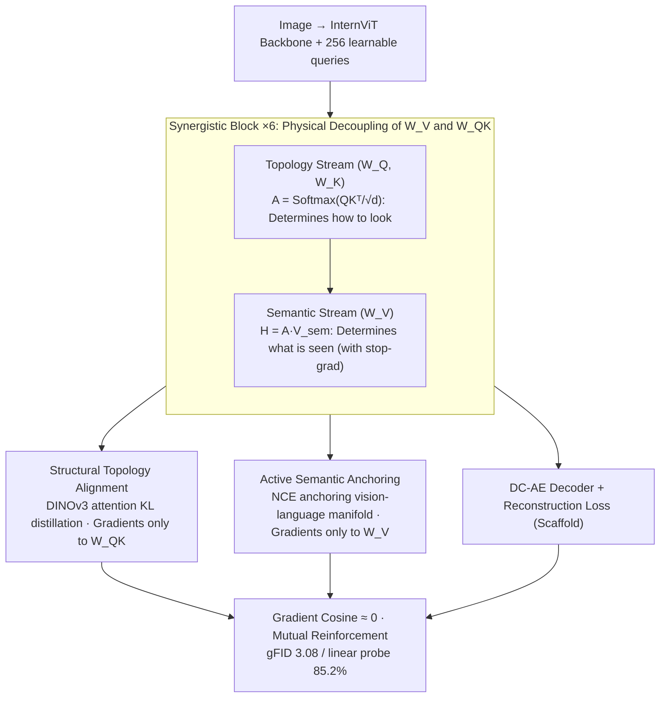

# MUSE: Resolving Manifold Misalignment in Visual Tokenization via Topological Orthogonality

**Conference**: ICML 2026  
**arXiv**: [2605.05646](https://arxiv.org/abs/2605.05646)  
**Code**: Available (GitHub noted in paper; repository address requires main text lookup)  
**Area**: Interpretability / Multimodal / Visual Tokenizer  
**Keywords**: Unified visual tokenizer, manifold alignment, gradient orthogonality, topological alignment, multimodal understanding-generation

## TL;DR
MUSE attributes the "understanding-generation" zero-sum dilemma in unified visual tokenizers to manifold misalignment. It proposes the Gradient Orthogonality Hypothesis—injecting semantics into $W_V$ while routing structural gradients through $W_{Q,K}$. Through Synergistic Blocks, DINOv3 topological alignment, and NCE semantic anchoring, it achieves complete decoupling. Consequently, gFID 3.08 and 85.2% linear probing (surpassing the InternViT-300M teacher's 82.5%) coexist, marking the first instance of true "mutual reinforcement" rather than trade-off.

## Background & Motivation

**Background**: As multimodal large models move toward unification, the industry attempts to use a single unified visual tokenizer to serve both understanding (CLIP-style semantic encoding) and generation (VQ-VAE/diffusion latent). Methods like UniTok, TokenFlow, UniLIP, and VTP attempt to fit both objectives into the same codebook or shared latent space.

**Limitations of Prior Work**: Although architectures are unified, objectives remain contradictory. Pixel reconstruction prefers "expanded" manifolds (preserving high-frequency details), while semantic alignment prefers "compressed" manifolds (filtering irrelevant textures). This leads to "perceptual polarization": attention is either fragmented (VA-VAE types) or excessively blurred (UniLIP types), resulting in missing mid-frequency structural information.

**Key Challenge**: The two objectives directly compete within shared parameters (specifically self-attention $W_Q, W_K, W_V$). Gradient directions even exhibit negative cosine similarity ($\cos\theta_g \ll 0$, Fig. 2a), causing "destructive interference"—one pulling while the other pushes. Neither objective is learned well, a phenomenon the authors term Manifold Misalignment.

**Goal**: (1) Eliminate the zero-sum trade-off between generation and understanding without increasing architectural overhead; (2) Use "structural information" as a bridge to serve both objectives; (3) Empirically verify that the gradient orthogonality hypothesis can transform "parameter sharing = gradient conflict" into "subspace division = gradient synergy."

**Key Insight**: From a manifold geometry perspective, understanding requires $\mathcal M_S$ (semantic invariance) to "compress" the manifold, while generation requires $\mathcal M_T$ (structural equivariance) to "expand" the manifold. A Structural State ($S$) is missing as a geometric foundation. In a Transformer block, $W_{Q,K}$ controls routing topology and $W_V$ controls content values, naturally forming two orthogonal subspaces.

**Core Idea**: Route semantic gradients to $W_V$ and structural gradients to $W_{Q,K}$. Use DINOv3 attention distillation to align topology and NCE to anchor content to the vision-language manifold, allowing both objectives to be optimized in physically isolated spaces within the Transformer.

## Method

### Overall Architecture
MUSE addresses the conflict between two types of gradients when a tokenizer serves both understanding and generation. It splits the encoder $f_\theta: \mathcal X \to \mathcal Z$ into two physically isolated gradient paths—structural gradients only traverse $W_{Q,K}$, while semantic gradients only traverse $W_V$. This ensures the latent resides on both the semantic invariant manifold $\mathcal M_S$ and the structural equivariant manifold $\mathcal M_T$. Architecturally, a connector is formed by six Synergistic Blocks, with InternViT from InternVL3 as the visual backbone and DC-AE as the pixel decoder. Training follows a three-stage curriculum: "learn where to look, learn what it is, and finally end-to-end synergy," using stop-gradients to prevent reconstruction gradients from polluting the semantic branch.

### Key Designs

**1. Synergistic Block: Physical Decoupling of $W_V$ and $W_{Q,K}$**

The pain point is that in classic self-attention, $W_Q, W_K, W_V$ share parameters, forcing reconstruction and semantic gradients to mix, often with negative cosine similarity. MUSE follows the natural division of labor within attention, splitting it into two streams: the Topology Stream uses $W_Q, W_K$ to calculate the adjacency matrix $A = \text{Softmax}(Q_{topo}K_{topo}^T/\sqrt{d_k})$, determining "how to look"; the Semantic Stream uses an independent $W_V$ to project values $V_{sem}=H_l W_V$, then aggregates them via $A$ for $H_{attn}=A\cdot V_{sem}$, determining "what is seen." Consequently, structural loss only backpropagates to $W_{Q,K}$, and semantic loss only to $W_V$. A stop-gradient is added to the semantic branch to prevent reconstruction gradients from passing through and polluting the routing. This is effective because the authors' violin plots (Fig. 2c-d) show that under natural training, semantic gradients concentrate in $W_V$ and structural gradients in $W_{Q,K}$. The Synergistic Block formalizes this internal specialization without increasing parameters, reducing gradient cosine from negative to $\approx 0$.

**2. Structural Topology Alignment: Distilling Structure via DINOv3 Attention**

Both understanding and generation lack mid-frequency structural information. The attention maps of self-supervised models like DINOv3 naturally exhibit object-level segmentation geometry, serving as free topological supervision. MUSE uses a 4D interpolation function $\Psi(\cdot)$ to align teacher-student resolutions, then applies KL divergence per layer and head: $\mathcal L_{topo} = \frac{1}{LH}\sum_l\sum_h D_{KL}(\Psi(A_T^{(l,h)})\,\|\,A_S^{(l,h)})$. The architecture ensures this loss only updates $W_{Q,K}$, aiming to maximize $I(Z;S)$. Learning topology first follows the chain rule of mutual information $I(Z;X,Y)\approx I(Z;S)+I(Z;Y|S)+I(Z;X|S,Y)$—where structural state $S$ is the foundation. Learning "where to look" before "what it is" is information-theoretically more sound than simultaneous optimization.

**3. Active Semantic Anchoring: Nailing Token Values to the Vision-Language Manifold**

Previous semantic alignment methods (e.g., UniLIP) used passive distillation, which is easily eroded by reconstruction gradients. MUSE employs active anchoring: a projector $g_\phi(\cdot)$ maps pooled tokens $\bar z$ to the joint vision-language space, using an NCE upper bound $\mathcal L_{anchor} = \mathcal L_{NCE}(g_\phi(\bar z), t) \approx -I_{LB}(Z;Y|S)$ (where $t$ is the paired text embedding) to nail content to the manifold. This loss only updates $W_V$ and the projector. NCE, acting as an information-theoretic lower bound combined with stop-gradients, acts as a Lagrangian constraint on $W_V$, preventing value parameters from drifting away from $\mathcal M_S$.

### Loss & Training
A three-stage curriculum is used: Stage 1 (Topology warmup, 50k steps, 224×224, lr 4e-4, frozen backbone, $\mathcal L_{topo}$ only) → Stage 2 (Semantic injection, 50k steps, lr 2e-4, added NCE) → Stage 3 (Synergistic fine-tuning, 50k steps, lr 1e-5, adversarial training enabled, joint end-to-end reconstruction + semantic + topology). MUSE-1B/3B variants are based on InternVL3-1B + SANA-0.6B and InternVL3-2B + SANA-1.6B respectively. The connector uses 6 Synergistic Blocks with $N=256$ learnable queries. Pre-training uses 36M image-text pairs.

## Key Experimental Results

### Main Results
Table 1 (ImageNet-1K + ADE-20K, all unified methods retrained on the same BLIP3-o corpus for fairness):

| Method | rFID↓ | gFID↓ | PSNR↑ | Zero-Shot↑ | Linear Probe↑ | mIoU↑ |
|------|-------|-------|-------|------------|---------------|-------|
| InternViT-300M (Teacher, Und. only) | – | – | – | 77.4 | 82.5 | 40.2 |
| VA-VAE-d32 (Gen. only) | 0.52 | 4.56 | 26.2 | – | – | 19.6 |
| TokenFlow | 1.37 | 7.66 | 21.6 | 65.4 | 72.4 | 17.4 |
| UniTok | 0.76 | 6.45 | 24.1 | 68.6 | 74.3 | 19.5 |
| UniLIP | 0.79 | 5.73 | 23.0 | 73.5 | 76.2 | 15.4 |
| VTP-L-d64 | 0.75 | 3.01 | 24.7 | 71.2 | 80.5 | 36.8 |
| **MUSE (Ours)** | 0.62 | 3.08 | 24.9 | **76.1** | **85.2** | **46.5** |

Key figures: linear probing 85.2% > Teacher 82.5%, with gFID comparable to VTP and significantly higher mIoU (46.5 vs 36.8).

### Ablation Study

| Configuration | Key Phenomenon | Explanation |
|------|---------|------|
| Full MUSE | Best | Three-stage + Synergistic Block |
| Naive shared $W_{Q,K,V}$ + sum of objectives | $\cos\theta_g \ll 0$ | Classic destructive interference; gFID/Zero-Shot both drop |
| W/o stop-gradient | Semantic drift | Reconstruction gradients pollute $W_V$; Zero-Shot drops significantly |
| W/o $\mathcal L_{topo}$ | mIoU sharp drop | Attention degrades into fragmentation |
| W/o NCE / Passive distillation | Zero-Shot degradation | Semantics squeezed out by reconstruction gradients |
| Reversed curriculum (Semantic first) | Divergence/degradation | $I(Z;Y\|S)$ is hard to maximize without geometric foundation |

### Key Findings
- Gradient cosine is reduced from negative to $\approx 0$ (Fig. 2a-b), and split violins show semantic/structural gradients naturally specialize to different parameters (Fig. 2c-d), empirically supporting the Gradient Orthogonality Hypothesis.
- "Student surpasses teacher" phenomenon: MUSE linear probing 85.2% > InternViT-300M 82.5%. Authors explain that structural topology constraints prevent attention degradation (mIoU increases from 15.4-36.8 to 46.5), indirectly strengthening semantic readability.
- Reconstruction and understanding are no longer zero-sum: while maintaining gFID close to the generation expert (VTP 3.01), understanding performance (MMVP 74.8) is significantly better than UniLIP.

## Highlights & Insights
- **Causal attribution from "Manifold Misalignment" to "Gradient Orthogonality"**: The trajectory from visualization (Fig. 2 gradient cosine and violins) $\to$ theory (mutual information chain decomposition) $\to$ architecture (Synergistic Block) transforms ad-hoc engineering tricks into theoretical necessities. This serves as a template for shared-parameter multi-objective scenarios.
- **Precise use of stop-gradient in multi-objective learning**: Unlike many multi-task works that use stop-gradients heuristically, this work explicitly identifies which gradient path should be severed. Combined with $W_V$/$W_{Q,K}$ separation, it is theoretically and empirically sound.
- **Structure as a bridge**: Topological information is often ignored. This paper uses DINOv3 attention distillation as free geometric supervision, suggesting that geometric priors latent in self-supervised models are undervalued resources for unified systems.

## Limitations & Future Work
- The topological teacher must be a model where "attention has spontaneously gained segmentation capability" like DINOv3 or iBOT. If teacher attention is degraded, $\mathcal L_{topo}$ will mislead the student.
- The three-stage curriculum is sensitive to hyperparameters (lr decay, stage duration). While details are provided, reproduction costs are non-trivial.
- Multimodal expansion to video and audio is not yet explored. Currently verified only on image tokens, the "mutual reinforcement" effect remains to be tested across temporal dimensions.
- The physical isolation of $W_V$ and $W_{Q,K}$ assumes vanilla self-attention. Applicability to variants like RoPE, grouped-query, or shared-projection attention requires individual evaluation.

## Related Work & Insights
- **vs UniLIP / Tang 2025**: UniLIP uses passive distillation to inject CLIP semantics into the tokenizer, but it is eroded by reconstruction gradients. MUSE uses stop-grad + NCE active anchoring to fundamentally prevent erosion.
- **vs VTP-L-d64**: VTP uses aggressive pixel supervision to reach gFID 3.01, but Zero-Shot drops to 71.2. MUSE achieves nearly the same gFID while pulling Zero-Shot to 76.1, effectively breaking the trade-off.
- **vs UniTok / TokenFlow**: Early unified methods relied on codebooks or Q-Formers for coarse-grained alignment, lacking architecture-level gradient routing. MUSE's fine-grained routing within the Transformer is a new paradigm.
- **vs DINOv3 / DINOv2**: This work elevates their attention maps to topological supervision for unified tokenizers, highlighting self-supervised attention as a source of free geometric priors.

## Rating
- Novelty: ⭐⭐⭐⭐⭐ Gradient orthogonality hypothesis + structural bridge; the first solution in this line with theoretical consistency and empirical support.
- Experimental Thoroughness: ⭐⭐⭐⭐ Covers ImageNet/ADE/MMVP/WISE/Editing; strong baseline retraining + gradient visualization; however, video/audio are missing.
- Writing Quality: ⭐⭐⭐⭐⭐ Figs. 1-3 clearly explain motivation, validation, and method; theoretical decomposition corresponds perfectly with architecture.
- Value: ⭐⭐⭐⭐⭐ Provides a viable "mutual reinforcement" path for unified multimodal systems; directly guides future UMM designs.

<!-- RELATED:START -->

## Related Papers

- [\[ICML 2026\] Learning Coherent Representations: A Topological Approach to Interpretability](learning_coherent_representations_a_topological_approach_to_interpretability.md)
- [\[ICML 2026\] Manifold-Aligned Guided Integrated Gradients for Reliable Feature Attribution](manifold-aligned_guided_integrated_gradients_for_reliable_feature_attribution.md)
- [\[ICML 2026\] BLOCK-EM: Preventing Emergent Misalignment via Latent Blocking](block-em_preventing_emergent_misalignment_via_latent_blocking.md)
- [\[ICLR 2026\] Persona Features Control Emergent Misalignment](../../ICLR2026/interpretability/persona_features_control_emergent_misalignment.md)
- [\[ICML 2026\] LatentLens: Revealing Highly Interpretable Visual Tokens in LLMs](latentlens_revealing_highly_interpretable_visual_tokens_in_llms.md)

<!-- RELATED:END -->
