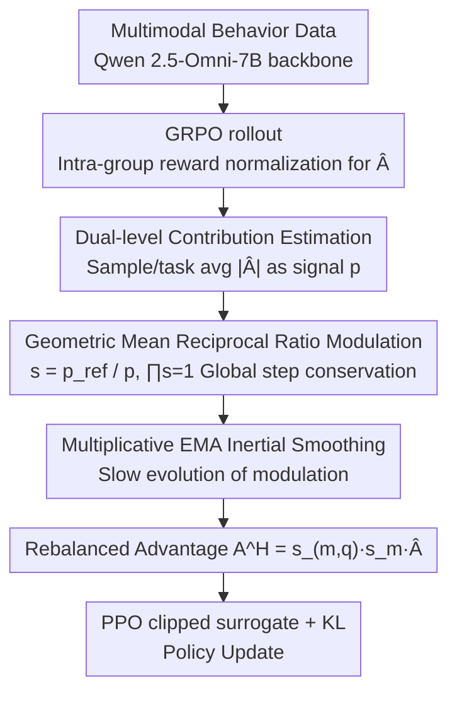

# OmniSapiens: A Foundation Model for Social Behavior Processing via Heterogeneity-Aware Relative Policy Optimization

**Conference**: ICML 2026  
**arXiv**: [2602.10635](https://arxiv.org/abs/2602.10635)  
**Code**: https://github.com/MIT-MI/human_behavior_atlas  
**Area**: Human Understanding / Social Behavior Analysis / Multimodal Foundation Models / Reasoning-based Reinforcement Learning  
**Keywords**: Social Intelligence, Behavior Foundation Model, Heterogeneous RL, GRPO Improvement, Advantage Reweighting

## TL;DR
To address the issue where reasoning-based RL signals in GRPO-like frameworks are dominated by a few tasks due to the inherent heterogeneity of social behavior data (10 tasks across emotion/cognition/pathology/social cues, with modalities spanning speech/vision/text), this paper proposes HARPO. HARPO approximates the contribution of each sample and task to policy updates using advantage magnitudes, derives structured modulation factors via a "geometric mean reference + reciprocal ratio" approach, and incorporates inertial smoothing. Trained on Qwen 2.5-Omni-7B, OmniSapiens-7B 2.0 ranks 1st on average across multiple tasks, wins all 5 zero-shot tasks, improves reasoning consistency from 66.5% to 87.7%, and compresses reasoning length to 19.86 tokens.

## Background & Motivation

**Background**: Socially intelligent AI must simultaneously interpret emotions, psychological states, and social signals while generalizing to new scenarios. Existing approaches are either single-task experts (e.g., separate models for emotion classification and depression detection) or recent unified behavior foundation models (OmniSapiens series, HumanOmniV2) employing SFT or GRPO for multi-task RL.

**Limitations of Prior Work**: The authors observe that behavior data is naturally heterogeneous—reward distribution scales for SEN (sentence-level sentiment) and PTSD (long video-based pathology) differ by orders of magnitude, and their modal compositions vary significantly (text vs. audio+video+text). Directly applying GRPO causes a few tasks or samples with systematically larger advantage magnitudes to dominate the policy gradient, leading tasks like SAR and SEN to experience F1 drops from 70+ to single digits (e.g., SAR=5.01 for RE++ and HUM=27.56 for GRPO in Table 1).

**Key Challenge**: While GRPO performs intra-group reward normalization, it lacks **scale constraints across groups and tasks**. Equation (4) simply sums gradients from all rollouts, allowing rollouts with large absolute advantage values to dictate the update. When tasks are inherently heterogeneous, this aggregation degenerates into a "winner-takes-all" failure mode in multi-task learning.

**Goal**: To introduce an **explicit heterogeneity-aware mechanism** within a critic-free reasoning RL framework that automatically balances sample-level and task-level update influences without disrupting the overall GRPO training paradigm or global step size.

**Key Insight**: The authors note a simple fact: according to Equation (5), the contribution of each rollout to the policy gradient is proportional to its absolute advantage $|\hat{A}|$. Thus, **advantage magnitude itself serves as a computable proxy for "the actual contribution of a sample/task to the update."** This can be used for inverse weighting without training a critic or auxiliary networks.

**Core Idea**: Use the "reciprocal ratio relative to a geometric mean reference" as a modulation factor for GRPO advantages. This scales down contributions from dominant rollouts and scales up those from minor ones. The property that the product of geometric mean ratios is naturally 1 ensures that the global step size remains invariant.

## Method

### Overall Architecture
OmniSapiens-7B 2.0 addresses the imbalance in multi-task social behavior RL where dominant tasks/samples overwhelm the gradient. Using Qwen 2.5-Omni-7B as the multimodal backbone, it processes behavior data (Human Behavior Atlas with 10 tasks and 100k+ samples including SEN/EMO/SOC/INT/NVC/HUM/SAR/ANX/DEP/PTSD) to output autoregressive sequences of "reasoning chains + prediction labels/answers." Training utilizes HARPO (Heterogeneity-Aware Relative Policy Optimization), which retains the PPO clipped surrogate and KL regularization of GRPO. The primary modification is a "modulator" attached outside the actor: it estimates the update contribution of each sample/task online at training step $t$ and scales the group-normalized advantage $\hat{A}_{(m,q,i)}$ into a rebalanced $A^H_{(m,q,i)}$. Rewards comprise three components: task reward $r_{task}$ (binary classification, cosine similarity for QA), format reward $r_{fmt}$ (weight 0.2), and length penalty $r_{len}$ (coefficient 0.75). The modulator performs three sequential operations: dual-level contribution estimation, geometric mean reciprocal ratio modulation, and multiplicative EMA inertial smoothing.

### Key Designs

**1. Dual-level Contribution Estimation: Advantage Magnitude as a Zero-cost Proxy**

Since heterogeneity stems from dominant influences, the first step is quantifying "influence" as a scalar. HARPO avoids training a critic or calculating full gradients. Instead, leveraging the fact that each rollout's contribution to the gradient is proportional to $|\hat{A}|$, it uses the absolute value of the group-normalized advantage as the contribution signal. This requires no extra training or forward passes and is mathematically coupled with the policy gradient. Specifically: sample-level signals $p^{(t)}_{(m,q)}$ are the mean absolute advantage within a rollout group $G(m,q)$, and task-level signals $p^{(t)}_m$ are the mean absolute advantage across all rollouts for task $m$ in the batch. 

**2. Geometric Mean Reciprocal Ratio Modulation: Local Reweighting with Global Step Conservation**

To rebalance without disrupting the global update scale, HARPO defines modulation factors based on reciprocal ratios. For samples, the reference $\bar{p}^{(t)}_{ref,m}$ is the geometric mean of signals within task $m$; for tasks, the reference $\bar{p}^{(t)}_{ref,M}$ is the geometric mean across all tasks. The modulation factors are $s^{(t)}_{(m,q)} = \bar{p}^{(t)}_{ref,m}/p^{(t)}_{(m,q)}$ and $s^{(t)}_m = \bar{p}^{(t)}_{ref,M}/p^{(t)}_m$. The final advantage is $A^H_{(m,q,i)} = s^{(t)}_{(m,q)} \cdot s^{(t)}_m \cdot \hat{A}^{(t)}_{(m,q,i)}$. Using geometric means (rather than arithmetic) handles multi-task scales that often span orders of magnitude and guarantees that $\prod s = 1$. This mathematical property ensures that local scaling factors cancel out globally, keeping the total update step size constant and avoiding the need for learning rate retuning.

**3. Inertial Smoothing: Multiplicative EMA for Evolutionary Modulation**

Modulation factors are "weights for update weights." If they fluctuate wildly with on-policy noise, they re-inject high variance into the gradients. HARPO ensures the modulation evolves more slowly than policy parameters. Contribution signals use standard EMA: $\bar{p}^{(t)} = \beta_\rho \bar{p}^{(t-1)} + (1-\beta_\rho) p^{(t)}$. Since modulation factors are multiplicative ratios, they employ multiplicative EMA: $s^{(t)} = (s^{(t-1)})^{\beta_s}(s)^{1-\beta_s}$. This tracks persistent trends while remaining immune to single-step perturbations and preserving the "product = 1" invariant.

### Loss & Training
The HARPO objective is isomorphic to GRPO, replacing the clipped surrogate's $\hat{A}$ with the modulated $\tilde{A}^H_{(m,q,i):k}(\theta)$:  
$$J_{HARPO}(\theta) = \mathbb{E}\big[\frac{1}{|G|}\sum_i \frac{1}{n_o}\sum_k \tilde{A}^H_{(m,q,i):k}(\theta)\big] - \beta \mathbb{E}[D_{KL}(\pi_\theta \| \pi_{ref})]$$  
Training uses the Human Behavior Atlas (Ong et al., 2026) multimodal RL dataset covering 10 tasks. The base model is Qwen 2.5-Omni-7B with a unified reward design. All baseline RL algorithms are evaluated on the same data and base model for fairness.

## Key Experimental Results

### Main Results: 10-Task Multi-task Performance (Selected from Tab. 1)

| Model / Algorithm | EMO | HUM | SAR | INT | DEP | Avg. Rank ↓ |
|------|------|------|------|------|------|------|
| Qwen 2.5-Omni-7B (base) | 58.25 | 54.30 | 65.60 | 25.40 | 71.35 | 6.20 |
| HumanOmniV2-7B | 59.70 | 63.80 | 39.50 | 26.30 | 65.40 | 5.80 |
| OmniSapiens BAM | 64.53 | 64.40 | 79.50 | 17.70 | 78.85 | 3.30 |
| OmniSapiens-7B RL (GRPO) | 57.28 | 63.90 | 64.70 | 48.60 | 77.15 | 4.20 |
| **OmniSapiens-7B 2.0 (HARPO)** | **76.55** | **69.85** | 70.64 | **50.52** | **78.87** | **1.90** |

At the model level, OmniSapiens 2.0 achieves top-2 on 8 out of 10 tasks with an average rank of 1.90.

| RL Algorithm (Same Base/Data) | HUM | SAR | SEN | INT | Avg. Rank ↓ |
|------|------|------|------|------|------|
| GRPO | 27.56 | 53.58 | 77.51 | 49.90 | 3.90 |
| RE++ | 60.26 | 50.21 | 56.52 | 5.01 | 4.50 |
| RLOO | 67.86 | 62.58 | 76.86 | 51.73 | 2.80 |
| GPG | 69.28 | 45.96 | 75.77 | 54.21 | 2.90 |
| EMAGRPO | 63.50 | 77.75 | 68.28 | 52.62 | 3.10 |
| **HARPO** | **69.85** | 70.64 | 77.61 | 50.52 | **2.10** |

Algorithmically, GRPO collapses on HUM (27.56), and RE++ collapses on SAR/INT (5.01). HARPO is the only algorithm that avoids performance collapse across all tasks, showing a maximum relative improvement of +42.29% over GRPO.

### Ablation Study: Zero-Shot Generalization (Tab. 2) and Reasoning Quality (Tab. 3)

| Model | AUT | SER | IDR | SMSA | SIR | Consistency ↑ | Avg. Tokens ↓ |
|------|------|------|------|------|------|------|------|
| Qwen 2.5-Omni-7B | 25.68 | 53.53 | 70.25 | 44.64 | 34.99 | 34.0 | 73.66 |
| HumanOmniV2 | 38.05 | 62.74 | 21.97 | 53.06 | 37.45 | 50.0 | 195.90 |
| OmniSapiens-7B RL | 30.46 | 55.77 | 69.29 | 55.03 | 66.53 | 55.1 | 57.69 |
| **OmniSapiens 2.0** | **39.91** | **72.11** | **72.43** | **58.47** | **69.27** | **87.7** | **19.86** |

The model wins all 5 held-out tasks, reasoning consistency jumps to 87.7%, and average tokens are reduced to 19.86 (less than 35% of the next best RL version).

### Key Findings
- The success of HARPO lies in its stability rather than just higher averages; while GRPO/RE++/GPG collapse on certain tasks, HARPO remains competitive across all 10, validating the importance of heterogeneity-aware modulation.
- Balanced multi-task training enhances zero-shot transfer: OmniSapiens 2.0 outperforms OmniSapiens RL on all 5 held-out tasks using identical data, suggesting that more uniform multi-task learning promotes more transferable behavior representations.
- Reasoning becomes shorter yet more accurate: HARPO enables the model to learn reasoning chains that average only 19.86 tokens while achieving the highest consistency. Human evaluation shows win rates of 68.5%/85.1%/99.2% in specificity/coherence/concision, indicating that advantage rebalancing suppresses verbose but hollow reasoning patterns.

## Highlights & Insights
- **Advantage magnitude as a contribution signal**: This is an elegant idea requiring no critic, no gradient estimation, and no extra forward passes. It is a zero-cost proxy derived directly from the relationship between advantages and policy gradients.
- **Global step conservation via geometric mean**: The combination of geometric mean references and reciprocal ratios ensures $\prod s = 1$. This allows local reweighting without contaminating the global learning rate, avoiding the classic multi-task reweighting pitfall where "weight tuning requires LR retuning."
- **High transferability to GRPO variants**: HARPO can be integrated into any GRPO-based RL training where data is heterogeneous across tasks, domains, or difficulty levels (e.g., mixing math+code, multilingual, or multimodal tasks). It is orthogonal to RLOO/REINFORCE++/GPG and likely to become a standard module for reasoning RL.

## Limitations & Future Work
- The causal link between HARPO and improved zero-shot generalization is an empirical observation lacking rigorous theoretical or controlled analysis; "more balanced → more transferable" currently remains a correlation.
- The use of absolute advantage magnitude makes the method sensitive to reward design. If rewards are highly noisy or consistently tiny for a specific task, the geometric mean reference might become unstable (smooth $\epsilon$ is used but its failure boundaries are not explored).
- Experiments are restricted to a 7B model and one behavior dataset. Scaling behavior on larger models (70B+) or different reasoning data (math/code) remains unverified, especially the stability of geometric means when the number of tasks $|M|$ is very large.
- Future Work: Extending dual-level modulation to "difficulty levels" (binning by reward variance) or "prompt levels" for finer-grained heterogeneity awareness. Another direction involves upgrading signals from "magnitude" to "gradient norms" or "Fisher Information."

## Related Work & Insights
- **vs. GRPO (Shao et al., 2024)**: GRPO only performs intra-group reward normalization. HARPO adds a layer of heterogeneity-aware advantage modulation without modifying the PPO objective, representing a minimally invasive extension.
- **vs. EMAGRPO (Feng et al., 2025)**: While EMAGRPO uses EMA for multi-task balancing at the reward or loss level, HARPO operates directly on advantages and introduces "global step conservation" through geometric mean constraints, avoiding step-size drift common in EMA methods.
- **vs. Classic Multi-task RL**: Methods like gradient balancing (Yu et al. 2020) or uncertainty weighting (Kendall et al. 2018) rely on gradient estimation or extra weights. HARPO follows a "zero extra parameters, zero extra forward passes" route, fitting the simplicity of critic-free reasoning RL.
- **vs. HumanOmniV2 / OmniSapiens RL**: Given the same backbone and data, the gap between OmniSapiens 2.0 and its predecessors suggests that in unified behavior models, the **bottleneck of RL training paradigms currently outweighs the bottleneck of backbone or data scale**.

## Rating
- Novelty: ⭐⭐⭐⭐ Advancing heterogeneous RL using "advantage magnitude as contribution" and "geometric mean reciprocal ratios" is a clean and effective combination.
- Experimental Thoroughness: ⭐⭐⭐⭐⭐ Rigorous comparison of 6 RL algorithms on the same base/data/reward, covering 10 training tasks, 5 held-out tasks, consistency, and human evaluation.
- Writing Quality: ⭐⭐⭐⭐ Clear mathematical derivation and explanation of global step conservation, though sensitivity analysis of hyperparameters ($\beta_s, \beta_\rho$) is brief.
- Value: ⭐⭐⭐⭐⭐ Provides a reusable behavior foundation model and a plug-and-play heterogeneity-aware module for all GRPO-based reasoning RL.

<!-- RELATED:START -->

## Related Papers

- [\[ICLR 2026\] Behavior Learning (BL): Learning Hierarchical Optimization Structures from Data](../../ICLR2026/interpretability/behavior_learning_bl_learning_hierarchical_optimization_structures_from_data.md)
- [\[ACL 2026\] Dual Alignment Between Language Model Layers and Human Sentence Processing](../../ACL2026/interpretability/dual_alignment_between_language_model_layers_and_human_sentence_processing.md)
- [\[ICML 2026\] Discovering Differences in Strategic Behavior Between Humans and LLMs](discovering_differences_in_strategic_behavior_between_humans_and_llms.md)
- [\[ICML 2026\] Is One Layer Enough? Understanding Inference Dynamics in Tabular Foundation Models](is_one_layer_enough_understanding_inference_dynamics_in_tabular_foundation_model.md)
- [\[ICML 2026\] Courtroom Analogy: New Perspective on Uncertainty-Aware Classification](courtroom_analogy_new_perspective_on_uncertainty-aware_classification.md)

<!-- RELATED:END -->
