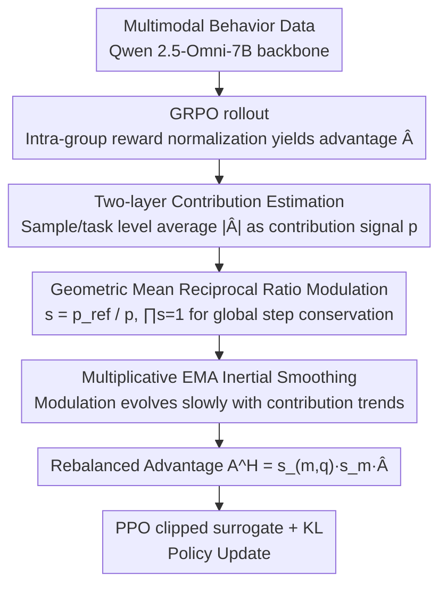

# OmniSapiens: A Foundation Model for Social Behavior Processing via Heterogeneity-Aware Relative Policy Optimization

**Conference**: ICML 2026  
**arXiv**: [2602.10635](https://arxiv.org/abs/2602.10635)  
**Code**: https://github.com/MIT-MI/human_behavior_atlas  
**Area**: Human Understanding / Social Behavior Analysis / Multimodal Foundation Models / Reasoning Reinforcement Learning  
**Keywords**: Social Intelligence, Behavior Foundation Model, Heterogeneous RL, GRPO Improvement, Advantage Reweighting

## TL;DR
Addressing the issue where GRPO-style reasoning RL is dominated by a few tasks due to the inherent heterogeneity of social behavior data (10 tasks across emotion/cognition/pathology/socializing, spanning speech/vision/text modalities), this paper proposes HARPO. By approximating the contribution of each sample and task to policy updates using advantage magnitudes, HARPO derives structured modulation factors via "geometric mean reference + reciprocal ratio" combined with inertial smoothing. Trained on Qwen 2.5-Omni-7B, OmniSapiens-7B 2.0 achieves the top average rank across multiple tasks, wins all 5 zero-shot tasks, improves reasoning consistency from 66.5% to 87.7%, and compresses token count to 19.86.

## Background & Motivation

**Background**: Socially intelligent AI must simultaneously interpret emotions, psychological states, and social signals while transferring to new scenarios. Existing approaches either utilize task-specific experts (e.g., separate models for emotion classification and depression detection) or recent unified behavior foundation models (OmniSapiens series, HumanOmniV2) using SFT or GRPO for multi-task RL.

**Limitations of Prior Work**: The authors observe that behavior data is naturally heterogeneous—reward distribution scales for SEN (sentence-level sentiment) and PTSD (long-video pathological states) differ by orders of magnitude, and their modal compositions differ (text vs. audio+video+text). Applying standard GRPO causes a few tasks/samples with systematically larger advantage magnitudes to dominate the policy gradient, leading F1 scores for tasks like SAR and SEN to drop from 70+ to single digits (e.g., SAR=5.01 in RE++, HUM=27.56 in GRPO in Table 1).

**Key Challenge**: While GRPO performs intra-group reward normalization, **no scale constraints exist across groups or tasks**. Equation (4) directly sums gradients from all rollouts, meaning whoever has the largest absolute advantage dominates the update. When tasks are inherently heterogeneous, this aggregation degenerates into a "winner-take-all" multi-task learning failure mode.

**Goal**: To introduce an **explicit heterogeneity-aware mechanism** within a critic-free reasoning RL framework, ensuring that both sample-level and task-level update impacts are automatically balanced without disrupting the overall GRPO training paradigm or global step size.

**Key Insight**: The authors note a simple fact: according to Equation (5), the contribution of each rollout to the policy gradient is proportional to its absolute advantage $|\hat{A}|$. Thus, **advantage magnitude itself serves as a computable proxy for "the actual contribution of the sample/task to the update"**, allowing for inverse weighting without training an additional critic or auxiliary network.

**Core Idea**: Use the "reciprocal ratio under a geometric mean reference" as a modulation factor to multiply the GRPO advantages. This scales down advantages of high-contribution rollouts and scales up low-contribution ones. The property that the product of ratios relative to their geometric mean is 1 ensures the global step size remains unchanged.

## Method

### Overall Architecture
OmniSapiens-7B 2.0 addresses the imbalance in multi-task social behavior RL where specific tasks/samples dominate the policy gradient due to large advantage magnitudes. Using Qwen 2.5-Omni-7B as the multimodal backbone, it processes mixed behavioral data (text/images/video/audio from 10 tasks in the Human Behavior Atlas, 100k+ samples including SEN/EMO/SOC/INT/NVC/HUM/SAR/ANX/DEP/PTSD) and outputs autoregressive sequences of "reasoning chain + predicted label/answer". Training utilizes HARPO (Heterogeneity-Aware Relative Policy Optimization), which maintains the PPO clipped surrogate + KL regularization of GRPO but adds a "modulator" outside the actor. This modulator estimates the update contribution of each sample/task online at each training step $t$, converts contributions into modulation factors, and replaces the dominant $\hat{A}_{(m,q,i)}$ with rebalanced $A^H_{(m,q,i)}$. Rewards are weighted across three parts: task reward $r_{task}$ (binary classification, QA cosine), format reward $r_{fmt}$ (weight 0.2), and length penalty $r_{len}$ (coefficient 0.75). The modulator performs three sequential operations: two-layer contribution estimation, geometric mean reciprocal ratio modulation, and multiplicative EMA inertial smoothing.

### Key Designs

**1. Two-layer Contribution Estimation: Using "Advantage Magnitude" as a Zero-cost Contribution Proxy**

The root of the heterogeneity problem is "influence translates to dominance." Therefore, a scalar to quantify "influence" is required. Instead of training a critic or estimating gradients, HARPO leverages the fact from Equations (4)-(5) that the contribution of each rollout to the policy gradient is proportional to the absolute value of its advantage $|\hat{A}|$. Thus, the absolute value of group-normalized advantages is used directly as the contribution signal, requiring no extra training or forward passes. Specifically: sample-level signals take the mean absolute advantage within a rollout group $G(m,q)$ as $p^{(t)}_{(m,q)} = \frac{1}{|G(m,q)|}\sum_i |\hat{A}^{(t)}_{(m,q,i)}|$, and task-level signals take the mean absolute advantage of all rollouts in the current batch for that task $p^{(t)}_m$. 

**2. Reciprocal Ratio Modulation under Geometric Mean Reference: Local Reweighting with Global Step Conservation**

Contribution signals are converted into modulation factors that "suppress the strong and boost the weak." HARPO takes the geometric mean of all sample signals within a task $\bar{p}^{(t)}_{ref,m}$ as a reference for the sample layer, and the geometric mean of all task signals $\bar{p}^{(t)}_{ref,M}$ as a reference for the task layer. Modulation factors are defined as the reciprocal ratio of the reference to the signal: $s^{(t)}_{(m,q)} = \bar{p}^{(t)}_{ref,m}/p^{(t)}_{(m,q)}$ and $s^{(t)} = \bar{p}^{(t)}_{ref,M}/p^{(t)}_m$. The final advantage is $A^H_{(m,q,i)} = s^{(t)}_{(m,q)} \cdot s^{(t)}_m \cdot \hat{A}^{(t)}_{(m,q,i)}$. Geometric means are preferred because: (1) contribution signals often vary by orders of magnitude across tasks, and geometric averaging handles heavy-tailed distributions gracefully; (2) the geometric mean naturally ensures the product of all modulation factors is 1 ($\prod_q s^{(t)}_{(m,q)} = 1$), meaning multiplicative contributions cancel out, keeping the overall update step size constant.

**3. Inertia Smoothing: Multiplicative EMA for Slow Evolution of Modulation**

As modulation factors are "weights for update weights," high variance from on-policy noise could degrade learning. HARPO ensures the modulation mechanism evolves at a slower scale than policy parameters. Contribution signals use standard EMA smoothing: $\bar{p}^{(t)} = \beta_\rho \bar{p}^{(t-1)} + (1-\beta_\rho) p^{(t)}$. Modulation factors, being multiplicative ratios, use multiplicative EMA: $s^{(t)} = (s^{(t-1)})^{\beta_s}(s)^{1-\beta_s}$. This ensures modulation tracks persistent trends while remaining immune to single-step perturbations, maintaining the "geometric mean = 1" invariant.

### Loss & Training
The HARPO objective function is isomorphic to GRPO, replacing $\hat{A}$ with the modulated $\tilde{A}^H_{(m,q,i):k}(\theta)$:
$$J_{HARPO}(\theta) = \mathbb{E}\big[\frac{1}{|G|}\sum_i \frac{1}{n_o}\sum_k \tilde{A}^H_{(m,q,i):k}(\theta)\big] - \beta \mathbb{E}[D_{KL}(\pi_\theta \| \pi_{ref})]$$
Training uses the Human Behavior Atlas (Ong et al., 2026) multimodal RL dataset covering 10 tasks, with Qwen 2.5-Omni-7B as the base and a unified reward design.

## Key Experimental Results

### Main Results: Performance on 10 Tasks (Selected from Tab. 1)

| Model / Algorithm | EMO | HUM | SAR | INT | DEP | Avg Rank ↓ |
|------|------|------|------|------|------|------|
| Qwen 2.5-Omni-7B (base) | 58.25 | 54.30 | 65.60 | 25.40 | 71.35 | 6.20 |
| HumanOmniV2-7B | 59.70 | 63.80 | 39.50 | 26.30 | 65.40 | 5.80 |
| OmniSapiens BAM | 64.53 | 64.40 | 79.50 | 17.70 | 78.85 | 3.30 |
| OmniSapiens-7B RL (GRPO) | 57.28 | 63.90 | 64.70 | 48.60 | 77.15 | 4.20 |
| **OmniSapiens-7B 2.0 (HARPO)** | **76.55** | **69.85** | 70.64 | **50.52** | **78.87** | **1.90** |

Model Level: Top-2 in 8 out of 10 tasks, with an average rank of 1.90, the best among all baselines.

| RL Algorithm (Same Base/Data) | HUM | SAR | SEN | INT | Avg Rank ↓ |
|------|------|------|------|------|------|
| GRPO | 27.56 | 53.58 | 77.51 | 49.90 | 3.90 |
| RE++ | 60.26 | 50.21 | 56.52 | 5.01 | 4.50 |
| RLOO | 67.86 | 62.58 | 76.86 | 51.73 | 2.80 |
| GPG | 69.28 | 45.96 | 75.77 | 54.21 | 2.90 |
| EMAGRPO | 63.50 | 77.75 | 68.28 | 52.62 | 3.10 |
| **HARPO** | **69.85** | 70.64 | 77.61 | 50.52 | **2.10** |

Algorithm Level: GRPO collapsed on HUM (27.56) and RE++ collapsed on SAR/INT (5.01). HARPO is the only algorithm that avoided collapse across all 10 tasks, with a maximum gain of +42.29% over GRPO.

### Zero-shot Generalization (Tab. 2) and Reasoning Quality (Tab. 3)

| Model | AUT | SER | IDR | SMSA | SIR | Consistency ↑ | Avg Tokens ↓ |
|------|------|------|------|------|------|------|------|
| Qwen 2.5-Omni-7B | 25.68 | 53.53 | 70.25 | 44.64 | 34.99 | 34.0 | 73.66 |
| HumanOmniV2 | 38.05 | 62.74 | 21.97 | 53.06 | 37.45 | 50.0 | 195.90 |
| OmniSapiens-7B RL | 30.46 | 55.77 | 69.29 | 55.03 | 66.53 | 55.1 | 57.69 |
| **OmniSapiens 2.0** | **39.91** | **72.11** | **72.43** | **58.47** | **69.27** | **87.7** | **19.86** |

Ours won all 5 held-out tasks, while reasoning consistency jumped from 66.5% to 87.7% and average token count was compressed to 19.86 (less than 35% of the next best, OmniSapiens-7B RL).

### Key Findings
- The success of HARPO lies not just in "higher averages" but in a "stable floor"—while GRPO/RE++/GPG collapse to single-digit F1 on certain tasks, HARPO remains competitive across all 10, validating the role of heterogeneity-aware modulation in multi-task RL balance.
- Balanced multi-task training enhances zero-shot transfer: OmniSapiens 2.0 and OmniSapiens RL use the same data/backbone, but switching to HARPO improved all 5 held-out tasks, suggesting more uniform multi-task learning may foster more transferable behavioral representations.
- Reasoning becomes shorter yet more accurate: HARPO enables reasoning chains averaging only 19.86 tokens with the highest consistency (87.7%). Human evaluation shows an average win rate of 68.5%/85.1%/99.2% in specificity/coherence/concision vs. 4 baselines, indicating advantage rebalancing suppresses the "long but vacuous reasoning" degradation.

## Highlights & Insights
- Using "advantage magnitude as a contribution signal" is elegant: it requires no critic, no gradient estimation, and no extra forward passes, derived directly from the relationship with policy gradients.
- The combination of geometric mean reference + reciprocal ratio + multiplicative EMA ensures "global step size conservation." The $\prod s = 1$ invariant allows local reweighting without contaminating the global learning rate.
- This method is **directly transferable to any GRPO-based RL training** where data heterogeneity exists (e.g., mixed math+code+chat, multilingual, or multimodal training). HARPO can serve as a plug-and-play module compatible with RLOO/REINFORCE++/GPG.

## Limitations & Future Work
- The causal link between HARPO and zero-shot improvement remains an empirical observation lacking rigorous theoretical analysis.
- Dependence on reward design: if rewards are highly noisy or systematically small for a task, the geometric mean reference may become unstable.
- Scale behavior (70B+ models) and performance on different RL data (math/code reasoning) have not yet been verified.
- Future work: Extending modulation to a "difficulty layer" or "prompt layer" for finer-grained awareness, or upgrading contribution signals from "magnitude" to "gradient norms."

## Related Work & Insights
- **vs GRPO (Shao et al., 2024)**: GRPO only uses intra-group normalization. HARPO adds a layer of heterogeneity-aware advantage modulation without changing the PPO objective.
- **vs EMAGRPO (Feng et al., 2025)**: EMAGRPO uses EMA for multi-task balancing at the reward/loss level. HARPO acts directly on the advantage layer with structured constraints to prevent step size drift.
- **vs Classic Multi-task RL**: Unlike methods relying on gradient balancing or uncertainty weighting that require extra parameters or backprop, HARPO follows a lightweight "zero extra parameters" approach.
- **vs HumanOmniV2 / OmniSapiens RL**: Given the same backbone and data, the performance leap of OmniSapiens 2.0 suggests that the **RL training paradigm is a more significant bottleneck than backbone or data size** in unified behavior modeling.

## Rating
- Novelty: ⭐⭐⭐⭐ Using advantage magnitude for heterogeneity modulation is a clean and effective combination.
- Experimental Thoroughness: ⭐⭐⭐⭐⭐ Comprehensive comparisons across 6 RL algorithms, 10 training tasks, 5 held-out tasks, consistency, and human eval.
- Writing Quality: ⭐⭐⭐⭐ Clear mathematical derivation, though sensitivity analysis of hyperparameters ($\beta_s, \beta_\rho$) is limited.
- Value: ⭐⭐⭐⭐⭐ Provides both a state-of-the-art social behavior model and a plug-and-play module for heterogeneous reasoning RL.

<!-- RELATED:START -->

## Related Papers

- [\[ICML 2026\] ExPLAIND: Unifying Model, Data, and Training Attribution to Study Model Behavior](explaind_unifying_model_data_and_training_attribution_to_study_model_behavior.md)
- [\[ACL 2026\] Dual Alignment Between Language Model Layers and Human Sentence Processing](../../ACL2026/interpretability/dual_alignment_between_language_model_layers_and_human_sentence_processing.md)
- [\[ICML 2026\] Is One Layer Enough? Understanding Inference Dynamics in Tabular Foundation Models](is_one_layer_enough_understanding_inference_dynamics_in_tabular_foundation_model.md)
- [\[ICML 2026\] Discovering Differences in Strategic Behavior Between Humans and LLMs](discovering_differences_in_strategic_behavior_between_humans_and_llms.md)
- [\[ICML 2026\] Courtroom Analogy: New Perspective on Uncertainty-Aware Classification](courtroom_analogy_new_perspective_on_uncertainty-aware_classification.md)

<!-- RELATED:END -->
## Related Papers

- [\[ICLR 2026\] Behavior Learning (BL): Learning Hierarchical Optimization Structures from Data](../../ICLR2026/interpretability/behavior_learning_bl_learning_hierarchical_optimization_structures_from_data.md)
- [\[ICML 2026\] ExPLAIND: Unifying Model, Data, and Training Attribution to Study Model Behavior](explaind_unifying_model_data_and_training_attribution_to_study_model_behavior.md)
- [\[ACL 2026\] Dual Alignment Between Language Model Layers and Human Sentence Processing](../../ACL2026/interpretability/dual_alignment_between_language_model_layers_and_human_sentence_processing.md)
- [\[ICML 2026\] Is One Layer Enough? Understanding Inference Dynamics in Tabular Foundation Models](is_one_layer_enough_understanding_inference_dynamics_in_tabular_foundation_model.md)
- [\[ICML 2026\] Courtroom Analogy: New Perspective on Uncertainty-Aware Classification](courtroom_analogy_new_perspective_on_uncertainty-aware_classification.md)

<!-- RELATED:END -->
