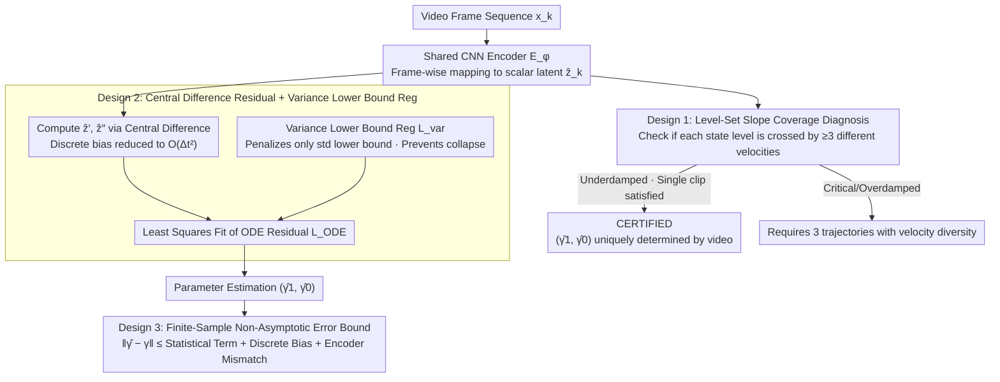

# Physics from Video: Identifiability of Time-Invariant Second-Order ODEs under Minimal Trajectory Conditions

**Conference**: ICML 2026  
**arXiv**: [2606.00115](https://arxiv.org/abs/2606.00115)  
**Code**: https://github.com/wenjiewang3/PhysicsFromVideo (Available)  
**Area**: Physical Parameter Identification from Video / Causal Representation Learning / Scientific Machine Learning  
**Keywords**: Structural Identifiability, Second-Order ODE, Decoder-Free, Level-Set Slope Coverage, Variance Lower Bound Regularization  

## TL;DR
This paper provides the first structural identifiability theorem for identifying second-order linear ODE parameters $(\gamma_1,\gamma_0)$ from raw video using only an encoder (without a decoder/pixel reconstruction). It characterizes the boundary between "single trajectory sufficiency vs. three trajectories necessity" via a geometric condition called **level-set slope coverage**. It proves that underdamped systems are identifiable from a single video, while other regimes require three distinct trajectories, and proposes a finite-sample estimator using "variance lower bound regularization + central difference."

## Background & Motivation
**Background**: Current video world models (such as Sora or Physics IQ benchmarks) pursue pixel-level realism. However, benchmarks like Physics-IQ demonstrate that they can produce "physically wrong" videos that are "visually plausible," revealing a decoupling between visual realism and physical correctness. Treating cameras as low-cost non-contact sensors to invert physical parameters (e.g., spring constants, damping ratios, pendulum length) from video serves as a complementary research path.

**Limitations of Prior Work**: Mainstream methods fall into two categories: (1) autoencoder + differentiable simulation, learning dynamics via pixel reconstruction loss; (2) strictly decoder-free, applying physical constraints in the latent space (e.g., LPFV, Garcia 2025). The first category suffers from parameter non-uniqueness: a sufficiently strong decoder can fit low pixel loss using incorrect physical parameters combined with compensatory appearance textures. The second category removes the decoder but introduces a deeper issue: the latent coordinate system is only defined up to an **arbitrary $C^2$ reparameterization** $f$. Even if the ODE residual is reduced to zero, the recovered $(\hat\gamma_1,\hat\gamma_0)$ may not equal the true values.

**Key Challenge**: Encoder-only settings lack theoretical guarantees specifying what conditions allow the data itself to "pin down" the latent coordinate system as an affine function of the true physical state. Without this, decoder-free methods lack a foundation for identifiability.

**Goal**: For the cleanest non-trivial model—homogeneous second-order linear time-invariant ODEs $z''(t)+\gamma_1 z'(t)+\gamma_0 z(t)=0$—Ours aims to answer three questions: (i) When is a single video clip sufficient to uniquely recover $(\gamma_1,\gamma_0)$; (ii) When are multiple trajectories necessary; (iii) What is the non-asymptotic upper bound for estimation error in discrete noisy scenarios.

**Key Insight**: The authors observe that structural identifiability ultimately reduces to whether the latent reparameterization $f$ is forced to be an affine function. For $f$ to be affine, the trajectory must **repeatedly pass through the same physical state value but with different instantaneous velocities**—a purely geometric/dynamical condition verifiable from raw trajectories.

**Core Idea**: Translate the concept of "pinning the latent space" into "level-set slope coverage" of the trajectory. If every state level $u$ is passed with at least 3 distinct instantaneous velocities $z'$, any $C^2$ reparameterization $f$ that satisfies both sets of second-order ODEs must be affine, ensuring $(\hat\gamma_1,\hat\gamma_0)$ equals $(\gamma_1,\gamma_0)$.

## Method

### Overall Architecture
The entire pipeline is encoder-only. The core question is determining the conditions under which data pins the latent coordinate system as an affine function of the true state, guaranteeing unique recovery of $(\hat\gamma_1,\hat\gamma_0)$. At runtime, each frame $\boldsymbol{x}_k$ passes through a shared CNN encoder $E_\phi$ to obtain a scalar latent $\hat{z}_k$. Central differences compute $\hat{z}'_k, \hat{z}''_k$, which are used in a least-squares fit for the ODE residual $r_k = \hat{z}''_k + \gamma_1 \hat{z}'_k + \gamma_0 \hat{z}_k$ to estimate $(\hat\gamma_1,\hat\gamma_0)$, supplemented by a variance lower bound regularization to prevent latent collapse. Parallel to training, a "UNIQUENESS CHECK" diagnostic box determines online whether the current clip satisfies level-set slope coverage, providing a CERTIFIED label. The theoretical coverage condition and the estimation side (discrete difference + variance regularization + error bounds) are two sides of the same framework.

### Key Designs

**1. Level-Set Slope Coverage: Translating Latent Uniqueness into Geometric Conditions**

Decoder-free methods suffer from the fact that the latent coordinate system is only defined up to an arbitrary $C^2$ reparameterization $f$; even with zero ODE residuals, recovered parameters might not be ground truth. Ours breaks this by translating whether "$f$ is forced to be affine" into a geometric condition verifiable on the raw trajectory: a trajectory satisfies coverage on an open interval $U \subset \mathcal{R}_z$ if and only if each state level $u \in U$ is visited at at least three time points $t_1,t_2,t_3$ with distinct instantaneous velocities $z'(t_1), z'(t_2), z'(t_3)$. Theorem 4.2 proves that under the state consistency assumption $\hat{z}(t)=f(z(t))$, if the same $f$ allows both $z$ and $\hat{z}$ to satisfy second-order ODEs, coverage forces $f$ to be affine on $U$, thus $(\eta_1,\eta_0)=(\gamma_1,\gamma_0)$. Intuitively, a second-order ODE is a 2D submanifold in the $(z,z')$ plane; back-inferring an affine map requires a third independent dimension, which velocity diversity provides.

The authors characterize minimal data requirements for different damping regimes: Theorem 4.3 proves that underdamped systems automatically satisfy coverage with a window length $L \geq 2P=4\pi/\sqrt{\gamma_0-\gamma_1^2/4}$. Theorem 4.5 proves that single trajectories in critical, overdamped, or undamped regimes must fail (the former two have at most 2 crossings per level, the latter only $\pm$ velocities). Theorem 4.6 proves that three trajectories with different velocities are sufficient in these cases.

**2. Central Difference Residual + Variance Lower Bound Regularization: Moving from Continuous Theory to Discrete Noisy Video**

Using only $\mathcal{L}_{\mathrm{ODE}}$ leads to a degenerate optimal solution $\hat{z}_k \equiv 0$, and continuous-time residuals must be discretized for video frames. Ours uses central differences $\hat{z}'_k = (\hat{z}_{k+1}-\hat{z}_{k-1})/(2\Delta t)$ and $\hat{z}''_k = (\hat{z}_{k+1}-2\hat{z}_k+\hat{z}_{k-1})/\Delta t^2$ instead of Euler/one-sided differences used in LPFV, reducing the discrete bias from $O(\Delta t)$ to $O(\Delta t^2)$. Second, a variance lower bound regularization is designed: $\mathcal{L}_{\mathrm{var}}=(\max\{0, \tau-\sqrt{\widehat{\mathrm{Var}}(\hat{z})+\varepsilon}\})^2$, which only penalizes the latent standard deviation when it falls below threshold $\tau$, avoiding forced distribution shapes.

KL divergence to $\mathcal{N}(0,1)$ (used in LPFV) is avoided because non-oscillatory trajectories (critical/overdamped) are strongly non-Gaussian and non-stationary; forcing a match to a standard normal distorts the representation. Theoretically, the variance lower limit corresponds to the condition that the minimum eigenvalue of the design matrix $\psi_{\min}>0$ in the finite-sample error bound.

**3. Finite-Sample Non-Asymptotic Error Bound: Decomposing Errors**

To make the conclusions applicable to real-world scenarios with discrete sampling, noise, and non-strictly affine encoders, Theorem 4.8 provides an error bound with $1-\delta$ confidence: $\|\hat\eta-\gamma\|_2 \leq \frac{C_1\sigma}{\psi_{\min}}\sqrt{\log(3/\delta)/(T-1)} + \frac{C_2\sigma^2}{\psi_{\min}} + \frac{C_3\Delta t^2}{\psi_{\min}} + E_{\mathrm{enc}}$. These four terms correspond to: statistical error from sub-Gaussian noise $O(\sqrt{\log/T})$, second-order noise terms, central difference discrete bias $O(\Delta t^2)$, and deterministic mismatch $E_{\mathrm{enc}}$ from the encoder deviating from affine.

### Loss & Training
The total objective is $\mathcal{L}_{\mathrm{total}} = \mathcal{L}_{\mathrm{ODE}} + \lambda_{\mathrm{var}} \mathcal{L}_{\mathrm{var}}$, with defaults $\lambda_{\mathrm{var}}=1.0$, $\tau=1$, and $(\gamma_1,\gamma_0)$ initialized at $(1,1)$. The encoder is a shared per-frame CNN, and results are averaged over 5 random seeds.

## Key Experimental Results

### Main Results
Identification theory was validated on synthetic pendulum videos across 4 damping regimes:

| System / Damping Regime | Ground Truth $(\gamma_0, \gamma_1)$ | Estimate $\hat\gamma_0$ | Estimate $\hat\gamma_1$ | Coverage |
|---|---|---|---|---|
| Pendulum Underdamped | (4.0016, 0.08) | 4.0037±0.0003 | 0.0800±0.0003 | satisfied by single clip (L≥2P) |
| Pendulum Undamped | (4, 0) | 4.0032±0.0010 | 0.0002±0.0004 | identifiable under discretization |
| Pendulum Critical (3 clips coverage+) | (4, 4) | 4.0218±0.0040 | 4.0352±0.0017 | 3 diverse velocity trajectories |
| Pendulum Overdamped (3 clips coverage+) | (4, 5) | 3.9733±0.0033 | 4.9723±0.0010 | 3 diverse velocity trajectories |
| Pendulum Critical (3 clips coverage–) | (4, 4) | 2.3462±0.0437 | 2.7642±0.0787 | Fail, validates Thm 4.6 necessity |
| Intensity Underdamped | (4.0016, 0.08) | 4.007±0.007 | 0.088±0.004 | Holds for non-motion scenes |
| Real Video Pendulum $L^\star=0.9$m | 0.90m | — | RMSE: Ours ≪ PAIG (0.116) | Successfully recovered length |

### Ablation Study

| Reg Method / Regime | $\hat\gamma_0$ (True 4) | $\hat\gamma_1$ (Varies) | Conclusion |
|---|---|---|---|
| No Reg / Underdamped | -0.0004±0.0009 | 0.0425±0.1194 | Collapses to $\hat{z}\equiv 0$ |
| KL-$\mathcal{N}(0,1)$ / Underdamped | 4.0037±0.0009 | 0.0798±0.0003 | Oscillatory regime OK |
| **Var Lower Bound / Underdamped** | **4.0037±0.0003** | **0.0800±0.0003** | Parity with KL |
| KL-$\mathcal{N}(0,1)$ / Critical | 9.2659±1.0532 | 6.2857±0.4848 | **Complete failure** |
| **Var Lower Bound / Critical** | **4.0218±0.0040** | **4.0352±0.0017** | Only method success in non-oscillatory |
| KL-$\mathcal{N}(0,1)$ / Overdamped | 6.8248±0.1909 | 7.3831±0.0906 | Failure |
| **Var Lower Bound / Overdamped** | **3.9733±0.0033** | **4.9723±0.0010** | Accurate |

### Key Findings
- **Alignment of Theory and Empirical Results**: In underdamped systems, the first coverage-positive window appears at $1.1\pi$ (less than the sufficient condition $2\pi$), which coincides perfectly with the inflection point where parameter recovery becomes accurate.
- **Discrete Estimators vs. Continuous Theory**: While the undamped case is structurally unidentifiable in continuous time (Thm 4.5), discrete regression with central differences has a unique zero-loss target (Prop C.1), allowing long clips to achieve approximate recovery in practice.
- **Variance Lower Bound vs. KL**: KL regularization fails in critical/overdamped regimes because non-oscillatory trajectories are inherently non-Gaussian. Variance lower bound only manages scale, aligning with the $\psi_{\min}$ condition in the error bound.
- **Non-motion Scenarios**: In synthetic videos where state controls pixel intensity or radius, underdamped parameters are accurately recovered (4.007±0.007), proving identifiability stems from trajectory geometry rather than visual motion cues.

## Highlights & Insights
- **Identifiability as a Geometric Condition**: Level-set slope coverage is a geometric condition verifiable directly on the raw trajectory, independent of network architecture or gradients. It acts as an online diagnostic box to separate "trustworthiness" from "fitting quality."
- **Physical Intuition of "3 Velocities"**: A second-order ODE is a 2D submanifold in $(z, z')$ space. To back-infer an affine map from the latent space, a third independent dimension is needed, which velocity diversity provides. This intuition can be extended to $n$-th order ODEs requiring $n+1$ independent observations.
- **The Utility of Variance Lower Bound**: Compared to KL, it constrains only one scalar (std) but directly ensures the minimum eigenvalue of the design matrix, unifying "anti-collapse" with "statistical validity" in self-supervised representation learning.

## Limitations & Future Work
- **Limited to Homogeneous 2nd-order Linear ODEs**: While extensions to non-homogeneous terms are discussed, there is no theory yet for non-linear, higher-order ODEs or PDEs.
- **State Consistency Assumption**: Requires a $C^2$ function $f$ such that $\hat{z}(t)=f(z(t))$ strictly holds, essentially excluding scenarios with strongly time-varying lighting or backgrounds.
- **Per-frame Encoder**: Does not utilize temporal structures like optical flow or 3D-conv, making it sensitive to noise.
- **Computability of Coverage Diagnosis**: While coverage can be calculated in synthetic experiments, its practical usability in real-world videos (where ground truth $z(t)$ is unknown) requires further study.

## Related Work & Insights
- **vs. LPFV (Garcia et al. 2025)**: While the architecture is similar, LPFV lacks identifiability theory. Ours provides the theoretical foundation and replaces Euler differences with central differences and KL with variance lower bounds.
- **vs. Reconstruction-driven (e.g., PAIG)**: Their identifiability relies on inductive biases of decoders/renderers, allowing parameters to be compensated by appearance. Ours achieves identifiability through geometric conditions decoupled from appearance.
- **Insight**: Decoupling identifiability as a geometric property of the data trajectory rather than a model property is a paradigm shift that can be transferred to other self-supervised causal representation learning tasks.

## Rating
- Novelty: ⭐⭐⭐⭐⭐ First structural identifiability theorem for encoder-only video physics identification.
- Experimental Thoroughness: ⭐⭐⭐⭐ Extensive damping regimes and synthetic scenarios, though real-world data is limited to pendulums.
- Writing Quality: ⭐⭐⭐⭐⭐ Extremely clear structure bridging theory, discretization, and finite-sample analysis.
- Value: ⭐⭐⭐⭐⭐ Provides the missing theoretical foundation for the decoder-free research line.

<!-- RELATED:START -->

## Related Papers

- [\[AAAI 2026\] PragWorld: A Benchmark Evaluating LLMs' Local World Model under Minimal Linguistic Alterations and Conversational Dynamics](../../AAAI2026/interpretability/pragworld_a_benchmark_evaluating_llms_local_world_model_under_minimal_linguistic.md)
- [\[ICML 2026\] Why Linear Interpretability Works: Invariant Subspaces as a Result of Architectural Constraints](why_linear_interpretability_works_invariant_subspaces_as_a_result_of_architectur.md)
- [\[CVPR 2026\] Back to the Feature: Explaining Video Classifiers with Video Counterfactual Explanations](../../CVPR2026/interpretability/back_to_the_feature_explaining_video_classifiers_with_video_counterfactual_expla.md)
- [\[ICML 2026\] Position: Zeroth-Order Optimization in Deep Learning Is Underexplored, Not Underpowered](position_zeroth-order_optimization_in_deep_learning_is_underexplored_not_underpo.md)
- [\[ICML 2026\] Optimal Attention Temperature Improves the Robustness of In-Context Learning under Distribution Shift in High Dimensions](optimal_attention_temperature_improves_the_robustness_of_in-context_learning_und.md)

<!-- RELATED:END -->
