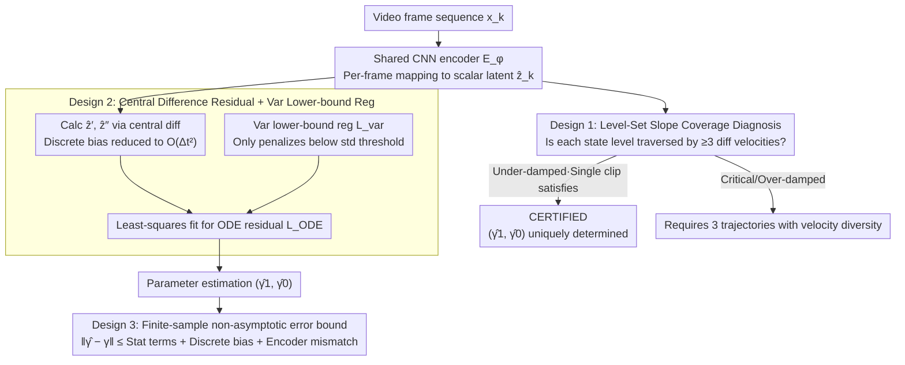

# Physics from Video: Identifiability of Time-Invariant Second-Order ODEs under Minimal Trajectory Conditions

**Conference**: ICML 2026  
**arXiv**: [2606.00115](https://arxiv.org/abs/2606.00115)  
**Code**: https://github.com/wenjiewang3/PhysicsFromVideo (Available)  
**Area**: Physics parameter identification from video / Causal representation learning / Scientific machine learning  
**Keywords**: Structural identifiability, second-order ODE, Decoder-Free, Level-Set Slope Coverage, variance lower-bound regularization  

## TL;DR
This paper provides the first structural identifiability theorem for identifying second-order linear ODE parameters $(\gamma_1, \gamma_0)$ from raw video using only an encoder (no decoder/pixel reconstruction). It uses a geometric condition, **level-set slope coverage**, to characterize the critical threshold between "one trajectory is sufficient" and "three trajectories are necessary." It proves that under-damped systems can be identified from a single video, while other damping regimes require three distinct trajectories, and proposes a finite-sample estimator with "variance lower-bound regularization + central difference."

## Background & Motivation
**Background**: Current video world models (such as Sora-like models or Physics-IQ benchmarks) pursue pixel-level realism. However, evaluations like Physics-IQ demonstrate that they can generate videos that "look right" but are "physically wrong," exposing the decoupling between visual realism and physical correctness. Using cameras as low-cost, non-contact physical sensors to invert physical parameters (spring constants, damping ratios, pendulum lengths) from video has become a complementary research direction.

**Limitations of Prior Work**: Mainstream methods fall into two categories: (1) autoencoder + differentiable simulation, learning dynamics via pixel reconstruction loss; (2) completely decoder-free, imposing physical constraints in the latent space (e.g., LPFV, Garcia 2025). The problem with the first category is that a sufficiently strong decoder can fit low pixel loss using incorrect physical parameters combined with compensatory appearance textures, leading to **parameter non-uniqueness**. The second category removes the decoder but faces a deeper issue: the latent coordinate system is only defined up to an **arbitrary $C^2$ reparameterization** $f$. Even if the ODE residual drops to 0, the recovered $(\hat\gamma_1, \hat\gamma_0)$ may not equal the true values.

**Key Challenge**: Encoder-only settings lack a theoretical guarantee: under what conditions does the data itself "anchor" the latent coordinate system as an affine function of the true physical state? Without this, all decoder-free methods lack a foundation for identifiability.

**Goal**: For the cleanest non-trivial model—homogeneous second-order linear time-invariant ODE $z''(t)+\gamma_1 z'(t)+\gamma_0 z(t)=0$—this paper answers three questions: (i) when a single video clip is sufficient to uniquely recover $(\gamma_1, \gamma_0)$; (ii) when multiple trajectories are necessary; (iii) the non-asymptotic upper bound of estimation error in discrete, noisy scenarios.

**Key Insight**: The authors observe that structural identifiability ultimately reduces to whether the latent reparameterization $f$ is forced to be an affine function. To force $f$ to be affine, the trajectory itself must **repeatedly pass through the same physical state value but with different instantaneous velocities**—this is a purely geometric/dynamical condition verifiable from the raw trajectory.

**Core Idea**: "Whether the latent is anchored" is translated into whether the trajectory satisfies "level-set slope coverage." If each state level $u$ is traversed by at least 3 different instantaneous velocities $z'$, then any $C^2$ reparameterization $f$ satisfying two sets of second-order ODEs must be affine, ensuring $(\hat\gamma_1, \hat\gamma_0)$ equals $(\gamma_1, \gamma_0)$.

## Method

### Overall Architecture
The pipeline is entirely encoder-only. The core question is not "how to fit the video well," but "under what conditions can the data anchor the latent coordinate system as an affine function." In operation, each frame $\boldsymbol{x}_k$ passes through a shared CNN encoder $E_\phi$ to obtain a scalar latent $\hat{z}_k$. $\hat{z}'_k, \hat{z}''_k$ are calculated using central differences and substituted into the ODE residual $r_k = \hat{z}''_k + \gamma_1 \hat{z}'_k + \gamma_0 \hat{z}_k$ for least-squares fitting of $(\hat\gamma_1, \hat\gamma_0)$. A variance lower-bound regularization is added to prevent latent collapse. A "UNIQUENESS CHECK" diagnostic box runs in parallel with training to online determine if the current clip satisfies level-set slope coverage and provides a CERTIFIED label. The theoretical side (coverage geometric conditions) and the estimation side (discrete differences + variance regularization + error bounds) are two sides of the same strategy.

### Key Designs

**1. Level-Set Slope Coverage: Translating "Latent Uniqueness" into Geometric Conditions on Trajectories**

The deepest hole in decoder-free methods is that the latent coordinate system is only defined up to an arbitrary $C^2$ reparameterization $f$. The breakthrough in this paper is translating "$f$ being forced to be affine" into a geometric condition verifiable on the raw trajectory: a trajectory satisfies coverage on an open interval $U \subset \mathcal{R}_z$ if and only if each state level $u \in U$ is traversed at at least three time points $t_1, t_2, t_3$ with distinct instantaneous velocities $z'(t_1), z'(t_2), z'(t_3)$. Theorem 4.2 proves that under the state consistency assumption $\hat{z}(t)=f(z(t))$, if the same $f$ allows both $z$ and $\hat{z}$ to satisfy second-order ODEs, then coverage forces $f$ to be affine on $U$, thus $(\eta_1, \eta_0)=(\gamma_1, \gamma_0)$. Intuitively, a second-order ODE is a 2D submanifold in the $(z, z')$ plane; to back-calculate an affine mapping, a third independent dimension is needed, which velocity diversity precisely provides—this is the physical origin of "why 3 velocities are needed."

The authors characterize the minimum data requirements for different damping regimes: Theorem 4.3 proves that in the under-damped case, as long as the window length $L \geq 2P=4\pi/\sqrt{\gamma_0-\gamma_1^2/4}$, a single trajectory automatically becomes coverage-positive. Theorem 4.5 proves that a single trajectory necessarily fails in critical/over-damped/undamped regimes (the former two have at most 2 intersections per level, the latter only $\pm$ two velocities). Theorem 4.6 proves that in these cases, three trajectories with different velocities are sufficient. These results provide the first critical characterization for "one video suffice vs. three required" in encoder-only physics-from-video.

**2. Central Difference Residual + Variance Lower-bound Regularization: Applying Continuous Theory to Discrete Noisy Video**

Using only $\mathcal{L}_{\mathrm{ODE}}$ would be eaten by the degenerate optimal solution $\hat{z}_k \equiv 0$, and continuous-time residuals must be discretized for video frames. This paper first uses central differences $\hat{z}'_k = (\hat{z}_{k+1}-\hat{z}_{k-1})/(2\Delta t)$ and $\hat{z}''_k = (\hat{z}_{k+1}-2\hat{z}_k+\hat{z}_{k-1})/\Delta t^2$ instead of LPFV's Euler/one-sided differences, reducing the discrete bias of the residual from $O(\Delta t)$ to $O(\Delta t^2)$. Second, it designs a variance lower-bound regularization $\mathcal{L}_{\mathrm{var}}=(\max\{0, \tau-\sqrt{\widehat{\mathrm{Var}}(\hat{z})+\varepsilon}\})^2$, which only penalizes when the latent std falls below threshold $\tau$, without forcing a specific distribution shape.

The reason for not using LPFV's KL-to-$\mathcal{N}(0,1)$ is that trajectories in non-oscillatory regions (critical/over-damped) are strongly non-Gaussian and non-stationary. Forcing a match to a standard normal distorts the representation—experiments show KL estimates $\hat\gamma_0$ between 6–9 in these regions, while the variance lower bound remains accurate. A deeper reason is that the variance lower bound corresponds exactly to the key condition of "minimum eigenvalue of the design matrix $\psi_{\min}>0$" in the finite-sample error bound.

**3. Finite-Sample Non-Asymptotic Error Bound: Decomposing Errors into Tunable Terms**

To ensure the conclusions are applicable in real-world scenarios with discrete sampling, noise, and non-strictly affine encoders, Theorem 4.8 provides $\|\hat\eta-\gamma\|_2 \leq \frac{C_1\sigma}{\psi_{\min}}\sqrt{\log(3/\delta)/(T-1)} + \frac{C_2\sigma^2}{\psi_{\min}} + \frac{C_3\Delta t^2}{\psi_{\min}} + E_{\mathrm{enc}}$ under $1-\delta$ confidence. The four terms correspond to: statistical error of sub-Gaussian noise $O(\sqrt{\log/T})$, noise second-order terms, central difference discrete bias $O(\Delta t^2)$, and deterministic mismatch $E_{\mathrm{enc}}$ from the encoder's deviation from affine. This allows users to determine how long a video or what $\Delta t$ is needed for a specific error tolerance.

### Loss & Training
The total objective is $\mathcal{L}_{\mathrm{total}} = \mathcal{L}_{\mathrm{ODE}} + \lambda_{\mathrm{var}} \mathcal{L}_{\mathrm{var}}$, with $\lambda_{\mathrm{var}}=1.0$ and $\tau=1$. $(\gamma_1, \gamma_0)$ are initialized from $(1, 1)$. The encoder is a shared per-frame CNN, with results averaged over 5 random seeds.

## Key Experimental Results

### Main Results
Verified identifiability theory on synthetic pendulum videos across 4 damping regimes:

| System / Damping | True $(\gamma_0, \gamma_1)$ | Estimate $\hat\gamma_0$ | Estimate $\hat\gamma_1$ | Coverage |
|---|---|---|---|---|
| Pendulum Under-damped | (4.0016, 0.08) | 4.0037±0.0003 | 0.0800±0.0003 | Single clip satisfied (L≥2P) |
| Pendulum Undamped | (4, 0) | 4.0032±0.0010 | 0.0002±0.0004 | Identifiable under discrete sampling |
| Pendulum Critical (3 clips coverage+) | (4, 4) | 4.0218±0.0040 | 4.0352±0.0017 | 3 clips with velocity diversity |
| Pendulum Over-damped (3 clips coverage+) | (4, 5) | 3.9733±0.0033 | 4.9723±0.0010 | 3 clips with velocity diversity |
| Pendulum Critical (3 clips coverage–) | (4, 4) | 2.3462±0.0437 | 2.7642±0.0787 | Failed, validates necessity of Thm 4.6 |
| Intensity Under-damped | (4.0016, 0.08) | 4.007±0.007 | 0.088±0.004 | Holds for non-motion scenes |
| Real Pendulum $L^\star=0.9$m | 0.90m | — | RMSE: Ours ≪ PAIG (0.116) | Successfully recovered rope length |

### Ablation Study

| Reg Method / Regime | $\hat\gamma_0$ (True 4) | $\hat\gamma_1$ (True varies) | Conclusion |
|---|---|---|---|
| No Reg / Under-damped | -0.0004±0.0009 | 0.0425±0.1194 | Collapsed to $\hat{z}\equiv 0$ |
| KL-$\mathcal{N}(0,1)$ / Under-damped | 4.0037±0.0009 | 0.0798±0.0003 | OK in oscillation regime |
| **Var Lower-bound / Under-damped** | **4.0037±0.0003** | **0.0800±0.0003** | Comparable to KL |
| KL-$\mathcal{N}(0,1)$ / Critical | 9.2659±1.0532 | 6.2857±0.4848 | **Total failure** |
| **Var Lower-bound / Critical** | **4.0218±0.0040** | **4.0352±0.0017** | Success in non-oscillatory |

### Key Findings
- **Alignment of Theory and Empirics**: In the under-damped case, the first coverage-positive window appears at $1.1\pi$ (smaller than sufficient condition $2\pi$), perfectly coinciding with the inflection point where parameter recovery becomes accurate.
- **Discrete Estimators are More Forgiving**: Continuous-time theory suggests undamped cases are structurally unidentifiable (Thm 4.5), but under discrete sampling, the central difference regression has a unique zero-loss target (Prop C.1), allowing approximate recovery.
- **Variance Lower-bound is Mandatory for Non-oscillatory Regimes**: KL regularization fails in critical/over-damped cases because those trajectories are inherently non-Gaussian.
- **Real-world Pendulum**: On real videos with lengths of 0.45/0.90/1.50m, this method's RMSE is significantly lower than PAIG (PAIG was biased toward ~1.01m for all lengths).

## Highlights & Insights
- **Identifiability as a Geometric Condition**: Level-set slope coverage is a geometric condition that can be **visualized** on the raw trajectory (Fig. 3). It does not depend on network architecture, decouplings "whether the result is trustworthy" from "how well it fits."
- **Physical Intuition of "3 Velocities"**: A second-order ODE is a 2D submanifold in $(z, z')$; to anchor the affine mapping from latents, a third independent dimension is required, provided by velocity diversity. This likely generalizes to $n$-th order ODEs requiring $n+1$ independent velocities/accelerations.
- **Variance Lower-bound is an Underestimated Trick**: Compared to KL, it only constrains one scalar (std) but directly corresponds to the minimum eigenvalue of the design matrix—a precise design unifying "anti-collapse" and "statistical validity."

## Limitations & Future Work
- **Scope**: Currently covers only homogeneous second-order linear ODEs. Extensions to non-linear ODEs, higher-order systems, or PDEs are logical next steps.
- **State Consistency Assumption**: Requires the existence of a $C^2$ function $f$ such that $\hat{z}(t)=f(z(t))$, which essentially excludes videos with strongly time-varying lighting/background.
- **Per-frame Encoder**: Does not utilize temporal structures like optical flow or 3D-conv, making it sensitive to noise.

## Related Work & Insights
- **vs LPFV (Garcia et al. 2025)**: Similar architecture (encoder-only), but LPFV lacks identifiability theory. This paper provides the theoretical foundation and improves discrete bias via central differences.
- **vs Reconstruction-driven (PAIG, etc.)**: Their identifiability relies on inductive biases of the decoder/renderer; parameters can be compensated by appearance nuisances. This paper's identifiability comes from pure geometry, decoupled from appearance.

## Rating
- Novelty: ⭐⭐⭐⭐⭐ **First** structural identifiability theorem for encoder-only video-to-physics; coverage is a non-trivial original tool.
- Experimental Thoroughness: ⭐⭐⭐⭐ Extensive synthetic scenarios and real-world pendulum, though real-world data is limited to one type.
- Writing Quality: ⭐⭐⭐⭐⭐ Extremely clear structure bridging theory, discretization, and finite-sample bounds.
- Value: ⭐⭐⭐⭐⭐ Provides the missing theoretical foundation for the decoder-free physics-from-video research line.

<!-- RELATED:START -->

## Related Papers

- [\[AAAI 2026\] PragWorld: A Benchmark Evaluating LLMs' Local World Model under Minimal Linguistic Alterations and Conversational Dynamics](../../AAAI2026/interpretability/pragworld_a_benchmark_evaluating_llms_local_world_model_under_minimal_linguistic.md)
- [\[ICML 2026\] Why Linear Interpretability Works: Invariant Subspaces as a Result of Architectural Constraints](why_linear_interpretability_works_invariant_subspaces_as_a_result_of_architectur.md)
- [\[ICML 2026\] Position: Zeroth-Order Optimization in Deep Learning Is Underexplored, Not Underpowered](position_zeroth-order_optimization_in_deep_learning_is_underexplored_not_underpo.md)
- [\[ICML 2026\] Optimal Attention Temperature Improves the Robustness of In-Context Learning under Distribution Shift in High Dimensions](optimal_attention_temperature_improves_the_robustness_of_in-context_learning_und.md)
- [\[ICML 2026\] CorrSteer: Generation-Time LLM Steering via Correlated Sparse Autoencoder Features](corrsteer_generation-time_llm_steering_via_correlated_sparse_autoencoder_feature.md)

<!-- RELATED:END -->
