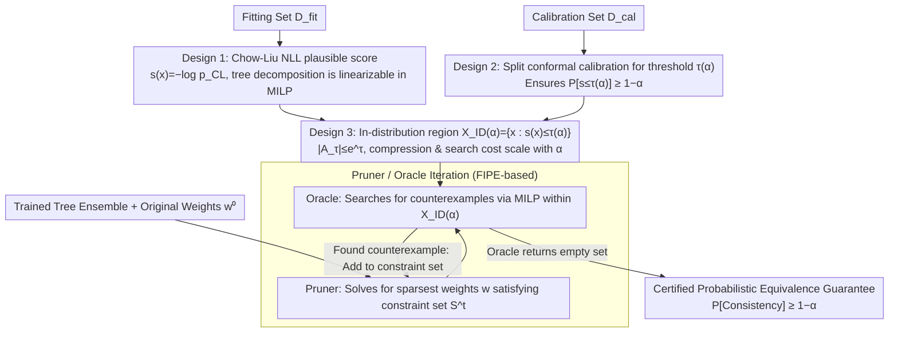

# PINE: Pruning Boosted Tree Ensembles with Conformal In-Distribution Prediction Equivalence

**Conference**: ICML 2026  
**arXiv**: [2605.28068](https://arxiv.org/abs/2605.28068)  
**Code**: To be confirmed  
**Area**: Model Compression / Tree Ensemble Pruning / Conformal Prediction  
**Keywords**: Tree Ensemble Pruning, Faithful Pruning, Conformal Prediction, In-Distribution Equivalence, Chow-Liu Tree

## TL;DR
PINE contracts the "equivalence constraint" of faithful pruning for boosted tree ensembles from the entire input space to an "in-distribution region" $\mathcal{X}_{\text{ID}}(\alpha)$ defined by Chow-Liu tree likelihood and split conformal calibration. Using a single parameter $\alpha$ to smoothly control the compression-fidelity trade-off, it improves compression rates by up to 30% relative to FIPE across 12 public tabular datasets while providing provable guarantees that the probability of "prediction consistency before and after pruning" is at least $1-\alpha$.

## Background & Motivation
**Background**: On tabular data, boosted decision tree ensembles like XGBoost remain SOTA. However, large ensembles suffer from slow inference and difficult verification (robustness/fairness), making post-training ensemble pruning common. Two existing paths are: (a) accuracy-oriented pruning (IC/DREP/MDEP/ForestPrune, etc.), which only requires minimal accuracy loss while allowing arbitrary prediction changes; (b) faithful pruning (Born-Again Trees, FIPE), which requires identical predictions before and after pruning for any input.

**Limitations of Prior Work**: While accuracy-oriented pruning achieves high compression, many predictions change—critical in high-risk scenarios (medical, finance) where downstream workflows or robustness/fairness checks are built around model outputs. Faithful pruning like FIPE enforces "prediction equivalence" as a hard constraint across the entire input space $\mathcal{X}$, including OOD "ghost points" that rarely occur in reality (e.g., "Pre-school education + 13.5 years of schooling" in the Adult dataset or logically impossible points like "prior offenses=0 and prior offenses>3" in COMPAS). By preserving fine-grained boundaries for these points, FIPE can only prune a 30-tree toy example down to 11 trees.

**Key Challenge**: A structural trade-off exists between fidelity and compression. Achieving 100% fidelity necessitates accounting for all OOD points, which limits compression; abandoning fidelity breaks decision consistency.

**Goal**: To find a mechanism that guarantees prediction equivalence on "inputs likely to occur" without commitments to OOD regions, where the size of this "likely region" is smoothly adjustable via a single knob.

**Key Insight**: The authors observe that OOD regions offer little decision value but consume many equivalence constraints. Requiring equivalence only on an **in-distribution region** $\mathcal{X}_{\text{ID}}$ significantly expands the feasible pruning space. As long as the coverage of $\mathcal{X}_{\text{ID}}$ is calibrated via conformal prediction, the probability of "future inputs falling in $\mathcal{X}_{\text{ID}}$" is maintained at $\geq 1-\alpha$, translating the "prediction consistency" into a provable guarantee of $\geq 1-\alpha$.

**Core Idea**: Use the negative log-likelihood (NLL) of a Chow-Liu tree as the "plausible score" $s(\bm{x})$, determine the threshold $\tau(\alpha)$ via split conformal calibration to obtain $\mathcal{X}_{\text{ID}}(\alpha)=\{\bm{x}:s(\bm{x})\leq\tau(\alpha)\}$, and restrict the Oracle's counterexample search from $\mathcal{X}$ to $\mathcal{X}_{\text{ID}}(\alpha)$. The tree-structured decomposition of Chow-Liu fits cleanly into a Mixed-Integer Linear Program (MILP).

## Method

### Overall Architecture
PINE addresses the limitation where faithful pruning remains insufficiently sparse. Given a trained ensemble $\mathcal{T}=\{T_m\}_{m=1}^M$ and original weights $\bm{w}^{(0)}$, it identifies sparse weights $\bm{w}$ (discarding trees where weight is 0) such that $\hat{y}(\bm{x};\bm{w})=\hat{y}(\bm{x};\bm{w}^{(0)})$ specifically within $\mathcal{X}_{\text{ID}}(\alpha)$. It transforms the hard constraint of "equivalence across all $\bm{x}\in\mathcal{X}$" into an equivalence for "almost all relevant inputs" via a user-adjustable miscoverage level $\alpha$.

The implementation utilizes the Pruner + Oracle iteration from FIPE: fit the Chow-Liu score $s_{\text{CL}}(\cdot)$ on the fitting set $\mathcal{D}_{\text{fit}}$, calculate the threshold $\tau(\alpha)$ on the calibration set $\mathcal{D}_{\text{cal}}$, and use $\mathcal{D}_{\text{fit}}$ as the initial constraint set $\mathcal{S}^{(0)}$. The process iteratively lets the Pruner solve for the sparsest weights satisfying the current $\mathcal{S}^{(t)}$ and the Oracle search for new counterexamples within $\mathcal{X}_{\text{ID}}(\alpha)$ using MILP. When the Oracle returns an empty set, a certified equivalence guarantee is secured for $\mathcal{X}_{\text{ID}}(\alpha)$.

### Key Designs

**1. Chow-Liu NLL: An In-Distribution Score Compatible with MILP**

The bottleneck of faithful pruning is the Oracle: it must exhaustively search for counterexamples that change predictions within a region. Therefore, the criterion for this region must be MILP-friendly (linearly encodable), or the search becomes intractable. PINE discretizes each continuous feature into $B$ bins to obtain $\tilde{\bm{x}}\in\{1,\dots,B\}^p$. It fits a joint distribution $p_{\text{CL}}(\tilde{\bm{x}})=p(\tilde{x}_r)\prod_{j\neq r}p(\tilde{x}_j\mid\tilde{x}_{\text{pa}(j)})$ using a Maximum Mutual Information spanning tree (Chow-Liu tree) and computes the plausible score as $s(\bm{x})=-\log p_{\text{CL}}(\tilde{\bm{x}})$. This score decomposes into a root marginal and conditional probabilities along tree edges, where each term depends only on a single bin or a parent-child bin pair. This allows linear encoding using binary variables $q_{i,b}$ (feature $i$ in bin $b$) and $u_{i,j,b,b'}$ (parent-child bin combination) with constraints like $u_{i,j,b,b'}\leq q_{i,b}$. The constraint complexity is $\mathcal{O}(pB^2)$, far smaller than the discrete input space of $\mathcal{O}(B^p)$.

**2. Split Conformal Calibration $\tau(\alpha)$: Translating Hard Constraints to Probabilistic Guarantees**

Through the calibration set $\mathcal{D}_{\text{cal}}$, PINE computes order statistics $s_{(1)}\leq\cdots\leq s_{(n)}$ of the scores $\{s(\bm{x}_i)\}$ and sets $\tau(\alpha)=s_{(k)}$ where $k=\lceil(n+1)(1-\alpha)\rceil$. Under exchangeability, this ensures $\mathbb{P}[s(\bm{X}_{\text{new}})\leq\tau(\alpha)]\geq 1-\alpha$. Combining this coverage guarantee with the Oracle's proof of "no counterexamples in $\mathcal{X}_{\text{ID}}(\alpha)$" yields Proposition 4.2: the probabilistic equivalence guarantee $\mathbb{P}[\hat{y}(\bm{X}_{\text{new}};\bm{w})=\hat{y}(\bm{X}_{\text{new}};\bm{w}^{(0)})]\geq 1-\alpha$. This provides a distribution-free way to define "almost all future inputs," turning the fidelity-compression trade-off into a continuous user-adjustable axis.

**3. $\mathcal{X}\to\mathcal{X}_{\text{ID}}(\alpha)$: Exponential Reduction in Compression and Search Cost**

PINE's theoretical foundation explains why shrinking the guarantee region slightly leads to massive gains in compression and efficiency. The original $\mathcal{X}$ is partitioned into up to $\prod_j(|\Theta_j|+1)$ cells, which explode in higher dimensions. With the Chow-Liu constraint, the Oracle only needs to search over the discrete state set $A_\tau=\{\tilde{\bm{x}}:-\log p_{\text{CL}}(\tilde{\bm{x}})\leq\tau\}$. Proposition 4.3 provides a clean upper bound: $|A_\tau|\leq e^\tau$. As $\alpha$ increases, $\tau(\alpha)$ decreases, causing the state space bound $e^{\tau(\alpha)}$ to shrink exponentially. This accelerates the search and expands the feasible pruning region, ensuring the resulting $\|\bm{w}\|_0$ is at least as good as FIPE.

### Loss & Training
The optimization objective remains $\arg\min_{\bm{w}\geq 0}\|\bm{w}\|_0$ subject to $\hat{y}(\bm{x};\bm{w})=\hat{y}(\bm{x};\bm{w}^{(0)}), \forall\bm{x}\in\mathcal{X}_{\text{ID}}(\alpha)$. This is solved via iterative Pruner (solving for the sparsest weights on $\mathcal{S}^{(t)}$) and Oracle (MILP search for counterexamples). Main experiments use the $\ell_0$ objective, while Appendix B.2 explores an $\ell_1$ approximation for efficiency. The solver is Gurobi v11.0.3, with XGBoost ensembles of $D=2$ and $M=30$.

## Key Experimental Results

### Main Results
On 12 UCI/OpenML tabular datasets, PINE-CL was compared with FIPE (faithful baseline) and IC/DREP/MDEP (accuracy-oriented baselines). Detailed results for Pima-Diabetes:

| Method | $\alpha$ | Pruning Rate (%) ↑ | Fidelity (%) ↑ | Time (s) ↓ | Iterations ↓ |
|--------|----------|-------------------|----------------|------------|--------------|
| FIPE | – | 17.3 | 100.0 | 42.5 | 24.6 |
| PINE-CL | 0.05 | 22.7 | 100.0 | 48.1 | 19.2 |
| PINE-CL | 0.1 | 26.7 | 100.0 | 48.0 | 19.6 |
| PINE-CL | 0.2 | 30.0 | 100.0 | 47.0 | 19.6 |
| PINE-CL | 0.4 | 34.7 | 99.9 | 33.8 | 15.2 |
| PINE-CL | 0.6 | 45.3 | 98.6 | 19.4 | 11.0 |
| PINE-CL | 0.8 | 55.3 | 98.3 | 12.0 | 7.8 |

Across the 12 datasets: as $\alpha$ increased from 0.05 to 0.8, the average pruning rate rose from 44.6% to 67.8%, while average fidelity only dipped from 99.96% to 99.15%.

### Ablation Study

| Dimension | Configuration | Phenomenon | Explanation |
|-----------|---------------|------------|-------------|
| Depth $D$ | $D=2\to 5$ | Pruning rate 66.94% → 34.44% | Deeper trees create more local regions, making it harder to remove trees globally. |
| Tree Count $M$ | $M=10\to 50$ | Pruning rate stable at ~50% | $M$ affects optimization overhead more than compression ratio. |
| Bin Count $B$ | Various | Robust trends | Discretization granularity is not a performance bottleneck. |
| Objective $\ell_0$ vs $\ell_1$ | Appendix B.2 | $\ell_1$ is faster | Provides a scalable alternative for large scenarios. |

### Key Findings
- **RQ1**: Accuracy-oriented methods lose fidelity monotonically as pruning increases, showing "unchanged accuracy" $\neq$ "decision consistency." PINE maintains fidelity near 1 even at high compression.
- **RQ2**: Empirical test coverage $\hat{\pi}_{\text{ID}}$ closely follows $1-\alpha$, validating that $\alpha$ functions as an effective knob for the in-distribution region size.
- **RQ3**: In-distribution fidelity ($\hat{\rho}_{\text{ID}}$) for baselines remains $<1$, whereas PINE achieves certified $\hat{\rho}_{\text{ID}}=1$.
- **Case Study**: Counterexamples ignored by PINE often correspond to logically impossible data points, justifying their exclusion to gain compression.

## Highlights & Insights
- **Natural Integration**: Combining faithful pruning with conformal prediction is highly intuitive. It transforms a binary "all-space" problem into a controllable probabilistic one.
- **MILP-Friendly Denisty Modeling**: The choice of the Chow-Liu tree is driven by its ability to be linearly encoded. This suggests a paradigm where density models are selected based on their "MILP-friendliness" for formal verification.
- **Information-Theoretic Efficiency**: The bound $|A_\tau|\leq e^\tau$ links the number of in-distribution states directly to search complexity, providing a theoretical basis for the speedups observed as $\alpha$ increases.

## Limitations & Future Work
- **Solver Optimality**: Guarantees rely on reaching certified MILP optimality. Time-outs degrade the guarantee to empirical status.
- **Exchangeability Assumption**: Standard conformal prediction assumes IID/exchangeable data; distribution shifts would require weighted conformal extensions.
- **Scalability**: For very large ensembles or high-dimensional features, discretization and MILP solving still present significant computational overhead.
- **Hard Decisions Only**: The current framework does not address equivalence in soft logits or regression values.

## Related Work & Insights
- **Ours vs FIPE**: PINE extends FIPE by relaxing the "entire space" requirement to an "in-distribution region," offering a tunable trade-off.
- **Ours vs IC/DREP/MDEP**: While these baselines prioritize accuracy and diversity, they lack formal consistency guarantees and fail on in-distribution fidelity tests.
- **Generalizable Insight**: The "MILP Verification + Conformal Calibration" paradigm can be applied to other tasks requiring "full-space" guarantees, such as rule extraction or model distillation auditing.

## Rating
- Novelty: ⭐⭐⭐⭐ (Elegant fusion of existing calibration and verification tools)
- Experimental Thoroughness: ⭐⭐⭐⭐ (Broad range of datasets and sensitivity analyses)
- Writing Quality: ⭐⭐⭐⭐ (Clear logic and well-structured arguments)
- Value: ⭐⭐⭐⭐ (Practical solution for compressed, yet consistent, high-stakes models)

<!-- RELATED:START -->

## Related Papers

- [\[ICML 2026\] From Rashomon Theory to PRAXIS: Efficient Decision Tree Rashomon Sets](from_rashomon_theory_to_praxis_efficient_decision_tree_rashomon_sets.md)
- [\[ICML 2026\] Bridging the Knowledge-Prediction Gap in LLMs on Multiple-Choice Questions](bridging_the_knowledge-prediction_gap_in_llms_on_multiple-choice_questions.md)
- [\[ICML 2025\] Leveraging Predictive Equivalence in Decision Trees](../../ICML2025/interpretability/leveraging_predictive_equivalence_in_decision_trees.md)
- [\[ICML 2026\] Optimal Attention Temperature Improves the Robustness of In-Context Learning under Distribution Shift in High Dimensions](optimal_attention_temperature_improves_the_robustness_of_in-context_learning_und.md)
- [\[CVPR 2025\] Learning on Model Weights using Tree Experts](../../CVPR2025/interpretability/learning_on_model_weights_using_tree_experts.md)

<!-- RELATED:END -->
